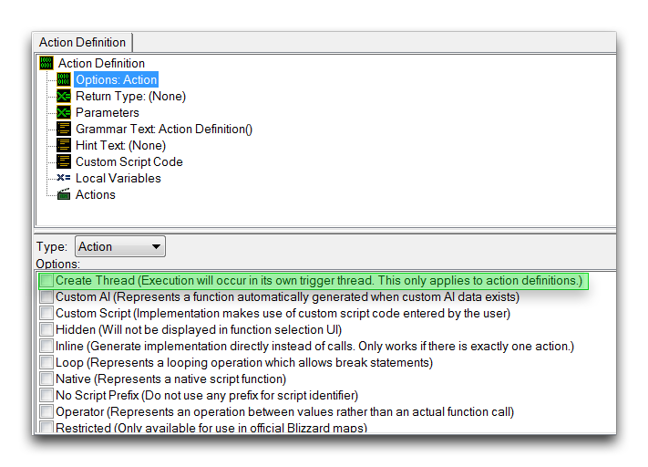
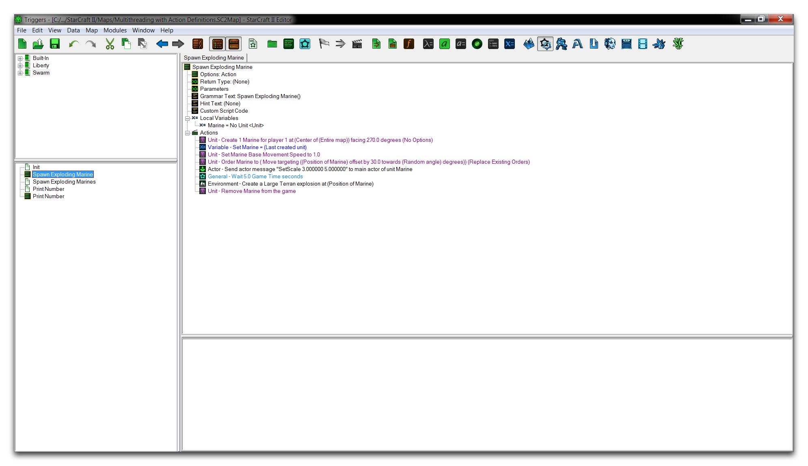
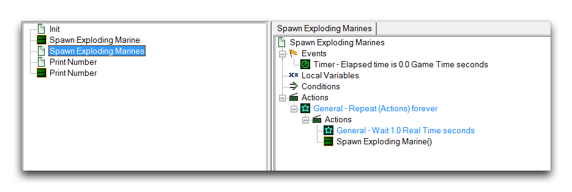
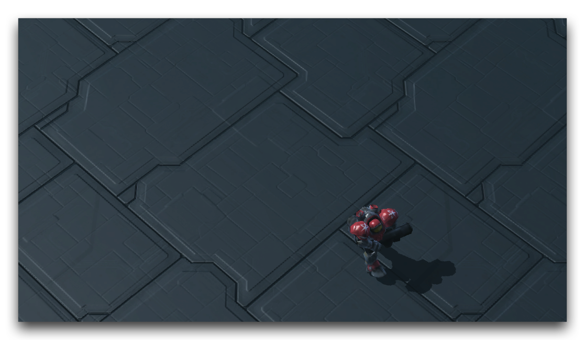
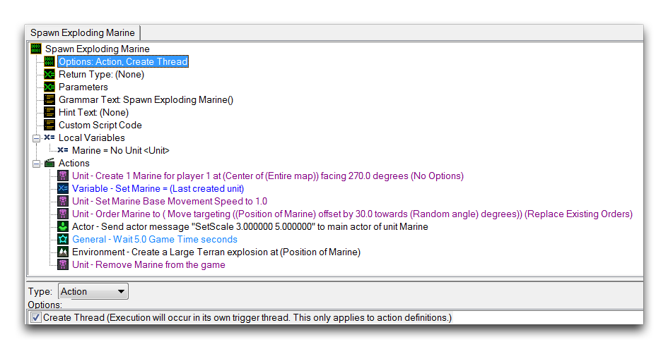
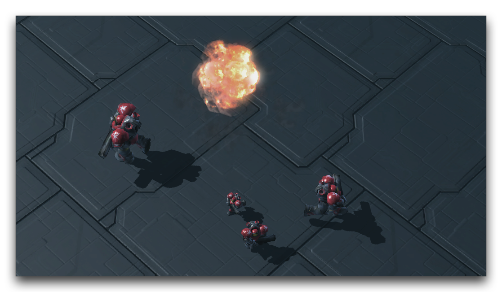

# 使用动作定义进行多线程

多线程是计算机科学术语，指的是处理单元执行多个动作的能力。传统上，计算机程序的标准行为是按顺序执行所有动作，一个接一个地执行。通过打破这种行为，多线程允许处理器并行执行动作，同时处理许多任务，每个任务在所谓的线程中运行。看下面这个关于线性操作系统的示例。

> 任务1开始
> 
> ...
> 
> 任务1完成
> 
> 任务2开始
> 
> ...
> 
> 任务2完成
> 
> 任务3开始
> 
> ...
> 
> ...
> 
> ...

每个任务都需要一些时间来完成，并且系统一次只能处理一个任务。采用多线程的系统执行相同的任务可能看起来更像以下设置。

> 任务1开始 任务2开始
> 
> ... ...
> 
> 任务1完成 任务2完成
> 
> 任务3开始 任务4开始
> 
> ... ...
> 
> ... 任务4完成
> 
> ... 任务5开始

在这种情况下，多线程允许将各种较短的任务组织到一个单独的线程中。这样一来，系统不会因为较长的任务3而变得不顺畅，可以在相同的时间框架内考虑到全新的任务4和任务5。能够进行多线程处理的系统有许多优点。首先，它们可以通过将大型任务分解为可以同时处理的较小块来高效工作。在游戏环境中，多线程对于其性能优势非常重要，同时也因为它能够打开不同的编程方式，从而导致全新的机制和游戏玩法。

## 编辑器中的处理

现在您可能对触发器编辑器中逻辑的执行方式相当熟悉了。一个触发器被调用，然后它的内部、动作和控制语句按顺序运行。然后触发器关闭，继续到下一个。如果从源触发器调用了一个单独的触发器或动作定义，那么线性控制被传递，但最终会返回到其原始源处，顺序运行直到耗尽。

因此，编辑器中的触发器操作作为一个标准的线性处理系统。虽然这可能不准确地反映代码背后的情况，因为优化后可以利用多核系统，但最终，本文涉及的是编辑器的前端工具。毕竟，编辑器的前端旨在成为一个直观的工具，使您能够专注于设计和构建项目，而不是它的精确编程细节。

## 动作定义线程

然而，编辑器是一个包容性系统，正如它为广泛用户群体提供直观的前端一样，它还支持多线程，让高级用户有机会利用非线性处理。通过使用特殊标记的动作定义来访问多线程。标志选项如下所示。

*动作定义中的多线程选项*

在动作定义中设置“创建线程”标志将导致该定义移至单独的线程，并在被调用时并行处理，与其余代码一起。这些动作定义线程本身的操作可以通过触发器调试器进行跟踪和检查。

## 使用多线程

打开本文提供的演示地图，并进入触发器编辑器。打开“生成爆炸式海军”动作定义将呈现如下内容。

*演示地图视图*

此定义在地图中心创建一个海军，向其发出移动命令，在五秒钟内缩放它，最后在五秒后引爆它。注意触发器调用此定义的示例，如下图所示。

*控制循环触发器*

该触发器在打开地图时立即启动，并开始每秒调用一次“生成爆炸式海军”动作定义。逻辑上，这应该导致地图上有大约五个正在活动的海军，经历移动、缩放和爆炸行为。对地图的测试将得到如下图所示的结果。

*运动中的单一海军*

测试这种实现时，您将看到每次生成一个海军，每次生成之间大约间隔六秒。这是因为主线程，即循环触发器，将线性控制传递给其调用的动作定义。从那里开始，动作定义会阻止运行其他触发器，直到完成。这种行为清楚展示了触发器系统的标准线性处理行为。要更改此行为，请移至动作定义并启用多线程，如下所示。

*多线程动作定义*

如果测试新的多线程动作定义，您应该得到以下类似的结果。

*通过多线程执行许多海军生成动作*

现在每次调用动作定义时都会打开一个新的线程。由于每个线程大约需要五秒钟才能运行，循环会管理大约五个活动线程，每个线程之间间隔大约一秒。知道海军的大小会随着它们的线程打开时间变长而变大，这意味着它们确实是一个很好的可视化，显示了系统如何同时管理多个线程。