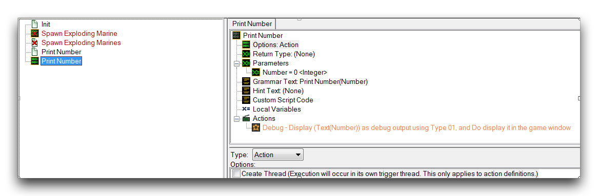
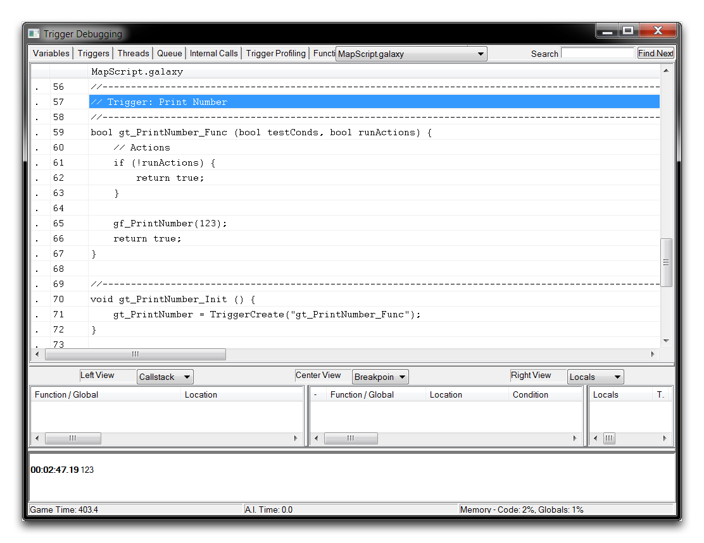
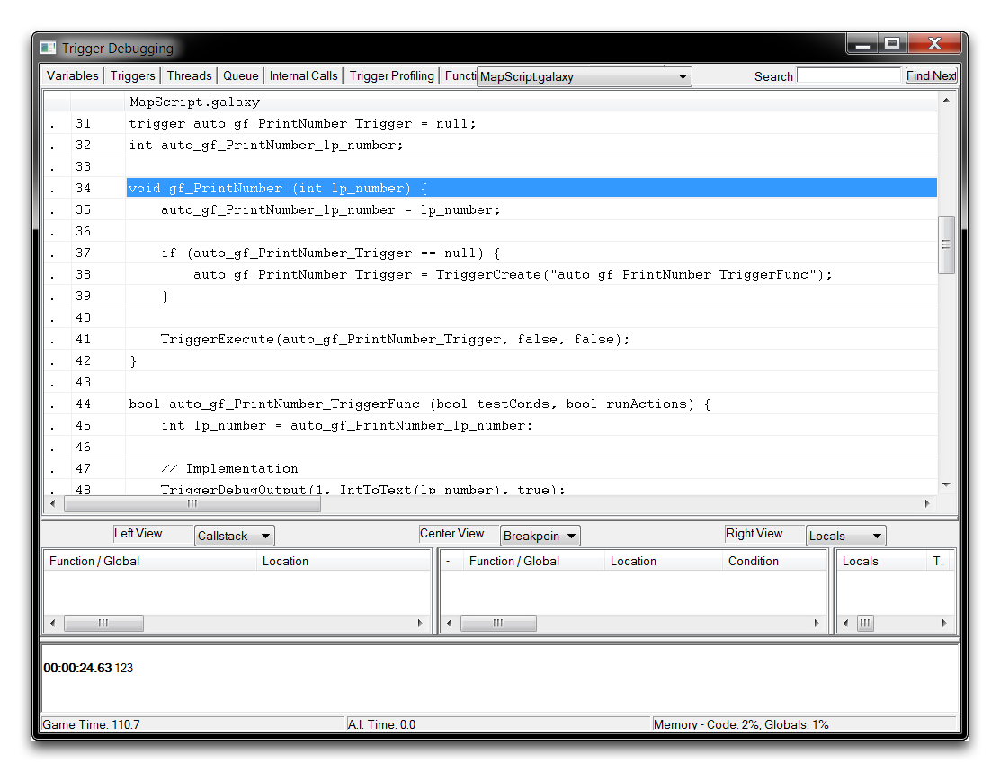

事实上，编辑器对于多线程的实现有点类似于概念的伪装或不纯净版本。真正的多线程实现将能够同时处理多个任务，而编辑器则通过一种称为时间分片的方法来处理这些任务。

在编辑器版本的时间分片中，启用线程的动作定义将在调用时按预期运行。控制会线性传递给它，其语句将按顺序运行，然后控制会再次传递给原始父调用者。不同之处在于当它达到等待控制语句时会发生什么。如果是这种情况，控制将被中断，然后传回到父线程，直到等待得以解决，此时控制将返回到线程化的定义处。

这与非线程定义有所不同，非线程定义将等到等待得以解决之前一直占用控制权。因此，编辑器通过非常快速地切换线性控制来“伪装”多线程。这使得它能够避免等待语句在代码中创建完全停顿，结果在处理时给出了非线性处理的印象。

然而，赋予用户绕过等待语句的能力意味着，编辑器的伪多线程具有了已被吹捧的概念所具备的许多效用。它仍然可以提供独特或更直观的编程特效方式，并且可以作为一种有价值的组织工具。然而，存在一个重要的缺点：性能。

由于编辑器的多线程没有真正的并行执行，因此对性能没有明显的积极影响。事实上，由于此选项的额外内部工作，编辑器中的多线程通常会对性能产生负面影响。这一点很重要要记住，因为它与概念的大部分常规定义相悖。

## 通过Galaxy脚本触发器实现多线程

Galaxy通过`TriggerExecute`原生函数提供了一些独特的多线程支持。通过使用此函数直接执行触发器时，可以指定一个参数，将目标触发器设置为在自己的线程中运行。这里的缺点在于触发器没有参数输入，使它们在大多数情况下比动作定义的使用性更低。

## 多线程机制

如果你是一名高级用户，可以通过检查Galaxy脚本实现来深入了解多线程。将注意力转回演示地图，并通过突出显示它们、右键单击并取消选中“Enabled”来禁用“Spawn Exploding Marine”触发器和动作定义。现在，看一下“Print Number”触发器及其相关的动作定义。该触发器调用了下面图片中展示的动作定义。

*Print Number动作定义*

该动作定义向屏幕发送一个简单的调试消息。请注意，它目前尚未设置为多线程。您可以使用该触发器和定义作为检查多线程实现的最简单试验。为此，请以窗口模式运行地图，然后启动触发器调试器。进入调试器后，转至“Triggers”选项卡，右键单击`gt_PrintNumber_Func`触发器，然后选择“View Script”。这将显示以下标准的动作定义脚本。

*标准“Print Number”脚本*

这里的脚本很简单。它生成一个无返回的函数，其格式与GUI中的动作定义相匹配。然后由“Print Number”触发器调用该函数。现在返回到触发器编辑器，并通过选择“Create Thread”标记在“Print Number”动作定义中启用多线程。重复相同的调试过程将得到以下结果。

*多线程“Print Number”脚本*

在这种情况下，脚本变得更加复杂，包括许多自动生成的组件。下面展示了这些组件的分解。

1.  动作定义的每个参数都有一个全局变量，与其原始类型匹配。

    > int auto_gf_PrintNumber_lp_number

2.  具有初始值为“Null”的全局触发器变量。

    trigger auto_gf_PrintNumber_Trigger = null

3.  具有两个布尔参数的布尔触发器函数；这包含了GUI中定义的每个动作，以及每个线程动作定义参数的一个隐含生成的本地变量。

    > bool auto_gf_PrintNumber_TriggerFunc (bool testConds, bool runActions) {
    > 
    > int lp_number = auto_gf_PrintNumber_lp_number;

4.  接受动作定义参数的包装函数。

    > gf_PrintNumber(123)

了解了这些部分后，机制的操作如下。

  -  第4步中的包装函数首先将其参数值复制到第1步中的全局参数变量中。
  -  然后包装函数检查第2步中的全局触发器变量是否为null。如果是，它将基于第3步创建一个新的触发器，并将其分配给第2步。
  -  此时第2步的函数将在其自己的线程中执行，从第1步获取参数并制作本地副本。

请注意，步骤1中的全局变量用作临时存储，因此可以从触发器中访问。目前，创建本地版本使得该线程可以并行操作，并与变量更改的情况隔离。

通过上述内容，您无疑可以看出此处展示的多线程版本的复杂性增加了。由于代码大小的增加，多线程动作定义的性能显著不及其非线程化版本。

## 附件

 * [057_Multithreading_with_Action_Definitions.SC2Map](./maps/057_Multithreading_with_Action_Definitions.SC2Map)