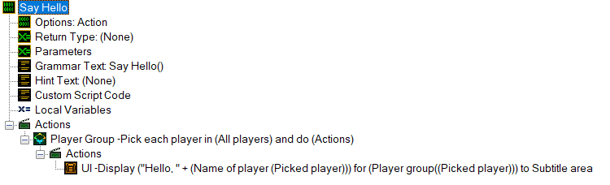
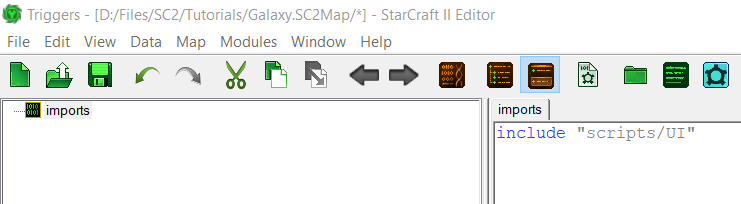

# GalaxyScript

GalaxyScript是SC2编辑器的编程语言。虽然大部分内容被隐藏在触发器编辑器的GUI层后面，但所有的触发器工作最终都会归结为GalaxyScript，由编辑器在你的MapScript.galaxy中自动生成。

虽然许多人认为由于触发器编辑器的存在，不应该与GalaxyScript进行交互，但是有理由在GalaxyScript中编写项目的部分内容。在本指南中，您将学习何时以及如何将GalaxyScript整合到您的项目中。

本教程假设您对传统编程或触发器编辑器有很好的基础。它还假设您已将地图保存为 .SC2Components 格式（尽管没有真正的理由不这样做），并且正在使用Talv的VSCode扩展。

[](./resources/058_GalaxyScript1.png)
*例如，此GUI将编译为下面的代码*

```c
void gf_SayHello () {
    // 自动变量声明
    playergroup auto50B0D547_g;
    int auto50B0D547_var;

    // 实现
    auto50B0D547_g = PlayerGroupAll();
    auto50B0D547_var = -1;
    while (true) {
        auto50B0D547_var = PlayerGroupNextPlayer(auto50B0D547_g, auto50B0D547_var);
        if (auto50B0D547_var < 0) { break; }
        UIDisplayMessage(PlayerGroupSingle(auto50B0D547_var), c_messageAreaSubtitle, (StringExternal("Param/Value/E3C00EB1") + PlayerName(auto50B0D547_var)));
    }
}
```

# 为什么选择GalaxyScript？

*"但我们可以在GUI中做GalaxyScript能做的一切，对吧？那么为什么要使用它呢？"*

不是的。有一些事情只能在GalaxyScript中完成（或者在GUI中很费力）。此外，还有一些其他原因，我在下面列出了其中一些。

### 1. 你可以复制/粘贴

我们在使用编辑器时都遇到过这样的时刻：你意识到你将不得不做很多复制/粘贴，或者说你想要将 `Int` 转换为 `Real`。在尝试在GUI编辑器中进行更改时，它会覆盖语句中的所有内容。复制/粘贴也比较慢，尤其是如果您想在每次迭代中仅更改1/2个字母。您将不得不回到 *所有* 的语句中并浏览各种窗口迷宫 - 这并不理想！使用Galaxy可以解决所有这些问题，因为它使您可以像编辑任何其他内容一样编辑代码。这还意味着在更改诸如变量类型之类的小事情时，代码不会被覆盖。

### 2. 编辑器的类型安全性太强了。

编辑器中很多东西最终归结为 `字符串` 或 `整数`。例如，`Dialogs` 和 `Dialog Items` 只是 `整数`。`单位类型`（或实际上90% 的数据引用）只是 `字符串`。当编辑器强制您在这些内置类型之间进行转换时，有很多时候会出现问题。当处理游戏链接时，这可能特别令人恼火，因为它们往往会使游戏变慢或卡死。在我的情况下，通过模板创建对话框项目时，当我尝试选择项目时编辑器有50％ 的几率崩溃，尽管我刚刚在布局中定义了它们，并且只想使用一个字符串。

摆脱编辑器的类型限制是非常解放的，但是伴随着强大的功能也意味着有责任。然而，在编写Galaxy时，调试功能也更容易阅读，因为它实际上会提供脚本中函数的名称，这使得查找和修复错误变得更加容易。

### 3. 有些事情只能在GalaxyScript中做，而在GUI中无法完成。

像动态触发器创建（请参见页面底部的例子）这样的事情只能通过脚本完成，无法通过触发器编辑器实现。

---

然而，类型安全性和其他功能也可能非常有益。Galaxy，和布局/UI一样，是一个工具，通过使用你会学会何时使用Galaxy是个好主意，何时不是。我通常发现你会在触发器中写大约75% 的代码，而在Galaxy中写大约25%。根据你对代码的熟悉程度，这可能会因人而异；你最终会找到一个适合你的平衡点。

# 入门指南

让我们从一些基本示例开始，使您熟悉使用Galaxy的工作流程。一旦您学会了这一点，其他一切都会自然而然地上手。
您应该首先做的事情是[收藏这个网站](https://mapster.talv.space/galaxy/reference)，因为在您继续学习时，它将非常有帮助。

## 步骤1：创建您的第一个脚本

在文件资源管理器中打开您的地图，并创建一个名为 `scripts` 的文件夹。这将是我们放置所有Galaxy文件的地方。

创建一个名为 `UI.galaxy` 的文件。正如我之前提到的，"Create Dialog Item From Template" 函数很容易使我的编辑器崩溃。让我们编写一个包装函数，这样我们就可以根据一个字符串创建对话框项目。

在文件中，复制/粘贴（或编写）以下代码段。

```cpp
int CreateDialogItemFromTemplate(int dialog, int type, string template)
{
    return DialogControlCreateFromTemplate(dialog, type, template);
}
```

接下来，我们需要将其导入编辑器，以便我们可以使用它。首先创建一个 `Custom Script Object（Ctrl+Alt+T）`。将其命名为 `imports`。这是您在编辑器中唯一会编写的自定义脚本。然后，向其中添加以下行：

```c
include "scripts/UI"
```

[](./resources/058_GalaxyScript2.png)
*它应该看起来像这样*

自定义脚本只是在生成MapScript.galaxy时将脚本附加到顶部的方法（如果您以前在C/C++中进行过任何编程工作，这就像 `#include <stdio.h>`）。这使我们可以在 'main' 脚本中和在其后的所有其他脚本中使用该文件中的功能。

现在，让我们创建一个 `native function`，这样我们才能实际使用我们编写的脚本。创建一个新函数（Ctrl+F），并将其命名为与脚本中的函数相同：`CreateDialogItemFromTemplate`。打开函数选项，然后选中“原生函数”复选框。因为它返回一个对话框项目，将返回值设置为 `Dialog Item`。然后，我们将创建参数。