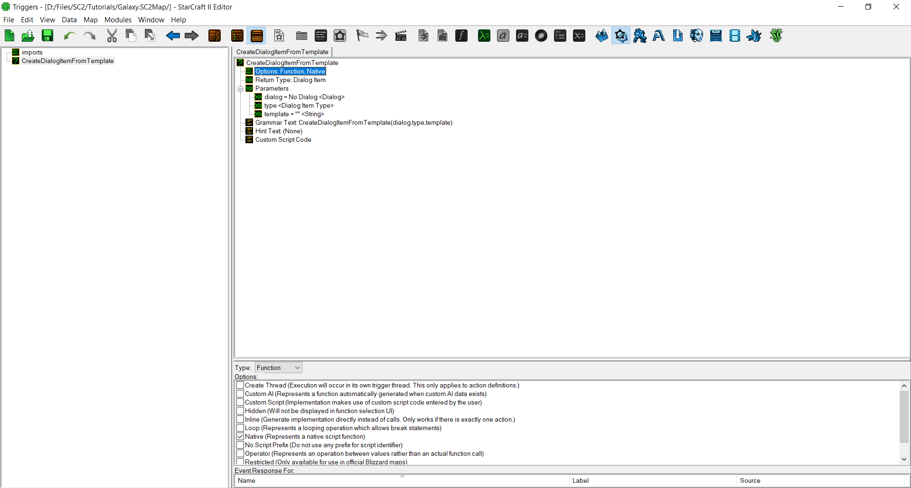
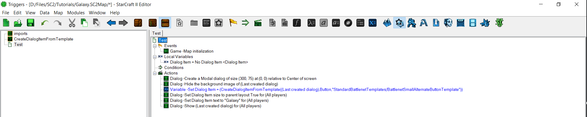
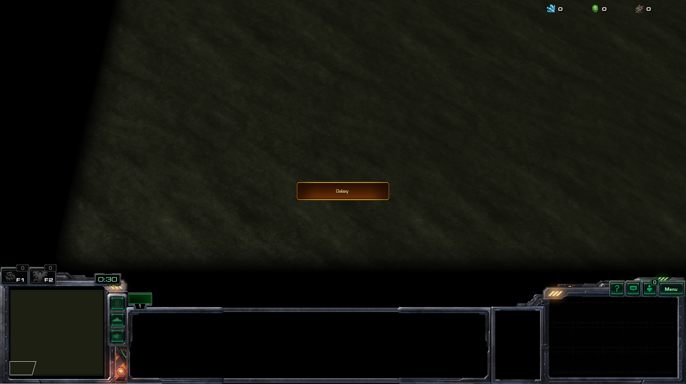

- **Dialog（对话框）** 是一个整数，但你应该记住，对话框只不过是整数。所以它的类型是 Dialog（对话框）。
- **Type（类型）** 是一个预设值：对话框项的类型。
- **Template（模板）** 是一个字符串。

[](./resources/058_GalaxyScript3.png)
*这应该是你的最终结果。*

然后，让我们进行测试。我创建了一个对话框项，并使用我们的函数在其中创建了一个按钮。

[](./resources/058_GalaxyScript4.png)
*这是不良实践。不要像这样编写触发器。*

让我们启动测试地图，然后 -

[](./resources/058_GalaxyScript5.png)
*大功告成。*

我们完成了！你已经用 Galaxy 编写了你的第一个脚本。现在，如果你想编写更多的函数或操作，你知道该怎么做了。

坦率地说，我们上面所做的在 GUI 中也可以轻松完成，但它更多是为了演示而非展示 Galaxy 的强大之处。在决定何时编写脚本与使用 GUI 时，我有一些经验法则。

- 只编写自包含函数。引用全局变量*是*可行的（只需在它们的名称前添加 `gv_` 前缀），但通常最好不要这样做。唯一的例外是常量，但那是明显的。
- 在 Galaxy 中进行任何与目录相关的工作。GUI 函数很麻烦，而使用字符串比使用游戏链接要容易得多。
- 繁琐的类型转换或频繁重复的操作（循环无法完成）应该在 Galaxy 中完成。
- 触发器的创建应始终在 GUI 中完成。

正如我上面提到的，每个人都有自己编写代码的风格，也许这些提示对你有用，也许没有。你只需要尝试学习。

# 提示

Galaxy 有一些设计上的奇怪之处。

- 所有变量必须在函数开头声明。你不能调用另一个函数然后再声明一个变量。
- `var++` 不起作用。你应该使用 `var+=1` 代替。
- 只要它们包含在 MapScript 中，你就可以引用另一个 Galaxy 文件中的函数，而不必在*那个*文件中也包含一条 include 语句。
- For 循环可以有空值。
- 如果需要创建一个异步/单独线程函数，为它创建一个触发器。

# 示例

以下是我搜集的一些常用的通用实用程序/示例动作，以展示 Galaxy 中各种任务的示例。所有变量名都应该是不言自明的。任何以 `c_` 开头的内容都是预设值。

## 遍历玩家组

```c
void DisplayMessageToPlayerGroup(string message, playergroup group)
{
    int player;

    for(player = 1; player <= CONST_MAX_PLAYERS; player+=1)
    {
        if(!PlayerGroupHasPlayer(group, player)){ continue; }
        UIDisplayMessage(PlayerGroupSingle(player), c_messageAreaChat, StringToText(message));
    }
}
```

## 动态函数注册

```c
void CreateButtonAndRegisterToTrigger()
{
    // 创建对话框项
    int dialogitem = libNtve_gf_CreateDialogItemButton(
        CONST_DIALOG,
        300,
        75,
        c_anchorCenter,
        0,
        0,
        StringToText(""),
        StringToText("点击我！"),
        ""
    );

    // 将其添加到全局触发器 TRIGGER_VARIABLE
    TriggerAddEventDialogControl(
        TRIGGER_VARIABLE,
        c_playerAny,
        dialogitem,
        c_triggerControlEventTypeClick
    );
}
```

## 创建触发器/创建异步（在单独线程中运行）函数

```c
trigger MyGlobalTrigger;

// 你可以根据需要命名这些变量；testConds/runActions 只是标准。
bool MyTrigger(bool testConds, bool runActions)
{
    // 将聊天消息回显给玩家
    UIDisplayMessage(PlayerGroupSingle(EventPlayer()), c_messageAreaChat, StringToText(EventChatMessage()));

    return true;
}

void MyTrigger_Init()
{
    // 作为参数使用你想执行的函数的名称
    MyGlobalTrigger = TriggerCreate("MyTrigger");
    TriggerAddEventChatMessage(MyGlobalTrigger, c_playerAny, "echo", false);
}
```

## 作用域

```c
// 此函数无法在此文件之外访问
static bool ThisIsTrue()
{
    return true;
}


// 此函数可以访问
bool TrueIsTrue()
{
    if(!ThisIsTrue())
    {
        return false;
    }
    else
    {
        return true;
    }
} 
```