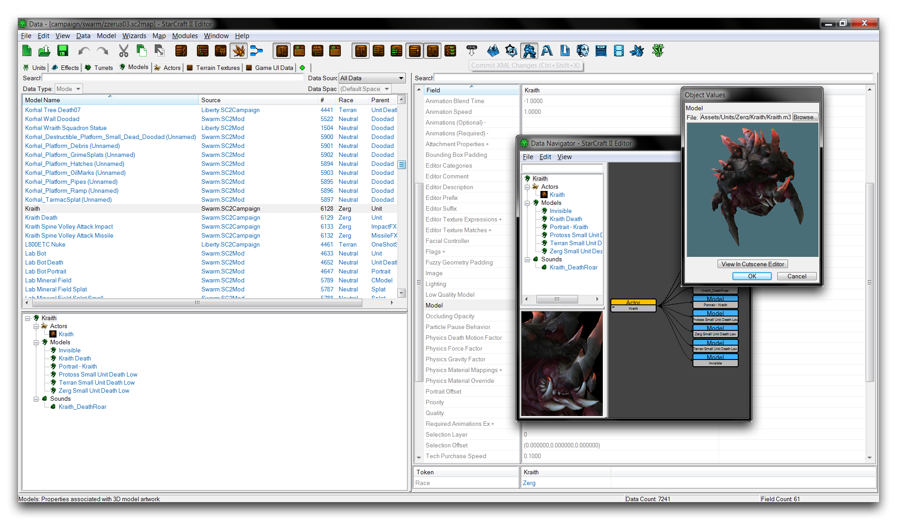
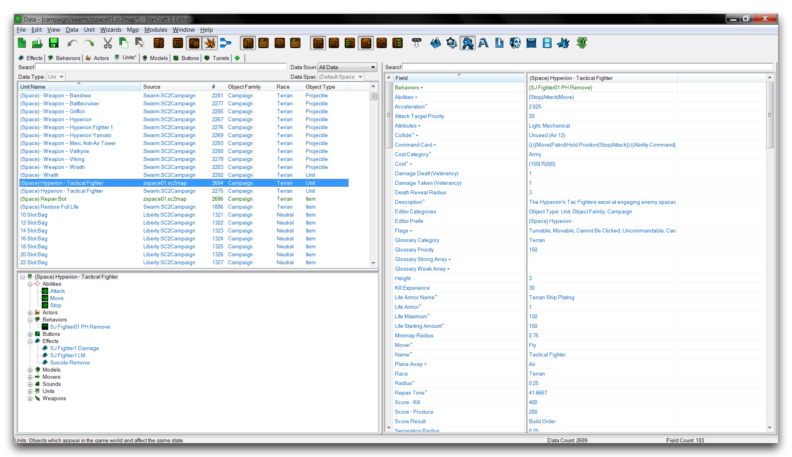
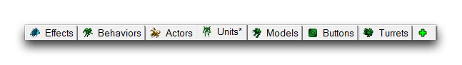
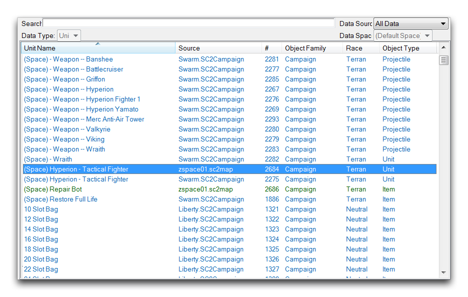
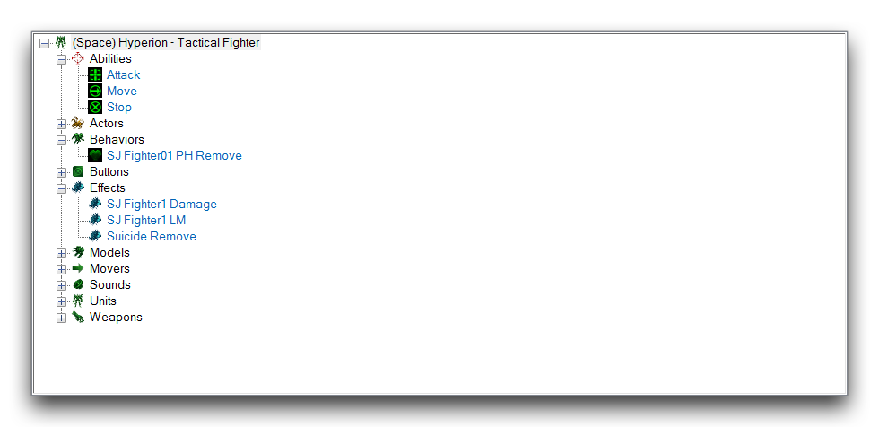
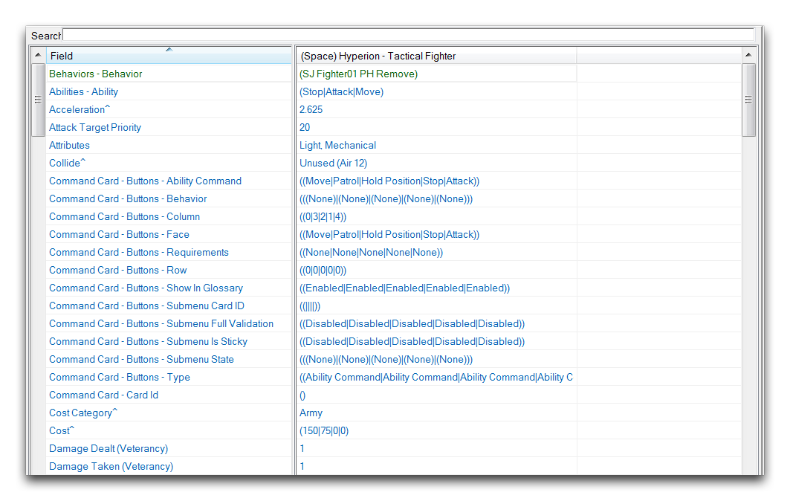
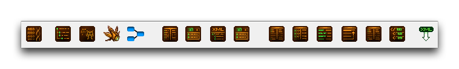

# 数据编辑器介绍

数据编辑器中存放着编辑器中的所有数据资产。项目的每一个数据部分都是使用这里找到的基本类型构建的。这是一个深入而强大的系统，为用户提供了极大的控制权，是暴雪编辑套件中有史以来提供的最多的控制选项。

*数据编辑器的使用*

在数据编辑器内，您将找到一个强大的功能集，支持其编辑功能。您应该注意，在工作时数据将会动态更新，使得变更能够快速传播到整个项目中。还有一些可视化选项，提供对任何数据结构的概述。这些对于建立引擎运作方式的触觉感觉非常重要。也许最重要的是，所有星际争霄战的资产都是可用的，可以通过数据编辑器查看。在这里，您可以仔细审查它们并从中学习，或重新利用它们用于自己的修改中。

## 数据目录

编辑器中的数据被组织成目录，每个目录包含项目中当前活动的特定数据类型的每个实例的列表。您必须导航到特定数据类型的目录才能创建或管理该特定类型的任何数据。每个目录提供其关联类型的所有数据字段的视图，以及一些上下文适当的选项。数据编辑器中共有 87 个目录，尽管大多数用户会发现他们的工作集中在其中的少数几个目录中。其中大部分的 87 个目录是由高度特定类型的数据组成的，其中很多您可能很少使用。

一些目录的示例包括熟悉的游戏类型如能力和单位，以及艺术资产如模型和声音。上述一些更具体的类型包括物理材料、光标和成就。您将在本段落下方找到引擎的所有目录的完整列表。值得注意的是，这些目录被组织成广泛的类别，比如游戏数据或角色数据，以反映不同数据类型的不同目的。

- 游戏数据 \[13\]

<!-- -->

  - 能力 --- 行为 --- 效果
  - 足迹 --- 物品 --- 战利品
  - 移动器 --- 要求 --- 炮塔
  - 单位 --- 升级 --- 验证器
  - 武器

<!-- -->

- 活动数据 \[13\]

<!-- -->

  - 军队类型 --- 军队单位 --- 军队升级
  - 银行条件 --- 战役 --- 角色
  - 指挥官 --- 对话 --- 对话状态
  - 地点 --- 地图 --- 目标
  - 预加载

<!-- -->

- 角色数据 \[3\]

    \--- 角色 --- 附加方法 --- 攻击方式

- 艺术和声音数据 \[12\]

    \--- 按钮 --- 数字音效 --- 镜头耀斑集合
    
    \--- 灯光 --- 模型 --- 混响效果
    
    \--- 形状 --- 声音 --- 声音独占性
    
    \--- 声音混音快照 --- 声音轨道 --- 纹理

- 地形数据 \[9\]

    \--- 地形悬崖 --- 地形悬崖网格 --- 迷雾数据
    
    \--- 物理材料 --- 地形类型 --- 地形物体
    
    \--- 地形纹理 --- 地形道路 --- 水

- 英雄数据 \[11\]

    \--- 神器 --- 神器插槽 --- 配置
    
    \--- 英雄 --- 英雄能力 --- 英雄统计
    
    \--- 坐骑 --- 皮肤 --- 天赋
    
    \--- 天赋配置 --- 配音

- 界面数据 \[6\]

    > \--- 警报 --- 捆绑 --- 摄像机

    \--- 光标 --- 游戏 UI 数据 --- 标记

- 高级数据 \[20\]

    \--- 成就 --- 成就条款 --- 加速
    
    \--- 游戏数据 --- 牧群 --- 牧群节点
    
    \--- 物品类别 --- 物品容器 --- 动力学
    
    \--- 种族 --- 要求节点 --- 奖励
    
    \--- 得分结果 --- 得分值 --- 战术 AI 冷却时间
    
    \--- 战术 AI 数据 --- 目标查找 --- 目标排序
    
    \--- 奖杯 --- 用户类型

## 界面

*数据编辑器界面视图*

您可以使用目录选项卡导航到数据编辑器的目录，如下所示。

*目录选项卡*

每个目录都有一个关联的选项卡，可访问它们的数据列表。您可以使用绿色的加号形状的目录打开器将选项卡添加到项目中。选择了一个选项卡后，将会在对象列表中显示该目录的数据，如下所示。

*对象列表*

该列表根据多个上下文敏感属性组织整个数据目录，如来源、ID＃、对象系列和种族。正如您在下图中所看到的，数据结构的完整层次结构将显示为对象资源管理器中所选实例。

*对象资源管理器*

对于像单位这样的高级结构，此资源管理器提供了一个重要的自上而下的查看数据的视角。对象资源管理器或对象列表中的任何数据将在下图所示的字段列表中显示其数据字段。

*字段列表*

字段列表是数据编辑器的数据输入部分。在此处，用户可以直接通过输入更改数据。由于可供编辑的目录和字段类型的多样性很大，因此有一系列查看选项可使列表尽可能易于访问。您可以在数据栏中找到这些选项。

*数据栏*