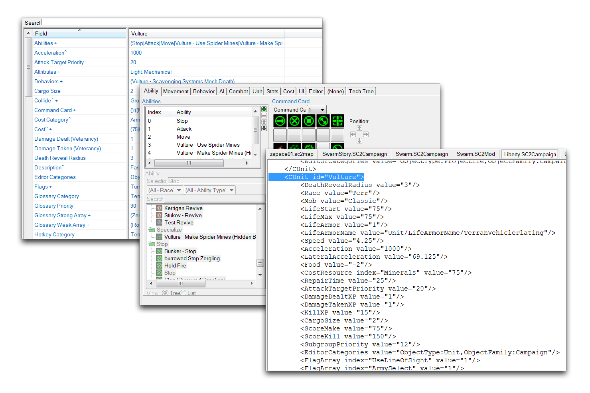
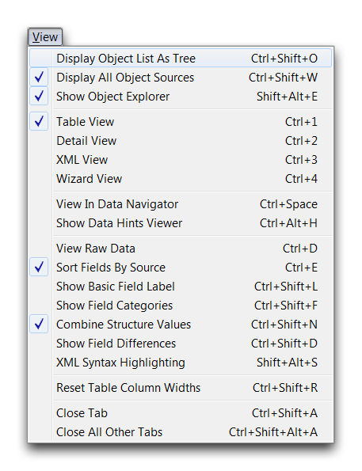
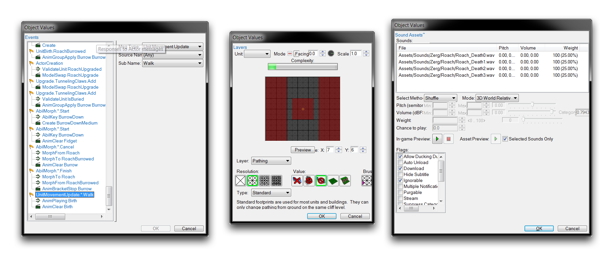
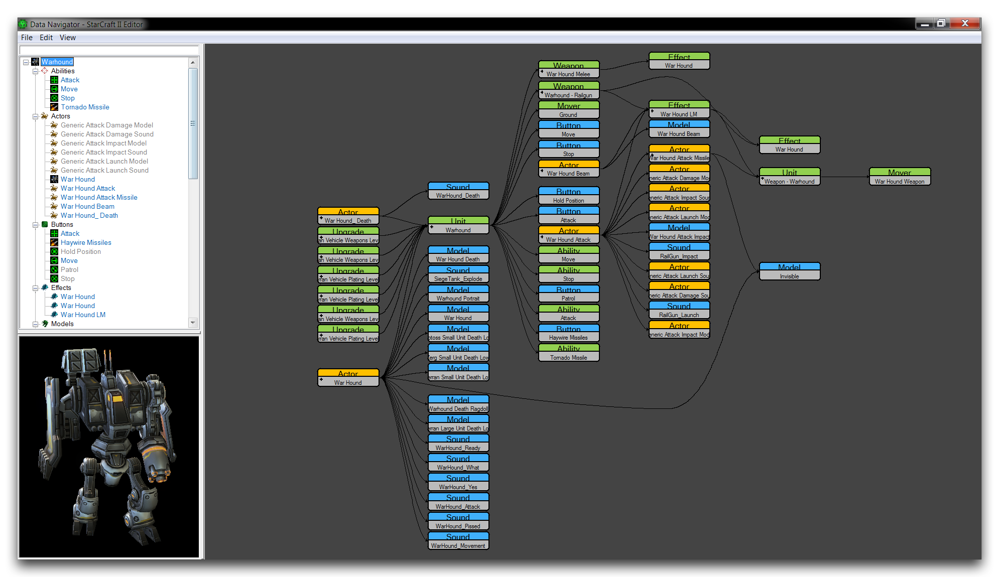
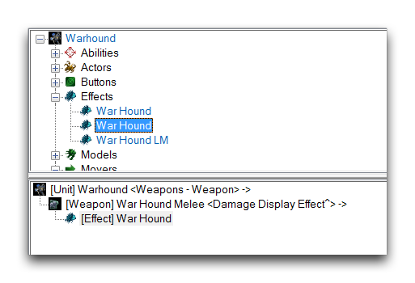

以下是各种查看选项的详细信息。

| 操作                       | 效果                                                                                                             |
| -------------------------- | ----------------------------------------------------------------------------------------------------------------- |
| 查看原始数据             | 将所有数据更改为其在后端代码中使用的原始 ID 值，而不是更易用的名称值。                                       |
| 将对象列表显示为树形     | 将对象列表显示为一组结构化的文件夹。                                                                          |
| 显示所有对象源           | 显示原始、未更改的源数据以及任何当前版本的数据。                                                              |
| 显示对象浏览器           | 切换对象浏览器的可用性。                                                                                         |
| 在数据导航器中查看     | 在数据导航器中将当前选择的数据实例可视化。                                                                  |
| 表格视图                 | 将字段列表显示为其所有单独字段的表格列表。                                                                    |
| 详细视图                 | 将字段列表显示为其条目窗口或子编辑器的组合。                                                                   |
| XML 视图                  | 将字段列表显示为其原始 XML 文件。                                                                            |
| 按源排序字段             | 按照每个字段的数据源组织列表。                                                                                |
| 显示基本字段标签       | 在来自该源的任何数据字段上显示（基本）标签。                                                                  |
| 显示字段类别             | 显示每个数据片段的任何类别标题。                                                                               |
| 合并结构值               | 将任何相关字段组合成一个字段。                                                                                 |
| 显示字段差异             | 显示数据字段中的任何差异。                                                                                      |
| XML 语法高亮显示        | 为 XML 视图启用基于颜色和类型的高亮显示。                                                                    |
| 提交 XML 更改            | 保存任何当前未保存的 XML 文件更改。                                                                           |

这些选项包括结构化字段列表视图：表格视图、详细视图和 XML 视图。以下是具体展示。

*表格视图 - 详细视图 -- XML 视图*

这些查看选项也可以从数据编辑器的“查看”选项卡中访问。

*查看选项卡*

每个层次中都有不同的选项可用。您可以从主地形视图最左侧的大面板中访问这些选项。这称为 UI 面板。

**UI 面板**根据当前层次而变化；每个层次都有一个调色板，该调色板提供了该层次的大多数主要控件。这些调色板专门针对当前层次的使用。您还应注意顶部的文件选项卡提供了许多选项。这些选项分解为子选项卡，在下面的各节中进行描述。

## 子编辑器

在某些情况下，您将发现在字段编辑期间有更专业化的嵌套编辑器可用。这些子编辑器包括 Actor 事件编辑器、足迹编辑器和声音编辑器。如下图所示。

*Actor 事件编辑器 -- 足迹编辑器 -- 声音编辑器*

## 数据可视化

随着项目内部结构的增长和交织，有一些可视化选项可能会对您有所帮助，以便更好地查看项目正在进行的工作。数据编辑器为此提供了一些选项，其中最明显的是下面所示的数据导航器。

*数据导航器*

导航器绘制了每个数据片段之间的连接，以可读的方式呈现整个实例的数据层次结构。另一个有用的功能是可用于对象浏览器的“显示解释链接”选项。这将在输出面板中显示数据连接的简化版本，如下图所示。

*显示解释链接*