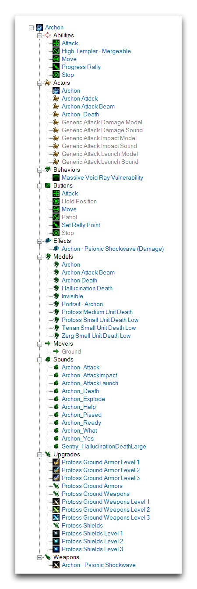
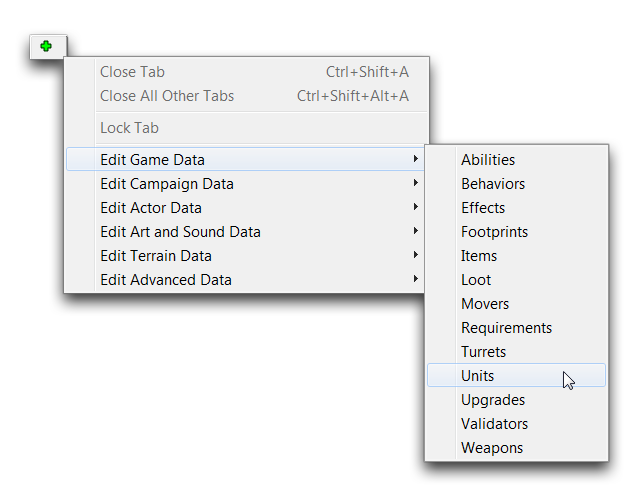
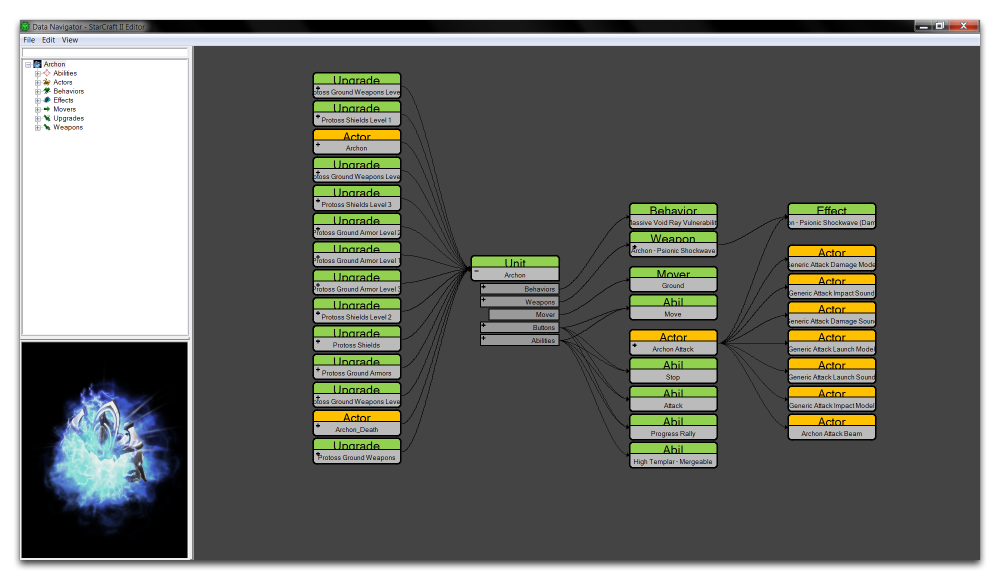
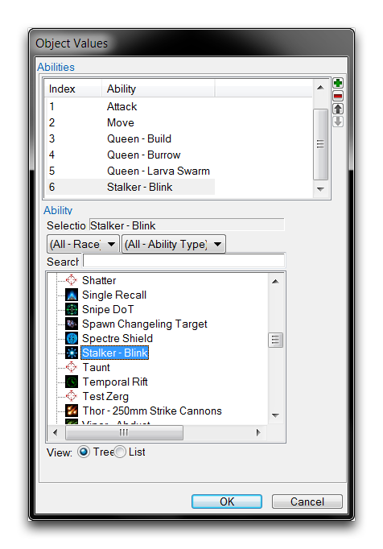
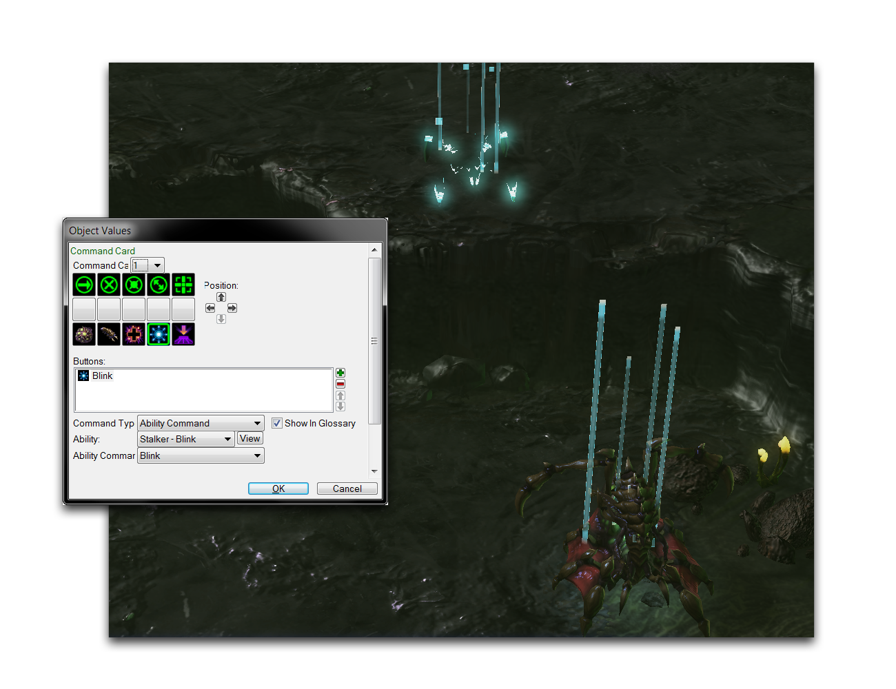
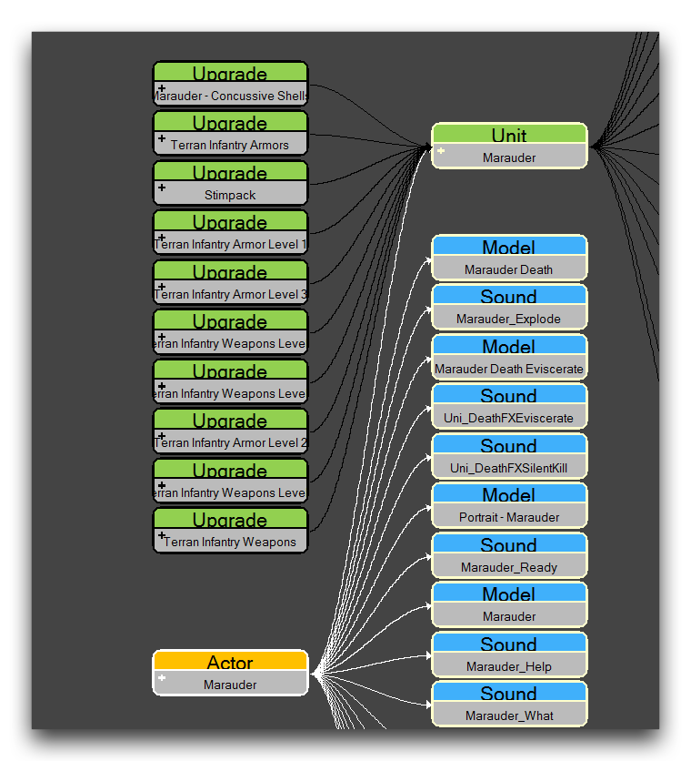
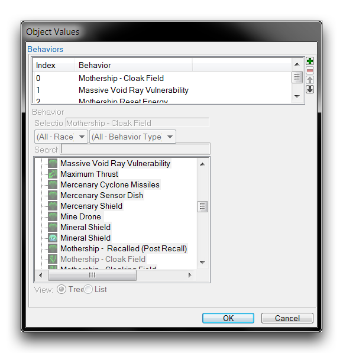
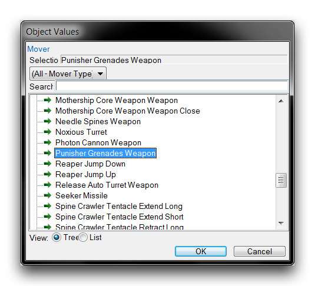

# 单位

一个单位是一个交互式游戏对象。尽管这个术语在许多情况下被随意使用，但在Data Editor中，“单位”这个术语非常明确地指代一个数据类型，直接放置在游戏中供玩家操作。在Data Editor中选择一个单位将给您提供下面所示的分解。

*单位数据对象*

以上显示的单位是Archon，显示在其相当庞大的数据层次结构的顶部。这里所显示的列表长度应该给您一个印象，即单位数据类型的主要目的是作为各种其他类型的游戏数据、美术和声音数据以及演员的容器。您可以通过在Data Editor中导航到+ ▶︎ 编辑游戏数据 ▶︎ 单位来研究单位，如下所示。

*导航到Data中的单位*

单位数据类型与其他数据类型的区别在于，它可以放置到游戏中并接收输入，比如玩家命令、与其他单位的交互以及来自AI的命令。将这些交互传达给其连接的数据类型使单位成为数据转化为游戏玩法的主要方式之一。单位的数据组成如下图所示。

*单位组成*

正如您所看到的，编辑器中的许多数据最终都导致了一个单位。直接的贡献者包括能力、演员、行为、移动器和武器。这些类别与单位类型之间的关系如下所述。

## 能力

一个单位有多达32个能力的空间。这些能力决定了其功能的大部分。单位中常见的能力包括攻击、移动、停止、保持位置和巡逻。这些能力通常通过下面显示的“能力”字段添加到单位中。

*单位组成*

添加后，这些能力通过“命令卡”字段与游戏玩法联系起来。在单位用户界面的命令卡部分添加一个按钮，允许玩家输入触发能力。您可以在下面的图像中看到这个过程的使用情况。

*自定义命令和效果*

## 演员

演员主要将美术和声音资源添加到单位中。更具体地说，每个单位都有一个与其名称相同的演员。这些演员连接到单位的3D模型、肖像、死亡动画和操作声音。许多单位还有一个处理其武器视觉和音频组件的攻击演员。这些演员通过其演员消息与单位连接。在下面的图像中，您将看到其中一个演员将美术和声音连接到一个单位。

*演员到单位数据连接*

## 行为

行为可以存在于单位的范围内，赋予它像光环或有时限生命这样的被动能力。行为通过使用下面显示的“行为”字段添加到单位中。

*Mothership行为视图*

## 移动器

单位将具有一个指导其基本移动的移动器。没有移动器的单位无法使用移动命令。单位的常见移动器包括地面、飞行、埋藏和悬崖跳跃。弹道也包含移动器，通常是模拟动态移动的更复杂移动器。您可以在单位的“移动器”字段内进一步定制单位的移动，允许您设置诸如速度、转向率和加速度之类的设置。移动器在单位的“移动器”字段内设置。

*导弹移动器*

## 武器和炮塔

武器赋予单位攻击的能力。没有武器，攻击命令将不可用。它们的操作方式相对简单。它开始于一个单位被玩家或AI选定为目标。武器然后将在目标处创建一个效果。如果目标单位在射程内，并且武器的冷却时间已过，武器将发射，播放动画，施加其效果，并在适当时发射导弹。武器也可以堆叠，使单位具有多个攻击，每个攻击都有自己的效果、射程、冷却时间等。

每个武器也可以配置一个炮塔。炮塔是一种特殊的数据类型，负责瞄准它们的攻击目标。这种瞄准在开火前会创建一个定时旋转的炮塔，提供了视觉和游戏元素。武器和炮塔通过它们各自的字段“武器”和“炮塔”添加到一个单位。