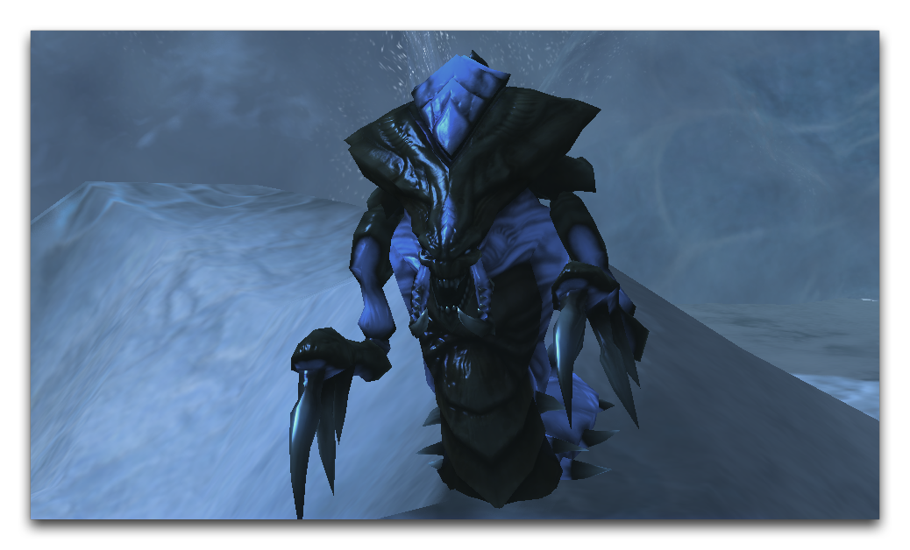

# 演员

演员是**数据编辑器**的中流砥柱。它们既是不可或缺的，也具有广泛的应用范围，因此很难准确定义。演员的目的更容易地通过其作用来定义。简单地说，演员在数据内部实现了某些功能。

演员有自己的逻辑系统，这个系统负责连接数据之间的许多链接和操作。一些演员将引擎中可观察的组件（如模型、小玩意和声音）连接起来，将它们融入游戏中。其他演员通过配置攻击和能力来影响游戏玩法。甚至还有一系列用于演员的高级构造，其中包括**演员列表**，用于跟踪和组织演员，**演员区域**，根据地图区域与其他演员互动，以及**事件宏**，将常见的演员逻辑汇集到一种可重复使用的工具中。演员也是 **StarCraft** 引擎的异步组件，使它们能够向不同的玩家推送不同的数据。

您可以通过移动到**数据编辑器**，然后导航到 + ▶︎ **编辑演员数据** ▶︎ **演员** 来找到**演员**部分，如下所示。

*导航到数据中的演员*

这将带您到**数据编辑器**的**演员**选项卡，为您展示以下视图。

*演员选项卡视图*

演员部分中的字段在下一部分中有描述。

## 演员详情

由于演员有许多不同类型，对每个演员属性进行单独处理将变得太过繁琐，无法使用。然而，演员有一长串的共同属性，这些属性在下表中进行了拆分说明。

| 字段                       | 详情                                                                                                                                                                                                                                                                                                                                                                                                                            |
| --------------------------- | ---------------------------------------------------------------------------------------------------------------------------------------------------------------------------------------------------------------------------------------------------------------------------------------------------------------------------------------------------------------------------------------------------------------------------------- |
| 别名                     | 演员的备用引用名称。这提供了一种快捷方式，让演员可以向彼此发送消息。例如，单位演员有一个通用的 \_Unit 别名。当另一个演员想要访问单位演员时，可以使用此别名。这比查找实际演员名称更好，因为实际名称每次都会有所不同。                                                                                    |
| 复制源                 | 将另一个演员设置为代理父级。这意味着当前演员的子演员将从复制源演员那里获得其属性。要传递的属性必须在复制源演员的 **接受的属性传递** 字段以及子演员的 **继承的属性** 字段中设置。                                                                                                                     |
| 过滤器                      | 将演员的可见性设置为演员所有者的盟友、敌人、中立或自身组。                                                                                                                                                                                                                                                                                                                                     |
| 过滤播放器               | 根据玩家进行演员的可见性设置。                                                                                                                                                                                                                                                                                                                                                                                |
| 标志              | 标志包含演员的许多附加选项。                                                                                                                                                                                                                                                                                                                                                                       |
| 添加到外部查找器      | 将演员移动到全局范围，使其可以被游戏中的所有其他演员使用。                                                                                                                                                                                                                                                                                                                                               |
| 不保存备份                   | 将演员标记为在游戏保存期间不保存或加载，从而减少这些操作的时间。                                                                                                                                                                                                                                                                                                                                     |
| 对单位玩家的响应     | 设置演员在其单位演员更改所有者时自动更新其玩家ID。                                                                                                                                                                                                                                                                                                                                            |
| 抑制创建错误    | 关闭演员的创建错误消息。如果演员在某些情况下设计为在创建事件失败时失败，则这将很有用。                                                                                                                                                                                                                                                                                       |
| 迷雾可见性              | 设置演员在战争迷雾下的外观。行为选项如下：变暗会使其看起来变暗，隐藏会完全隐藏演员，快照会显示演员在离开视野之前的最后可见状态，可见会使演员在迷雾下保持可见。                                                                                                                                                                                                                      |
| 共享                     | 设置共享演员的行为，如果多个功能请求它。选项包括：始终共享、从不共享和每个效果独立共享。每个效果允许您基于效果来配置共享。                                                                                                                                                                                                                 |
| 事件                      | 允许设置演员事件和消息，这些事件和消息是演员的内部逻辑语言。                                                                                                                                                                                                                                                                                                                                 |
| 宏                      | 可以在这里添加事件宏。事件宏是许多演员中可重复使用的常见事件集合。                                                                                                                                                                                                                                                                                                                        |
| 删除                      | 指定删除从父级演员继承的不需要的事件。                                                                                                                                                                                                                                                                                                                                                            |
| 条款                    | 设置必须通过的条件，才能创建演员。与**事件**中的创建事件的条件相同，如果在此处输入，将覆盖该消息。这在数据组织中有应用。                                                                                                                                                                                                          |
| 主机支持者              | 主机支持者用于指定支持者演员。当支持者死亡时，将发送 SupporterDesctruction 消息给托管它的演员。通常用于销毁该托管演员，但也可用于播放动画或传播消息。                                                                                                                                                                |
| 接受的属性传递 | 确定哪些属性将传递给子演员。通过一组标志进行控制。此处的众多选项包括模型比例、不透明度、比例、队伍颜色、可见性和贴花。在继续字段中还有更多传输属性，接受的传输中的选项包括动画属性、战争迷雾颜色、位置、旋转和纹理。 |
| 继承类型               | 设置演员是通过 **Once** 从其主机继承其属性，从不通过 **None** 继承，还是通过 **Continuous** 动态更新方式继承。                                                                                                                                                                                                                                                                                 |
| 继承的属性       | 确定该演员从其父级演员继承的属性集。要正确继承属性，必须在**继承的属性**和**接受的属性传递**字段中都进行选择。                                                                                                                                                                                                                 |

## 演员事件

**演员事件**是演员之间的通信系统。它允许演员相互交流，创建可能影响游戏的任何方面的上下文敏感变化。该系统由下面描述的三个基本元素组成。

 游戏内可能发生的具体发展。

 游戏状态的可确认属性集。

 可以传达到游戏元素的命令。

这些元素在一个序列中共同工作，创建一个**演员事件**。该序列展开如下。设置演员的事件使演员监视特定事件的发生。如果发生，那么检查条款。如果发现为真，则向目标游戏元素发送消息。