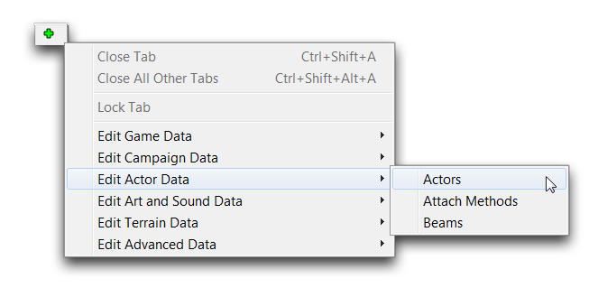
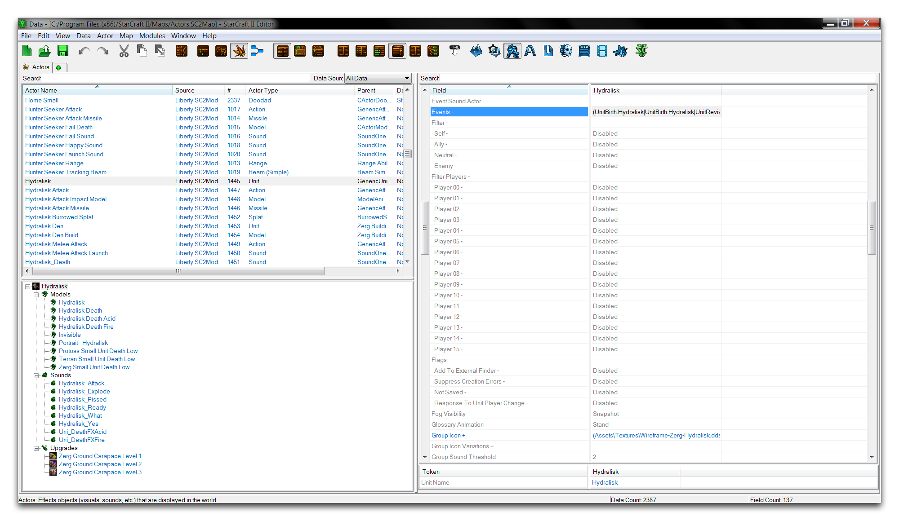
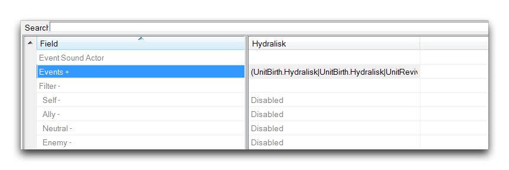
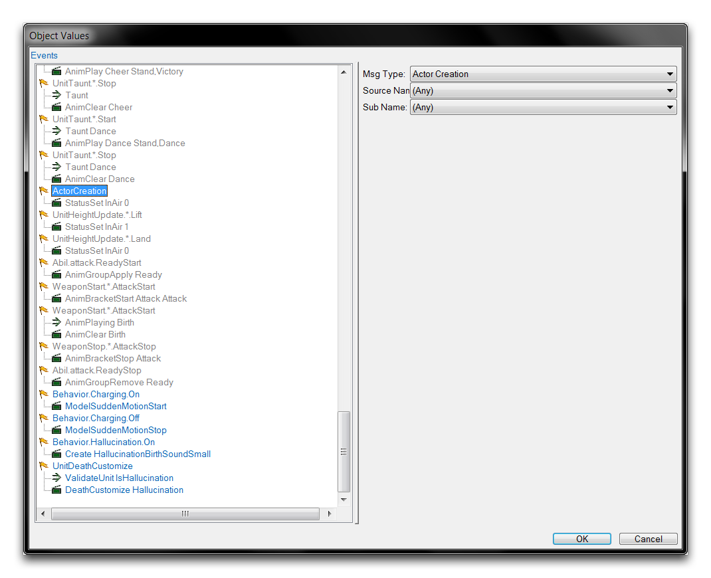
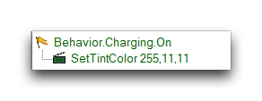
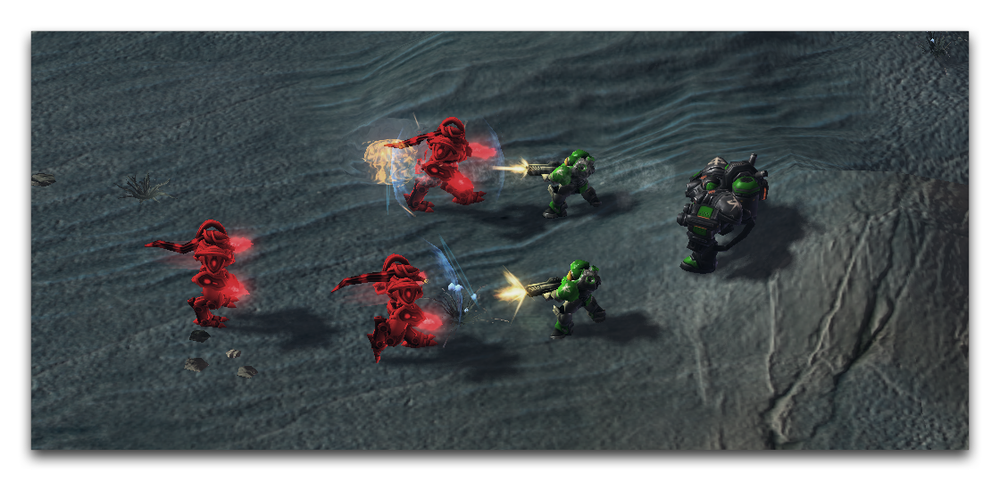

您可能已经注意到，这跟编辑器的另一个主要通信系统——触发器是相似的。角色事件系统中的事件、术语和消息与触发器系统中的事件、条件和动作是平行的。虽然触发器系统可以应用于许多游戏元素，但角色事件系统主要处理数据。触发器通常是针对地图中单位、对象和事件的特定实例的选项。角色事件适用于对象的一般类型。角色事件设计一个单位及其互动，而触发器可以在游戏过程中调整和更改该单位。

您可以通过导航到任何角色类型的“事件”字段来找到角色事件系统。下面展示了典型事件字段的视图。

*角色事件字段*

双击该字段将启动角色事件子编辑器。

*角色事件子编辑器*

该子编辑器展示了角色“事件”字段中的事件、术语和消息的组织视图。您应该注意，元素按其数据源进行了颜色标记。灰色元素表示从游戏核心数据中继承，蓝色元素来自暴雪依赖，绿色元素来自当前项目。

## 使用角色事件

通过在子编辑器视图中突出显示一个元素，然后选择其类型，可以设置角色事件，通过右侧面板的“消息类型”或“术语类型”下拉菜单。请注意，事件和消息都使用术语“消息”进行引用。这是因为它们是可以互换的，消息可以用作事件触发器，反之亦然。

额外选项，如参数或源，通常控制消息传达的内容。任何没有目标的消息将由角色发送到自身。消息也可以通过别名更精细地定位。尽管角色可以通过直接名称如“Marine”进行引用，但它们通常具有类型别名如\_Unit，并具有系统引用例如::Creator。

角色事件非常灵活多样。它们可以执行角色数据中的基本处理，例如创建、销毁和链接角色。然而，角色事件还具有许多更加微妙的功能，例如播放动画、改变艺术和声音资产的物理属性、应用物理效果以及控制照明。关于角色事件功能的示例，请参考下文。

*示例角色事件*

在这里，一个事件已经设置为响应狂热者的冲锋行为。作为对冲锋开始的响应，狂热者将向其自己的单位角色发送一个消息，导致其模型变为红色。在测试中，游戏效果如下图所示。

*狂热者在冲锋期间变成愤怒的红色*

## 角色事件与触发器

如前所述，尽管角色事件和触发器系统处理游戏的不同部分，但它们之间存在许多相似之处。尽管在思维上将这两者分开可能是有益的，但事实上，这两个系统经常相互通信，功能重叠，并且可以用几种不同方式来实现相同的目标。

一个重要的例子是，角色消息可以通过触发器编辑器的“发送角色消息”动作发送给特定的角色。您可以在下文中看到这一点。

*'发送角色消息' 动作*

上面，触发器中的一个动作语句已经向一个飞龙的单位角色发送了一个“设置着色”消息。该单位角色还收到了一个改变其队伍颜色的消息。通过从触发器直接向角色发送消息，这些消息一起让单位的模型变成了蓝色。

*上色的飞龙*