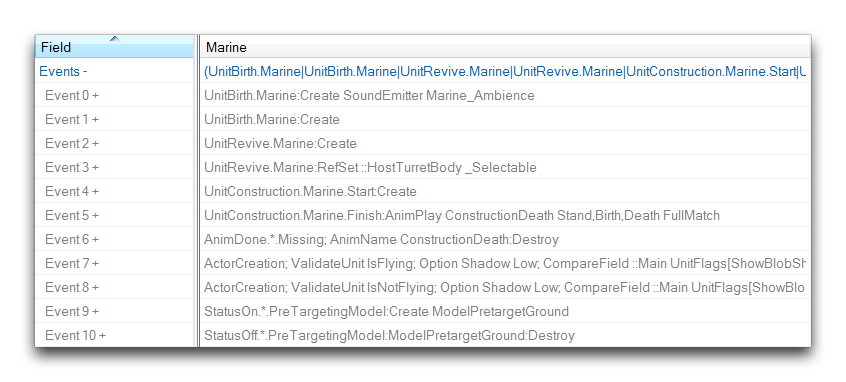
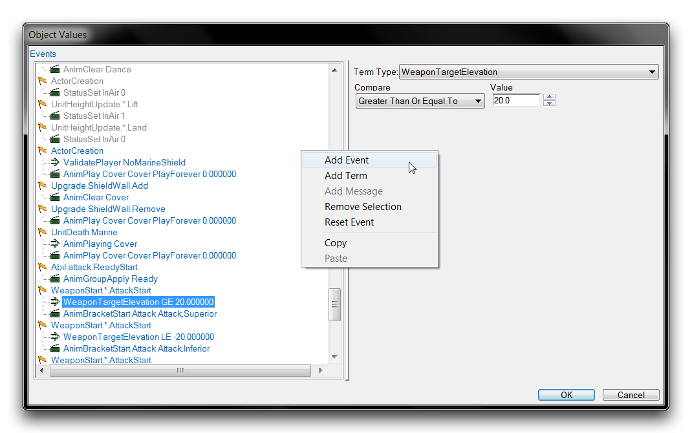
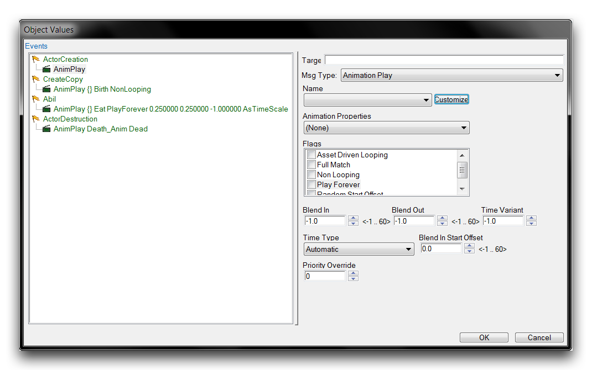
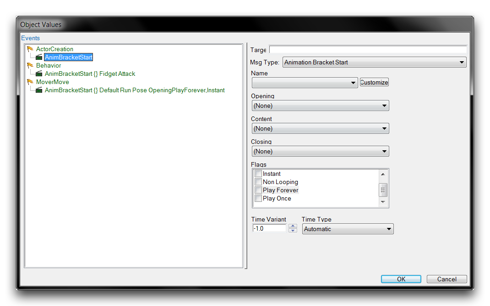
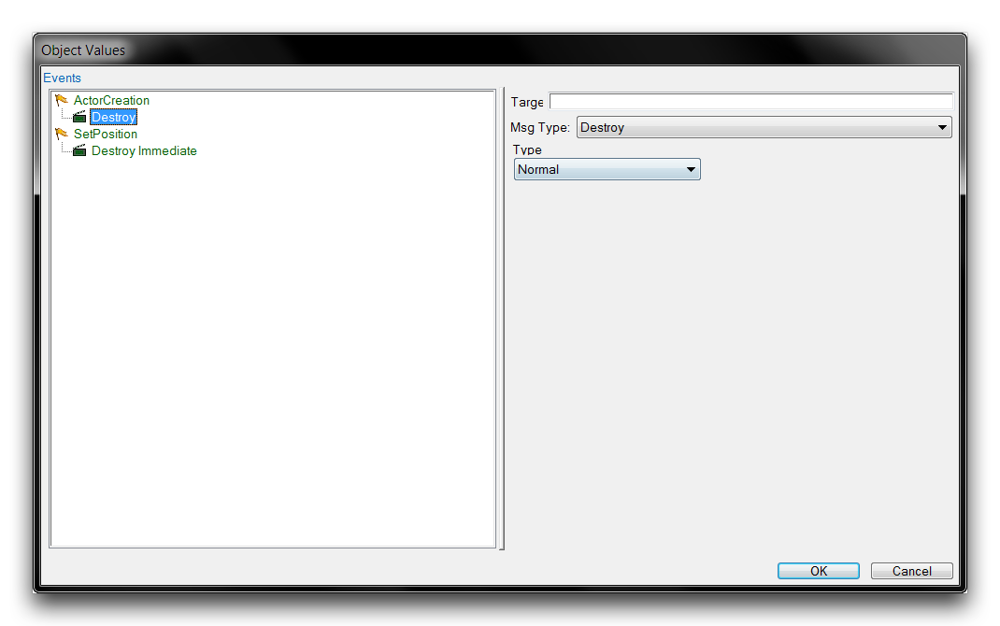
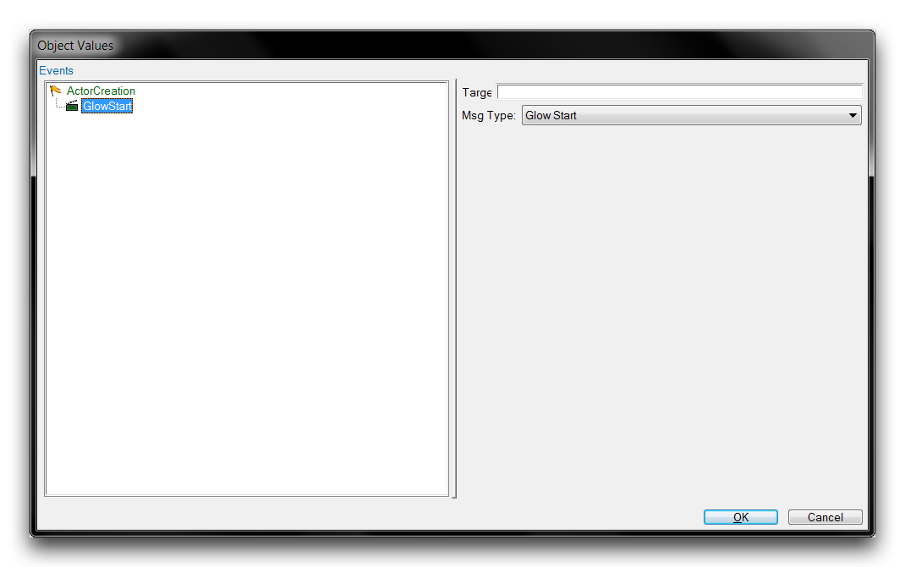
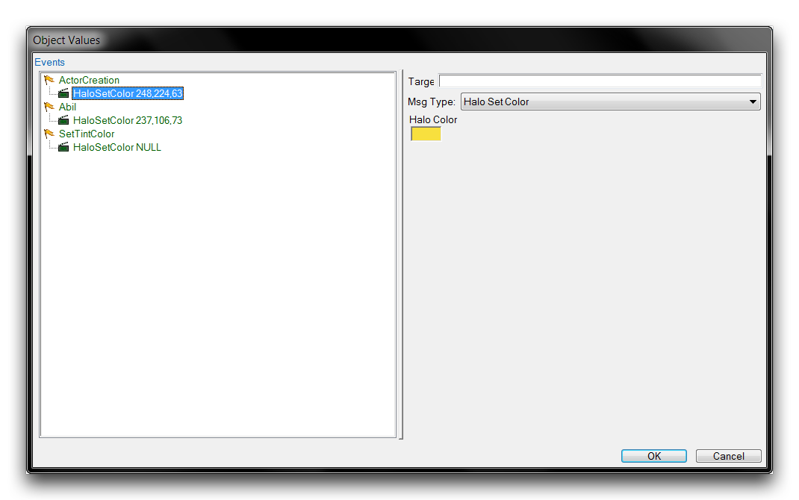
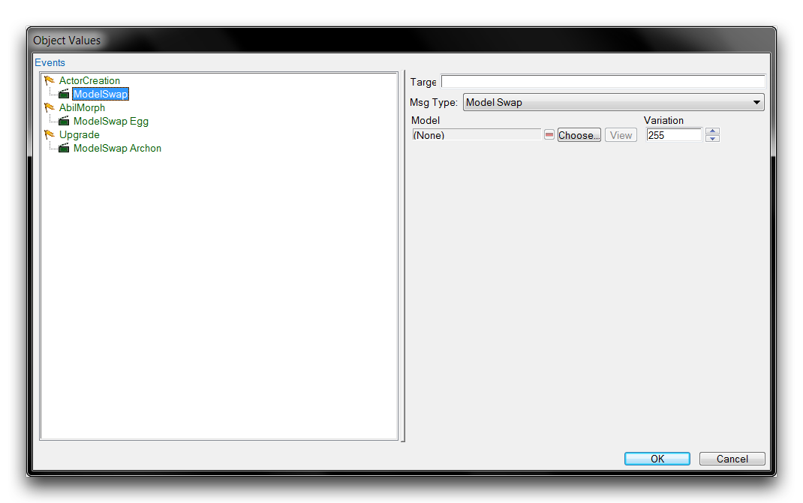
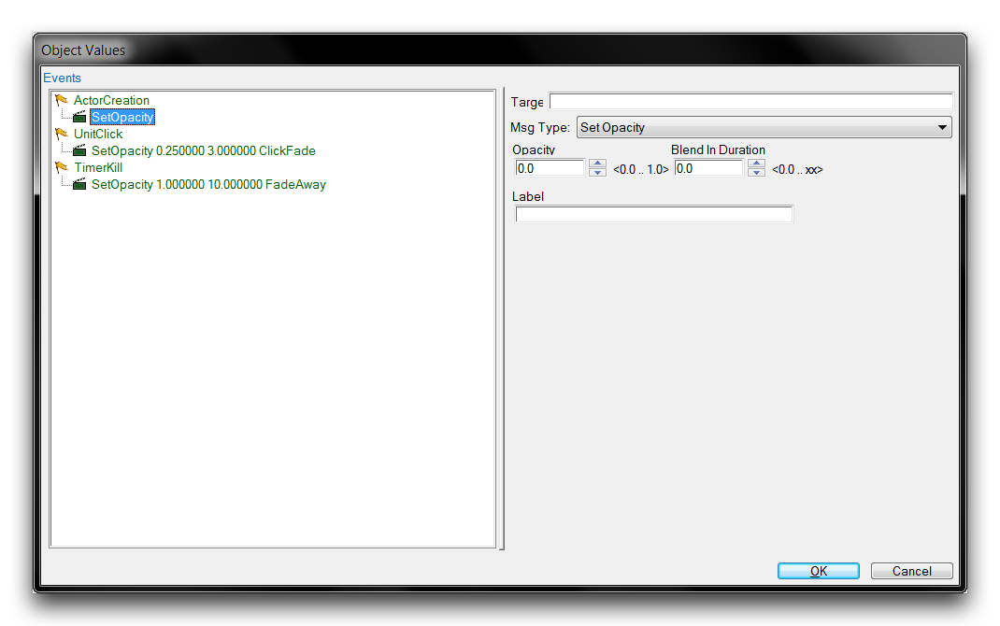

# 演员消息概述

对于几乎每种数据类型，都有一些相关的演员消息提供其逻辑后台。这确保了演员消息的稳定性既多样又众多。在本文中，您将找到许多类型消息的详细说明，以及一些关于它们使用的建议。

在开始之前，您应该注意，您既可以直接查看演员的消息，通过可展开的“事件”字段，也可以在演员事件的子编辑器中结构化查看。本文中的每个条目还将包括一个消息类型在子编辑器中的视图，但基本字段视图有时也很重要。您可以在下面的图片中查看这个视图。

*演员事件字段*

在这里，您可以查看演员消息的直接ID，例如UnitBirth或ActorCreation，而不是它们在子编辑器的“Unit Birth”或“Actor Creation”选择面板中的结构形式。在使用演员消息时，这些ID可能很重要，无论是在触发器编辑器还是脚本中。因此，它们已经在以下每个条目的开头提供了。

虽然本文可以作为一个参考，但您应该意识到，研究演员消息库的最佳方式是单独进行，通过在子编辑器视图中创建和检查消息。您可以通过移动到演员的“事件”字段，双击以启动子编辑器，然后右键单击白色框内并选择“添加事件”来创建一个事件和消息对。

*演员事件创建*

下面是许多类型的演员消息的概述。

## 播放动画

*播放动画消息*

AnimPlay

播放指定的动画。这是动画控制的基本消息，其选项主要控制动画的物理属性。

| 字段                  | 详情                                                                                                                                                   |
| -------------------- | --------------------------------------------------------------------------------------------------------------------------------------------------------- |
| 名称                 | 为消息设置一个参考标签。                                                                                                                   |
| 动画属性 | 从下拉列表中选择动画类型。所有动画都与一个预设状态列表相关联。您可以在“剧情编辑器”中找到并检查它们。 |
| 标志                |                                                                                                                                                           |
| 基于资产循环 | 类似于永久播放，但在动画中设置了更明确的循环行为。                                                                   |
| 完全匹配           | 将动画的连续播放彼此匹配，而没有任何断续。                                                                       |
| 非循环播放         | 一次播放当前动画。                                                                                                                 |
| 永久播放         | 持续循环播放动画。                                                                                                                          |
| 随机起始偏移  | 从一个随机帧开始播放动画。                                                                                                                   |

混入混合动态地在两组不同的动画之间进行插值。此设置了从当前动画混入此动画的时间。 淡出 设置从此动画淡出到新动画的时间。 时间变体 设置用于设置时间变体的时间刻度类型。 时间类型 设置用于设置时间变体的时间刻度类型。 混入起始偏移 设置开始混合过程的偏移时间。 优先级覆盖 设置混合的优先级与其他动画的优先级进行比较。

## 动画分段开始

*动画分段开始消息*

AnimBracketStart

动画分段充当三阶段动画序列的容器。这些阶段是开场、内容和收场。

| 字段               | 详情                                                                |
| ------------------- | ---------------------------------------------------------------------- |
| 名称                | 为消息设置一个参考标签。                                |
| 开场             | 设置第一个阶段的动画。                                        |
| 内容             | 设置第二个阶段的动画，其在开场后播放。     |
| 收场             | 设置在内容之后播放的最终动画阶段。          |
| 标志               |                                                                        |
| 完全收场        | 确认收场动画在任何情况下完成。 |
| 瞬间             | 跳过开场动画并从内容开始。              |
| 非循环播放         | 使内容动画只播放一次。            |
| 永久播放        | 重播开场动画，直到手动停止。          |
| 随机起始偏移 | 对动画开始时间应用随机偏移。|

时间变体 设置用于设置时间变体的时间刻度类型。 时间类型 设置用于设置时间变体的时间刻度类型。

## 销毁

*销毁消息选项*

Destroy

销毁演员，从任何进一步更新中消除它并移除任何视觉组件。有两种可用类型，即立即和正常。立即将立即销毁演员及其所有替代物。对于单位而言，它们的死亡动画不会播放。正常移除演员及其替代物，但允许死亡动画播放并使粒子自然消失。

## 开始发光

*发光开始消息*

GlowStart

将脉冲状的辉光效果应用于演员的模型。可以通过“Glow Stop”消息停止此效果。此消息没有子选项。

## 设置光环颜色

*设置光环颜色消息*

HaloSetColor

光环可在模型周围添加发光轮廓。它们通常用于为单位提供对比或突出显示以供特定参考。此消息设置光环的颜色，而“Halo Start”和“Halo Stop”控制其添加和移除。

## 模型替换

*模型替换消息*

ModelSwap

将演员的模型设置为选择的模型值。这将替换当前选择的任何模型。还支持选择模型的特定变体。

## 设置不透明度

*设置不透明度消息*

SetOpacity

改变演员的不透明度，并将该变化传播到任何连接的视觉资产，如模型。