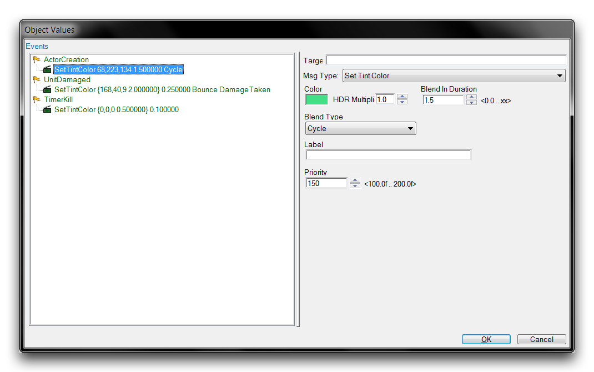

| 字段               | 详细信息                                                                                                          |
| ----------------- | ---------------------------------------------------------------------------------------------------------- |
 | 不透明度          | 设置应用的不透明度级别，0.0为默认状态，1.0为完全透明。 |
 | 混合持续时间       | 设置应用不透明度的时间段。默认情况下，应用是即时的。       |
| 标签              | 为消息设置一个参考标签。                                                                        |

## 设置着色

*设置着色消息*

SetTintColor

为演员应用一种着色，将颜色变化传播到任何连接的视觉资产，比如一个模型。

| 字段                | 详细信息                                                                                                                                   |
| ----------------- | ------------------------------------------------------------------------------------------------------------------------------------------ |
 | 颜色              | 设置作为着色应用的颜色。单击颜色框将启动一个颜色选择器窗口。                                                                             |
 | HDR增益          | 通过HDR光照设置亮度增益。                                                                                                               |
 | 混合持续时间      | 设置应用颜色的时间段。默认情况下，应用是即时的。                                                                                         |
 | 混合类型        | 从不同的混合方法中选择。One Shot将一次性应用混合到颜色中，Bounce将混合进颜色然后再混合出来，Cycle将重复混合进和混合出颜色。  |
 | 标签            | 为消息设置一个参考标签。                                                                                                                   |
 | 优先级          | 设置此着色在类似消息上的优先级。                                                                                                           |