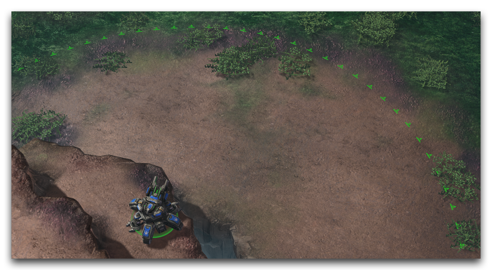
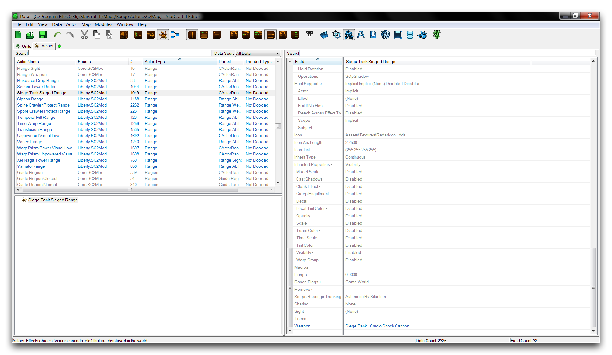

# 范围演员

范围演员用于在地图上绘制范围指示器。范围演员是一种视觉演员，其用途狭窄，在星际争霸的近战游戏中经常使用。在这种能力中，范围指示器标记了许多与游戏玩法相关的距离，包括幽灵狙击的施法范围、侦查者检测的视野范围，也许最著名的是围攻坦克的射程。

*围攻坦克范围演员*

实际上，范围演员并不绘制范围指示器。相反，它们在地图上绘制一种环形图案的纹理，然后该纹理作为范围指示器进行操作。在这里作出区分是为了让您了解范围演员可以以其他方式使用。了解演员实际操作的内容是非常重要的，这样您就可以进行配置和使用。

您可以在地形编辑器中通过导航到“视图”▶︎“显示地形”▶︎“显示范围”来设置范围演员的可见性。您可以在数据中找到范围演员，在演员选项卡下，类型为“Range”，如下所示。

*范围演员列表*

## 范围演员详细信息

范围演员有大量字段，由于它们是从演员继承而来的。但实际上，您只会使用其中最有用的字段。范围演员最有用的字段在以下表格中进行了拆分。

| 字段             | 详情                                                                                                                                                                                                                                                  |
| ----------------- | -------------------------------------------------------------------------------------------------------------------------------------------------------------------------------------------------------------------------------------------------------- |
| 能力           | 将演员链接到一个能力，并从中接收一个范围值。                                                                                                                                                                                        |
| 弧度               | 设置圆形图案的一部分，或弧度，在其中纹理将被绘制。值在0和360之间。默认情况下，指示器绘制一个完整的圆或360。弧度直接从单位的正前方开始，并向两个方向均匀扩大。 |
| 行为          | 将演员链接到一种行为，并从中接收一个范围值。                                                                                                                                                                                        |
| 悬崖高度标志 | 设置范围演员如何将其纹理投射到其他悬崖层级上。检查“较低”、“较高”或“相等”将在这些层级上显示纹理。                                                                                                    |
| 视野             | 将演员链接到一个单位，并从其“视野半径”字段接收一个范围值。                                                                                                                                                                        |
| 武器            | 将演员链接到一种武器，并从中接收一个范围值。                                                                                                                                                                                          |
| 图标              | 设置要在地图上绘制的纹理。请注意，所有默认范围演员均使用“RadarIcon1”纹理。                                                                                                                                            |
| 图标着色         | 对图标纹理应用着色。                                                                                                                                                                                                                      |
| 图标弧长   | 设置按照该间距在图标上进行图案化的间隔。间距值是单位之间的弧度测量。                                                                                                                        |
| 范围标志       | 包含两个标志，游戏世界和范围旗帜小地图。前者设置演员是否在主游戏中显示，后者设置演员在小地图上是否显示缩放版本。                                                 |
| 事件            | 设置演员事件。范围演员使用事件创建和移除自己，以及控制可见性行为。                                                                                                                                  |
| 范围             | 直接设置纹理绘制的半径。不要将其与“能力”、“行为”、“视野”或“武器”字段一起使用。                                                                                                        |

如上所述，有几个字段允许您自定义范围演员的外观。这些属性在默认数据依赖中大多被忽略。这是因为传统的星际争霸通常将范围演员用作沟通工具。结果，它们的外观在所有单位上保持一致，以避免玩家混淆。但是，这些字段仍可能为开发人员提供创造性选项。

## 范围演员消息

下表包含与范围演员相关的事件和消息的详细信息。

| 消息                     | 描述                                                                                                                                                            |
| --------------------------- | ---------------------------------------------------------------------------------------------------------------------------------------------------------------------- |
| 创建                      | 创建范围演员，在地图上显示指示器。                                                                                                             |
| 销毁                     | 销毁范围演员，从地图上移除指示器。                                                                                                         |
| RangeUpdat e                | 命令演员重新检查其源头的范围值。由于范围值在演员创建时设置，如果主机的属性发生了变化，则这可能是有用的。 |
| 能力                     | 用于在能力在主动目标时应用演员。                                                                                                      |
| TargetOn                    |                                                                                                                                                                        |
| 能力                     | 用于在目标结束后移除演员。                                                                                                                 |
| TargetOff                   |                                                                                                                                                                        |
| SelectionL ocalUpdate Start | 用于在选中单位时应用演员。                                                                                                                      |
| SelectionL ocalUpdate Stop  | 用于在取消选中单位时移除演员。                                                                                                                    |

## 范围演员类型

有四种基本类型的范围演员用于继承，Range Abil、Range Behavior、Range Sight和Range Weapon。

Range Abil是为设计提供面向目标能力的指示器的范围演员的基础。它支持一个“能力”令牌，将其链接至该令牌将设置演员的范围字段为该令牌的值。此令牌还提供演员事件模板，将范围演员的创建和移除消息链接到能力令牌的目标输入。此模板如下所示。

**

**

Range Behavior是为设计提供雷达范围或侦测半径行为的指示器的范围演员基础。它支持一个“行为”令牌，将其链接至该令牌将设置演员的范围字段为该令牌的值。此令牌还具有演员事件模板，将根据行为令牌的开启或关闭状态创建和移除演员。此模板如下所示。

**

**