Range Sight是为射程角色设计的基础，旨在为视野半径提供射程指示器。它支持一个单位令牌，连接到该令牌将会将角色的射程字段设置为该令牌的射程。Range Weapon同样接受一个武器令牌，将角色的射程设置为该令牌的射程。需要注意的是，这两种基本类型不包含角色事件，需要在它们被视为可操作之前，为射程角色的创建和销毁事件设置好。

## 展示射程角色

现在，打开本文提供的演示地图。该地图上有一个盘旋在悬崖上方的监视者，如下图所示。

[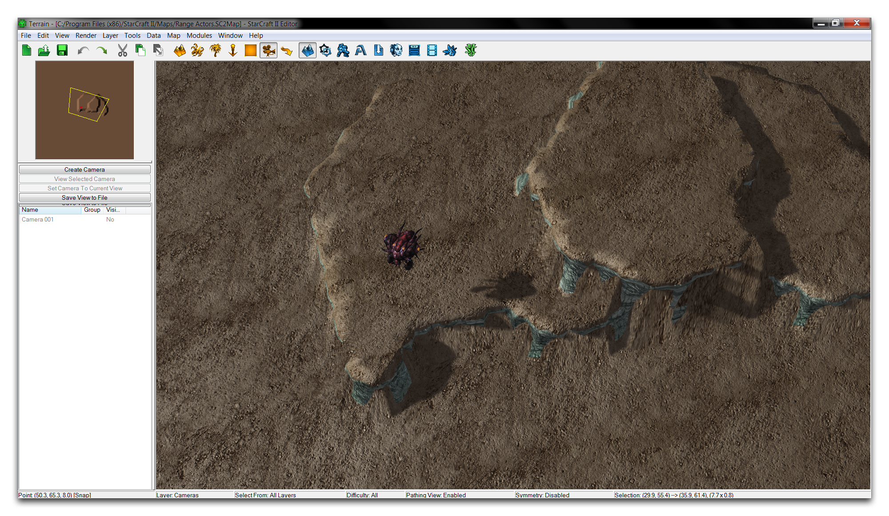](./resources/062_Range_Actors7.png)
*演示地图*

监视者是星际争霸中以其侦察能力闻名的单位。它可以在监视者周围的圆形半径内以一定距离显示隐形单位。在这张地图上，没有任何关于这一范围的指示，无论是被动地还是在选择监视者时。你可以应用一些射程角色来改变这一情况，让玩家一目了然地了解监视者的实用性。

要实现这一点，进入数据编辑器，然后进入角色选项卡。如果该选项卡尚不可用，通过导航到 + ▶︎ 编辑角色数据 ▶︎ 角色 来打开它。在那里，通过在主视图中右键点击并选择添加角色来创建一个新角色，如下图所示。

[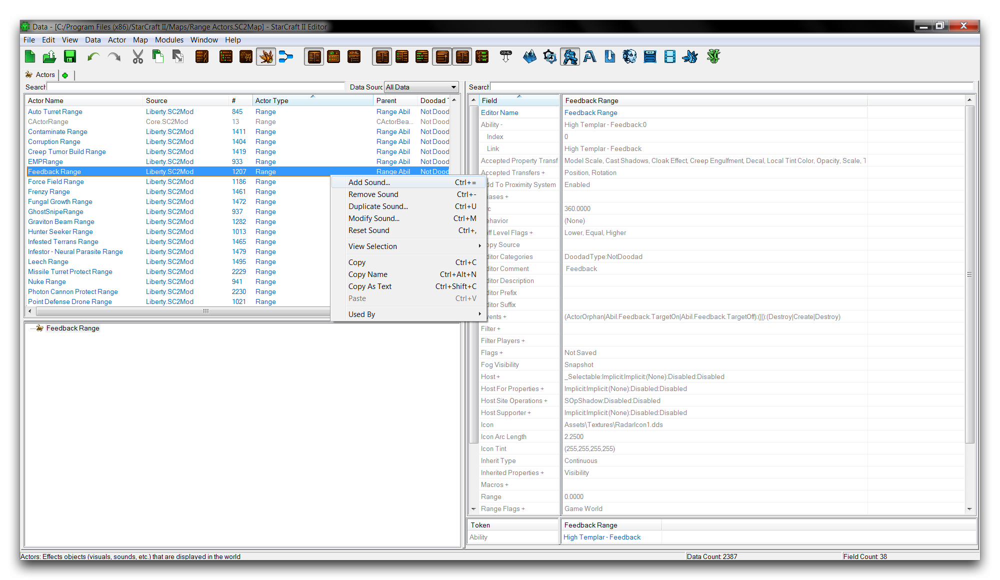](./resources/062_Range_Actors8.png)
*创建角色*

这将弹出一个窗口，您可以在其中设置要创建的角色的详细信息。将新角色命名为“监视者视野范围”，然后点击“建议”以生成一个ID。使用“角色类型”下拉菜单将该类型设置为Range，然后将“父级”设置为Range Sight。这声明了该角色为所需的射程角色，同时给予它一个基本类型，这将在稍后的工作中有所帮助。创建窗口现在应该显示如下图所示。

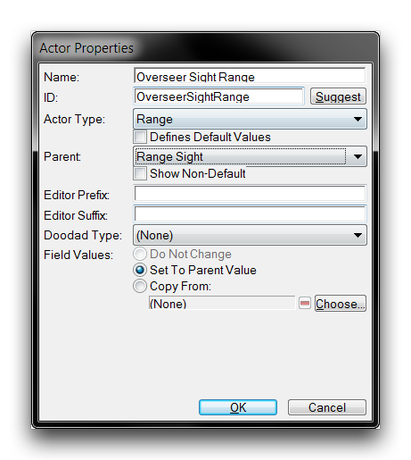 准备创建的射程角色

点击“确定”以创建射程角色。这将带您回到主数据编辑器视图。在那里，选中“监视者视野范围”角色以打开其字段。由于其父权，您将看到该角色在字段列表底部有一个令牌。在该令牌中输入一个单位类型将允许新的射程角色从现有单位中提取部分属性。选择令牌字段，如下图所示。

[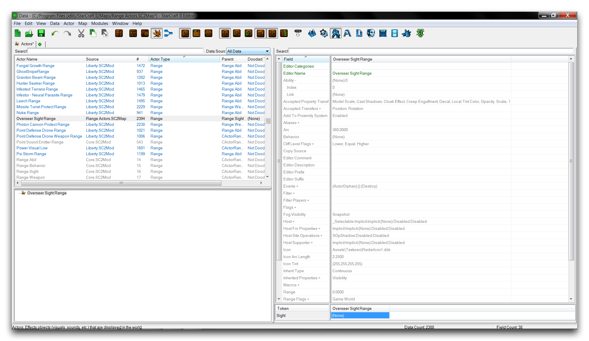](./resources/062_Range_Actors10.png)
*射程角色令牌字段*

打开该令牌字段将允许您设置一个单位，该单位将使其视野值被提取以用作射程角色的射程。双击令牌字段将呈现给您以下视图。

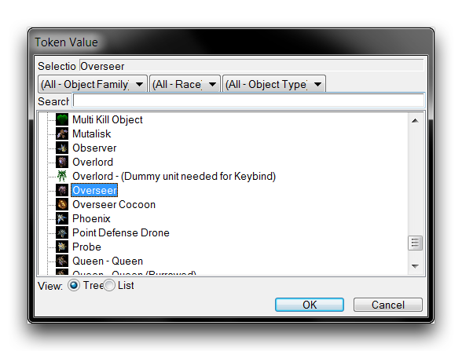
*令牌选择*

在令牌弹出窗口中选择一个单位，将该单位的视野设置为指示器将绘制的距离。由于此射程角色被设计为显示监视者的视野范围，请在此处选择“监视者”。值得指出的是，任何其他具有相同视野范围的单位仍然能够正常工作，并准确描绘监视者的视野。然而，输入实际的监视者本身，可以使这个射程角色在任何原因导致视野值改变时进行更新。这是一个很好的设计。在令牌弹出窗口中点击“确定”将更新该角色。现在，“视野”字段应如下图所示。

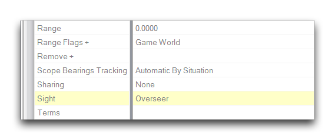
*令牌选择*

视野字段已自动填充。您可能也已经注意到，范围值不会显示在角色内。这些值直接与单位关联，这意味着“范围”字段现在是一个手动覆盖。一般来说，您不应该将其与令牌一起使用。

现在，导航至“事件”字段，双击以启动角色事件子编辑器。应该只有一个“ActorOrphan”事件，负责在编辑器中清理范围角色。右键单击白色框内部并选择“添加事件”。

[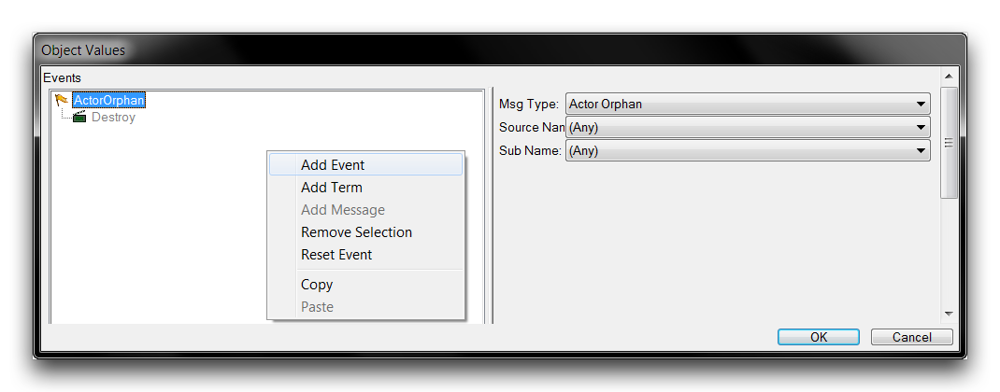](./resources/062_Range_Actors13.png)
*角色事件创建*

将新事件的“消息类型”设置为“单位出生”，将其“来源名称”设置为“监视者”。然后将其消息设置为“创建”。此过程如下图所示。

[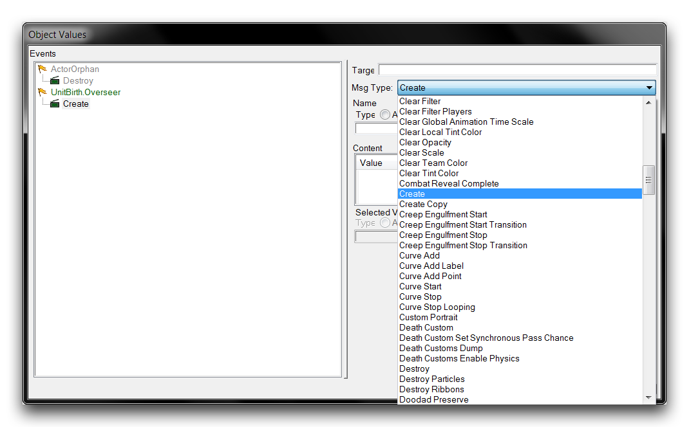](./resources/062_Range_Actors14.png)
*设置创建事件*

这种事件和消息的组合将在监视者创建时创建射程角色。这意味着射程指示器将始终与监视者一起显示。接下来，创建另一个事件，将其“消息类型”设置为“单位死亡”。同时，将其“来源名称”设置为“监视者”，消息设置为“销毁”。这将在监视者死亡时销毁并移除射程指示器。完成的角色事件应如下图所示。

[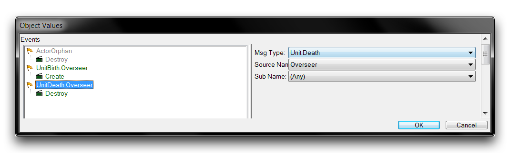](./resources/062_Range_Actors15.png)
*完成的角色事件*

点击“确定”保存角色事件，然后返回到主数据编辑器视图。此时，射程指示器应该已经正常运作，但您可以进行一些微小的改动来提高可见性。选择“图标弧长”字段，将其值设置为1.125。这将使基础值减半，导致圆圈中显示的射程指示器数量增加一倍。

如果您现在测试射程角色，应该能够获得成功的结果。然而，为了更好地说明这些角色的效果，下一个步骤是构建第二个射程指示器并将其附加到监视者上。您可以通过选择“监视者视野范围”角色，右键点击并选择“复制角色”来快速完成此操作。这将呈现给您以下视图。

[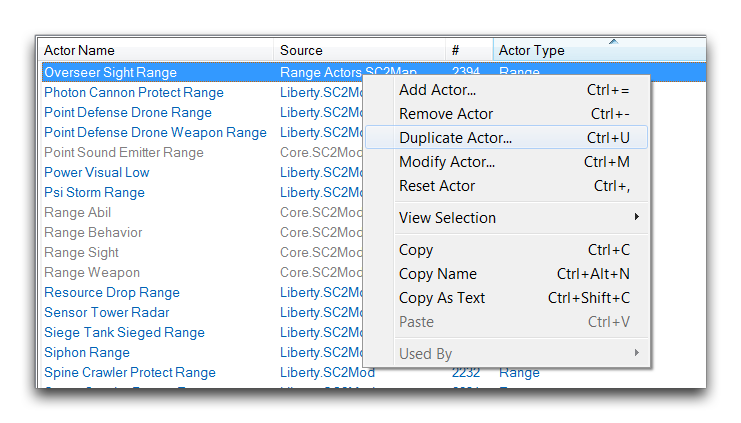](./resources/062_Range_Actors16.png)
*复制射程角色*

这将启动一个“复制角色”窗口，其中有一个“监视者视野范围”的值。

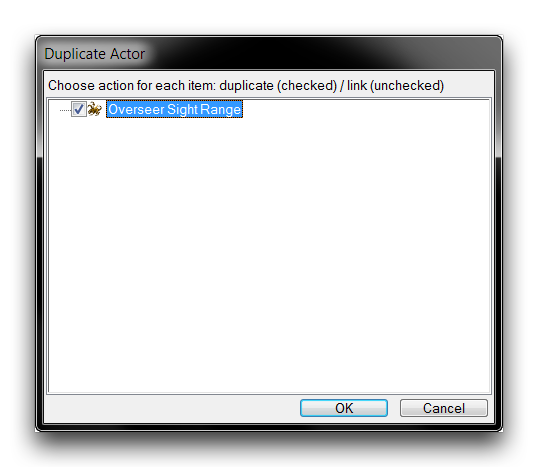
*复制窗口*

复制角色可能会变得非常混乱，因为它们也会克隆许多连接的角色。在这种情况下，射程角色是一个独立的、单一用途的角色，因此您可以放心地进行复制。确保在窗口中选中了“监视者视野范围”的值，然后点击“确定”。