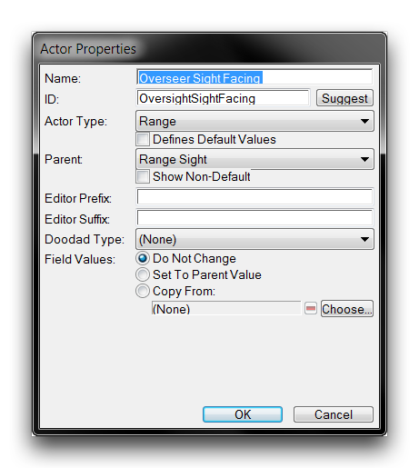
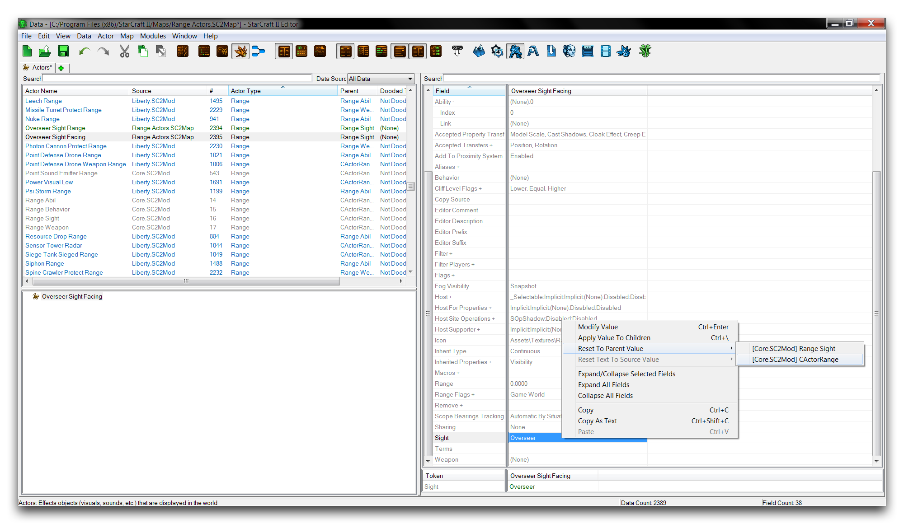
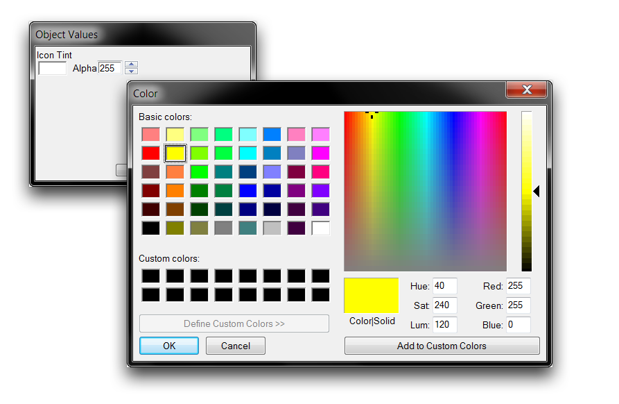
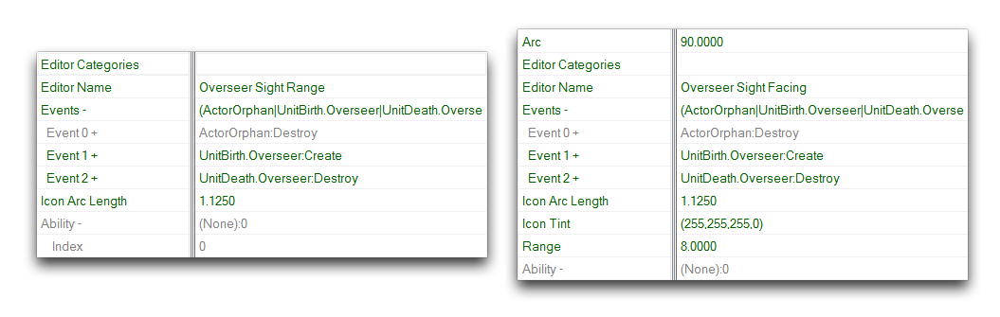
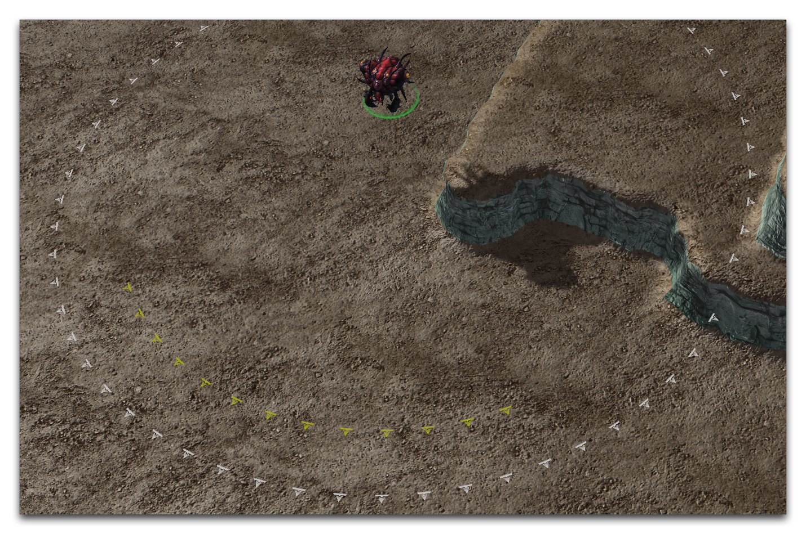

这将在编辑器中将演员复制为“Overseer Sight Range Copy”。突出显示这个新的演员，双击它以更改其属性。在此启动的“Actor Properties”窗口中，将演员的名称设置为“Overseer Sight Facing”，然后点击“Suggest”生成一个ID。确认窗口的数值如下图所示，然后点击“Ok”。

*复制窗口*

突出显示“Overseer Sight Facing”演员，选择其“Arc”字段，并将值更改为90。这个演员现在将只在Overseer前面投射一个四分之一的圆圈，突出显示单位的朝向。突出显示“Sight”字段，右键单击它，导航到Reset to Parent Value ▶︎ \[Core.SCMod\] CActorRange。您可以在下图中看到这个过程的执行。

*重置Actor Sight字段*

这已经将此朝向演员的范围与监工标记取消链接。现在，通过选择“Range”字段并将其值设置为8来创建一个新值。这将使您能够区分它和“Overseer Sight Range”指示器。否则，这两个指示器将在相同的范围上绘制并重叠。

最后一步，选择“Icon Tint”字段并双击它以打开一个“Object Values”窗口。点击彩色方框打开颜色选择器。将颜色设置为黄色，或R255 G255 B0，然后点击“Ok”。将Alpha值保持为255，然后点击“Ok”以完成图标色调。

*选择图标色调*

此时，确认下面构造的演员中的字段。左边显示了“Overseer Sight Range”演员，而右边显示了“Overseer Sight Facing”演员。

*监工视距范围字段--监工视向字段*

地图现在已完成。正如您所见，监工已经设定了两个单独的范围演员，一个以白色在其视距处绘制指示器，另一个以黄色显示其朝向。测试地图应该显示这些演员在操作中。使用“Test Document”功能启动测试应该可以得到如下图所示的结果。

*自定义监工范围指示器*

## 附件

 * [062_Range_Actors_Completed.SC2Map](./maps/062_Range_Actors_Completed.SC2Map)
 * [062_Range_Actors_Start.SC2Map](./maps/062_Range_Actors_Start.SC2Map)