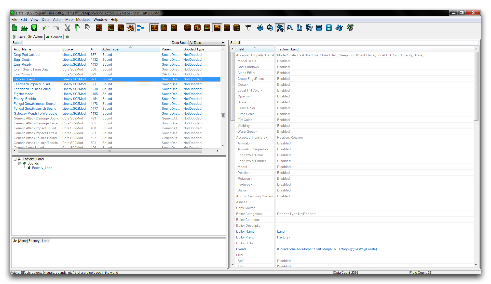
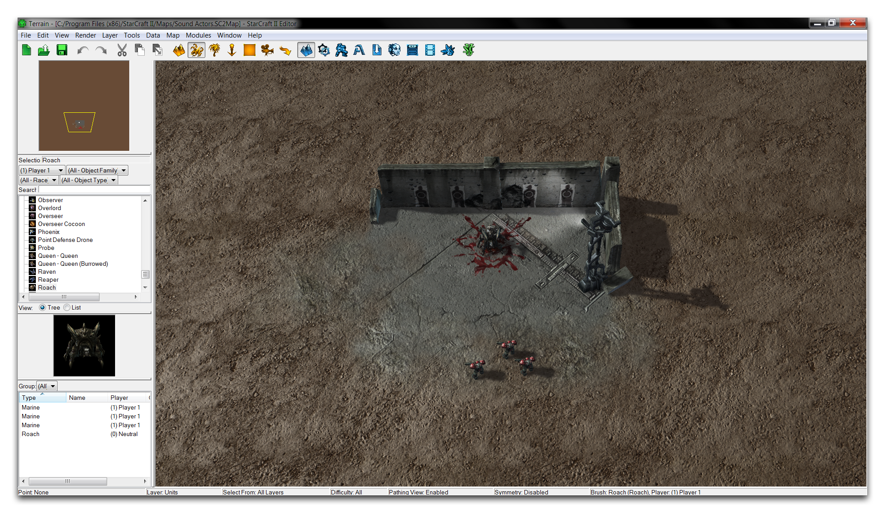
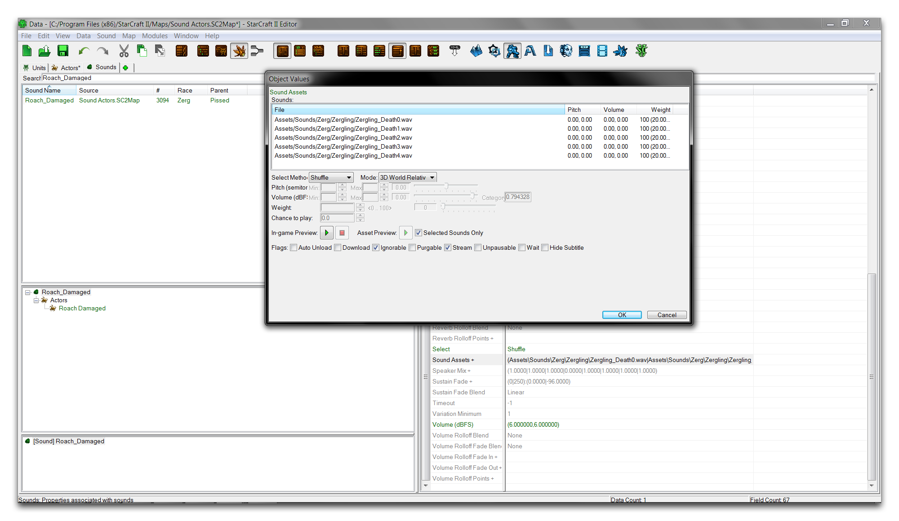
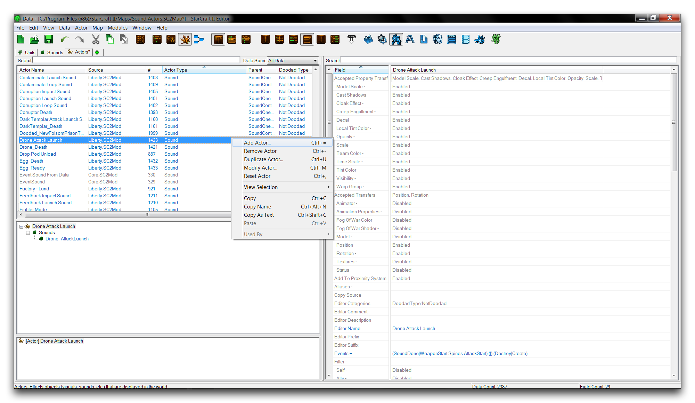
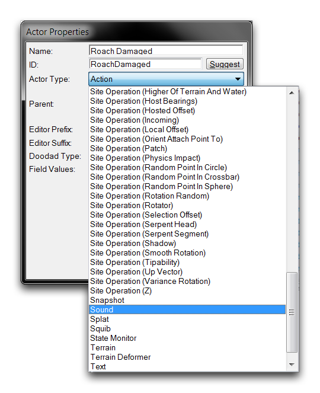
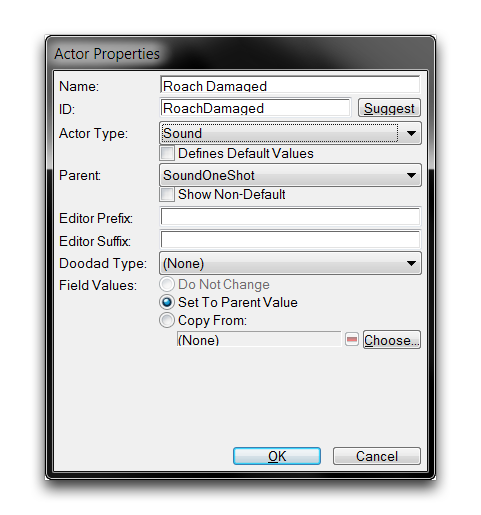
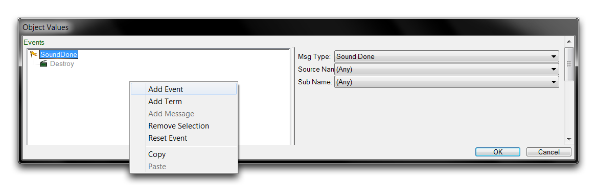
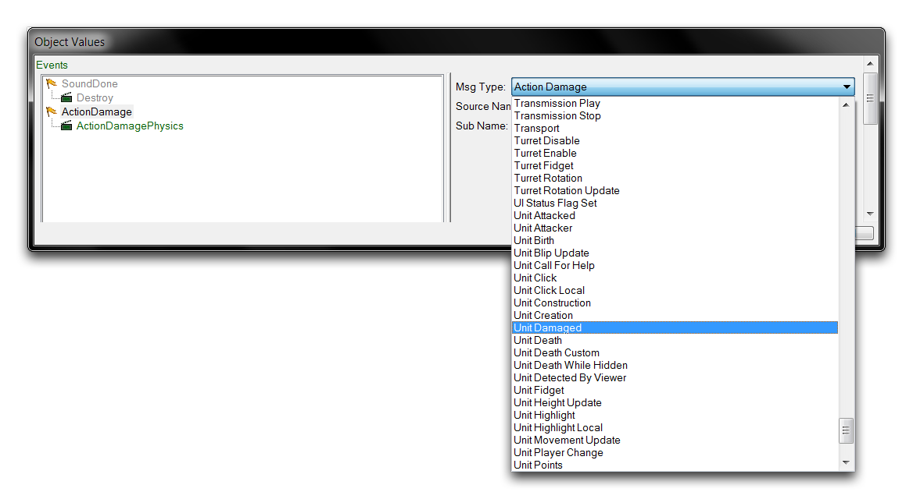

# 音效演员

音效演员用于传递大部分游戏单位的声音。这包括指令确认、武器开火、死亡哭声、法术效果和建造噪音等内容。游戏中还有其他声音，如音乐和剧情对话，但音效演员处理与游戏玩法相关的系统声音。作为一种演员类型，音效演员可以在下面显示的演员选项卡中找到。

  
*音效演员列表*

音效演员实际上并不包含其声音资产，声音资产单独存储在声音数据类型中。因此，您可以将音效演员视为一种声音协调者。它们根据与单位的连接对游戏输入作出反应，然后根据其“事件”字段的指示开始和停止声音。它们有限的能力用于配置其声音。对声音属性（如音调、音量或3D设置）的任何更改通常发生在声音数据中。

有两种基本类型的音效演员用于音效演员层级关系，即SoundOneShot和SoundContinuous。前者用于仅播放一次的声音，而后者用于持续播放的声音。例如，Zerg挖洞的噪音是一种一次播放的声音，而Medivac治疗循环是一种持续播放的声音。

## 音效演员字段

音效演员的字段在下表中详细说明了音效演员本身、一个单位和一个声音资产之间的联系。

| 字段                | 详情                                                                                                                                                                                                                                                                                                                                                                                      |
| -------------------- | ---------------------------------------------------------------------------------------------------------------------------------------------------------------------------------------------------------------------------------------------------------------------------------------------------------------------------------------------------------------------------------------- |
| 事件               | 设置演员事件。音效演员使用事件来创建自己及其与单位的链接。音效对象的控制也通过事件处理。                                                                                                                                                                                                                                                                                                    |
| 声音                | 设置创建演员时播放的声音。包括声音中存在的任何基本行为，如循环、变化和音量控制。                                                                                                                                                                                                                                                                                                           |
| 声音标志          | 包含一个单个“更新可见性”标志。此标志利用了演员的异步能力。当激活时，声音将对于玩家的可见性状态作出响应。例如，如果一个声音正在播放，当一个单位从玩家视野消失进入战争迷雾时，声音的音量将会逐渐减弱。此标志通常在单位死亡声音上禁用，以便玩家即使单位消失在战争迷雾中，也能听到单位的完整死亡声音。 |
| 主机                 | 确定从主机继承的属性。像位置和高度这样的属性对于任何配置为3D的声音非常重要。                                                                                                                                                                                                                                                                                                                    |
| 主机站点操作 | 站点操作可用于改变声音在3D空间中的位置。                                                                                                                                                                                                                                                                                              |

## 音效演员事件

与音效演员操作相关的事件和消息在下表中详细说明。

| 消息                   | 描述                                                                                                                                               |
| ------------------------- | -------------------------------------------------------------------------------------------------------------------------------------------------------- |
| 创建                    | 创建演员，播放带有指定属性的声音。                                                                                      |
| 销毁                   | 销毁演员，结束声音输出。                                                                                                                 |
| 定时器设置                 | 有时用于在演员创建后播放声音。                                                                                               |
| 声音完成                | 作为一个事件运行，一旦声音播放完成就会触发。通常用于销毁演员。循环声音不会触发这个事件。 |
| 声音添加数字效果 | 使用数字信号处理修改声音。有一些预配置的DSP效果，如ReverbUnderwater和ReverbStoneRoom。           |
| 设置静音           | 静音或取消静音声音。静音的声音会继续播放，但基本上音量为零。                                                               |
| 设置偏移          | 创建偏移，或在声音开始播放之前暂停。                                                                                             |
| 设置暂停          | 暂停或取消暂停声音。暂停的声音输出会停止直到重新开始。                                                                             |
| 设置音调           | 随时间改变声音的音调，使其更高或更低。                                                                                        |
| 设置音量          | 随时间设置声音的音量。                                                                                                                    |

## 演示音效演员

打开本文提供的示例地图。其中显示了一个被几个海军武装士兵围困的蟑螂。应该看起来如下图所示。

  
*被围困的蟑螂演示地图*

默认情况下，蟑螂在受到攻击时不会发出任何噪音。测试地图现在将证明这一点。然而，您可以构建一个新的音效演员来更改此行为，使用一些预建资产。转到数据编辑器并打开声音选项卡。找到现有的声音“Roach\_Damaged”，并打开其“声音资产”字段。这将呈现以下视图。

  
*声音资产视图*

这里设置了一个自定义声音，以复制一系列zergling死亡声音。列表设置为随机选择并播放作为蟑螂受伤噪音的替代。为了设置该功能，转到演员选项卡，右键单击主视图，然后选择“添加演员”。

  
*创建一个演员*

命名新演员为“Roach Damaged”，然后单击“建议”以生成一个ID。使用“演员类型”下拉菜单选择创建音效演员，如下所示。

  
*选择音效演员创建*

将“父级”选为SoundOneShot，因为您希望的行为是音效在受到攻击时只播放一次，然后停止。最终的演员创建窗口将看起来类似于这样。

  
*音效演员创建窗口*

现在突出显示刚刚创建的演员，并找到它的“事件”字段。选择此字段并双击以打开演员事件子编辑器。您将会看到一个预先存在的“SoundDone”事件和一个“Destroy”消息。这是从SoundOneShot基础中继承的，并将导致声音在播放一次后停止或被销毁。在该元素下方右键单击并选择“添加事件”，如下所示。

  
*添加事件*

创建后，突出显示新的“ActionDamage”事件并使用下拉菜单将事件的消息类型设置为“Unit Damage”。

  
*选择事件类型*