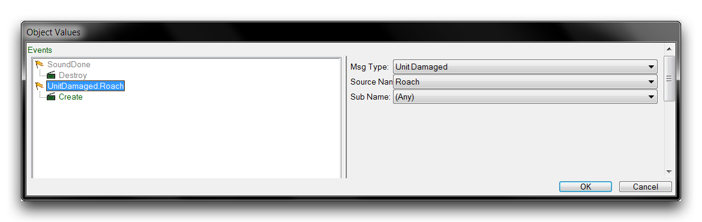
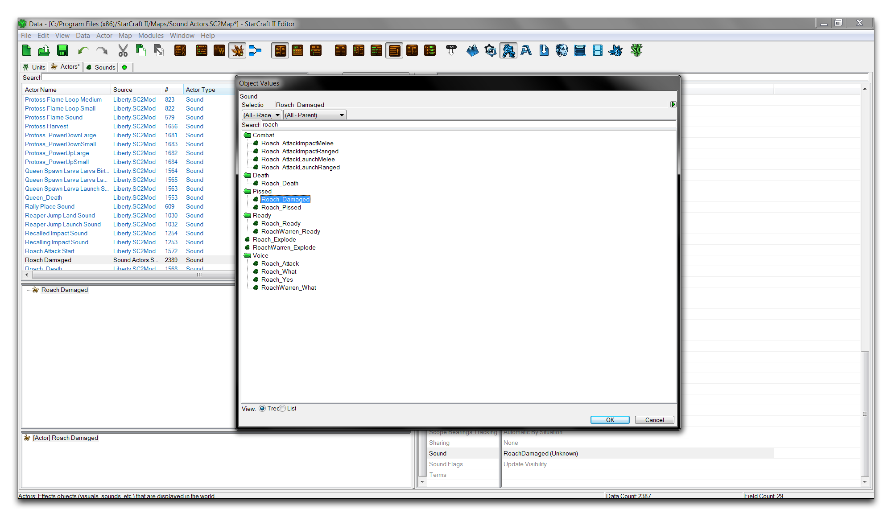
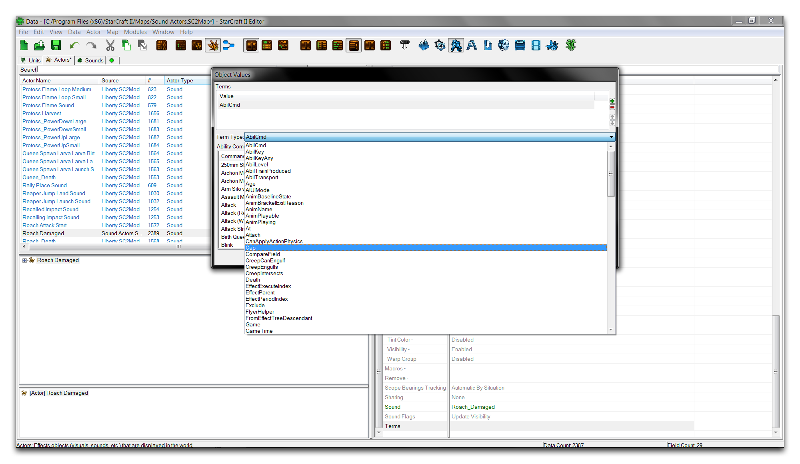
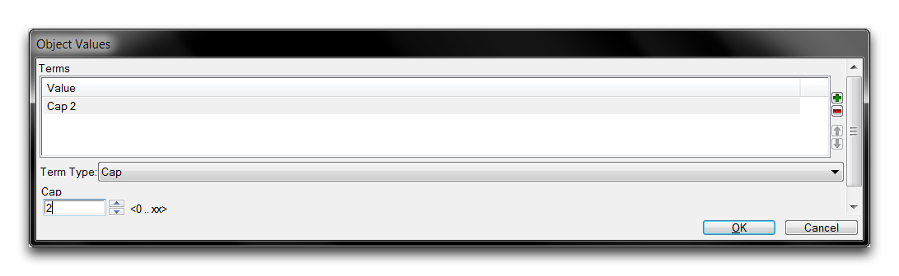
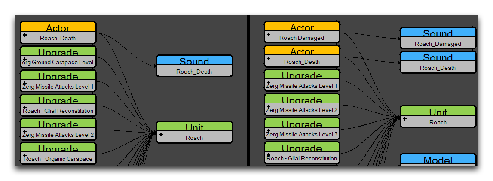
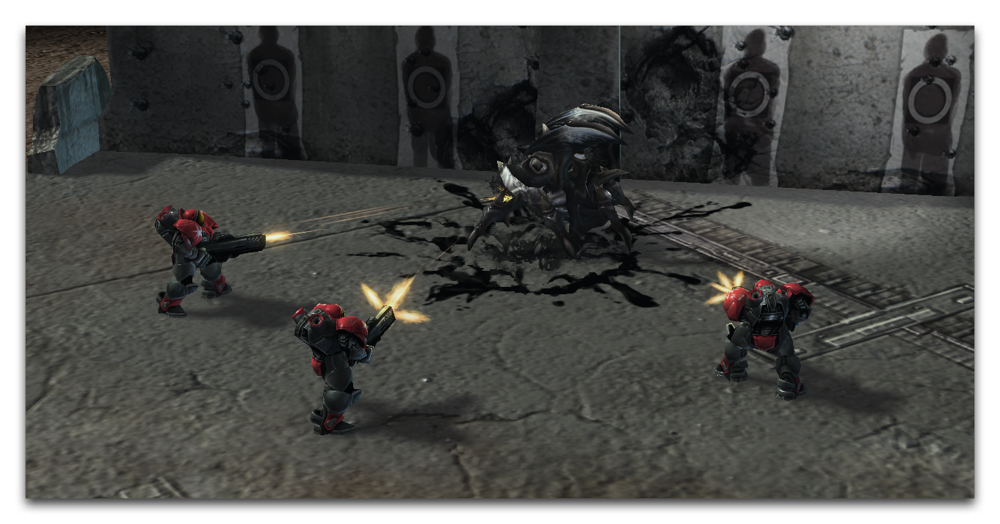

设定“Unit Damage”事件的源名称为“Roach”。然后将消息设置为“Create”。这将与蟑螂建立链接，导致演员在每次蟑螂受伤时被创建和播放。完成的演员事件应该如下图所示。

*已完成的演员事件*

点击“确定”保存演员事件，然后返回到主要的数据编辑器视图。声音演员仍然需要与一个声音资产建立连接，因此通过导航到“声音”字段并双击打开它来创建链接。

这将启动一个“对象数值”窗口，您可以在其中设置声音。这时您应该看到以下内容。

*设置声音资产*

选择地图中提供的“Roach Damaged”声音，然后点击“确定”。现在转到“条款”字段并双击打开它。该字段提供一些额外的条款，与演员事件中发现的相同。在这种情况下，这些条款必须在演员创建之前传递。点击+按钮添加一个新条款，然后使用下拉菜单选择“Cap”，如下所示。

*设置条款*

选择后，将此条款的Cap值设置为2。这将显示如下。

*已完成的条款*

此条款在相同范围内存在的演员数目达到上限前，下一个演员可以被创建。这里的范围是单位资源，即蟑螂。这套设置意味着蟑螂在任何给定时间内最多可以产生两个受伤声音。通过点击“确定”确认这些设置。

地图现在已经完成。声音演员使您能够引入一个新声音到蟑螂的数据中。您可以在下方看到单位数据结构的变化。

*旧蟑螂数据结构 - 新蟑螂数据结构*

声音演员通过其事件，特别是“Unit Create”事件，将声音“Roach Damaged”链接到单位数据中，当蟑螂受到伤害时将触发该事件。测试这种行为应在指挥任何海军陆战队员攻击蟑螂时播放这个新声音。请记住，此声音是一段食脑虫之死的哀鸣。使用“测试文档”来看它在游戏中的效果。

*对蟑螂的新发现同情*

## 附件

 * [063_Sound_Actors_Completed.SC2Map](./maps/063_Sound_Actors_Completed.SC2Map)
 * [063_Sound_Actors_Start.SC2Map](./maps/063_Sound_Actors_Start.SC2Map)