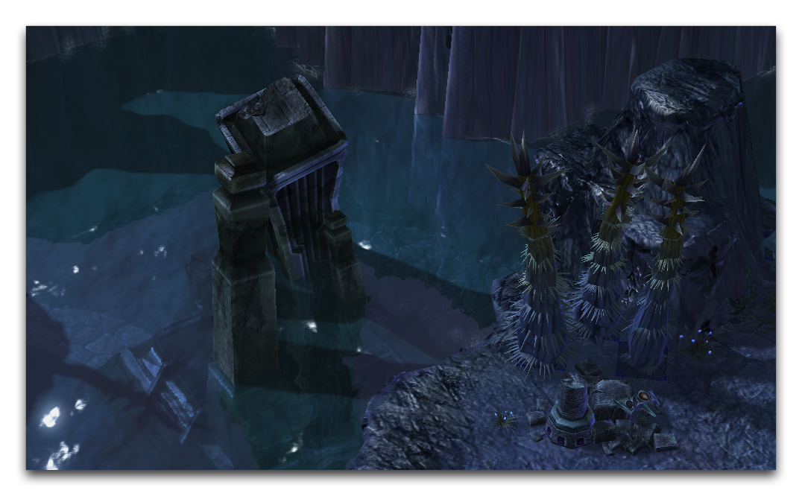
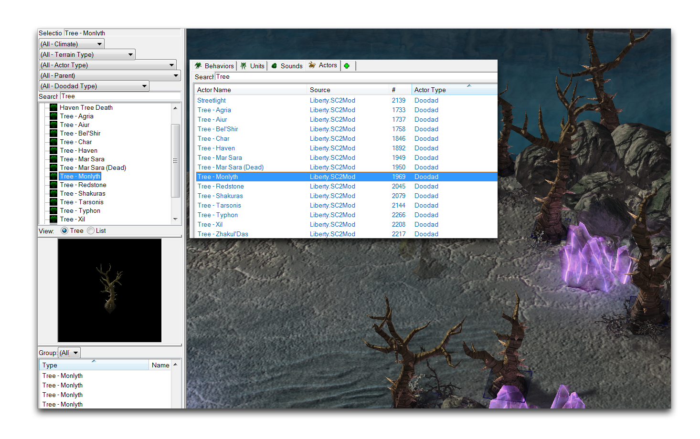
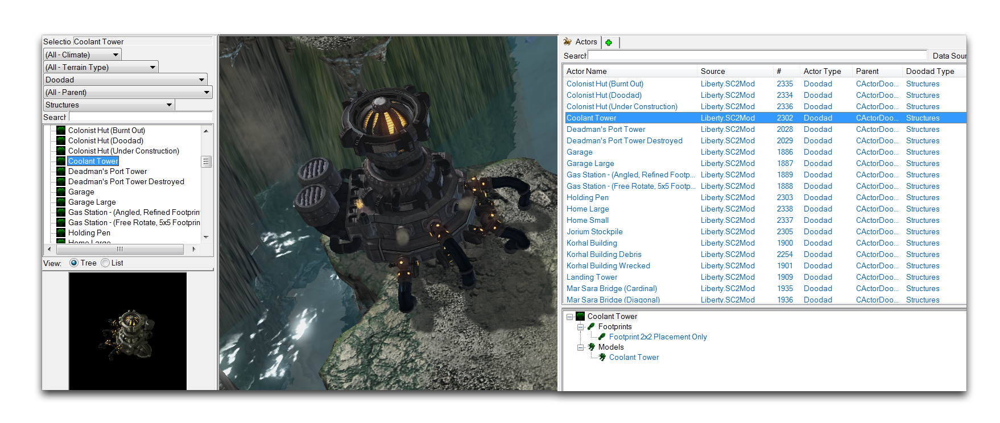
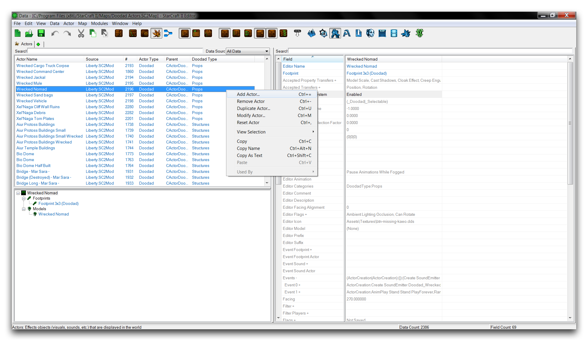
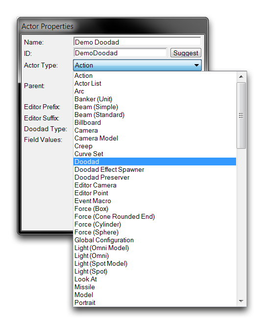
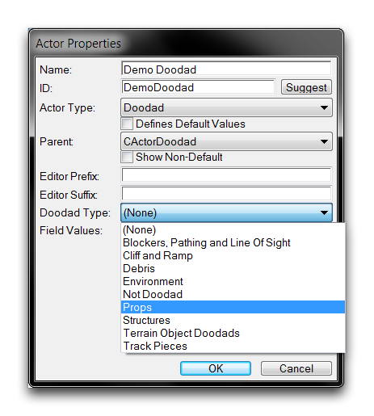
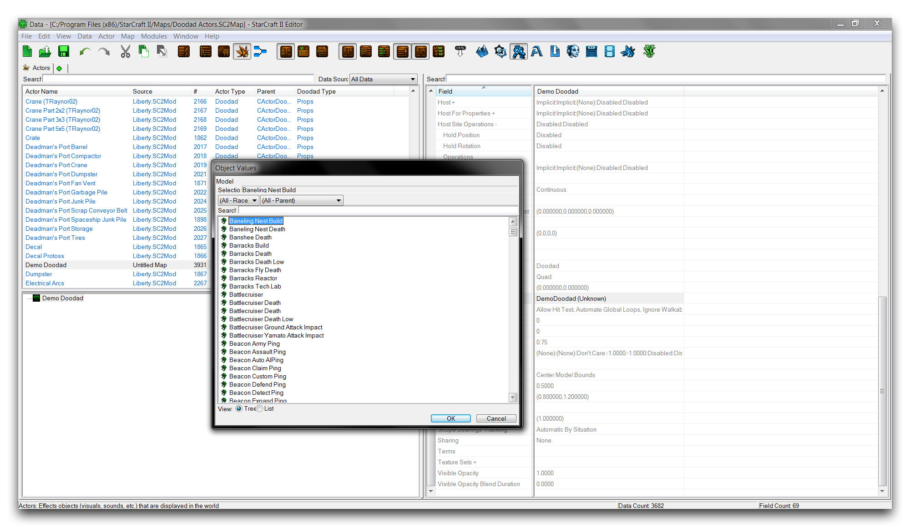
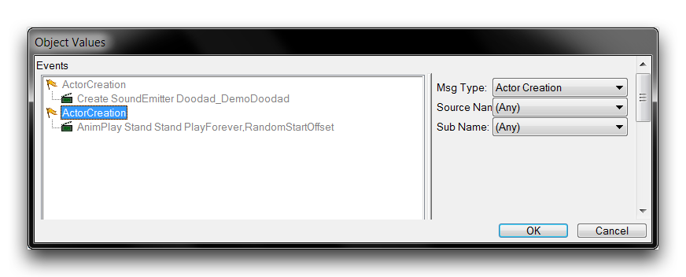

# Doodad 演员

大多数用户将 doodads 理解为地形编辑器中可用于地图装饰、样式或建造目的的元素集合。在这里，如果您对其有一个更正式、数据导向的定义将会有所帮助。Doodads 是简单的可视对象，您可以直接添加到游戏中。您可以通过称为 Doodad 演员的演员子类型来实现这一点。您可以在下面的图像中看到一些 doodads 的使用情况。

*Doodads 塑造悬崖*

Doodads 主要是视觉元素。作为游戏对象，它们与单位相区分，因为它们不会参与移动、战斗、技能等方面的任何计算。这种类型旨在提供一种轻量级的方法，只需提供一些次要属性即可向游戏发送模型类型。将演员创建为 doodad 子类型意味着它将直接列在游戏中，在地形编辑器的 Doodads 调色板中找到，准备放置。您可以在下面的图像中看到这一点。

*在地形编辑器中展示 Doodad 演员*

## Doodad 类型

Doodad 演员还被赋予一个子类型，列在它们的“Doodad 类型”字段下。这主要是一个组织工具，可以在创建演员后更改。除了组织，子类型使在 Doodads 调色板上启用了一组筛选器。使用“演员类型” Doodad 和特定“Doodad 类型”进行搜索可以极大地加快在地形编辑器中处理 doodads 的速度。

*在地形编辑器中的 Doodad 类型筛选器--使用数据编辑器为 Doodad 演员打标签*

右侧视图显示了通过它们的“Doodad 类型”在演员选项卡中组织 doodads。左侧视图显示了这些类型如何作为搜索过滤器在 Doodads 调色板中使用。

## Doodad 演员详细信息

有少量字段允许对 doodad 演员进行修改。鉴于 doodads 的性质，这些主要是视觉修饰符，并在下表中进行了描述。

| 字段               | 详情                                                                                                                                                                                                                                                                                                                                                                                                                                                                      |
| ------------------ | ---------------------------------------------------------------------------------------------------------------------------------------------------------------------------------------------------------------------------------------------------------------------------------------------------------------------------------------------------------------------------------------------------------------------------------------------------------------------------- |
| 艺术模型          | 设置将成为 doodad 的模型。                                                                                                                                                                                                                                                                                                                                                                                                                             |
| 艺术规模          | 允许在 X、Y 和 Z 轴上缩放模型类型。                                                                                                                                                                                                                                                                                                                                                                                                                |
| 随机缩放范围 | 在个体基础上应用一个随机缩放因子到放置的 doodads 上。缩放应用于所有三个轴，并从一个定义的范围中选择。                                                                                                                                                                                                                                                                                                           |
| 雾能见度     | 设置 doodad 在被战争迷雾覆盖时进入的状态。如果您关注性能，这是一个重要的考虑因素。按性能递增的顺序，可能的状态如下。 Visible 会在战争迷雾下保持 doodad 完全活跃。Dimmed 会略微变暗 doodad 并维持所有其他动画。Snapshot 冻结动画但保持可见性。Hidden 完全在战争迷雾下移除 doodad。 |
| 脚印          | 选择 doodad 的路径脚印。doodad 的路径是其主要的逻辑组件。这确定了 doodad 的视觉组件（艺术模型）、在地图上其他游戏对象的行为（如单位移动或放置）之间的交互。                                                                                                                                                                                                       |
| 事件             | 设置 doodad 的演员事件。这处理了 doodad 的基本创建和移除，但也包括声音发射器和动画等等。                                                                                                                                                                                                                                                                                                                            |

## 创建一个 Doodad 演员

通过进入数据编辑器中的演员选项卡来组装一个新的 doodad。如果选项卡尚未打开，您可以通过导航到 + ▶︎ 编辑演员数据 ▶︎ 演员 来打开它。进入后，通过右键单击主视图中的位置并选择“添加演员”来创建一个新演员，如下所示。

*创建新演员*

这将启动“演员属性”窗口。在此视图中，设置一个名称，然后点击建议以生成一个ID。将“演员类型”设置为 Doodad。在此示例中，演员名称为 Demo Doodad。

*创建 Doodad 演员*

使用“Doodad 类型”下拉菜单选择 doodad 的组织类型。在演示目的上，您应选择 Prop 类型。这是一种通常用于对人造、非结构物体进行分类的子类型。您可以在下面的图像中看到选择子类型的外观。

*选择 Doodad 类型*

完成后，您可以点击“确定”以完成创建 doodad 演员。

## 设置 Doodad 演员的字段

Doodad 演员的关键部分是“模型”，所以您现在应该设置它。突出显示新演员以在数据编辑器中查看其字段。移至“模型”字段并双击它以打开编辑窗口，如下所示。

*Doodad 演员模型选择*

此窗口显示了项目数据中的所有模型资产，以及一些搜索选项。在此处选择所需模型，然后点击“确定”保存选择。在此示例中，您应选择 Colonist Supply Crate。

接下来，移至“事件”字段以设置演员事件。选择此字段并双击以打开演员事件子编辑器，如下所示。

*Doodad 演员事件默认*

Doodad 演员默认包含声音发射器和动画支持。 “AnimPlay” 消息设置了在 doodad 创建时播放的动画，选择了开始播放的随机动画帧，并将其设置为无限循环。声音发射器开始其播放行为，如其各自声音类型中所设定的那样。如果不需要这些扩展功能，如演示箱子的情况，则可以删除它们。选择每个条目，右键单击，然后选择“删除选择”来执行这一操作。