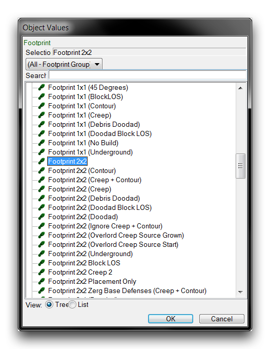
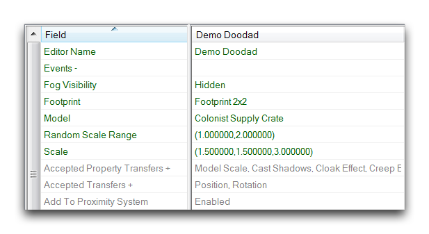
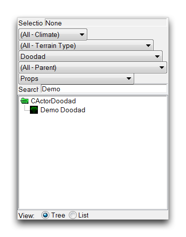
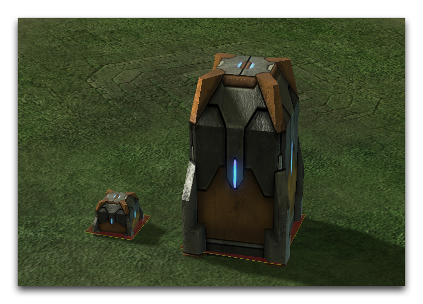

最后，您将需要设置“足迹”字段。该字段允许您从可用或自定义的足迹列表中进行选择，并将其应用于小玩意。然后，在游戏中在小玩意的顶部设置路径，使其具有“足迹”类型中定义的逻辑规则。通过突出显示“足迹”字段并双击以启动下面显示的编辑器窗口来添加足迹。

*设置小玩意足迹*

对于此练习，您应选择尺寸为2x2的足迹。小玩意现在已准备就绪并可用，但仍有一些属性需要考虑设置，包括艺术规模、随机规模范围和雾能见度。已完成的演示小玩意字段如下所示。

*演示小玩意字段*

## 放置小玩意

要放置您的自定义小玩意，请导航到地形编辑器，然后转到小玩意图层。已完成的小玩意将已添加到小玩意面板，您可以手动查找或使用搜索过滤器，如“小玩意类型”来找到它。您可以按照下面显示的方式使用面板。

*小玩意面板搜索过滤器使用*

在编辑器视图中放置小玩意应会显示其模型和足迹在地图上。请注意，任何比例变化和随机比例变化将在放置模型时发生，并不会反映在面板的预览器中。您可以在下方的图像中看到练习中的自定义小玩意。

*游戏中的自定义小玩意*