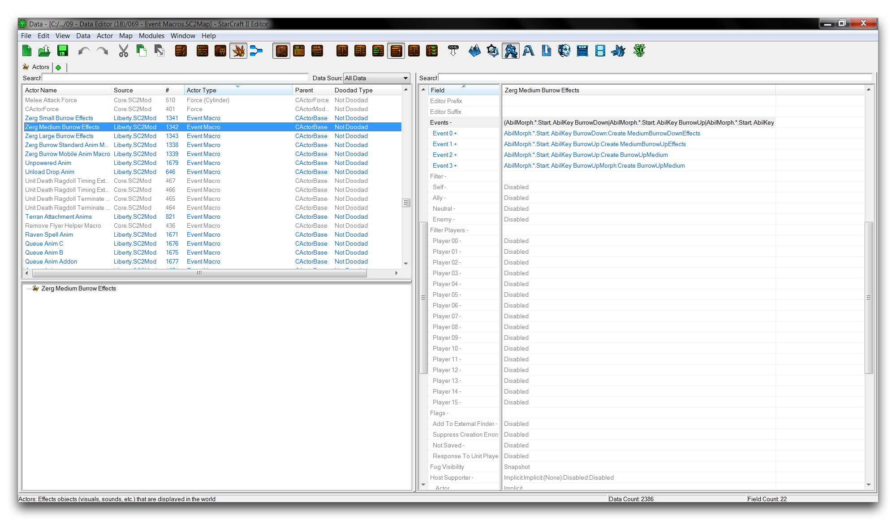
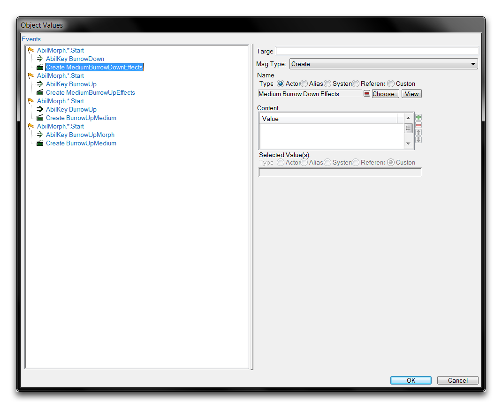
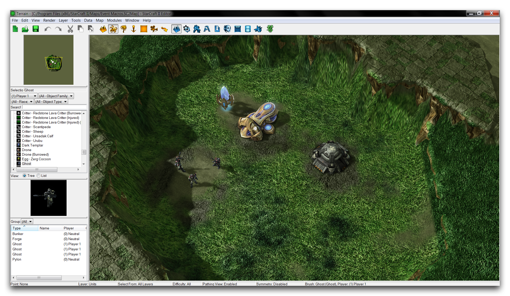
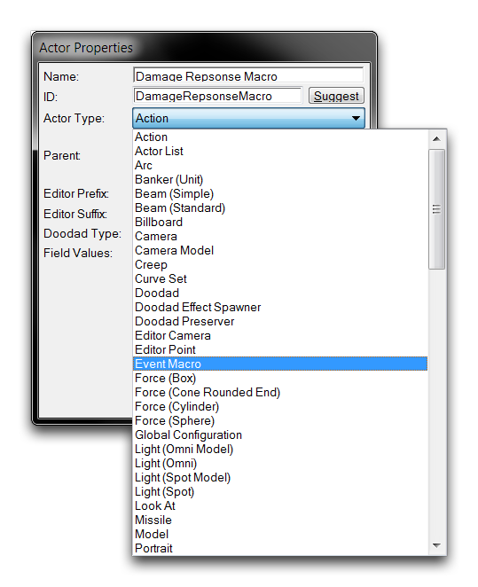
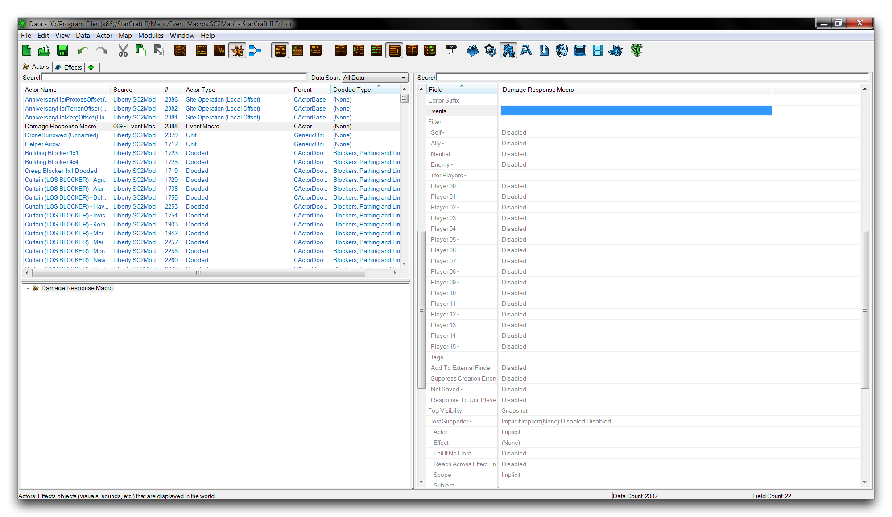
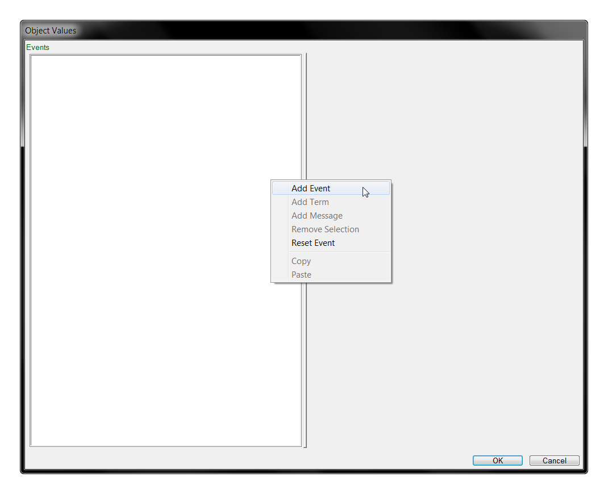
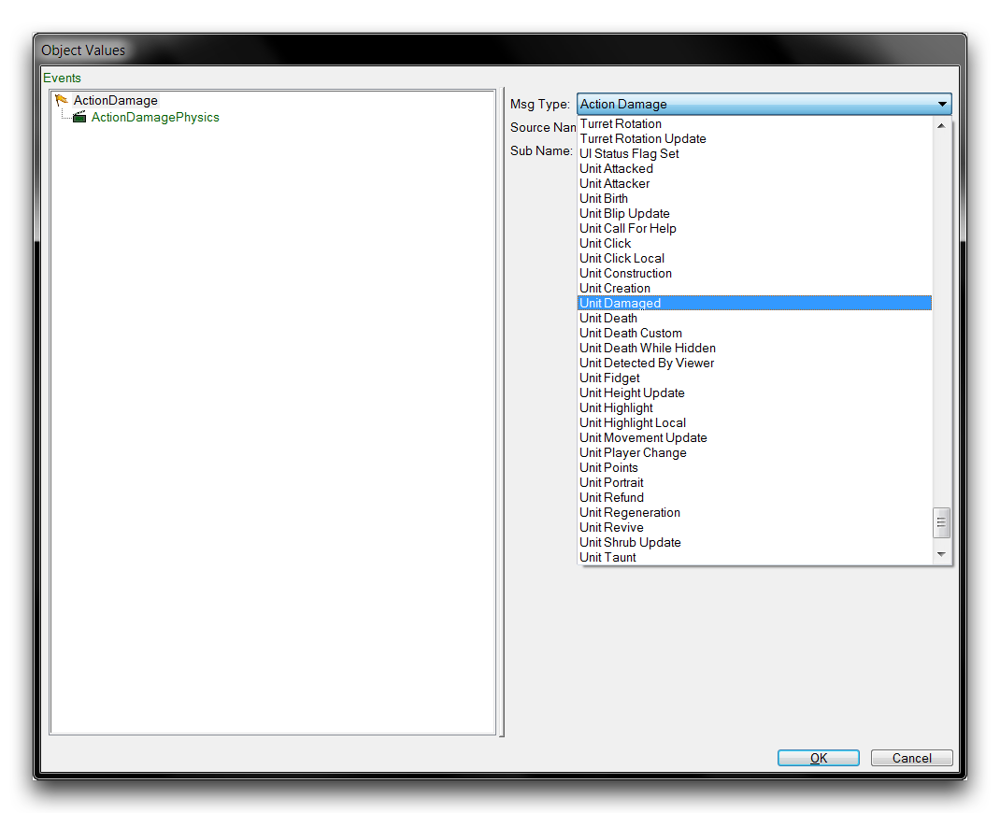
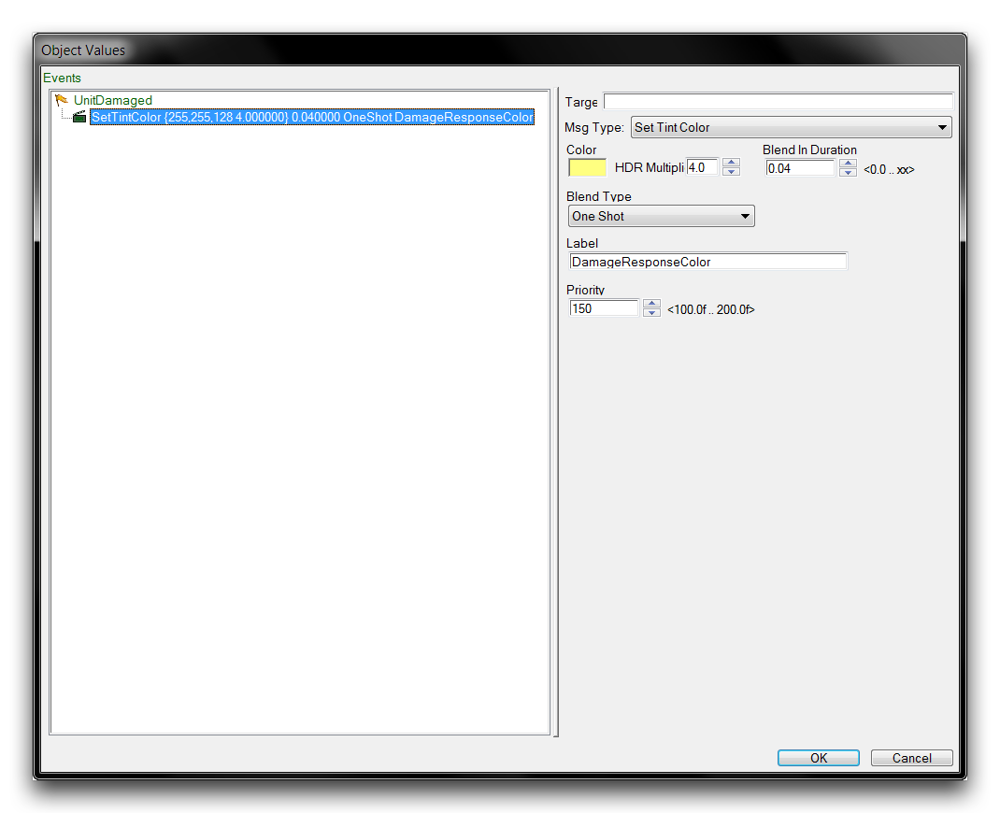
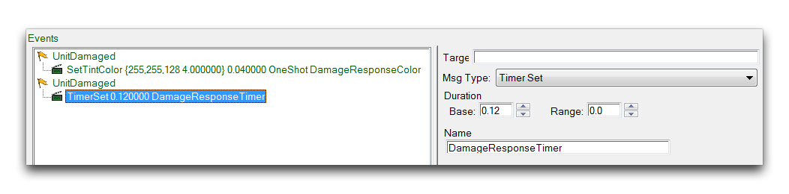
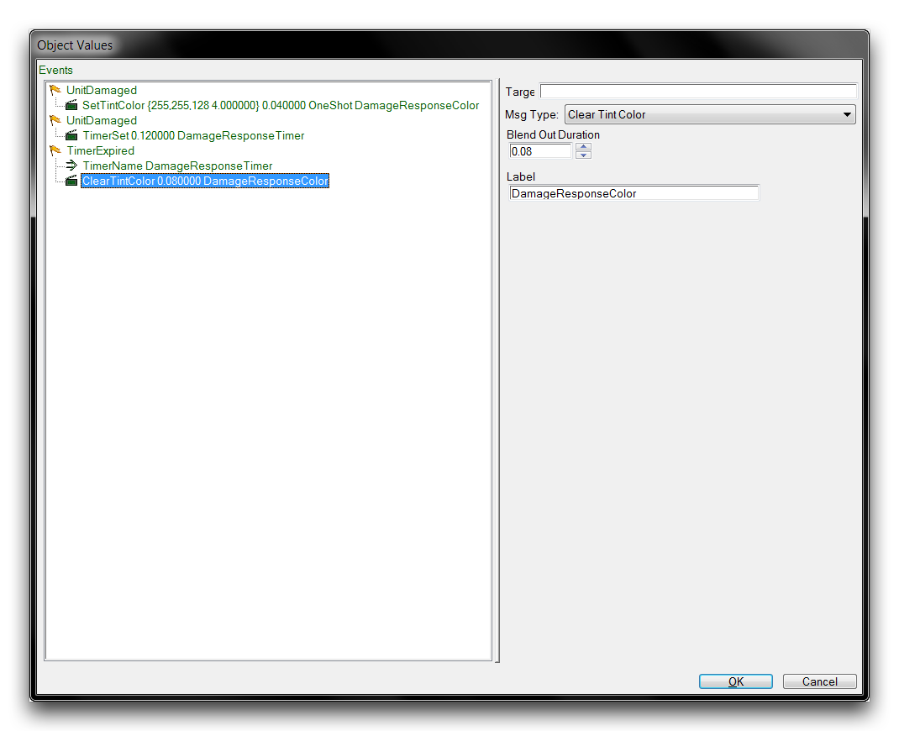

# 事件宏

与任何逻辑系统一样，角色事件涉及许多常见的流程。在触发器编辑器中，通过将这些重复任务提取到定义中，然后在需要的地方通用地应用这些定义来解决这个问题。这可以节省您大量的时间和精力。事件宏是重用角色事件的相似选项。

宏是一种携带一组事件的角色。然后，通过将其链接到这些角色的“宏”字段中，您可以将宏插入到任意数量的角色中。以这种方式托管宏的效果是将宏的事件合并到主机角色的事件中。共享宏允许其成为一组常见事件的源，作为可重复使用的定义。下面您将看到一个事件宏的典型视图。

*事件宏列表*

事件宏使处理角色事件更加可管理。将频繁发生的事件分开可以帮助保持项目的组织。事件宏还通过允许您更新单个定义而不是循环浏览一组角色进行更改，从而防止错误混入您的项目。

## 事件宏详细信息

事件宏没有很多可配置元素。尽管它们似乎有许多字段，但其中大多数是它们由于是角色而继承的默认值。当前感兴趣的字段标签为“事件”。调查宏的“事件”字段将启动下面展示的角色事件子编辑器。

*事件宏事件*

在宏的“事件”字段中定义的元素形成其主要定义。一旦托管，此定义将转移所有事件、术语和消息到主机角色的事件中。值得注意的是，这些事件实际上在主机的“事件”字段中并不可见。

## 演示事件宏

打开本文提供的演示地图。该课程呈现了一组建筑物和火山口中的一些幽灵，如下图所示。

*演示地图课程*

在这个练习中，您将更改地图以在受到攻击的对象上应用特殊的伤害动画。场景中的每个单位都将获得这个新动画。通过使用事件宏将新行为推送到四种单位类型的情况下，您可以快速实现这一点而无需创建多个定义。

首先转到数据编辑器中的角色选项卡。如果看不到选项卡，请通过导航到 + ▶︎ 编辑角色数据 ▶︎ 角色 来打开。在此处通过右键单击主视图中的位置然后选择“添加角色”来创建一个新角色。这将打开下面显示的窗口。

*创建事件宏*

将角色的名称设置为“伤害响应宏”，然后点击“建议”生成一个ID。将角色类型设置为事件宏，然后点击“确定”。您将看到以下视图。

*创建事件宏*

在角色选项卡中突出显示新的宏，然后转到其“事件”字段，然后双击以打开。这将启动角色事件子编辑器。在白色框里右键单击然后选择“添加事件”，如下所示。

*添加一个角色事件*

这将创建一个事件，由旗帜图标表示，以及一个角色消息，由快门图标表示。您可以通过突出显示某个元素然后从最右侧视图中选择其“消息类型”来更改此视图中的任何元素。现在通过突出显示“ActionDamage”事件并使用“消息类型”下拉菜单将其设置为“单位受损”事件。

*配置角色事件*

突出显示“ActorDamagePhysics”消息并使用下拉菜单将其更改为“设置色调颜色”。这将显示多种子选项，使您可以自定义色调效果。将颜色设置为黄色，或R255 G255 B128，将HDR倍增器设置为4.0，将混合持续时间设置为0.04。这个事件和消息将组合在一起，使角色在被攻击时快速变成明亮的黄色。最后，将消息的标签设置为“DamageResponseColor”，以便您可以轻松地参考。您的事件列表应如下图所示。

*完成色调事件*

添加另一个类型为“单位受损事件”的事件，并将其消息设置为“定时器设置”。将定时器的持续基值设置为0.12，并将其名称设置为“Damage Response Timer”。

*完成定时器事件*

向列表中再添加一个最终事件，并将其设置为“定时器到期”类型。突出显示事件，右键单击它，然后选择“添加条款”。使用下拉菜单将条款设置为“定时器名称”。将名称字段设置为“DamageResponseTimer”，然后将此事件的消息设置为“清除色调颜色”。将消息的属性“淡出持续时间”设置为0.08，标签设置为“DamageResponseColor”。完成的列表应如下所示。

*完成角色事件*

现在，该宏应产生以下行为。受损时，角色会变成黄色并启动一个定时器。当此定时器到期时，另一个事件将被触发，并由事件术语确认。这将使角色在每次攻击时快速切换颜色，创建一种闪烁效果。闪烁的持续时间大约等于定时器的长度。您现在可以将该宏安装到任何角色中以赋予其这些效果。点击“确定”保存事件并返回到主数据编辑器视图。