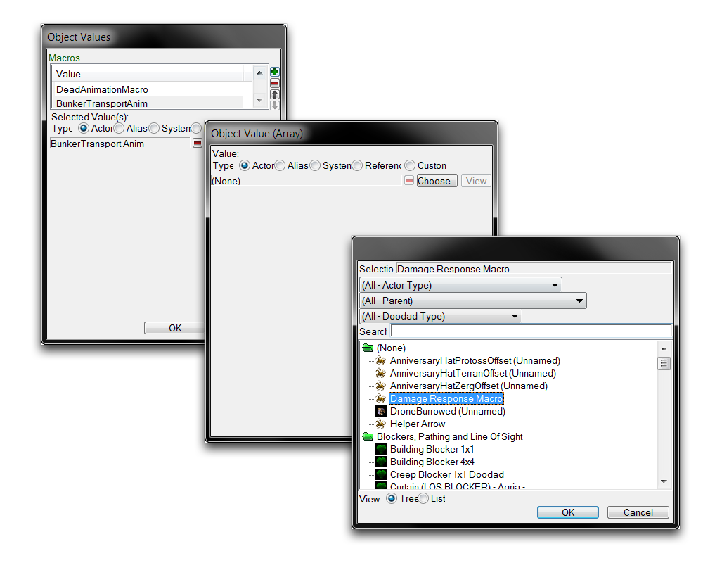
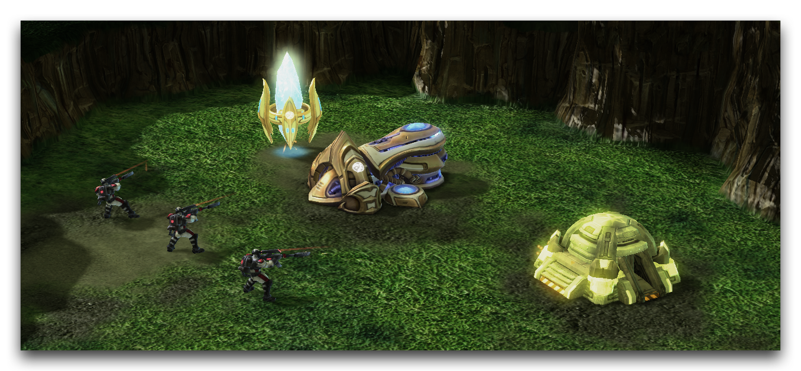

找到演员选项卡中的“Bunker”角色，并突出显示其“宏”字段。双击它以启动“对象值”窗口。这将显示演员中已经存在的宏列表。单击绿色的+以添加到列表。这将启动“对象值（数组）”窗口，您可以在其中选择要添加的宏。单击“选择”以获取当前项目中所有“事件宏”演员的列表。选择“伤害响应宏”，然后依次确认这三个窗口。这将显示如下。

*向演员添加宏*

现在为“Pylon”，“Forge”和“Ghost”演员重复此过程，以完成该练习。游戏已将事件宏附加到每个单位，因此在演示课程中，每个单位都会在攻击时闪光。您现在可以测试地图，并命令幽灵攻击任何单位，以查看效果。

*宏照亮伤害*

## 附件

* [065_Event_Macros_Start.SC2Map](./maps/065_Event_Macros_Start.SC2Map)
* [065_Event_Macros_Completed.SC2Map](./maps/065_Event_Macros_Completed.SC2Map)