# 站点操作

站点操作是一组修改主角色物理属性的动作。由于这些修改将传播到连接到角色的任何可视化元素，因此站点操作可用于在游戏时修改模型的外观和位置。

站点操作包括基本的平移和旋转，但也延伸到更复杂的控制。您可以使用操作来将对象组合在一起，甚至动态更新对象的属性，模拟独立运动或效果的随机变化。值得注意的是，操作不是互斥的，它们可以以多种方式堆叠和组合。下面的图像显示了站点操作的一些用途。

[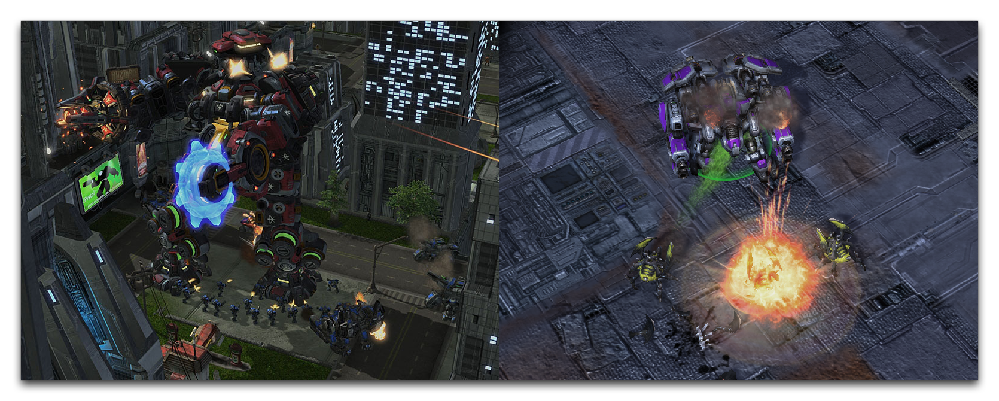](./resources/066_Site_Operations1.png)

Terratron 由附件操作构建 -- Thor's Barrage Effect上的随机变化操作

## 创建站点操作

作为一种角色类型，您可以在“数据编辑器”中的角色选项卡下找到站点操作。通过导航至 + ▶ ︎编辑角色数据 ▶ ︎ 角色 来打开此选项卡。

[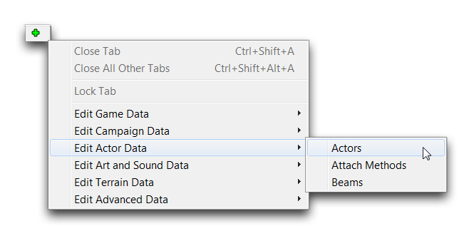](./resources/066_Site_Operations2.png)
*导航至数据中的角色*

您可以在角色选项卡中创建站点操作角色，方式与创建任何其他角色一样，右键单击对象列表，然后导航至“添加角色”。

[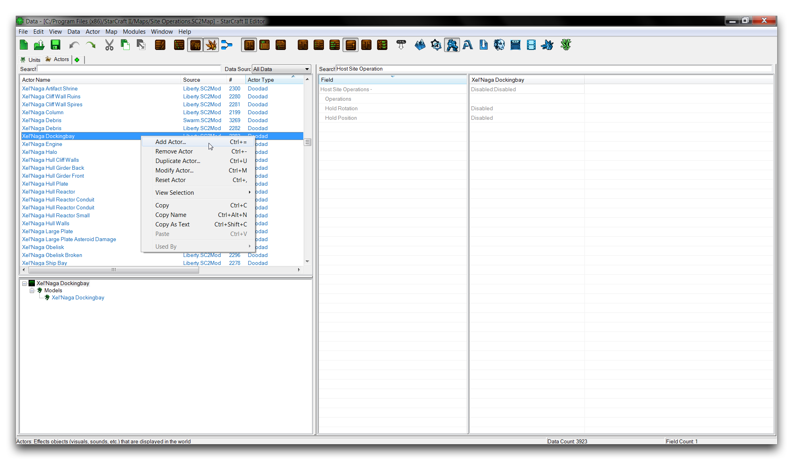](./resources/066_Site_Operations3.png)
*创建站点操作角色*

这将启动“角色属性”窗口。使用“角色类型”下拉菜单并向下滚动列表以查找站点操作。它们以前缀“站点操作”开头，并通过括号中的子类型进行区分。这种命名约定的一个示例是“站点操作 (2D旋转)”角色类型，表示负责XY平面旋转的2D旋转站点操作。您可以看到下面所示的选择站点操作角色的过程。

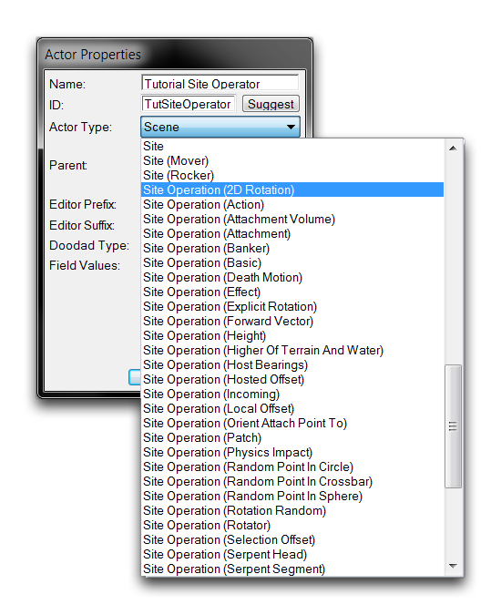
*站点操作角色列表*

然后，选择任何站点操作并单击“确定”完成创建角色。

## 应用站点操作

您可以通过适用于任何适用角色的“主站点操作”字段应用站点操作，下面显示了一个例子。

[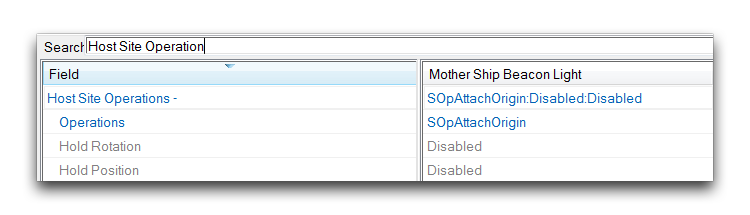](./resources/066_Site_Operations5.png)
*站点操作托管字段*

双击此字段将打开“对象值”窗口，其中列出了当前托管的站点操作，如下所示。

[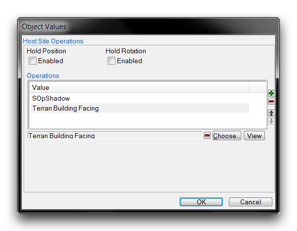](./resources/066_Site_Operations6.png)
*站点操作查看*

在此案例中，“SOpShadow”和“Terran Building Facing”站点操作已安装在此角色上。它们分别代表阴影站点操作和显式旋转站点操作的实例。通过选择“选择”字段，可以添加新的站点操作，这将打开下面的窗口。

[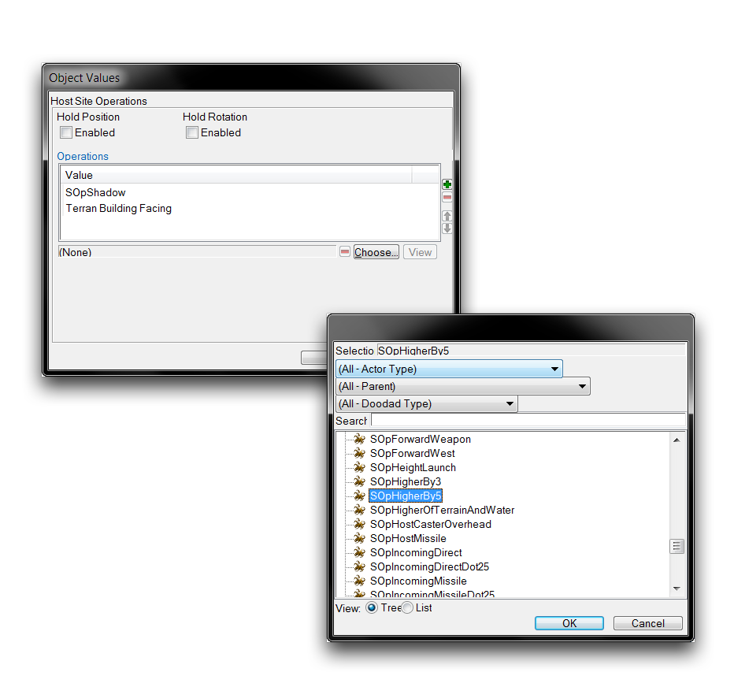](./resources/066_Site_Operations7.png)
*选择要添加的站点操作*

此窗口允许您选择站点操作。一旦确定，点击“确定”返回主站点操作查看。在此练习中，请选择“SOpHigherBy5”操作。这将呈现给您以下视图。

[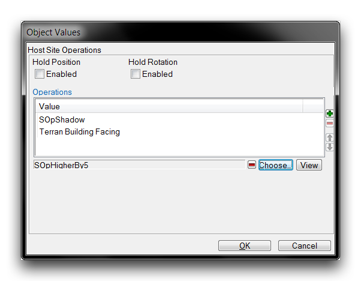](./resources/066_Site_Operations8.png)
*准备添加的站点操作*

现在，通过点击窗口右侧的绿色“+”按钮将站点操作添加到角色，如下所示。

[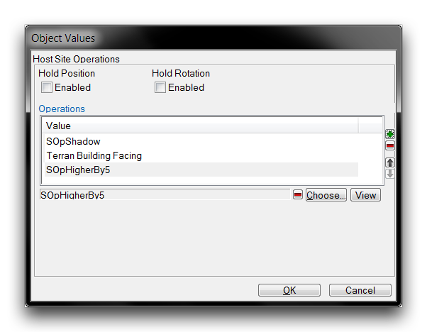](./resources/066_Site_Operations9.png)
*添加到角色的站点操作*

然后，点击“确定”保存添加并返回到主数据编辑器视图。

## 操作顺序

值得注意的是，站点操作受顺序影响。以不同顺序应用站点操作可能会产生截然不同的影响，或根本没有明显差异。为了帮助您管理这一点，编辑器提供了一个“主站点操作”子编辑器，允许您更改应用操作的顺序。

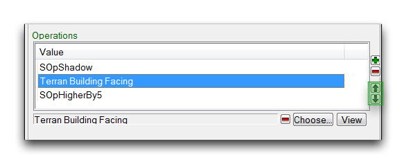
*站点操作排序控件*

您可以在此窗口的右侧找到用于更改应用站点操作顺序的控件。要使用它们，从列表中选择一个站点操作，然后单击向上或向下箭头按钮将其移动到操作列表中。站点操作将按照此窗口中列出的顺序从上到下依次应用。

为了理解应用站点操作的顺序对结果的影响，可以考虑“局部偏移”和“旋转器”。前者将使一个角色在3D空间中移动一定距离，而后者将使一个角色绕一个点旋转。在这个例子中，这两者将以不同顺序应用于一个“游戏球”角色。以下图片展示了先应用局部偏移的情况。

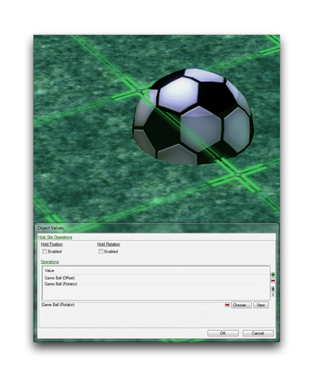
*先局部偏移，然后旋转器站点操作*

接下来的图片展示了先应用旋转器，然后局部偏移的情况。

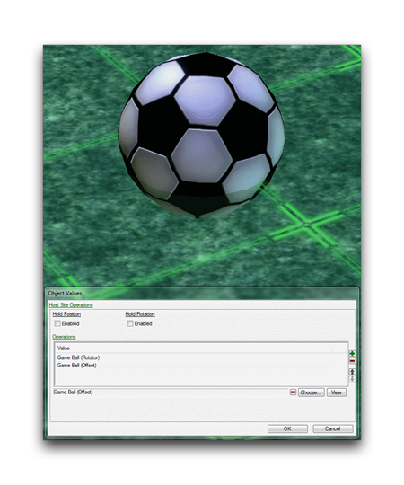
*先旋转器，然后局部偏移站点操作*

这里最重要的一点是，尽管应用了相同的操作，但结果却并不相同。以下是这些情况中发生的情况的概述。

  - 请注意，局部偏移向下，相当于球的高度的大约25%。旋转器大约等于90度，或者是四分之一的转向。
  - 先应用局部偏移使球向下偏移，但也偏移了旋转器的轴。这将使旋转轴外移球中心。结果，旋转实际上导致球的位置变化，使其向前跌入地面。球在X轴和Z轴上改变了其旋转和位置。
  - 相反，先应用旋转器使球原地旋转。然后将其向下偏移至地面。这意味着旋转轴仍位于球的中心。在此情况下，球只会看到旋转并改变其Z轴位置。

如上所示，站点操作对其应用顺序的敏感性有时会导致不可预测的结果。应对这种潜在的不可预测性的最好方法要么是仔细规划，要么是尝试组合操作时的反应方式。