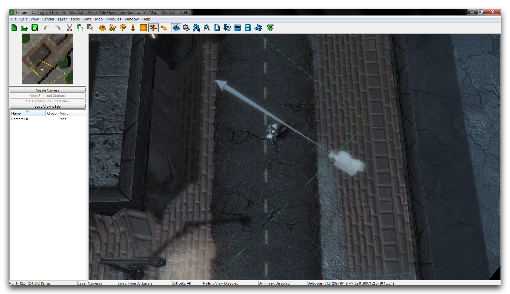
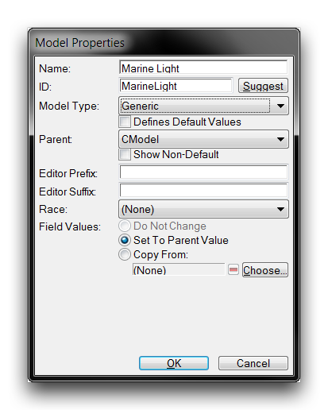
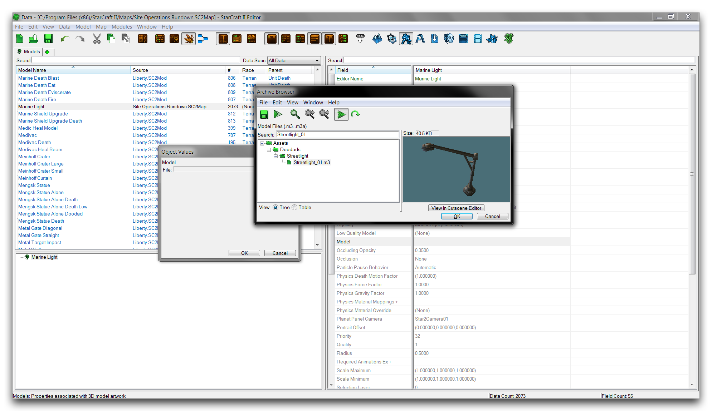
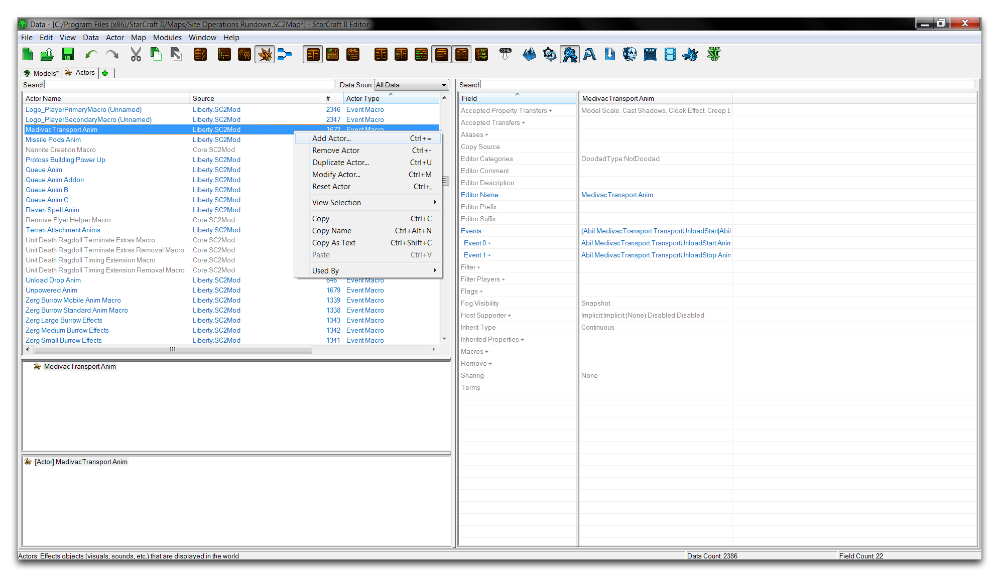
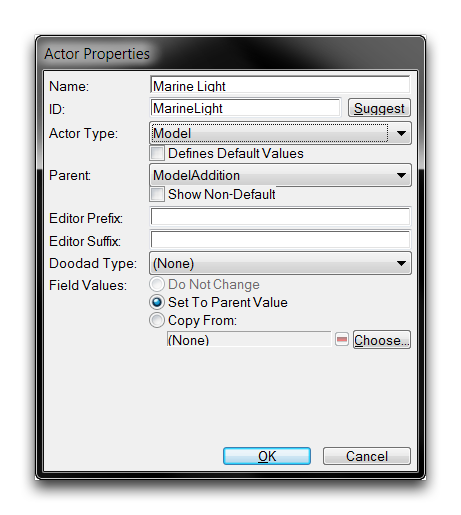
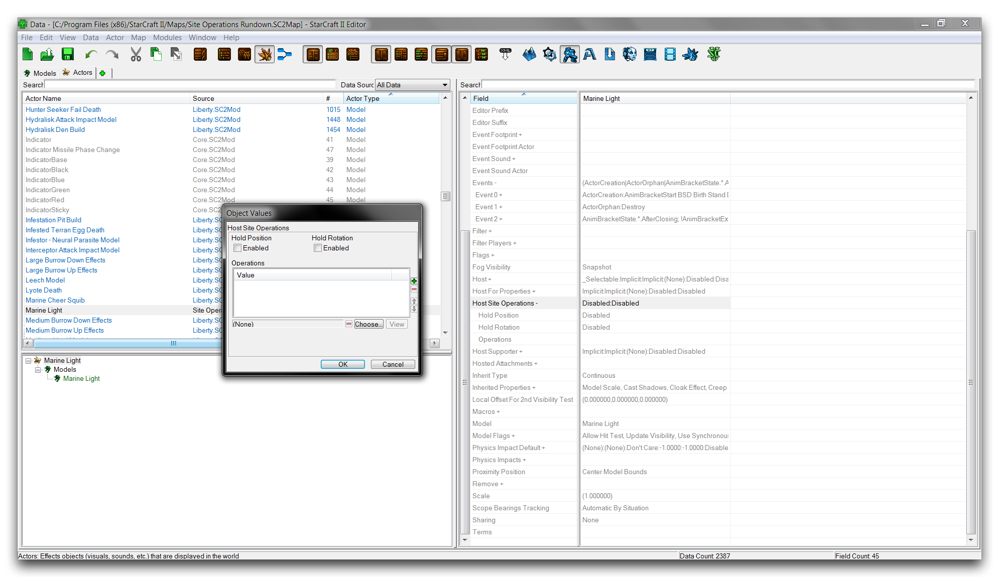
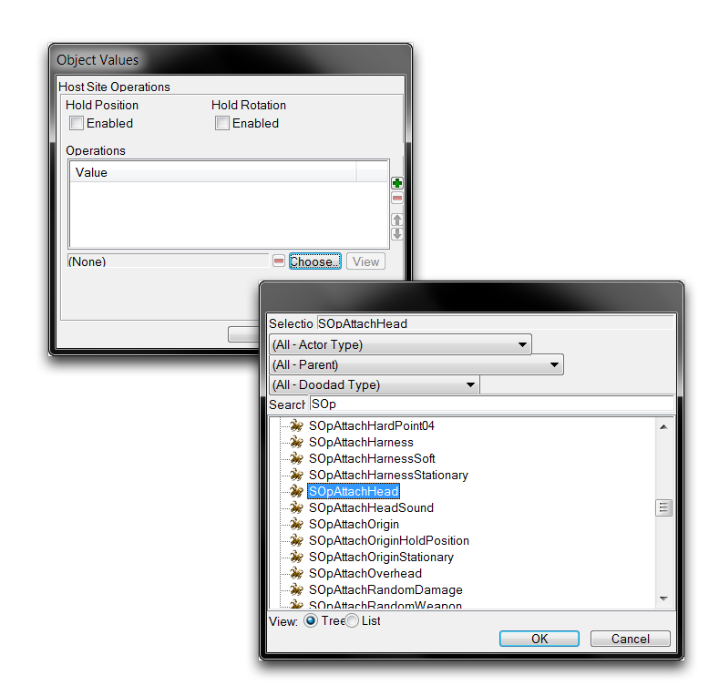

# 站点运营概述

站点运营代表了您可以对演员应用的大量修改。在您完全掌握它们之前，可能需要一些时间和经验。这是一个关于使用最常用操作的简要指南，以帮助您一路前行。

您会注意到，这份指南与之前的 Editor 元素概述有些不同。这是因为站点运营与编辑器的其他元素不同，它们的应用顺序很重要。重新排列相同一组站点运营可能会产生截然不同的结果。这意味着站点运营在真实环境中可能有些难以定义。本文没有提供每个操作字段和细节的详细说明，而是定义每个操作并展示如何在教程练习中应用它们。这将帮助您了解主演是如何随着覆盖更多站点运营而发生变化的。

打开本文提供的演示地图以开始教程。在里面，您将找到一名站在木板路上的海军陆战队员，如下图所示。

*演示地图课程*

移动到数据编辑器，然后转到演员选项卡，开始执行练习的第一步。

## 站点运营（附件）

附件站点运营可以将演员附加到一个单位或另一个演员。通常用于使演员的模型看起来像是相互连接或嫁接在一起。您可以堆叠这种嫁接以创建奇怪的、嵌合体般的单位，这或许是站点运营最具标志性的用途。通过这种方法构建的一个著名示例是暴雪的愚人节恶作剧——Terratron。

*Terratron：由多个星际争霸模型组合而成的机器人*

在尝试理解此操作的操作原理之前，了解一些术语将有所帮助。被附加的演员（承载站点运营的演员）被称为主机。将主机附加到的演员被称为基础。

在创建附件站点运营时，最重要的字段是附件查询。您可以使用此字段设置所使用的附加点类型。下表中会对此进行更详细的描述。将附件站点运营应用于主机将告诉它向任何连接的基础发送附件查询。这会导致主机通过其附件查询设置的附加点类型的实例附加到基础上。然后，该操作将主机的位置和方向设定为基础的附件点位置。

值得注意的是，由于附件点类型数目有限，您会在数据编辑器中找到一组有用的预设附件站点运营。这些通常以 SOpAttach 为前缀命名，并用附件点类型的后缀进行描述。示例包括 SOpAttachHead、SopAttachWeapon 和 SOpAttachCenter。

下表显示了附件站点运营字段的详细说明。

| 字段               | 详情                                                                                                                                                                                                                                                                                                                                                                                                      |
| ------------------- | ------------------------------------------------------------------------------------------------------------------------------------------------------------------------------------------------------------------------------------------------------------------------------------------------------------------------------------------------------------------------------------------------------ |
| 附件查询          | 设置附件方法，指定要将主机附加到的附件点。这通过选择“过滤器类型”来设置。此处的选项为“直接”，在此选项中，可以从下拉菜单中指定附件点的引用名称；以及“方法”，在此选项中，可以从“附加方法”数据类型中指定点。您还可以提供后备查询，以防指定方法失败。 |
| 保持位置          | 此标志设置附件的位置保持在其初始计算值不变。                                                                                                                                                                                                                                                                                                                                                         |
| 保持旋转          | 此标志设置附件的旋转保持在其初始计算值不变。                                                                                                                                                                                                                                                                                                                                                         |

## 使用附件操作

本文提供的地图可用于演示附件操作，您可以在单独的海军陆战队员上进行练习。他不会介意。您首先需要为主机演员创建一个模型。您可以通过转到数据编辑器中的模型选项卡，在对象列表中右键单击，然后选择“添加模型”来创建模型。这将启动下图所示的窗口。

*模型创建窗口*

将模型的“名称”设置为“光模型”，然后点击“建议”以自动生成一个ID。将“模型类型”设置为“通用”，然后点击“确定”。这将创建一个模型对象。移动到其“模型”字段，双击它以启动“对象值”选择窗口。在此窗口中点击“浏览”将启动存档浏览器，如下所示。

*使用存档浏览器进行模型选择*

使用浏览器的搜索功能查找 Streetlight_01.m3，选择它，然后点击“确定”。再次在选择窗口中点击“确定”，回到主数据编辑器视图。现在，模型资产已链接到模型类型，准备在演员中使用。首先移动到演员选项卡准备演员。在那里，右键单击对象列表，选择“添加演员”。

*添加演员*

选择“添加演员”将启动一个“演员属性”创建窗口。在此窗口中，将“名称”设置为“海军光”，然后点击“建议”以自动生成一个ID。您还应该将“演员类型”设置为“模型”，将“父级”设置为“ModelAddition”。点击“确定”以创建演员。这应该与下图所示的窗口一致。

*模型演员创建窗口*

创建与模型演员同名的模型将自动为您填写“模型”字段，建立链接。现在是时候将附件站点运营添加到这个演员了。方法是移至“主机站点运营”字段，双击它以启动站点运营子编辑器。

*主机站点操作子编辑器*

点击“选择”按钮将启动下图所示的站点运营选择。

*选择附件站点运营*