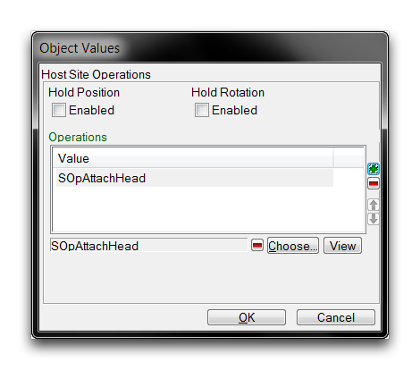
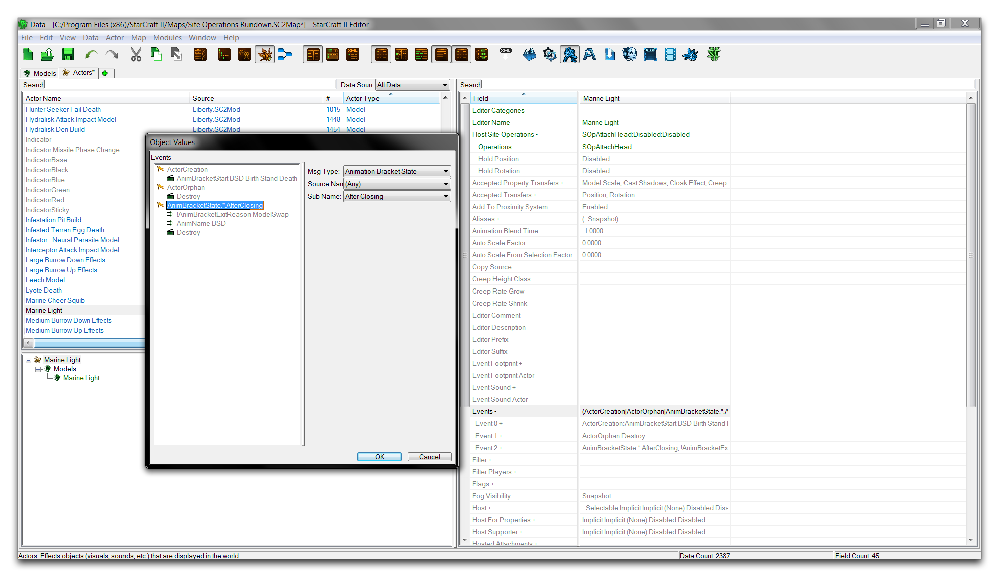
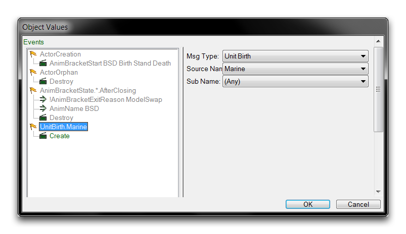
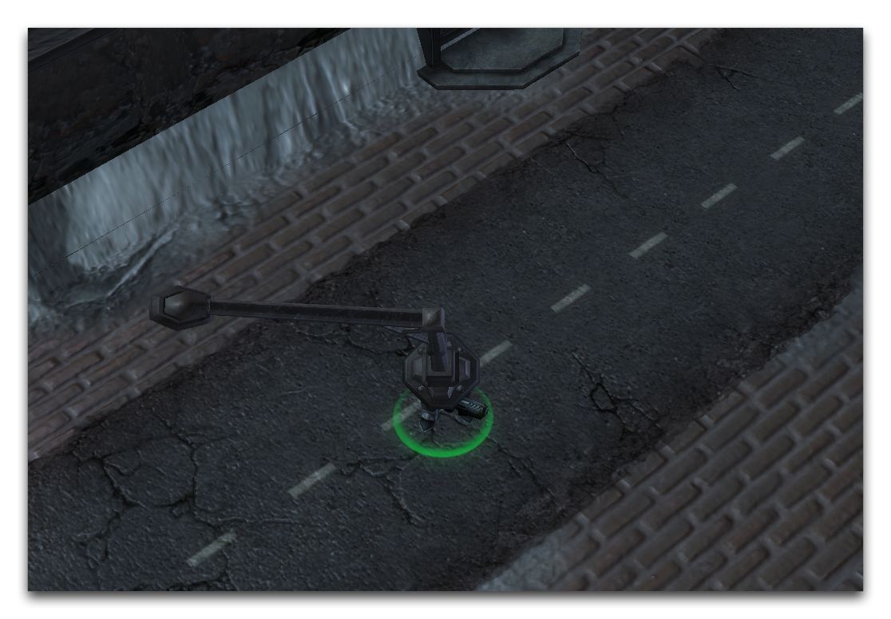
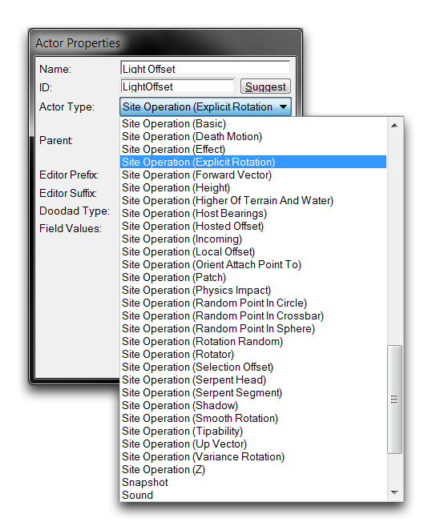
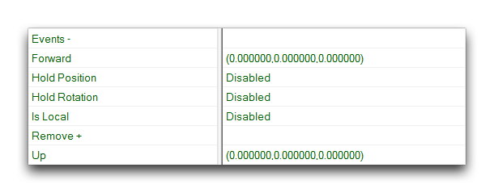
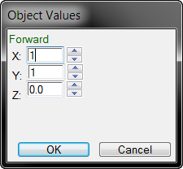
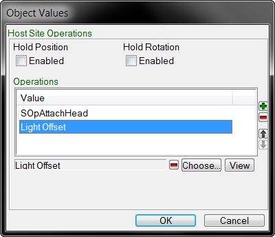
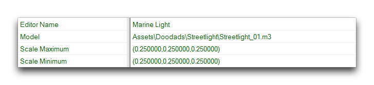

在这种情况下，您可以使用预先制作的附件操作之一。以每个附着点类别为目标的 Attachment Query 为前缀的一系列站点操作都包含了一个对单位的特定附着点进行操作的操作。选择 SOPAttachHead 操作，该操作会定位模型头部的附着点。然后点击“确定”返回前一个视图。

*选定的站点操作*

站点操作已添加到演员列表中。点击“确定”完成。模型演员现在包含一个自定义的路灯模型，将被嫁接到其基本单位的头部。您现在只需将演员连接到其主机即可。您可以通过演员事件字段来完成此操作。转到“Marine Light”模型演员内的“事件”，双击该字段以打开演员事件子编辑器视图，如下所示。

*演员事件视图*

右键单击白色框内，然后选择“添加事件”。使用下拉菜单，将事件的“消息类型”设置为“单位出生”。然后将消息的“消息类型”设置为“创建”，将其“源名称”设置为“Marine”。这样您将会看到以下。

*将模型演员链接到单位*

创建此演员事件将使“Marine Light”模型演员链接到“Marine”单位演员在单位创建时。正如之前所述，这将导致“Marine”演员作为基础，“Marine Light”作为主机，SOpAttachHead 作为附着站点操作。现在，“Marine Unit”演员的模型将会被嫁接到“Marine Light”演员的模型在 SOpAttachHead 的 Attachment Query 点。此操作的结果显示在下图中。

*使用附件操作将模型嫁接在一起*

## 站点操作（显式旋转）

显式旋转站点操作可以在主机演员的 x、y 和 z 任意组合上创建旋转。使用两个矢量，Forward 和 Up，来实现这一目标。每个矢量都为旋转提供了不同的基轴，用于在三个基本方向上进行旋转。此操作的细节在下表中列出。

| 字段            | 详情                                                                                                                                                                                                                                                             |
| -------------- | ------------------------------------------------------------------------------------------------------------------------------------------------------------------------------------------------------------------------------------------------------------------- |
| Forward       | 为旋转操作提供一个基础旋转轴，可通过 X、Y 和 Z 输入进行选择。您可以将 Forward 矢量想象为从演员向外突出，平行于地面。输入旋转由以下方案控制。   |
|                | \-X: 向右 +X: 向左                                                                                                                                                                                                                                                 |
|                | \-Y: 向前 +Y: 向后                                                                                                                                                                                                                                          |
|                | \-Z: 向下 +Z: 向上                                                                                                                                                                                                                                                    |
|                | 这是一个单位矢量，所有输入都在 1/-1 的比例上进行归一化。这个矢量比另一个选项更常用。                                                                                                                                         |
| Up             | 为旋转操作提供一个基础旋转轴，可通过 X、Y 和 Z 输入进行选择。您可以将 Up 矢量想象为从演员向上突出，就像从地面上升起一样。输入旋转由以下方案控制。 |
|                | \-X: 向右 +X: 向左                                                                                                                                                                                                                                                 |
|                | \-Y: 向下 +Y: 向上                                                                                                                                                                                                                                                    |
|                | \-Z: 向前 +Z: 向后                                                                                                                                                                                                                                          |
|                | 这是一个单位矢量，所有输入都在 1/-1 的比例上进行归一化。通常，此矢量只在横向的模型中使用，并在运动范围内移动。在这种情况下，使用 Forward 矢量的事物可能会倒置。       |
| Hold Position | 此标志设置操作的位置保持在其最初计算的值。                                                                                                                                                                 |
| Hold Rotation | 此标志设置操作的旋转保持在其最初计算的值。                                                                                                                                                                 |

这两个矢量选项通常不会同时使用。混合两个选项将创建一个结果旋转等于从 Up 减去 Forward 的旋转，从根本上说就是在它们的旋转中间找到平衡。

## 使用显式旋转操作

您现在将使用显式旋转操作来重新定位灯光模型。返回到演员标签页，并创建一个“显式旋转”类型的新演员，并命名为“Light Offset”。如下图所示。

*创建显式旋转演员*

通过选择要基于其旋转的矢量类型，然后设置其 x、y 和 z 字段，可以设置精确的旋转角度。可能的矢量字段 Forward 和 Up 如下所示。

*旋转演员字段*

双击 Forward 字段将打开以下视图。

*设置旋转站点操作*

这里所需的旋转是将灯光向左和向后各完整一个单位。您可以通过将 X 和 Y 字段设置为 1 来实现此目标。您现在的操作已经完成，准备添加到模型演员的站点操作列表中。您可以通过转到“Marine Light”中的“主机站点操作”字段，双击打开它来执行此操作。从这里，再次选择“选择”，导航至弹出窗口中的新“Light Offset”操作。选择它，然后点击“确定”。

*添加您的自定义显式旋转站点操作*

这将在站点操作列表中显示，如上所示。然后，点击“确定”完成添加。操作现在已完成，可以进行调查，但还有一个更改您应该进行。转到“缩放最大”字段并打开它。将每个 X、Y 和 Z 值设置为 0.25。对“缩小最小值”字段重复此过程。

*调整灯柱尺寸*