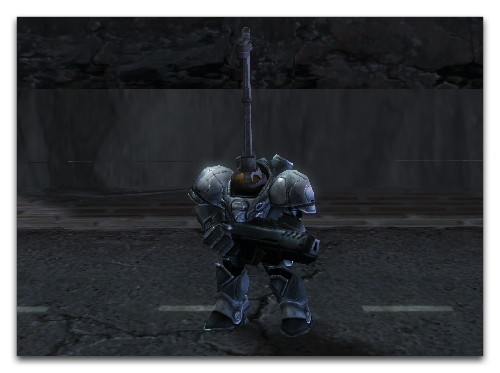
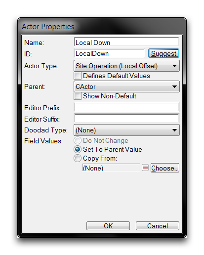
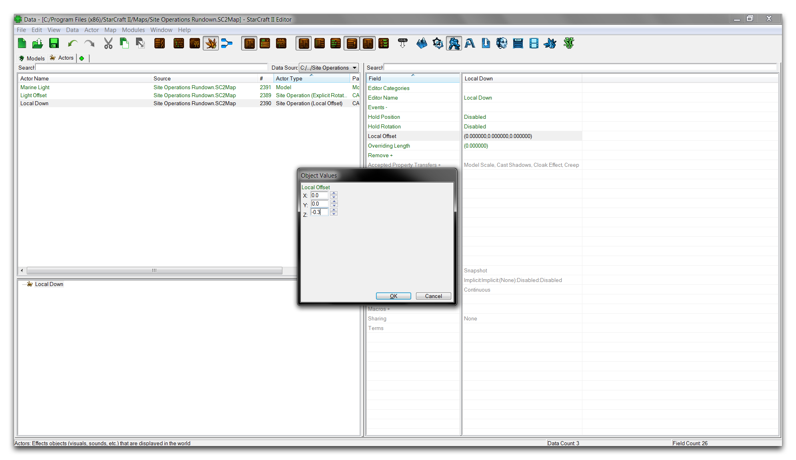
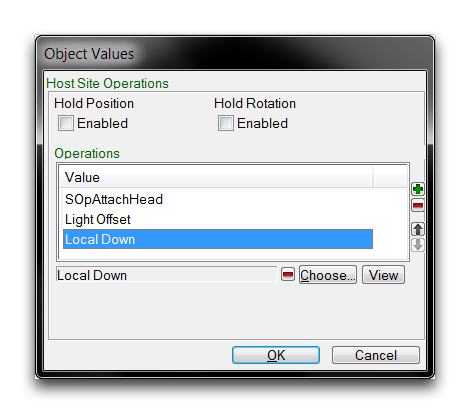

在创建时，模型被设置在规模最大值和规模最小值之间。使这两个字段相等将为模型提供恒定的、非随机的缩放。这些数字将规模设置为先前所见的大约四分之一。您可以通过返回到地形编辑器来检查您的进展，那里您应该看到类似下面图片所示的东西。

*缩放和旋转模型附件*

请注意，现在灯柱的主轴已与模型的头部对齐。

## 现场操作（本地偏移）

本地偏移站点操作允许您更改模型在所有三个基本方向（x、y和z）上的位置。

| 字段            | 详细信息                                                                                                                                                         |
| ----------------- | ----------------------------------------------------------------------------------------------------------------------------------------------------------------- |
| 本地偏移          | 应用一个偏移矢量，以在三个方向上移动角色，X、Y和Z。这个矢量遵循编辑器的基本方向性，如下所示。                                                                 |
|                  | \-X: 右 +X: 左                                                                                                                                                   |
|                  | \-Y: 前进 +Y: 后退                                                                                                                                             |
|                  | \-Z: 向下 +Z: 向上                                                                                                                                               |
| 保持位置           | 此标志设置偏移的位置保持在其最初计算的值上。                                                                                                                       |
| 保持旋转           | 此标志设置偏移的旋转保持在其最初计算的值上。                                                                                                                       |

## 使用本地偏移操作

现在您将使用一个偏移操作对灯具附件的位置进行一些微调。创建一个名为“Light Down”的新角色，类型为“站点操作（本地偏移）”。

*创建本地偏移角色*

移动到您的新角色的本地偏移字段。通过沿着负Z轴偏移它，模型将沿着向下移动到单位内。双击字段进行编辑，并将Z值设置为-0.3。

*设置偏移角色的字段*

与其他操作一样，此站点操作必须添加到基础模型的角色事件中。转到“Marine Light”中的“Host Site Operations”字段，并双击以打开子编辑器视图。然后，点击“选择”并将“Local Down”偏移添加到操作列表中。现在，包含三个不同站点操作的列表应如下图所示。

*添加偏移操作到列表*

现在是一个好时机来记住操作的顺序很重要，改变它通常会导致不可预测的结果。确认操作顺序是否符合您计划的设计，如上图所示。在这一点上，项目已经完成。一个外部模型已经移植到海洋上，重新定位，缩放和偏移。返回到地形编辑器，并花一点时间欣赏您的设计。

*物有所值*

## 附件

* [067_Site_Operations_Rundown_Completed.SC2Map](./maps/067_Site_Operations_Rundown_Completed.SC2Map)
* [067_Site_Operations_Rundown_Start.SC2Map](./maps/067_Site_Operations_Rundown_Start.SC2Map)