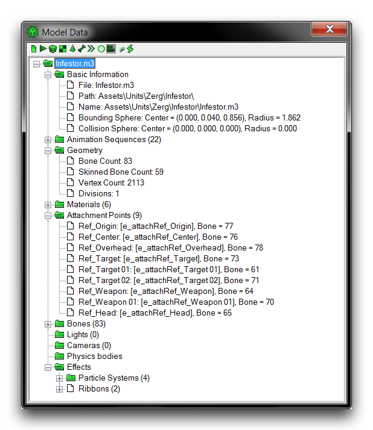
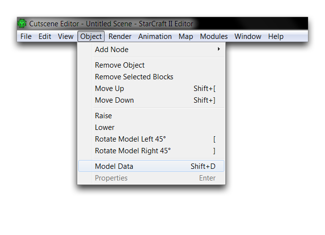
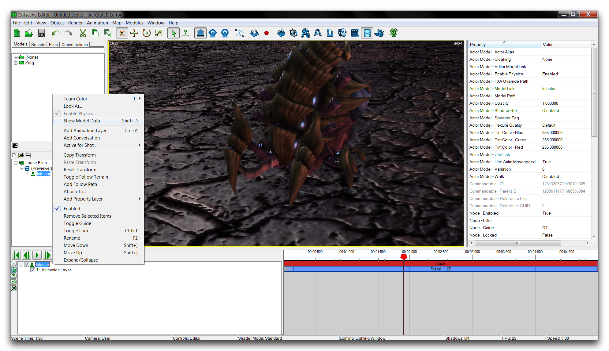
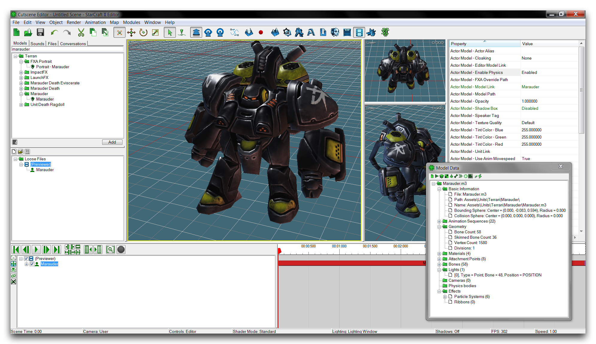
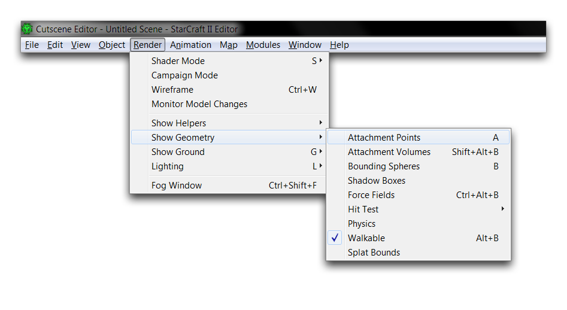
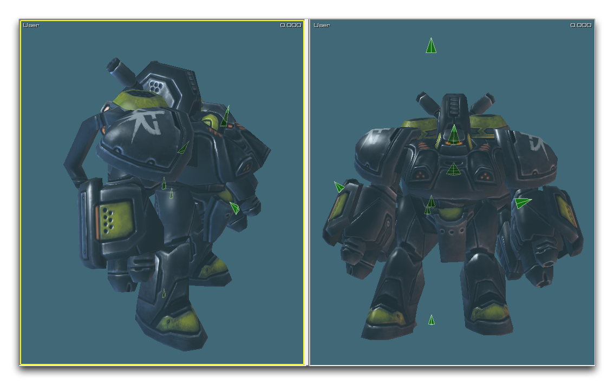
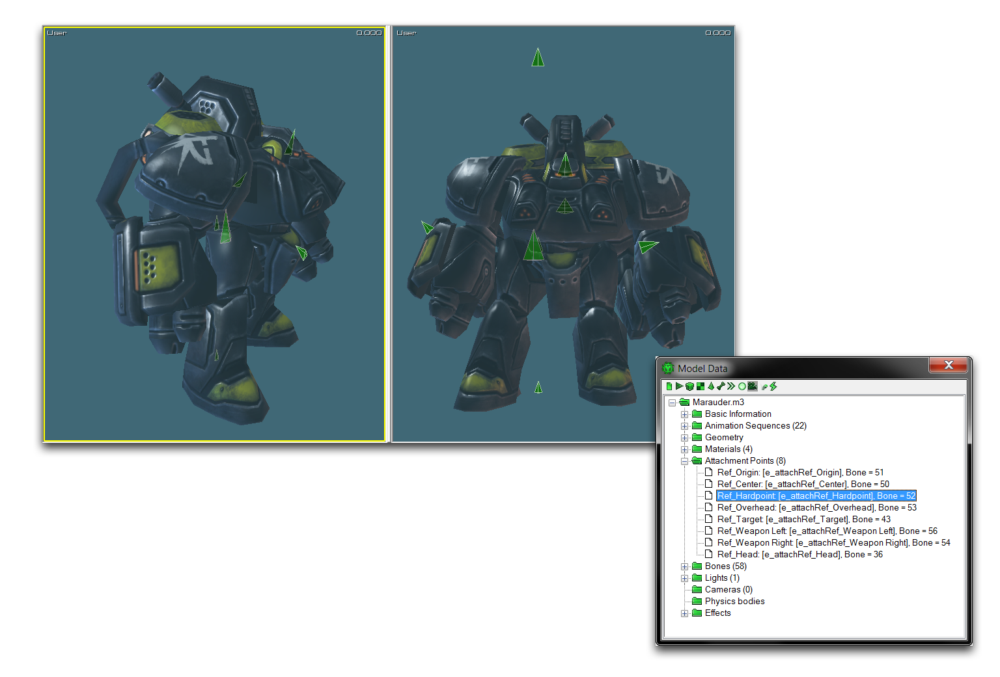

# 模型数据查看器

数据编辑器中的一些流程需要使用“模型数据”，这些数据是在构建模型资产时设置的结构属性。您可以始终通过检查创建它们的资产来检索这些属性，它们在暴雪艺术工具的发布套件中显示。在许多情况下，这可能有些过多。一个快捷方法是使用剧情编辑器作为检查器。在那里，你会找到一个特殊的模型数据查看器，专门用于此目的。查看器如下图所示。

*模型数据查看器*

## 启动查看器

您可以通过打开剧情编辑器并导航到对象 ▶︎ 模型数据来找到模型数据查看器，如下所示。

*打开模型数据查看器*

您还可以通过右键单击角色时间轴树中的模型，或者列出当前场景组件的左下角窗格，在弹出菜单中选择“显示模型数据”来打开查看器。

*从角色时间轴树打开模型数据查看器*

## 理解查看器

一旦启动，模型数据查看器将填充当前选择的模型类型的数据。

*剧情编辑器中的模型数据查看器*

在查看器中，您会看到模型数据被拆分并组织成文件夹。每个文件夹包含模型结构类型的详细分解或整个模型数据的概述。这些文件夹遵循下面概述的布局。

  - 单位类型
      - 基本信息
      - 动画序列
      - 几何
      - 材质
      - 附着点
      - 骨骼
      - 灯光
      - 摄像机
      - 物理体
      - 效果
          - 粒子效果
          - 带状物

您会在下表中找到每个文件夹中的信息。

| 字段               | 详细信息                                                                                                                                                                                                                                                 |
| ------------------- | -------------------------------------------------------------------------------------------------------------------------------------------------------------------------------------------------------------------------------------------------------- |
| 基本信息           | 提供模型文件结构和碰撞尺寸的概述。                                                                                                                                                                                                                       |
| 动画序列           | 将每个模型动画分解为列在动画引用名称下的文件夹，包括长度和起始帧。进入每个动画文件夹会显示它们的循环设置、单独的包围球尺寸以及其他几个标志。                                                        |
| 几何               | 包含模型内骨骼、定点、分区和蒙皮骨骼的数量。                                                                                                                                                                                                           |
| 材质               | 分解模型中的每个材质，列出它们的纹理和贴图组合，以及照明信息和任何设置的显示属性标志。还包含每个材质的文件夹，显示任何视差高度或动感模糊数据。                                                                |
| 附着点           | 显示模型上所有可用附着点的列表。每个点都列在其引用名称和附着到的骨骼号下。                                                                                                                                                                            |
| 骨骼               | 通过标识号码和引用名称分解模型中的每个骨骼。每个骨骼也有一个子文件夹，包含关于广告牌、动画和反向运动学的信息。                                                                             |

## 模型数据应用

模型数据查看器中找到的信息的应用因项目而异。

如果项目使用自定义资产，则查看器可以是您确认所有内容加载到引擎中的首选位置。在这里，模型数据与暴雪艺术工具中找到的信息进行比较，检查是否存在任何差异。任何差异可能表明某些组件未正确导出。

在其他情况下，查看器可用于查找引用名称。这些名称在触发器和数据中经常用作标识符。动画序列的引用名称在角色事件中使用，作为“动画属性”，或在动画触发操作中使用，作为“标识符”。附着点的引用名称用于附着点操作和“将角色附着到…” 触发器操作。

## 定位附着点

模型数据查看器在使用剧情编辑器定位附着点时具有特殊用途。您可以通过导航到渲染 ▶︎ 显示几何 ▶︎ 附着点，启用附着点的可见性来执行此操作。

*显示附着点*

一旦启用，每个附着点都由叠加在模型上的三角形固体表示。每个三角形表示附着点被发现的位置，并指示附着点面向的方向。下图显示了劫掠者的附着点。

*附着点基本可视化*

此可视化展示了附着点的分布和方向，但不提供任何有关查找每个点的引用名称的帮助，以便您可以在编辑器的其他地方使用它们。一些附着点具有有用的名称，但其他一些可能难以解码。

如果打开查看器并导航到附着点文件夹，您可以通过选择正在搜索的点的列表来找到每个单独的附着点。在模型数据查看器中突出显示附着点后，剧情编辑器的主视图中的附着点将变得明亮绿色并开始闪烁。如下图所示。

*使用模型数据查看器突出显示的附着点*

这种效果在运动中更加显著，但上图仍然显示，所选的附着点更亮且更大。在这种情况下，该方法已识别出 Ref\_Hardpoint，单单通过引用名称难以定位的附着点。