# 点击响应行为

点击响应行为是应用于玩家点击其托管单位时产生效果的一种行为。这是一种在星际争霸的数据依赖中只使用一次的神秘行为，位于每个地图瓦片组的本地野生生物，也就是小动物。如果您还不知道，在星际争霸和类似的Craft游戏中，小动物在被重复点击后会展现一些自发行为。如果您还没有体验过这种乐趣，那么现在测试这种行为绝对是值得投入时间的一种方式。

[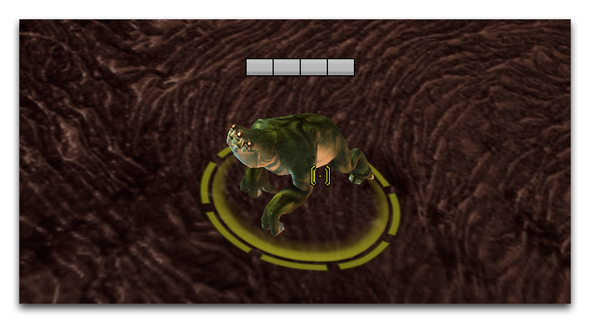](./resources/070_Click_Response_Behavior1.png)
*点击一个小动物30次*

尽管它缺乏传统用途，但点击响应行为显示了玩家输入和数据效果之间有趣的直接关系。值得深入研究。

## 演示点击响应行为

打开本文提供的演示地图。在那里，你会发现一个小型的异虫基地，外面漂浮着一群毒刺。如下所示。

[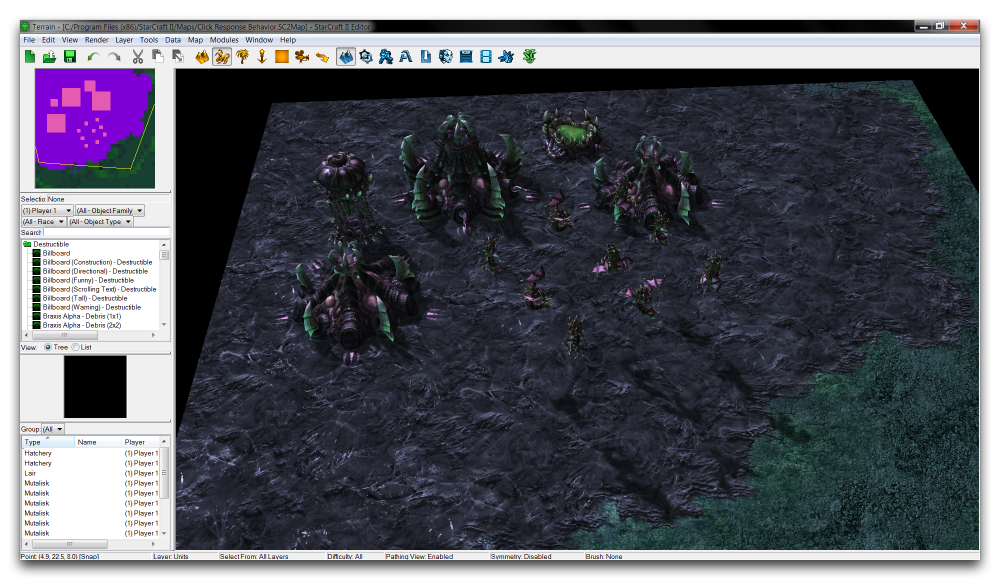](./resources/070_Click_Response_Behavior2.png)
*演示地图示例*

这个地图已经配置好，允许玩家从孵化场免费并加速产生毒刺。您将利用这一点添加一个自定义的点击响应行为，经过一系列的点击后摧毁毒刺。

开始组装这种行为，通过转到数据编辑器并导航到行为选项卡。如果选项卡还未打开，您可以通过导航到 + ▶︎ 编辑游戏数据 ▶︎ 行为 来打开它。右键单击主行为窗口内部，然后选择“添加行为”。如下图所示。

[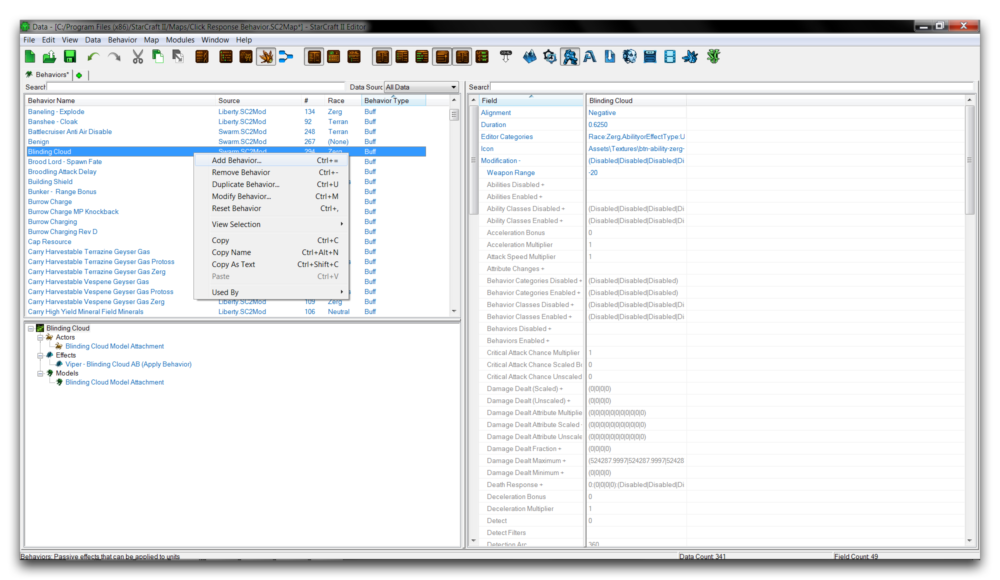](./resources/070_Click_Response_Behavior3.png)
*创建一个行为*

在行为创建窗口中，将名称设置为“毒刺销毁”，然后单击“建议”以生成一个ID。现在将“行为类型”设置为“点击响应”。完成后的创建窗口应该如下图所示。

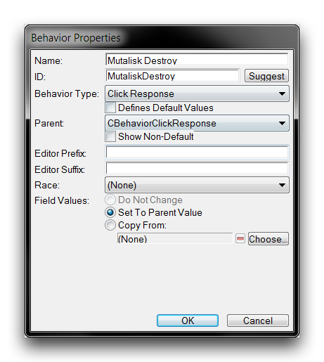
*点击响应行为创建*

单击“确定”以完成创建，并返回主数据编辑器屏幕。

## 设置行为字段

创建了行为后，选择它以编辑其字段。首先，移动到“计数”字段，您将在那里设置应用该行为所需的点击次数。双击该字段以启动“对象值”窗口，并将“计数”值设置为5，如下所示。

[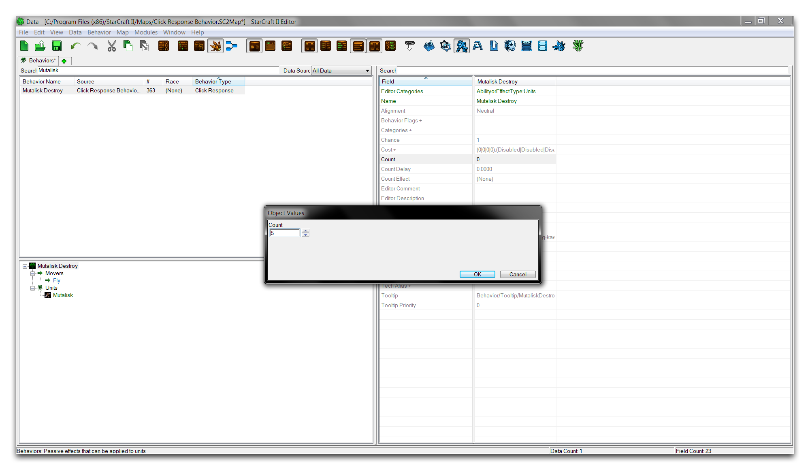](./resources/070_Click_Response_Behavior5.png)
*设置行为点击计数*

接下来，移动到“计数延迟”字段。双击该字段以启动另一个“对象值”窗口，并将其值设置为0.5。这将设置在点击之间运行的计时器。如果超过此值，点击计数将被重置。如果行为需要在正常使用过程中防止意外触发，这可能很有用。

[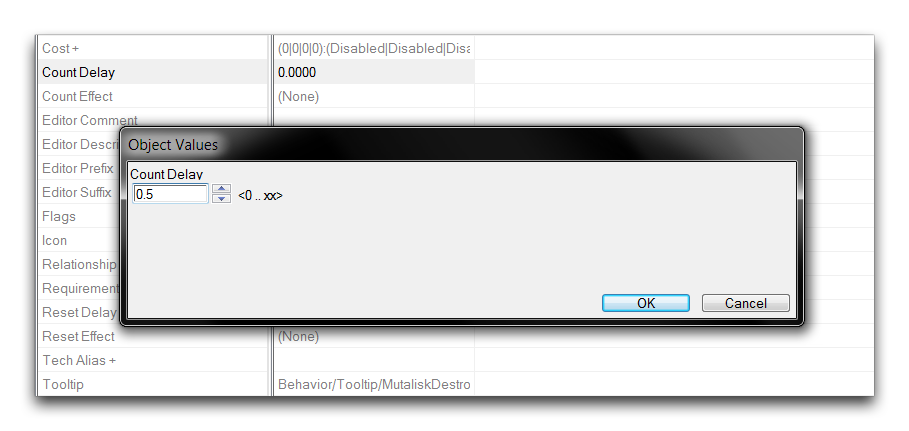](./resources/070_Click_Response_Behavior6.png)
*设置行为计数延迟*

现在移动到“计数效果”字段，选中它，并双击以启动编辑窗口。此字段将设置响应点击触发的效果。这是一个不错的位置，以便以后可以回来进行实验，但现在请选择“自杀”。这将使单位在重复点击后被移除。

[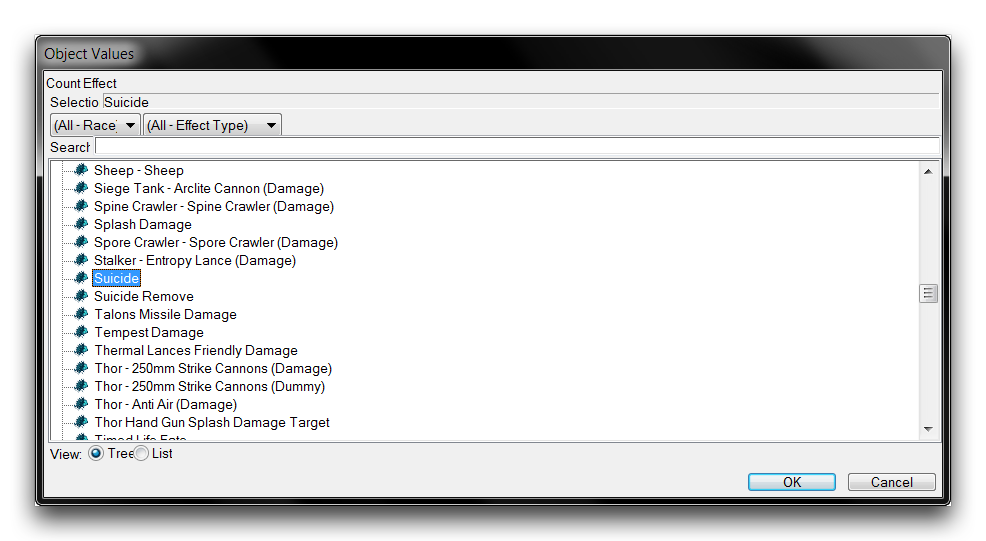](./resources/070_Click_Response_Behavior7.png)
*设置点击响应效果*

现在选择“确定”以完成行为的构建。完成的字段应如下图所示。

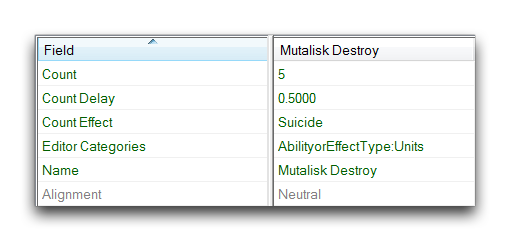
*完成的行为字段*

## 应用点击响应行为

行为现在已经完全准备就绪，可以与游戏玩法相连接。这种行为类型的一个很好的特性是，您可以直接将其插入到一个单位中，这样设置就非常容易。这是明智的，因为这种行为授予了直接响应玩家输入的效果，所以行为最自然的位置是在单位本身内部。通过导航到单位选项卡或通过 + ▶︎ 编辑游戏数据 ▶︎ 单位 打开它。从这里，选择“毒刺”，并移动到它的“行为”字段。

[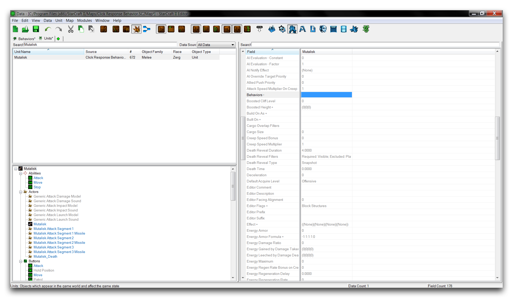](./resources/070_Click_Response_Behavior9.png)
*毒刺行为字段*

双击“行为”字段以打开“对象值”窗口。右键单击“行为”框内部，然后选择“添加数值”。这将向单位添加一个空白行为，如下所示。

[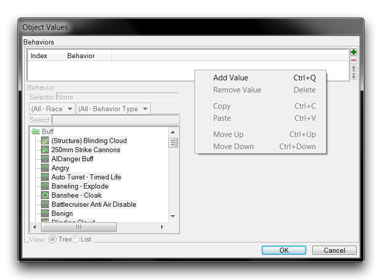](./resources/070_Click_Response_Behavior10.png)
*添加毒刺行为*

创建后，突出显示新值，并使用窗口的搜索功能或滚动条找到“毒刺销毁”行为。

[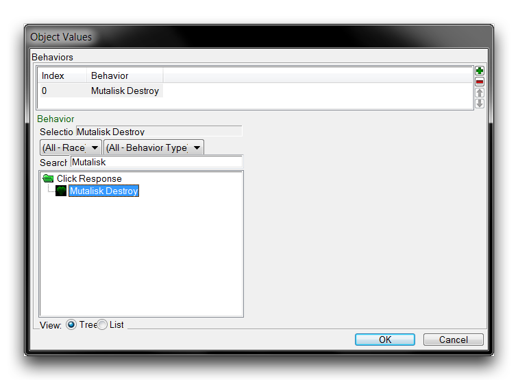](./resources/070_Click_Response_Behavior11.png)
*设定毒刺销毁行为*

单击“确定”以选择行为。此时，您还需要对单位进行最后更改。默认情况下，单位不会对玩家点击做出数据事件响应。它们可能可以被点击并在游戏视图中使用，但在数据方面不会产生事件信号。为了纠正这一点，突出显示“毒刺”，并导航到其“标志”字段。双击该字段以打开它，然后移动到“无法被点击”标志并取消选择它。

[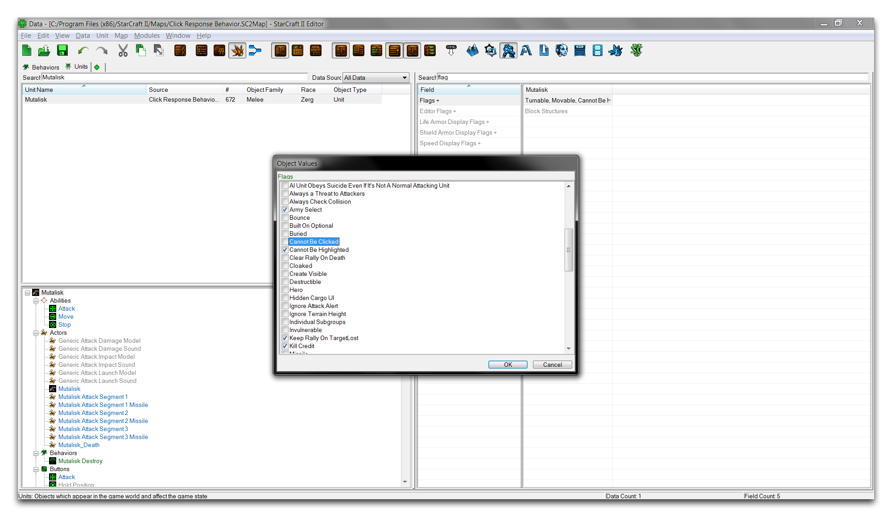](./resources/070_Click_Response_Behavior12.png)
*允许点击毒刺*

单击“确定”以返回主数据编辑器视图。现在地图已经完成，您可以运行“测试文档”功能。如果检查地图中的一个毒刺，您将发现它们现在带有一个行为状态标记，如下所示。

[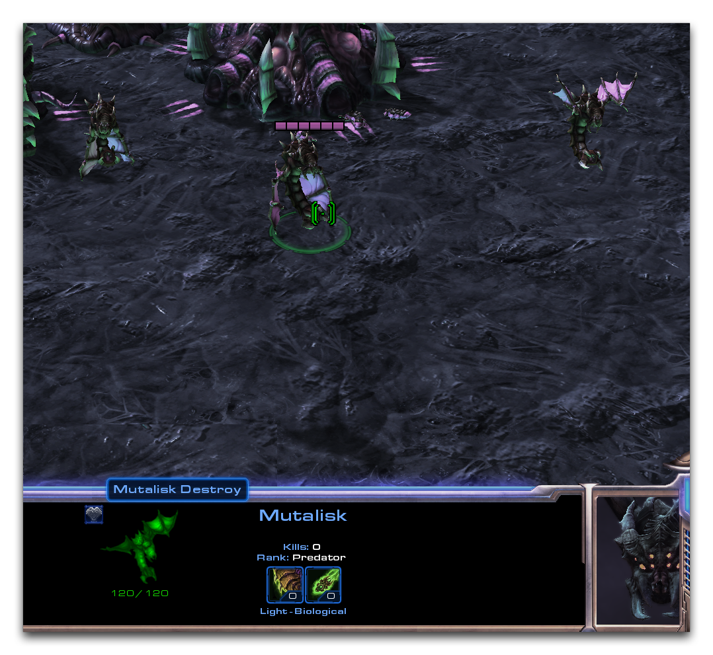](./resources/070_Click_Response_Behavior13.png)
*带有毒刺销毁行为的毒刺*

点击这个毒刺五次将展示这种行为的设计。