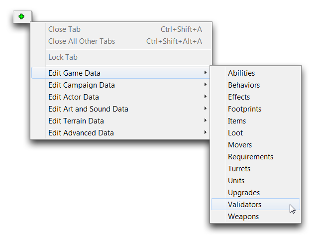
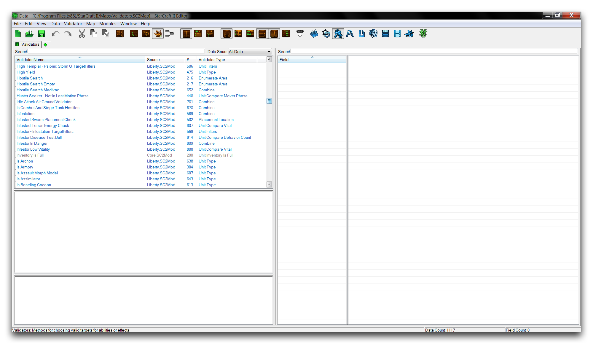
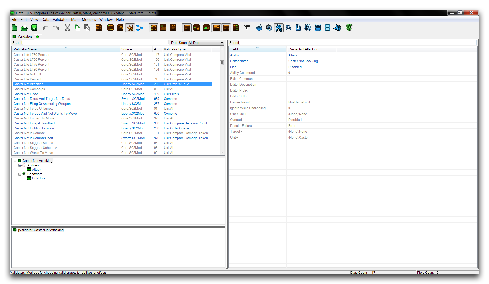
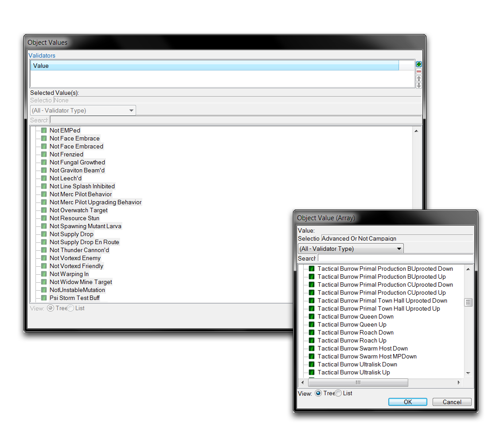
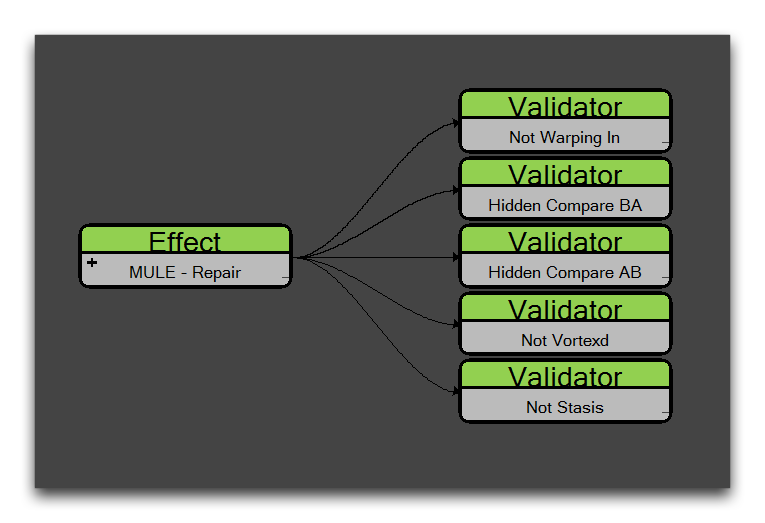
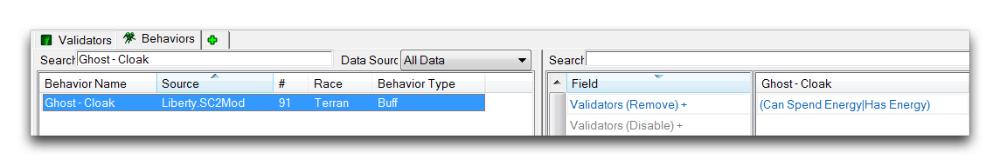

# 验证器

验证器进行测试。虽然它们本身是一种数据类型，但它们的目的是连接到其他数据类型并执行测试，检查语句的真假。根据结果，托管数据类型将做出选择，并相应地采取某些操作。因此，验证器以一种类似条件控制触发器的方式控制数据。然而，验证器的应用非常独特，它们有广泛的用途，从构建游戏对象到控制人工智能。

## 验证器详情

您如何应用验证器取决于验证器的类型以及验证器将要使用的托管类型。有许多类型的验证器可用，它们可以在效果、行为、能力和角色中使用，每次承担略微不同的角色。要了解这些多样化配置的感觉，最好从查看现有数据库中它们的许多用例开始。您可以通过导航到 + ▶︎ 编辑游戏数据 ▶︎ 验证器，在数据编辑器中找到验证器，如下所示。

*导航到数据中的验证器*

这将启动验证器选项卡。

*验证器选项卡清单*

在此视图中，所有验证器按其验证器名称、来源、\# 和验证器类型进行组织。您会看到验证器通常具有类似句子片段的名称。示例包括“威胁蝙蝠人”，“是凤凰”和“可以冲锋”。这反映了验证器插入其他内容并进行测试的事实。当用其托管方的术语来表述时，这些名称更有意义，如“这个斩杀者可以冲锋吗？”或“这个单位是凤凰吗？”因此，验证器的名称可以给出有关其最终用途的线索。在创建自定义验证器时，这是一种很好的模仿风格。

从验证器选项卡中，在主编辑器视图中突出显示“施法者未攻击”验证器，以显示其字段，如下所示。

*验证器字段视图*

这个“施法者未攻击”验证器是一个单位命令队列验证器。该类型测试玩家是否已命令单位使用某个能力。选择了验证器后，右侧视图将显示启用和支持此测试的字段。大多数验证器字段是特定类型的，但检查典型验证器的构成将帮助您了解如何拆分它们。单位命令队列验证器有三个主要字段，如下表所示。

| 字段         | 详情                                                                                                |
| ------------ | ---------------------------------------------------------------------------------------------------- |
| 能力         | 设置要测试的能力。                                                                                   |
| 查找         | 检查能力的状态。启用表示正在发生，禁用表示未发生。                                                  |
| 单位 - 值    | 设置验证器要测试的单位。                                                                             |

对于您正在检查的验证器，被测试的能力是攻击，查找状态为禁用，单位 - 值为施法者或使用该能力的用户。这些将一起检查单位当前是否未使用攻击能力，这由其名称“施法者未攻击”清晰覆盖。

## 验证器应用

验证器在效果、行为和能力中起作用。要将验证器应用于这些数据类型之一，您可以导航到其字段“验证器”，并双击启动“对象值”窗口。在那里，单击绿色 + 以添加新验证器。这将触发一个新的“对象值（数组）”窗口，在那里选择验证器。此过程应该如下图所示。

*应用验证器*

对于效果，验证器用于测试是否应用效果。此测试将在每种效果类型的常规应用时间发生。如果验证器返回false，则效果不会生效。如果返回true，则效果将继续进行。下面是一个效果验证器的示例。

*效果验证器*

在这里，“MULE -- 修理”效果具有一组五个验证器。例如，如果一个单位正在进行瞬间传送，那么第一个验证器将失败，导致效果不会应用。在这种情况下，每个验证器必须被发现为真，才能使效果生效。

在行为中，验证器允许您基于测试的响应而禁用或完全移除行为。下面是一个示例。

*行为验证器*

验证器被分为验证器（禁用）和验证器（移除）。每种情况将在验证器失败时对行为应用其特定的操作。对于验证器（禁用），验证器测试的错误结果将导致行为被禁用，但仍保留在单位中以供进一步测试。对于验证器（移除），错误的测试将导致行为永久从单位中去除。在这个示例中，当单位耗尽能量时，“Ghost -- Cloak”将被移除。对于下一个隐形状态，该行为将需要通过另一个“添加行为”效果重新应用。