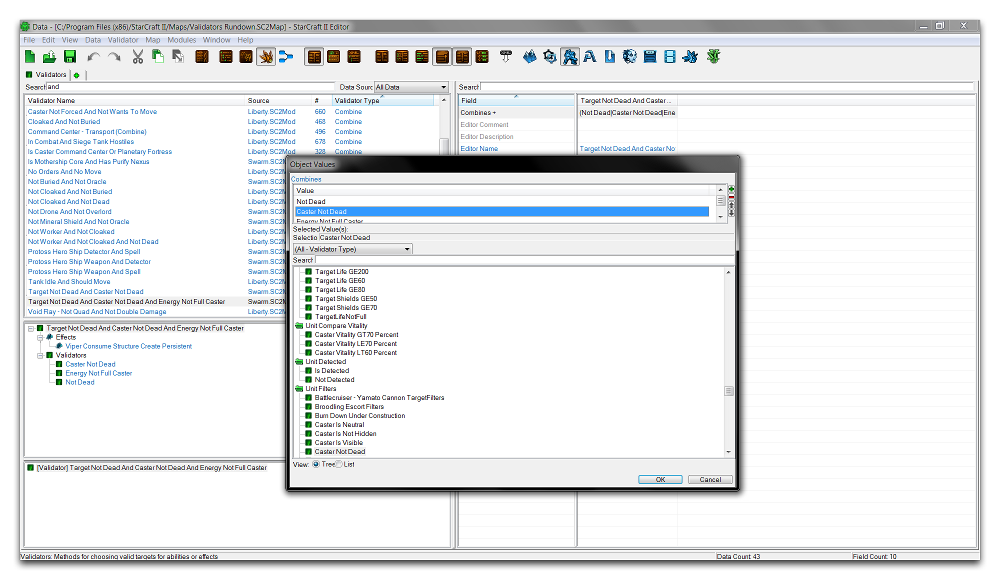
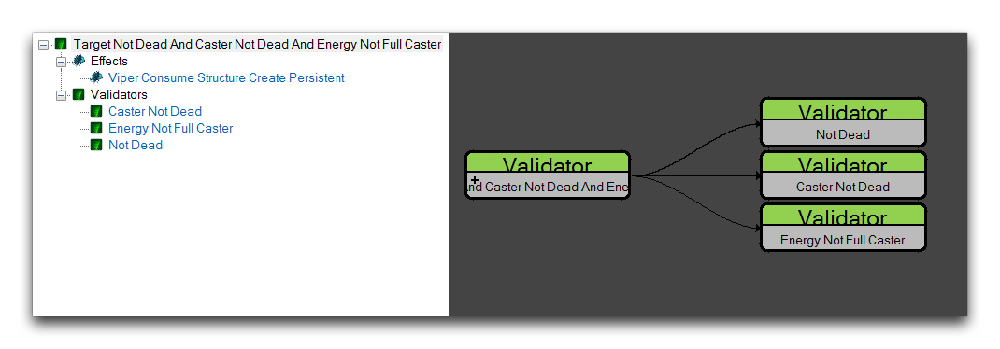
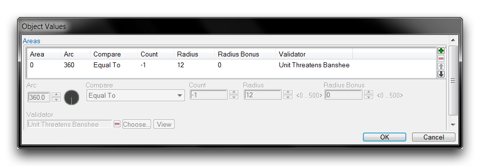
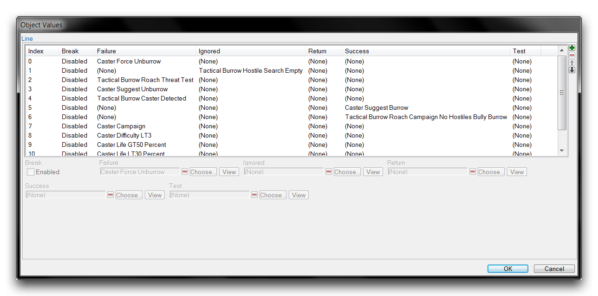

# 验证器概述

本文介绍了一些不同类型的验证器的分类情况。每个部分描述了它的验证器的各个字段，同时提供了一些关于其用途和应用的详细信息。

## 合并

合并验证器将一组验证器连接在一起。虽然“验证器”字段通常支持多个验证器，但像这样将它们组合在一起可以成为组织和清晰的有用工具。合并验证器可以通过反复将合并验证器插入自身来无限序列化。

| 字段           | 详细信息                                                                                                                                                                                                                         |
| -------------- | ----------------------------------------------------------------------------------------------------------------------------------------------------------------------------------------------------------------------------------- |
| 类型           | 选择术语的AND或OR组合。AND组合要求每个验证器都为真才能使组合验证器为真。相比之下，只要其中一个验证器为真，OR组合就为真。                                                                             |
| 合并           | 设置要合并的验证器。这些验证器可以包含另一个合并验证器。                                                                                                                                                                        |
| 反转           | 反转测试结果，任何真结果都会显示为假，反之亦然。这也被称为NOT运算符。                                                                                                                                                           |
| 结果 - 失败    | 在失败时设置要分发的错误消息。                                                                                                                                                                                                    |

您可以在下面看到一个合并验证器的示例。

*合并验证器示例*

在这里，三个单独的验证器被合并，包括Caster Not Dead、Energy Not Full Caster和Not Dead。您可以使用对象浏览器和数据导航器详细查看此链接，如下图所示。

*合并验证器链接视图*

需要注意的是，这些可视化效果只会显示单个层级的组合。如果合并验证器被序列化，您必须选择任何额外级别的合并验证器才能看到其组成验证器。

## 枚举区域

枚举区域验证器通过计算区域中的对象数量，然后将其数量与测试值进行比较来执行测试。根据此测试的结果，验证器将得出真或假。它可以计算一般对象的数量，也可以仅计算测试为某个验证器的对象的数量。

| 字段           | 详细信息                                                                                                                                                                                                                               |
| -------------- | ----------------------------------------------------------------------------------------------------------------------------------------------------------------------------------------------------------------------------------------- |
| 区域           | 定义要搜索的区域列表。您还可以为每个区域定义一个验证器，该验证器将导致搜索仅计算具有该验证器的对象。如果在任何区域中未设置任何验证器，结果将是简单的单位计数。                                                                   |
| 比较           | 定义用于将位于区域中的对象数量与计数进行比较的运算符。                                                                                                                                                                                  |
| 计数           | 设置要将位于区域中的对象与之进行比较的测试值。                                                                                                                                                                                            |
| 位置           | 检查能力的状态。已启用表示发生中，已禁用表示未发生。                                                                                                                                                                                     |
| 搜索过滤器     | 设置在哪个地图上创建和搜索区域。                                                                                                                                                                                                         |
| 搜索标志       | 设置一些选项标志。通过单位半径扩展将按单位半径值扩展该区域。相同悬崖级别将仅搜索与验证器宿主共享相同悬崖级别的单位。                                                                                                                     |

激活后，枚举区域验证器会在位置创建其区域。然后，它会计算有多少对象符合其区域内的条件，无论是简单地存在还是具有已定义的验证器。然后，将该值与比较定义的运算符以Count为基准进行比较。如果比较成功，则返回true，否则返回false。您可以在下面看到一个正在构建枚举区域区域字段的示例。

*枚举区域搜索区域*

## 函数

函数验证器允许您构建受控的验证器序列。序列的每个步骤都会测试一个验证器，然后返回结果或继续进行下一个测试。函数验证器中可以包含无限数量的术语，每个测试都可以返回几种不同的唯一结果类型。这使其与其他条件验证器Combine有所区别，后者必须序列化才能超过两个术语，并且每个测试只能返回简单的true或false结果。函数验证器通常用于构建广泛的AI程序。

函数验证器在子编辑器视图中构建，您可以通过Line字段访问该视图。函数验证器按照行索引的顺序逐行进行测试，从上到下移动。每个测试都会检查其行中设置的验证器是否为true。然后，根据验证器所属的五个字段中的任何一个，将采取一种操作。下面显示了一个函数验证器的示例。

*函数验证器构成*

在这种情况下，首先对Caster Force Unburrow进行测试。如果该验证器为真，则函数验证器返回失败并结束。如果验证器为假，则执行下一行。接下来，Index为1的行测试Tactical Burrow Hostile Search Empty是否为真。这恰好是一个枚举区域验证器。从中获得的真结果将导致验证器返回Ignored。这将结束函数验证器。如果结果为假，将执行下一行。此过程将一直持续到索引用尽。显然，该验证器可以提供非常强大的结果概要。下表显示了各个字段的详细分解。

| 字段           | 详细信息                                                                                                                                                                                                             |
| -------------- | ----------------------------------------------------------------------------------------------------------------------------------------------------------------------------------------------------------------------- |
| Line           | 按行进行验证器测试。有五种可能的返回结果：失败、已忽略、返回、成功和测试。下面所描述的Break提供了另一个控制选项。                                                              |
| Break          | 一旦达到，停止验证器。                                                                                                                                                                                                 |
| 失败           | 如果所选验证器为真，则对整体函数验证器返回失败并退出测试。这还会显示已设置的任何错误消息。                                                                         |
| 已忽略         | 如果所选验证器为真，则对整体函数验证器返回失败并退出测试。这不会显示任何错误消息。                                                                                |
| 返回           | 返回与所选验证器相同的True或False结果。                                                                                                                                                                                  |
| 成功           | 如果所选验证器为真，则对整体函数验证器返回True并退出测试。                                                                                                      |
| 测试           | 如果所选验证器返回为真，则将跳过该行中的其他验证器。这可以与额外的失败、已忽略、返回或成功验证器一起使用，以进行对象的前期测试。                        |
| 结果 - 失败    | 选择要在失败时显示的错误消息。                                                                                                                                                                                            |

## 位置范围

位置范围验证两个对象之间的距离。根据该范围是否满足测试值，会返回一个真或假值。下面显示了一个位置范围验证器的示例。