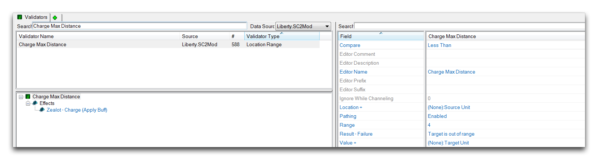
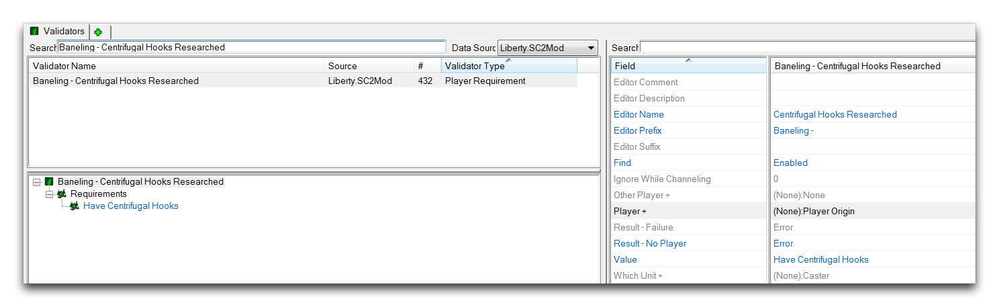
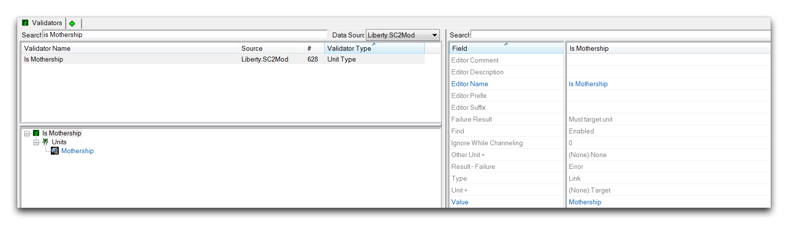
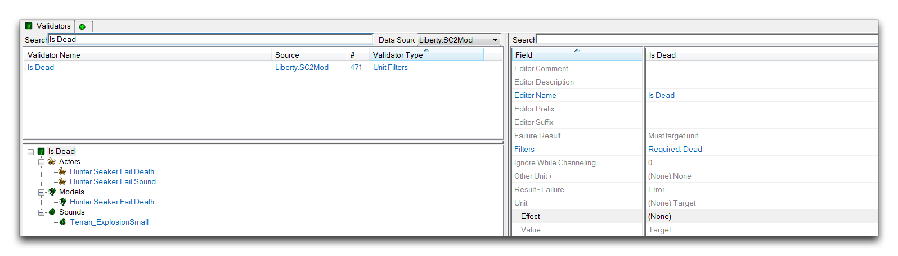
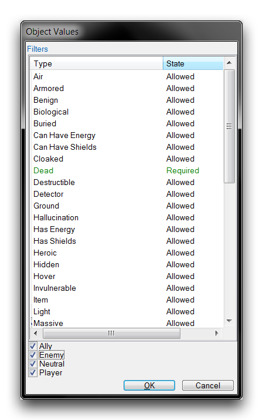
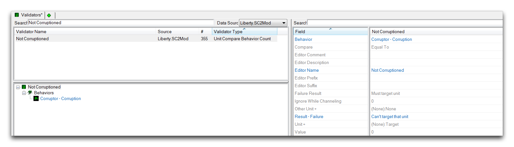

这是一个Markdown文件，将其翻译为中文，不要修改任何现有的Markdown命令：

*位置范围验证器*

| 字段              | 详细信息                                                                    |
| ----------------- | ------------------------------------------------------------------------ |
| 范围             | 使用比较运算符设置要测试的距离。               |
| 比较           | 定义用于比较一个对象到另一个对象的范围的运算符。 |
| 位置          | 设置测量的起始点。                                 |
| 值 - 值     | 设置测量的结束点。                                      |
| 结果 -- 失败 | 设置失败时显示的错误消息。                       |

## 玩家要求

玩家要求验证器测试玩家某一特定要求的状态。

*玩家要求验证器*

| 字段               | 详细信息                                                                                                                                                                                                                                                                                                           |
| ------------------- | ----------------------------------------------------------------------------------------------------------------------------------------------------------------------------------------------------------------------------------------------------------------------------------------------------------------- |
| 值               | 设置要测试的要求。                                                                                                                                                                                                                                                                                |
| 查找                | 选择如何对单位进行测试。启用表示识别为所选单位类型的单位将返回为True，而未被识别的将返回为False。禁用表示识别为所选单位类型的单位将返回为False，未被识别的将返回为True。 |
| 玩家 - 值      | 指定验证器将定位的玩家。                                                                                                                                                                                                                                                              |
| 结果 -- 无玩家 | 选择如果未设置或未找到玩家则要分发的错误消息。                                                                                                                                                                                                                                      |

## 单位类型

单位类型验证器测试单位是否为指定类型。您可以在以下看到单位类型验证器的一个示例。

*单位类型验证器*

| 字段            | 详细信息                                                                                                                                                                                                                                                                                                                  |
| ---------------- | ------------------------------------------------------------------------------------------------------------------------------------------------------------------------------------------------------------------------------------------------------------------------------------------------------------------------ |
| 单位 - 值     | 设置要测试的单位。                                                                                                                                                                                                                                                                                              |
| 值            | 设置要将单位 - 值测试为的单位类型。                                                                                                                                                                                                                                                       |
| 查找             | 选择如何对单位进行测试。启用表示识别为所选单位类型的单位将返回为True，而未被识别的将返回为False。禁用表示识别为所选单位类型的单位将返回为False，未被识别的将返回为True。 |
| 结果 - 失败 | 选择失败时要分发的错误消息。                                                                                                                                                                                                                                                                  |

## 单位过滤器

单位过滤器验证器检查单位是否包含指定的过滤器。

*单位过滤器验证器*

| 字段            | 详细信息                                                     |
| ---------------- | ----------------------------------------------------------- |
| 过滤器          | 设置要测试的过滤器。                          |
| 单位 - 值     | 设置将要检查其过滤器状态的单位。 |
| 结果 - 失败 | 设置失败时显示的错误消息。          |

过滤器选择可以针对单位的状态和联盟状态，如下所示。

*过滤器选择视图*

## 单位比较行为计数

单位比较行为计数验证器将单位的行为堆栈计数与测试值进行比较。根据比较结果，将返回True或False值。

*单位比较行为计数验证器*

| 字段            | 详细信息                                                                        |
| ---------------- | ------------------------------------------------------------------------------ |
| 行为         | 设置要测试的行为。                                            |
| 比较          | 定义与测试值比较行为堆栈计数的运算符。 |
| 值            | 设置要将行为堆栈计数与之比较的测试值。              |
| 单位 - 值     | 设置进行行为测试的单位。                                   |
| 结果 - 失败 | 设置失败时显示的错误消息。                             |

您应注意，通常认为单位在堆栈计数为1时具有行为。因此，此验证器通常用于测试单位是否可以应用某个行为，或者该单位是否已经拥有该行为。在这种情况下，测试检查行为堆栈是否等于测试值0。如果返回True，则表示单位当前未拥有该行为，可以应用。如果返回False，则表示单位已经具有该行为，并且不应接收额外的堆栈，因为设计不支持这种情况。