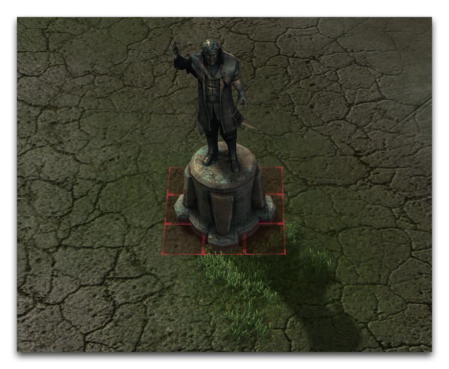
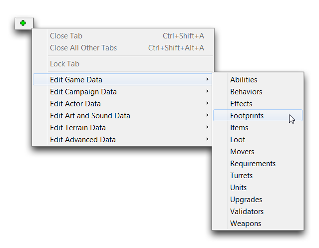
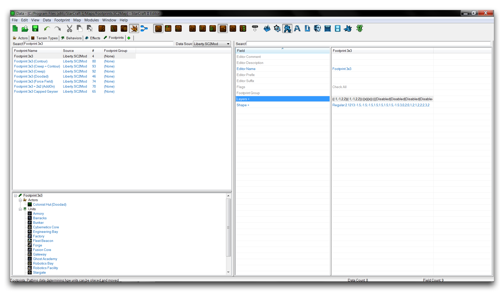

# 足迹

足迹将路径应用于其他对象。以雕像小玩意为例。为了在编辑器中运行，它必须防止单位通过它并固定模型。通过将足迹附加到小玩意上，可以防止这种情况发生，从而在雕像区域周围创建一种路径阻塞器。您可以在下面的图片中看到这一点。

*Doodad足迹*

小玩意将一个网格区域划分开，单位路径和建筑均无法在此发生。根据足迹在单位网格上所占据的路径面积确定其类型。此足迹为3×3，每个轴向均为三个单位。您可以移动到数据编辑器并导航到+ ▶︎ 编辑游戏数据 ▶︎ 足迹来查看和编辑足迹，如下所示。

*在数据中导航到足迹*

## 足迹详情

在编辑器中选择一个足迹将显示其字段在右侧子视图中以及其连接的对象在对象资源管理器中。通过“足迹”字段将足迹连接到一个演员，并通过“路径足迹”字段将其连接到一个单位。需要注意的是，当涉及单位时，许多建筑都有自己的足迹，但实际上可移动的地面单位则通过其自己的系统处理路径。下面是足迹选项卡的图像和其关键字段的细分。

*足迹数据字段*

| 字段            | 详情                                                                                                                                                                                                                          |
| --------------- | --------------------------------------------------------------------------------------------------------------------------------------------------------------------------------------------------------------------------- |
| 足迹组         | 在编辑器内设置索引类别。大多数足迹位于默认的Generic或空白分组下。一些用于可破坏物体和不常见形状的足迹位于SpecificDoodads分组下。 |
| 层级           | 确定应用于足迹的路径组成。这可以通过足迹编辑器进行修改。                                                                                                      |
| 形状           | 确定足迹的可见形状。这可以使用足迹编辑器进行修改。                                                                                                          |