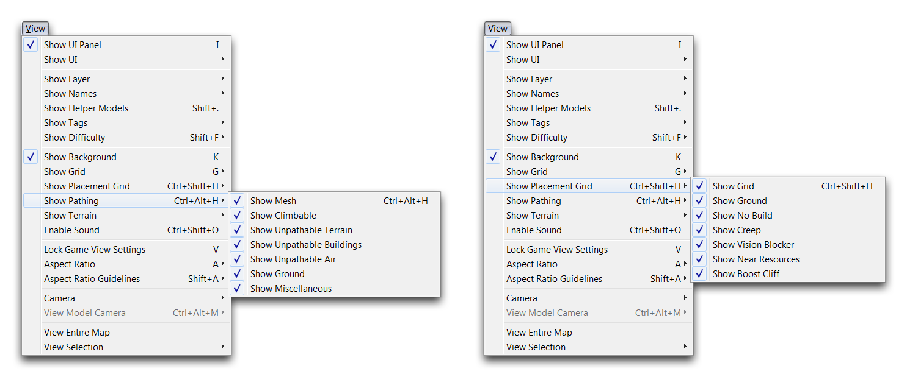
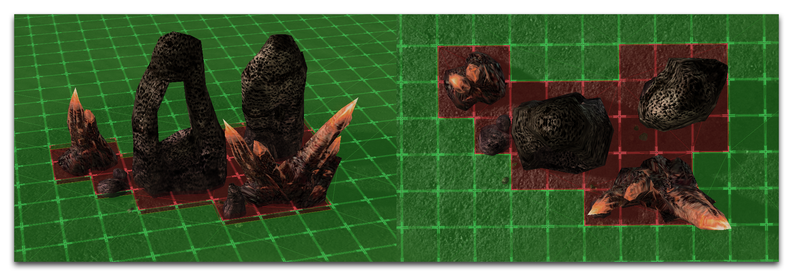
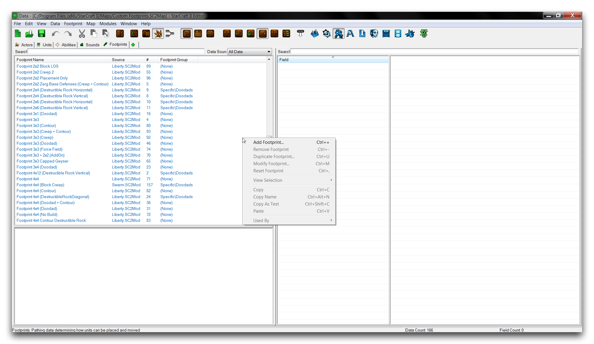
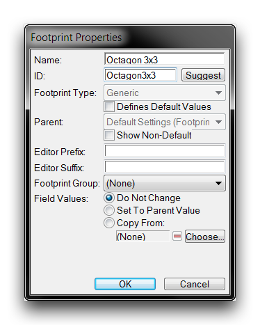
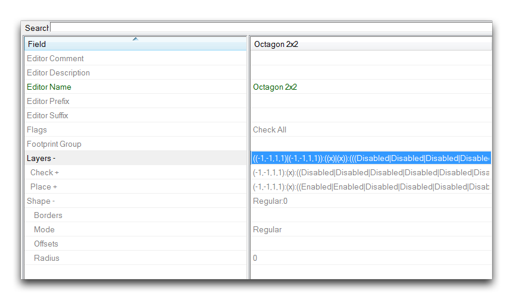
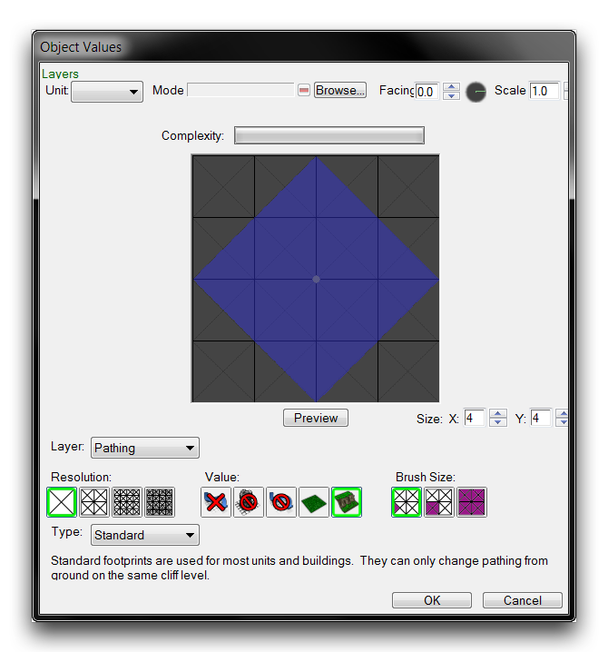
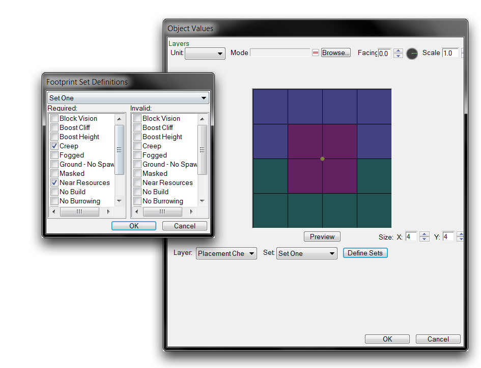

# 自定义足迹

编辑器提供了一系列经常被重新利用以创建新对象、演员和单位的足迹。尽管如此，了解如何创建自定义足迹仍然是有用的。这将允许您创建具有自定义形状和路径的足迹设计，用于非常具体的应用场景。

## 路径格网

足迹对地图的路径逻辑应用于地图单位。很难将StarCraft引擎的单位可视化，但幸运的是编辑器提供了一些实用工具来帮助您。首先，通过转到“视图 ▶︎ 显示路径”并选中每个类别来启用所有路径层可见性选项，如下所示。然后转到“视图 ▶︎ 显示放置格网”并启用所有选项。

*打开可见性选项*

现在您应该能够在编辑器中看到完整的路径格网。绿色表示可通行区域，而红色显示不可通行区域。格网中的方块每个代表一个1x1单位区域，与创建地图时使用的单位比例相同。这意味着96x96地图等同于96平方单位的单位格网比例。足迹必须遵守单位格网。这使得它非常有用于确定放置和理解特定自定义足迹的要求。您可以在下面的图像中看到这个格网。

*足迹格网可见性*

## 创建足迹

要创建一个足迹，首先切换到数据编辑器。如果“足迹”选项卡尚未打开，请通过转到+ ▶︎ 编辑游戏数据 ▶︎ 足迹来添加它。右键单击主数据视图，并选择“添加足迹”。这将呈现以下视图。

*在数据中添加足迹*

这将启动“足迹属性”窗口。在这个练习中，您将创建一个八角形的自定义足迹。在弹出窗口的“名称”字段中输入“八角形3x3”，点击“建议”生成ID，然后点击“确定”。

*足迹属性窗口*

一旦回到主数据编辑器视图，转到新创建的足迹的“层”字段，并双击以启动足迹编辑器。

*启动足迹编辑器*

## 足迹编辑器

*编辑器视图*

足迹编辑器提供了一个专用工具，用于创建足迹并控制它们的路径和放置逻辑。它有点偏门，但您可以从“足迹”数据类型的两个字段“层”和“形状”中访问它。选中这两个字段中的任何一个将启动相同的编辑器。这是因为足迹编辑器将单个足迹对象的数据从层和形状字段填充到自身。请注意，手动编辑足迹数据并避免使用此子编辑器仍然是一个选择。但是，由于足迹的可视化本质，使用足迹编辑器通常更直观。子编辑器的属性在下表中有详细说明。

| 属性       | 效果                                                                                                                                                                                                                                                                                                                                                           |
| ---------- | ---------------------------------------------------------------------------------------------------------------------------------------------------------------------------------------------------------------------------------------------------------------------------------------------------------------------------------------------------------------- |
| 大小       | 设置足迹的单位格网大小。                                                                                                                                                                                                                                                                                                                        |
| 值         | 选择要应用的路径类型。选项包括无、无建筑、不可通行地形、地面和悬崖。“无”设置是地图上所有单位的默认值。                                                                                                                                                                                  |
| 刷子大小   | 设置单元中的路径应用区域。设置包括三角形：1单元，子单元：4单元和单元：16单元。                                                                                                                                                                                                                                            |
| 分辨率     | 设置单个单位内可以通过的单元数。设置包括大型（每单元4个单元）、中等（每单元16个单元）、小型（每单元64个单元）和微小（每单元256个单元）。                                                                                                                                                              |
| 层         | 设置正在更改的逻辑层。选项包括路径、放置应用和放置检查。将在本文后面详细介绍这些内容。                                                                                                                                                                                                   |
| 单元       | 选择要测试足迹大小的预览模型。模型会列出单位路径，而“朝向”和“比例”允许您更改模型的属性。                                                                                                                                                                                                                 |
| 复杂度     | 足迹的性能成本的估计。增加分辨率、使用多种路径类型和创建不同几何图形是主要考虑因素。                                                                                                                                                                                                   |
| 类型       | 从标准、覆盖或持久性中选择足迹的主要行为。标准覆盖是最常见的，会改变相同高度的悬崖上的路径。覆盖足迹会改变非地面路径，很少使用。持久性足迹在游戏过程中无法移除，只能修改。它们通常与桥梁对象一起使用。 |

在子编辑器中，路径是分为三个单独的层：路径、放置应用和放置检查。路径允许确定路径的大小、形状和类型。这是地形编辑器的网格视图中可见的图层。值得一提的是，单元内支持多种路径类型。这并不是显而易见的，因为子编辑器只会显示第一个涂色。设计了一个路径足迹后，您可能会发现需要关闭编辑器并重新加载地图，才能在地形编辑器中显示任何更新后的足迹。

放置层“放置应用”和“放置检查”影响特定放置标志的应用。这两者都允许您设置四个不同层次的选项。放置应用会将这些选项应用到其足迹内的地图区域。放置检查要求选项存在于设置的区域中，否则拥有该足迹的对象将无法创建。请注意，为了将选项层绘制在足迹上，必须首先使用“定义集”进行设置。单击此按钮将启动“足迹集定义”窗口。请注意，确保使用窗口顶部的下拉菜单来选择正确的设置层。下面显示了这个层的典型视图。

*放置应用层和定义弹出窗口*