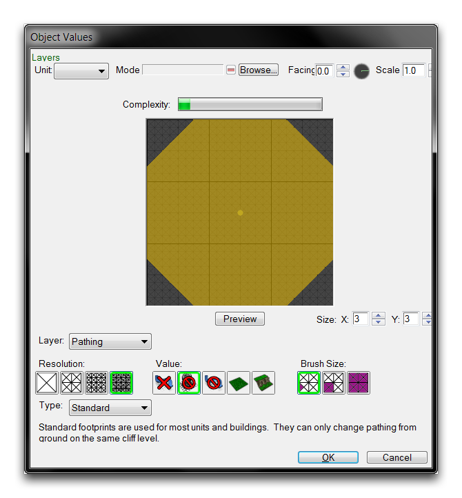
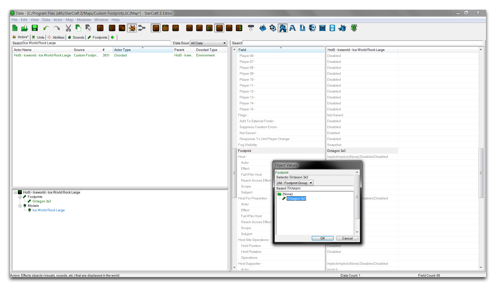
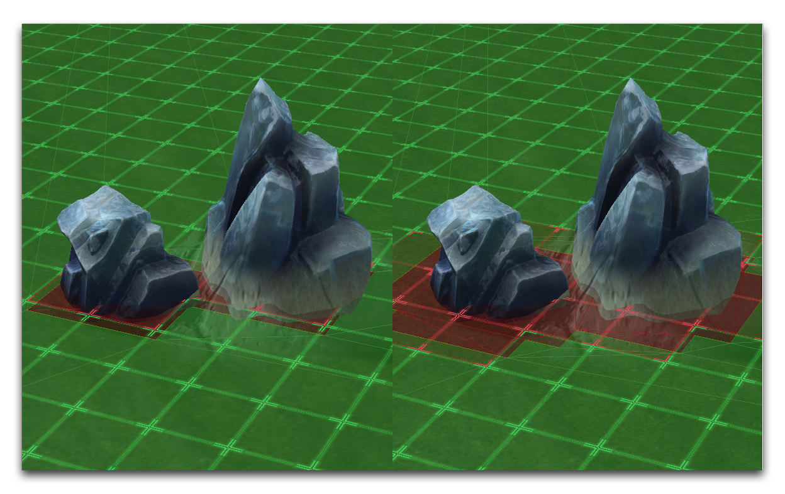

现在，返回到“八角形 3x3”的地形版图，并使用路径设置“禁止建筑物”和“无法通行的地形”来绘制一个八角形的地形版图。作为提示，您应该使用小分辨率并使三角形的切口基准长度为六个单元。结果应如下图片所示。

*六角形 3x3 地形版图*

## 将地形版图链接到对象

现在您已经创建了自定义地形版图，您将其放置在一个装饰物中进行测试。在数据编辑器中导航到角色选项卡，选择“冰世界大岩石”装饰物。突出显示“地形版图”字段，双击以打开“对象数值”窗口。找到您的“八角形 3x3”地形版图，选择它，然后点击“确定”。这应该让您获得以下结果。

*在数据中添加地形版图*

在地形编辑器中测试装饰物应该会得到一个更新的地形版图，与装饰物的默认方形 3x3 不同。在装饰物层中找到该装饰物，选择它，并将其放置在地图中进行调查。如果地形版图尚未更新或仍然为空白，请尝试关闭编辑器并重新启动。地形版图在其之前和之后的状态应如下所示。

*默认地形版图和自定义地形版图*