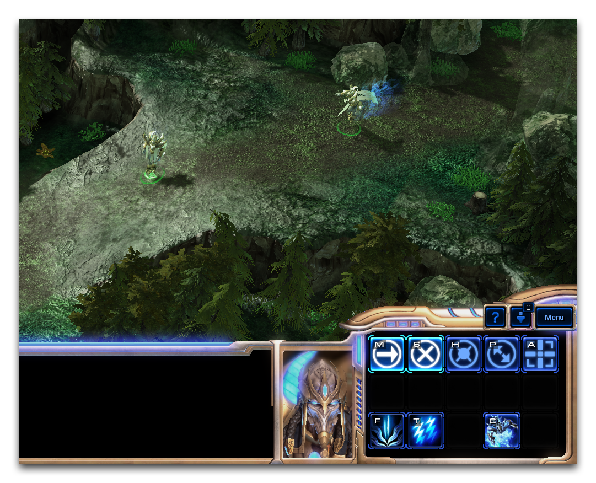
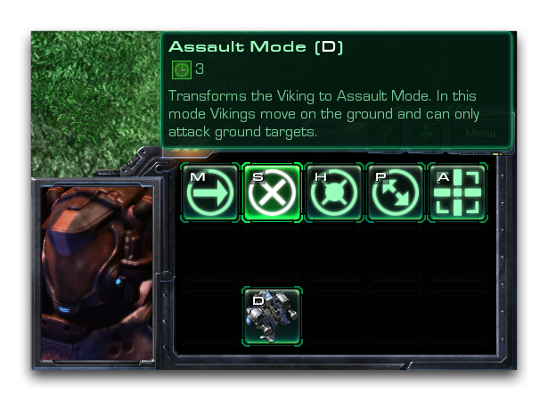
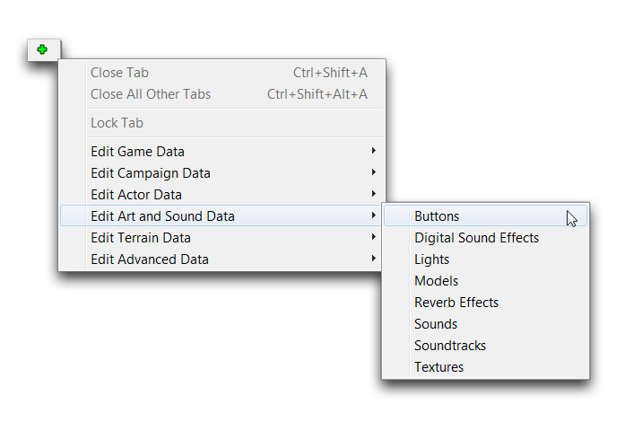
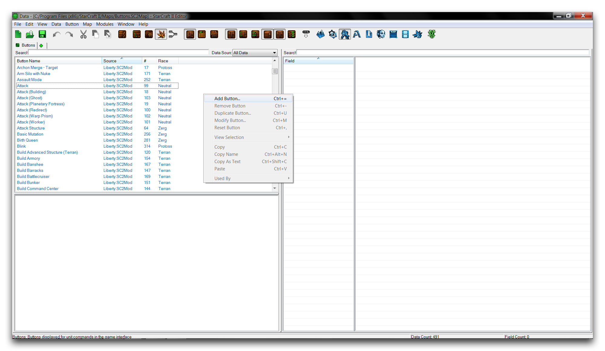
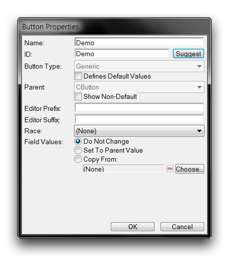
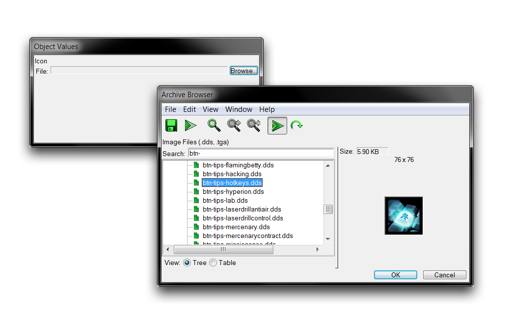
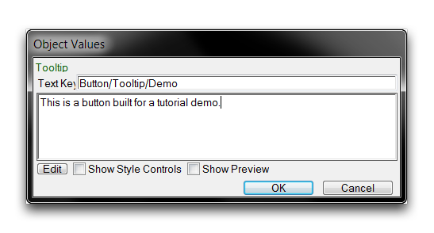
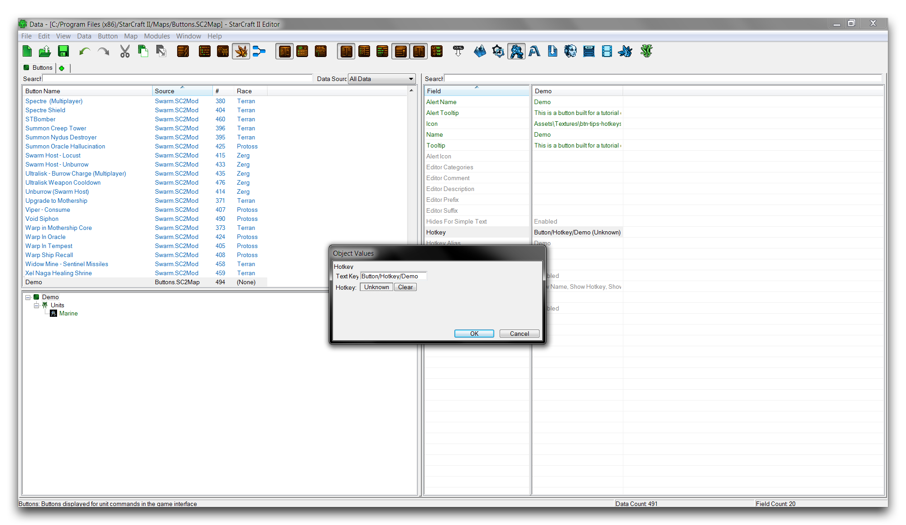
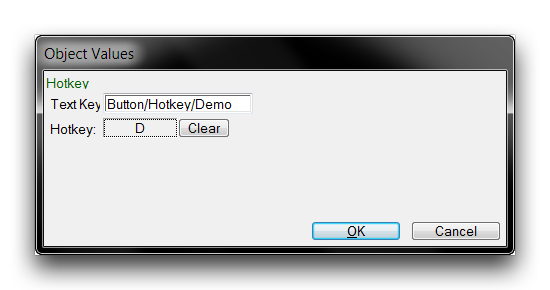

# 按钮

术语“按钮”在星际争霸中被广泛使用，用来指代任何可交互的界面元素，无论是菜单按钮、对话框还是可点击的任何内容。相反，在数据编辑器的背景下，该术语非常具体地指代一种艺术数据类型。这些按钮是指挥牌中能力的视觉元素，是玩家可以直接与之交互的用户界面部分。下面展示了一个充满按钮的圣堂指挥牌的典型视图。

*带按钮的神圣圣堂指挥牌*

这里有八个按钮在圣堂指挥牌上，包括“精神风暴”、“反馈”以及基本的控制元素，比如“移动”、“攻击”和“停止”。每个按钮都通过其指挥牌字段与单位相关联。这不仅决定了按钮的外观，还为界面内的使用设置了一些补充属性。

## 按钮数据字段

与引擎中多用途的各种按钮相比，按钮数据类型相当简单。下表列出了此类中包含的属性。

| 字段           | 详细信息                                                                                                                                                                                  |
| ------------- | ------------------------------------------------------------------------------------------------------------------------------------------------------------------------------------------ |
| 图标            | 设置按钮将被制作的纹理。通常使用编辑器中包含的一组特殊样式的 76x76 纹理集成员，其前缀为 btn- 来标识。                                                                               |
| 快捷键         | 设置一个键盘键，当按下时将自动触发按钮。在星际争霸中，快捷键几乎被普遍用于加快玩家输入速度。                                                                                            |
| 工具提示        | 设置鼠标悬停在按钮上时显示的文本。                                                                                                                                                    |
| 名称           | 设置鼠标悬停在按钮上时显示的名称。                                                                                                                                                    |
| 按种族着色     | 根据种族选择对按钮覆盖色彩。各种族的彩色如下：异虫 - 橘色、人类 - 绿色、智慧种族 - 蓝色。                                                                                                     |
| 通用           | 将按钮及其快捷键添加到每个单位。通常仅用于基本单位动作，如“移动”、“攻击”、“停止”、“取消”等。                                                                                           |
| 警报图标        | 警报面板可以使用按钮类型向玩家推送警告或教学信息。这会设置由此按钮能力发送的图标。                                                                                                      |
| 警报工具提示     | 类似于“警报图标”，但提供警报的鼠标提示。                                                                                                                                             |
| 警报名称        | 类似于“警报图标”，但为警报设置名称。                                                                                                                                                 |
| 种族           | 设置按钮的种族属性，以便组织目的。                                                                                                                                                    |

将鼠标闲置在按钮上将显示一个对话框，其中包含其工具提示和名称，以及与连接能力相关的时间。下面展示了这个对话框。

*按钮鼠标悬停工具提示和名称*

## 创建一个按钮

打开数据编辑器，切换到按钮选项卡。如果尚未打开，可以通过 + ▶︎ 编辑艺术与声音数据 ▶︎ 按钮 导航到那里，如下所示。

*导航至数据中的按钮*

通过在主窗口中右键单击并选择“添加按钮”来创建一个新按钮。

*创建一个新按钮*

这将启动“按钮属性”窗口。在那里，您可以设置新按钮的“名称”，然后单击“建议”以生成一个ID。请注意，通常按钮的命名是根据其代表的能力而不是作为按钮本身来命名的。因此，选择像“攻击”或“瘟疫”这样的名称，而不是“攻击按钮”或“瘟疫按钮”。下面展示了典型的创建屏幕，填写了名称“Demo”。

*完成的按钮创建屏幕*

## 设置按钮图标

您需要设置的主要按钮字段是图标字段。这将确定要转换为按钮的纹理。突出显示“图标”字段，双击以启动“对象值”窗口。在这里点击“浏览”将启动归档浏览器。在浏览器内，您可以选择任何纹理用作按钮，但标准的是 76x76 大小并带有文件类型 .dds。您可以通过使用前缀 btn- 进行搜索，找到许多这些纹理的集合，如下所示。

*使用归档浏览器选择图标*

在此演示中，已选择了纹理 btn-tips-hotkeys.dds。请注意，这些纹理缺乏游戏内按钮通常具有的彩色边框。这是因为引擎通过覆盖边框并使用“按种族着色”字段对其进行着色。您可以通过搜索前缀 btn-border 查看纹理内的各种边框类型。

## 设置按钮工具提示

为了向玩家提供有用信息，按钮通常配有一个工具提示，在鼠标悬停在按钮上时游戏将显示该文本。为创建该文本，请转到“工具提示”字段，双击以打开“对象值”编辑窗口。

在本演示中，已输入了包含消息“这是为教程演示而构建的按钮”的样本文本。此时，通常还会使用相同步骤为警报工具提示字段设置相同内容。

## 设置按钮快捷键

对许多玩家来说，按钮很少以所谓的“标准”方式单击。它们通常通过它们的快捷键进行交互。快捷键设置了对应于玩家键盘按键直接按下而自动“按下”目标按钮的安排。这是为了速度而构建的安排，但一些玩家更喜欢它以简单的便利性。

尽管这些快捷键可以由玩家通过游戏的“快捷键”部分决定，但基础快捷键是通过数据设置的。要这样做，请转到数据编辑器中的“快捷键”字段并双击。这将启动一个“对象值”窗口，呈现下列视图。

*未分配快捷键*

从这里，您可以通过单击“快捷键”框内部，在当前未知值的地方，来设置快捷键。这将使当前快捷键值变为红色，并允许键盘输入。此时按键将把它设置为快捷键。在本说明中，按下了 D 键，得到了以下结果。

*已分配快捷键*