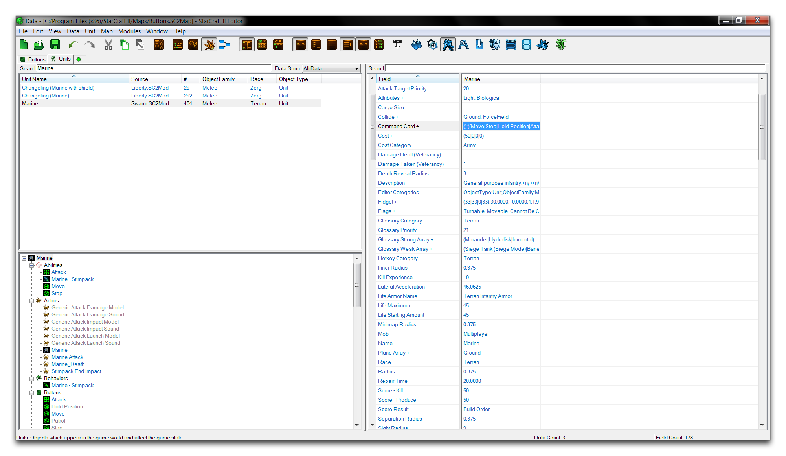
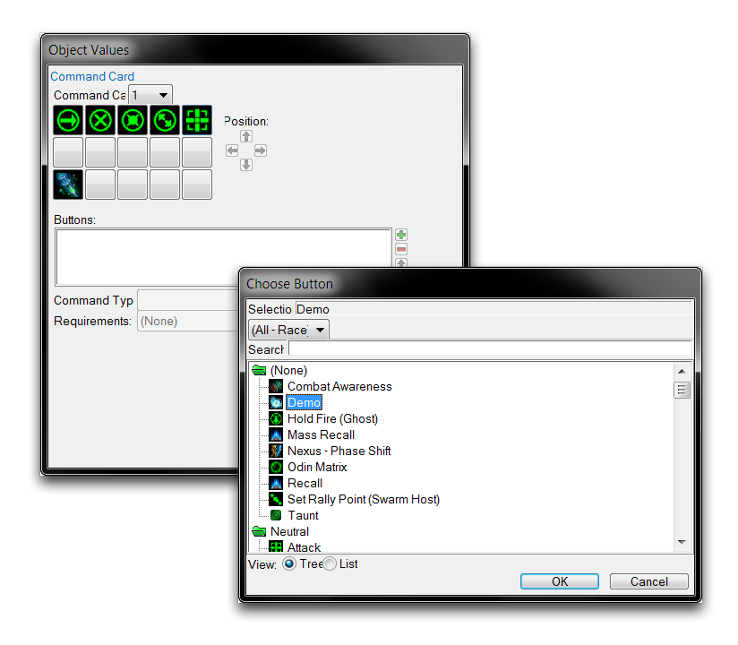
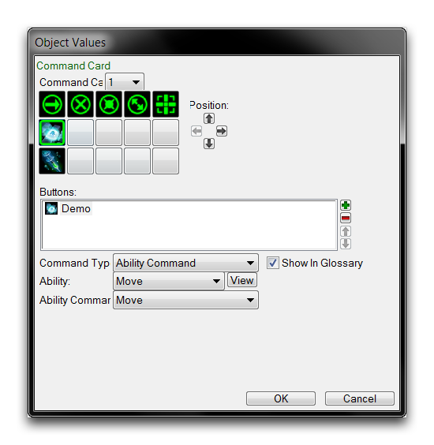
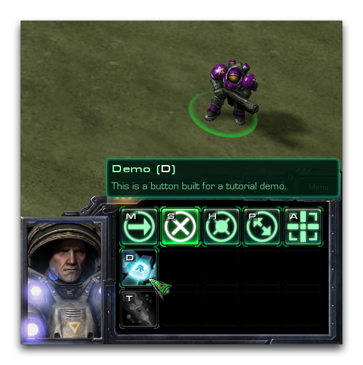

点击此处的“确定”将保存热键并返回到主编辑器视图。

## 为单位添加按钮

按钮专门设计用于插入到单位的命令卡中。在此练习中，您将把演示按钮插入到预先存在的单位中。为此，请通过+ ▶︎ 编辑游戏数据 ▶︎ 单位 转到单位选项卡。任何单位都可以在此处使用，但在此示例中请选择“陆战队员”单位。然后按下面所示选择其“命令卡”字段。

*命令卡字段*

双击字段将打开一个用于配置单位命令卡的子编辑器视图。您可以通过导航到命令卡中的一个未占用槽并单击绿色+ 来添加一个新按钮。这将打开一个名为“选择按钮”的窗口。在该窗口中，选择要添加到命令卡的“演示”按钮。此过程如下所示。

*将按钮添加到命令卡*

点击“确定”以将按钮添加到命令卡。现在您需要将一个能力链接到按钮，以便它能够正常运行并在游戏中显示。在命令卡子编辑器中选择新按钮，将其“命令类型”设置为“能力命令”，将其“能力”设置为“移动”，然后将其“能力命令”设置为“移动”。这将给您以下视图。

*已链接的完成按钮*

从这里，您可以点击“确定”完成按钮。在此演示中，“移动”能力被用作单位上通常至少是非传统技能，甚至是完全自定义能力的替代品。就本演示的目的而言，能力本身并不是最重要的。您的按钮现在应该在命令卡中可见。您可以通过使用“测试文档”启动地图并检查来确认此情况。

这样做应给您一个如下所示的结果。

*游戏中的自定义按钮*

## 附件

- [075_Buttons.SC2Map](./maps/075_Buttons.SC2Map)