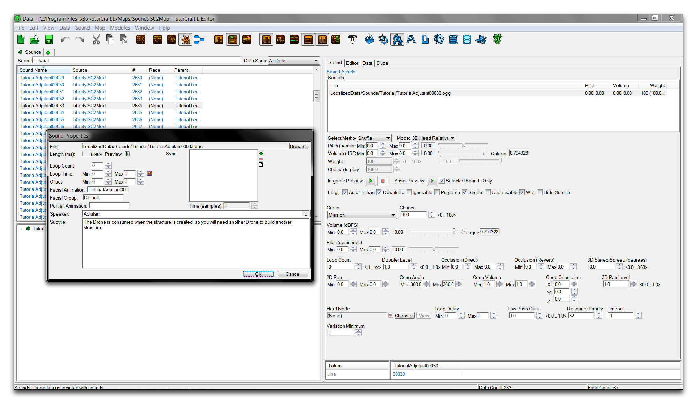
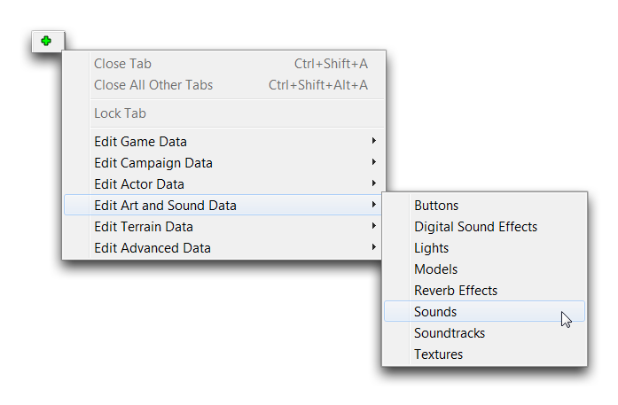
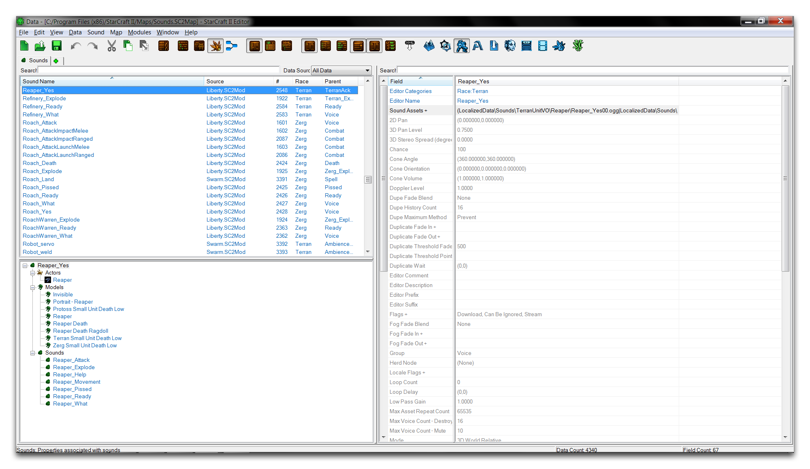
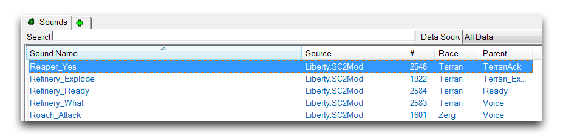
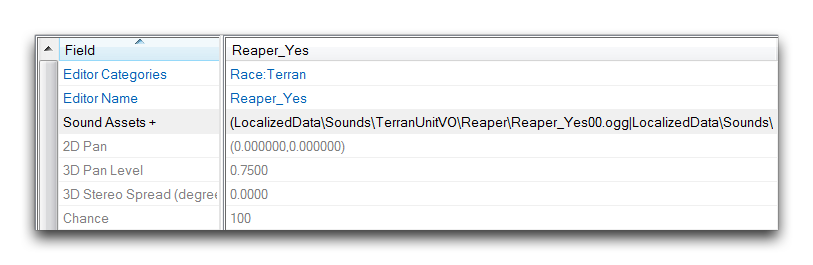
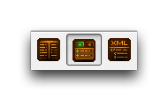
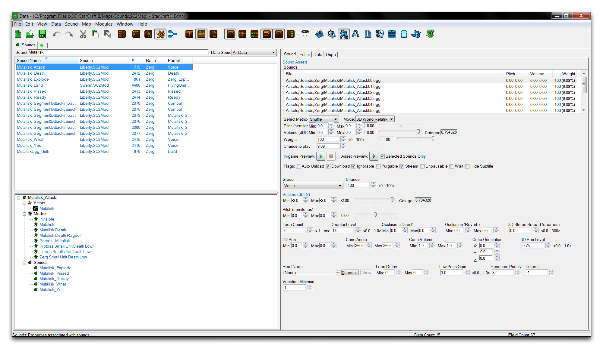
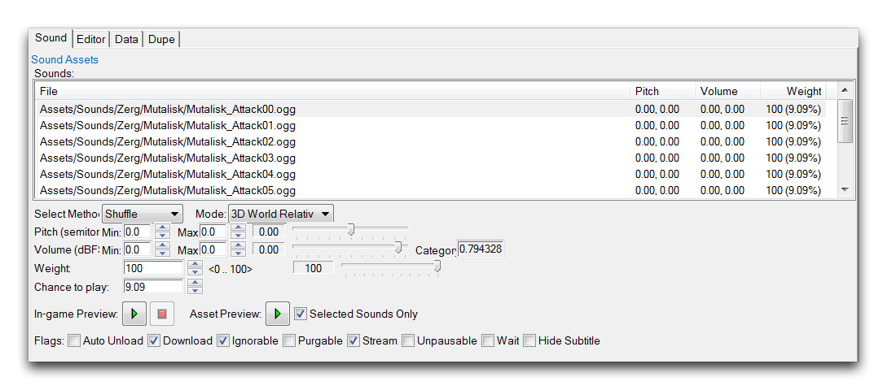
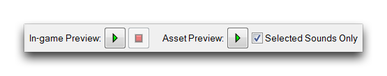

# 声音

声音是编辑器的主要音频数据类型。它可以代表单个文件或音频文件集合，并且几乎每种听得到的声音类型都源自它。例如音乐、音效、单位配音和叙事对话等内容在游戏中都被存储为声音类型。这种类型是一个基本资产单元，它从数据或导入中获取原始文件并对其进行配置，准备好播放。然后这些声音资产通过声音执行器或直接通过触发器操作被合并到游戏中。您可以在下面的数据编辑器中看到声音被操纵的典型视图。

*声音数据视图*

## 在数据编辑器中查找声音

作为数据类型，声音通过数据编辑器处理。一旦进入此模块，您可以通过选择绿色的 + 并导航到编辑艺术和声音数据 ▶︎ 声音来打开声音选项卡，如下所示。

*导航到声音数据*

您应该注意，声音与数据类型“音轨”不同。音轨类型主要设计用于游戏中的环境音乐和电影配乐。打开声音数据选项卡将呈现以下视图。

*声音数据列表*

## 声音类别

声音选项卡的组织方式与数据编辑器中的任何其他数据类型选项卡相同。它被分为两部分，左侧是当前数据范围中的每个声音的列表，右侧提供当前所选声音的详细视图，显示了所有可供查看的字段。声音列表如下所示。

*声音类别视图*

声音选项卡按照五个类别进行组织，如下表所述。

| 字段       | 详细信息                                                    |
| ---------- | ----------------------------------------------------------- |
| 声音名称   | 声音对象的名称。                                            |
| 来源       | 声音对象所在的数据来源。                                    |
| \#         | 声音对象在当前范围中的索引。                                |
| 种族       | 与声音对象相关联的一个种族。                                |
| 父级       | 声音对象的模板基础。                                        |

声音名称通常以前缀和后缀的形式Unit\_SoundType。这使得列表可以进一步根据单位和每个单位所需的声音类型进行细分。上面列出的一些示例是Refinery\_Explode、Refinery\_Ready和Refinery\_What。这三种声音分别与炼油厂单位关联，并且用于触发声音的三种状态。

## 声音详细视图

编辑器中声音字段的基本视图如下。

*声音字段*

在这里，类型被分解为各种属性字段和“声音资产”字段，其中包含基本声音文件链接。这些声音资产以.ogg和.wav两种格式带入编辑器。.ogg格式占大部分声音。进入编辑器后，这些资产必须通过“声音资产”字段制作为声音，然后才能在游戏中使用。

除了说明这一点，声音字段的基本视图并没有提供太多信息。由于每种声音类型可以打包多个文件，因此为该数据编辑器选项卡设计了一个更加详细的视图。您可以通过使用数据栏将数据编辑器切换为“详细视图”来访问它。该按钮如下所示。

*详细视图按钮*

设置详细视图后，突出显示声音选项卡中的一个声音应该呈现如下视图，后文将称之为声音编辑器。

*声音编辑器视图*

## 声音编辑器

增强的声音编辑器视图为您提供了对声音数据类型更加有用的查看。请注意编辑器顶部的“声音资产”框，如下图所示。

*声音资产特写*

这里最顶部的框显示了声音的“声音资产”字段的内容。如前所述，这可以包含一个或多个原始声音文件，本例中为.ogg。您还会在此视图中找到每个资产的单独Pitch、Volume和Weight值。下方是设置这些值的各项控件，以及一些支持选项。以下是这些信息的具体说明。

| 字段            | 详细信息                                                                                                                                                                                                                                             |
| -------------- | --------------------------------------------------------------------------------------------------------------------------------------------------------------------------------------------------------------------------------------------- |
| 选择方法      | 选择播放声音资产预览的顺序或随机播放方式。多数游戏中的声音使用随机播放以产生各种回应噪音。一个显着的例外是每个单位的\_Pissed系列声音，其使用顺序播放。 |
| 模式              | 选择播放模式为2D或3D声音。                                                                                                                                                                                                   |
| 音调               | 使用滑块设置原始声音的音调变化。                                                                                                                                                                                    |
| 音量            | 使用滑块设置原始声音的音量变化。                                                                                                                                                                                   |
| Weight          | 设置一个从0到100的值，确定播放机会。                                                                                                                                                                                 |
| 播放机会     | 该声音资产的权重除以该声音内所有声音资产的总权重。这将得出每次使用对象时播放该声音的百分比机会。                                                                                             |

阅读以上属性时，您可能已经猜到，由多个声音资产组成的声音将在每次在游戏中使用时随机播放其中的一个组件声音文件。随机机会取决于每个资产的Weight，并恰好被表达为播放机会。

在编辑器此部分的底部，您将找到可在任何声音内配置的八个标志。这些标志提供了对声音的组织属性的额外修改，包括其文件处理、流状态和暂停能力。

## 播放控制

声音编辑器最重要的特性之一是其用于音频预览和编辑的一组预览控制。如下所示。

*播放控制界面*