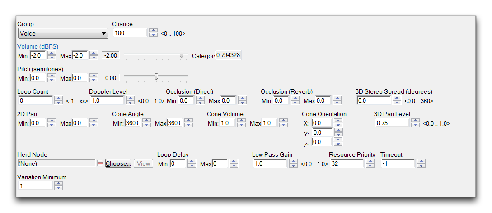
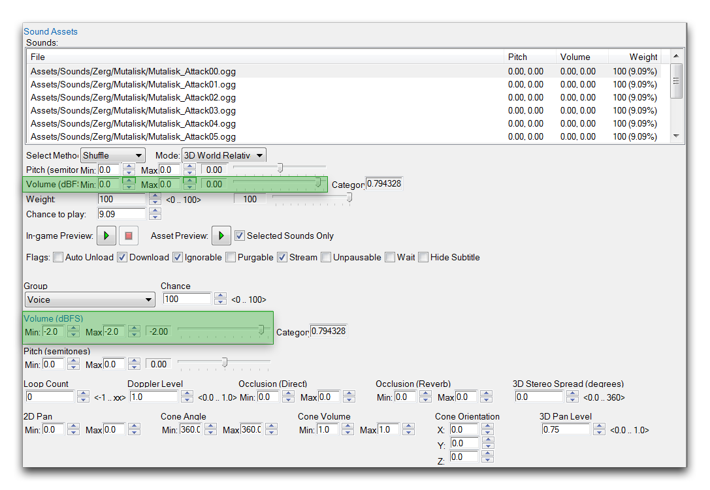
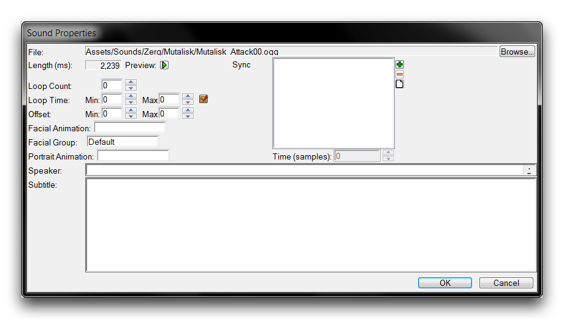
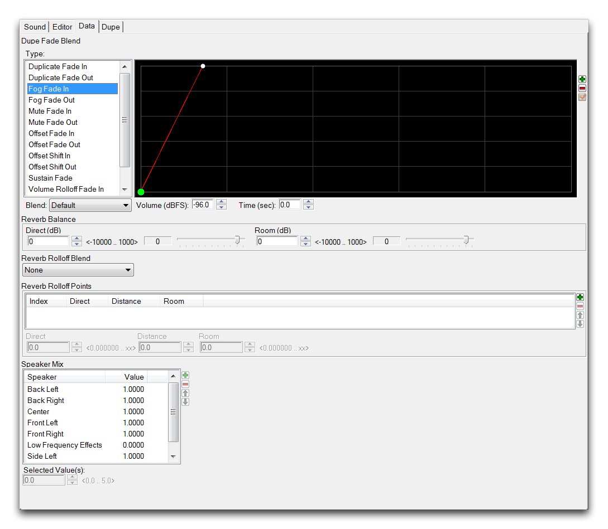

这些控件允许您通过“Asset Preview”按钮听取原始声音，同时还可以通过“In-game Preview”按钮测试修改后的声音。在使用导入的声音资产时，同时拥有这两个功能非常重要。如果没有这样的功能，要为制作自定义资产的正确音量平衡或效果控件而努力寻找，将会非常繁琐。

## 声音组音量控制

声音编辑器的另一部分让您可以设置组音量控制的功能。这些控件如下所示。

*声音组音量控制*

声音组通过允许您将单独的声音资产添加到特定频道，为声音属性提供了额外级别的控制。然后，可以通过与预览控件实验来最好地演示和理解所提供的广泛声音选项。下面您可以看到一个表格，显示了可供使用的许多频道。

| 警报    | 对话       | 场景构建          | 战斗       |
| -------- | ----------- | -------------- | ---------- |
| 死亡    | 对话    | 点缀          | 火焰     |
| 植被  | 收集      | 主要效果 | 任务   |
| 运动 | 电影       | 音乐          | 其他      |
| 准备    | 设定环境音 | 设置发射器   | 设置片段 |

这里值得注意的是声音频道可能会受到玩家个人设置的影响。例如，如果玩家已关闭音乐，他们将听不到任何在音乐频道中的声音。

在声音编辑器中找到的广泛控件的一个后果是组声音控件和单独声音选项之间的普遍混淆。下面的图像应帮助您避免这种混淆。

*单独和组音量控制*

用于设置每个声音资产音量的单独音量控制位于上方突出显示的框中。下方突出显示的框允许您为每个频道设置声音修改。

## 声音属性

从“声音资产”框中选择任何单个文件并双击它，将会打开一个名为“声音属性”的新窗口，如下所示。

*声音属性视图*

在这里您将找到许多重要的第二级别控件，涉及声音资产何时以及如何播放。循环次数控制在游戏中使用时特定资产将播放多少次。通常，大多数声音不需要连续播放多次，但也有例外情况。

值得注意的是，在游戏过程中，音乐文件通常设置为循环播放。为了获得这种特定行为，将循环次数设置为-1。通过设置循环时间，可以为循环播放设置一个随机的最小和最大长度。偏移将在其最小和最大之间应用随机偏移以播放声音文件。扬声器和动画控件针对叙事对话进行了配置。它们允许您为一段预先录制的音频标记信息和细节，这些信息在设置故事型活动或电影时可能会有用。

## 声音编辑器数据视图

如果您查看声音编辑器的顶部选项卡，您将在数据选项卡下找到另一组有用选项。这些选项如下所示。

*声音编辑器数据选项卡*

这些控件允许您设置每个声音的扬声器中心化音量属性。由于选项众多，您了解如何使用此面板的最佳方式是通过实验使用播放控件。