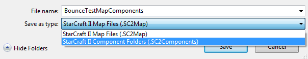
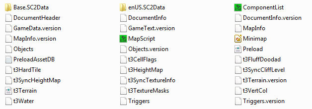
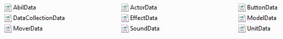
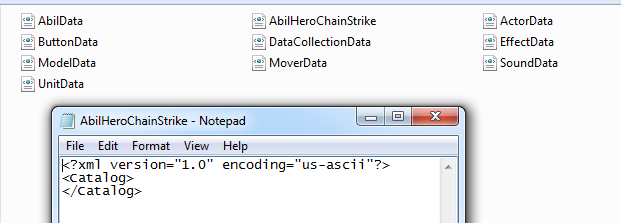
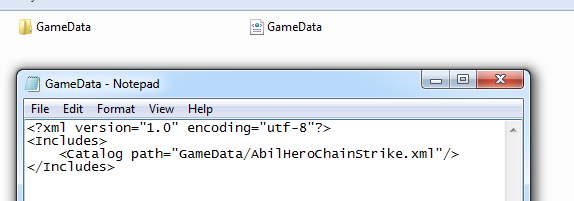
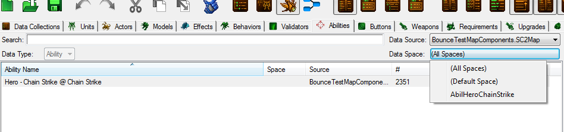
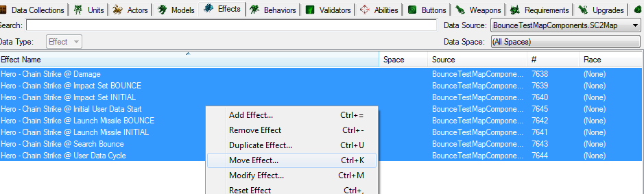
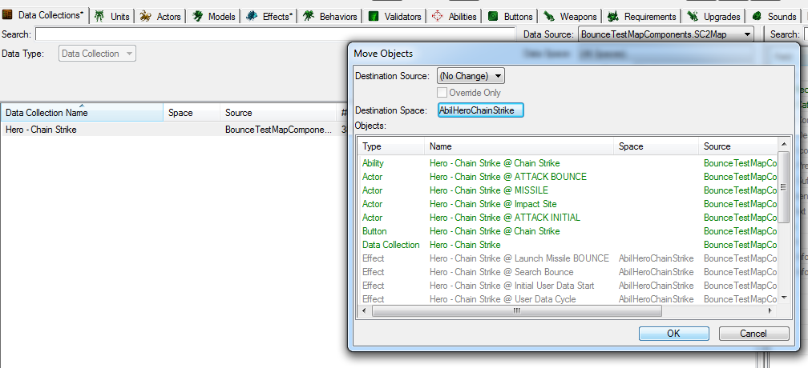
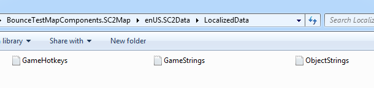

# 数据空间

将相关数据聚合到一个单一文件中，以便可以以有组织且耗时最少的方式将其复制到其他地图中。

本教程假设您从未见过 .xml 文件，并只想在提到任何复杂内容时翻转桌子。

## 步骤 1. 将地图保存为组件

文件->另存为->选择另存为 .SC2Components，而不是通常的 .SC2map 文件。



然后找到新创建的地图文件夹，进入 `Base.SC2Data` -> `GameData`文件夹



将地图保存为组件可以让您了解地图由什么组成。在 `Base.SC2Data` -> `GameData` 文件夹中，您可以查看所做的数据编辑。



您可以通过将两个地图都保存为组件，然后复制粘贴这些 xml 文件来轻松地从一个地图复制粘贴所有数据到另一个地图。

## 步骤 2. 创建一个数据空间

在这里，我们将通过它们的类别分开的数据编辑 - 单位、演员、效果、行为等。

我们将创建一个单一的 .xml 文件，其中将存储所有相关数据（而不是分散在多个不同的文件中）。

您可以创建新的，或者只是复制粘贴任何 xml 文件，将其重命名为您希望称呼数据空间的名称，打开它，擦除里面的所有内容，并复制粘贴

```xml
<?xml version="1.0" encoding="us-ascii"?>
<Catalog>
</Catalog>
```




## 步骤 3. 让编辑器看到数据空间

我们需要在 `Base.SC2Data` 文件夹中创建一个名为 `GameData` 的新 xml 文件（以与我们在步骤 2 中创建先前的 xml 文件相同的方式创建它）。复制粘贴以下内容，除了在目录路径中指定我们数据空间文件的名称。

```xml
<?xml version="1.0" encoding="utf-8"?>
<Includes>
    <Catalog path="GameData/AbilHeroChainStrike.xml"/>
</Includes>
```



## 步骤 4. 将数据转移到数据空间

现在一切都已经准备就绪。加载地图后，我们可以看到数据空间菜单现在有了我们制作的数据空间。



选择要移动到数据空间的数据条目，右键单击它们，然后选择“移动...”。



!!! 信息

    如果您正在使用数据集合功能，移动数据集合也将移动其包含的所有元素。



移动完所有内容后，保存地图并检查数据空间。您会发现您在编辑器中移动的所有信息现在方便地驻留在那一个文件中。它现在可以轻松共享。

要将其导入到新地图或模组中，我们需要将该地图/模组另存为组件，将我们的数据空间文件移动到 `\Base.SC2Data\GameData` 文件夹中，并像在步骤 3 中所做的那样创建/添加目录路径到 GameData.xml 文件。

## 步骤 5. 一切都为“(未知)”和“(未命名)”

原来文本是分开存储的。如果将数据空间添加到不同的地图或模组中，我们会发现所有描述和数据字段名称都消失/混乱了。因为除了英语之外，还有许多其他语言的游戏客户端，所有显示给用户的文本都是单独存储的。在地图的组件文件夹中，您可以找到本地化文件夹，在我的情况下是 `enUS.SC2Data`。它存储了包含数据条目文本的文本文件。我们将不得不手动添加/合并我们导入数据空间的地图的本地化文件的相关数据。



## 示例地图

* [BounceTestMap.SC2Map](./data-spaces/BounceTestMap.SC2Map)

**附加链接**

- Mapster 的 Github 教程链接： <https://sc2mapster.github.io/mkdocs/data/>