# 字体样式

字体样式允许您更改文本的基本展示方式。字体样式不需要特别复杂或奇特。它们代表了与游戏默认文本有所区别的任何字体调整。

## 创建字体样式

创建字体样式使您可以使用标准依赖项之外的字体资源。您可以使用任何现有或导入的字体来设置样式，但在本练习中，您将使用OpenSans的免费字体样本。首先，使用导入器导入字体。您可以通过模块▶︎导入进入。在那里，右键单击白色框内，选择“导入文件”，然后定位字体文件，可以是.ttf或.otf，然后点击“确定”。导入后保存项目应该会显示如下内容。

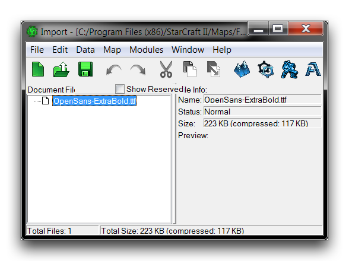
*导入的字体*

字体样式本身是通过文本编辑器创建的。要构建字体样式，请通过模块▶︎文本导航到那里。移至‘字体样式’标题处，在主列表中右键单击。选择‘添加样式’开始，如下所示。

[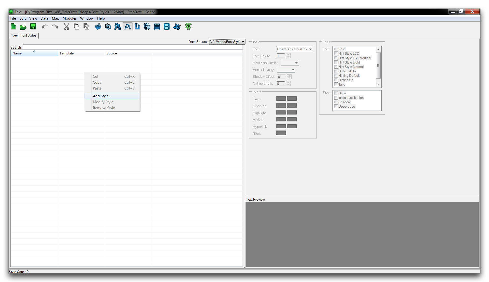](./resources/078_Font_Styles2.png)
*添加字体样式*

在‘样式属性’弹出中，将‘名称’设置为‘OpenSans18’。这表示字体类型及其打算大小。

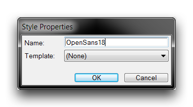
*样式命名*

创建完字体样式后，您可以使用文本编辑器右侧的面板对其进行配置。在这种情况下，将字体高度设置为18，水平对齐到左侧，垂直对齐到中间。将文本颜色设置为白色。设置栏位应如下所示。

[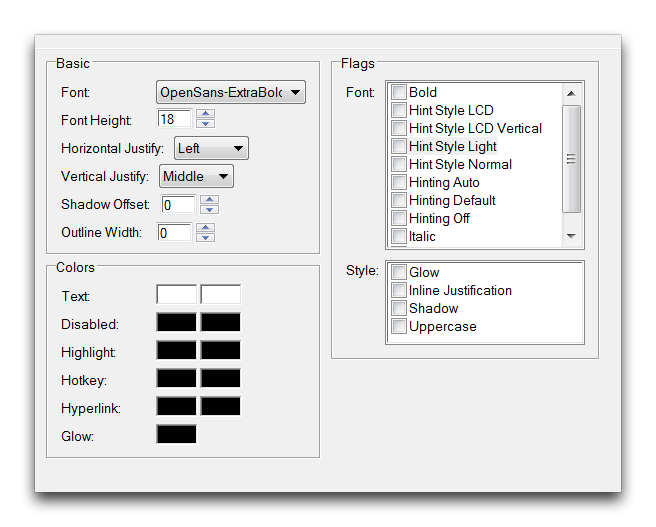](./resources/078_Font_Styles4.png)
*配置的OpenSans18样式*

转向“文本预览”以了解样式的效果。正确设置上述选项后，应如下图所示。

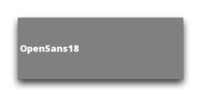
*OpenSans18样式预览*

## 从模板创建字体样式

从这里，您可以使用‘OpenSans18’样式作为模板创建更多字体样式。这将把子样式的所有字段设置为其父样式的字段。这个选项是一个有用的时间节省器，您可以使用它来构建一系列具有一定一致性的样式。

通过导航到文本编辑器中的‘添加字体样式’来从模板创建新的字体样式。将样式命名为‘OpenSans48’，然后设置其‘模板’为‘OpenSans18’，如下所示。

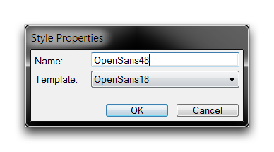
*从模板创建样式*

将此样式的字体高度设置为48，然后选中阴影标志并设置阴影偏移为2。添加4的轮廓宽度，然后将两个颜色选项设置为(R175，G237，B230)和(R133，G220，B139)。或者，您可以选择尝试一下现在字体的外观。这将使您得到如下所示的样式面板。

[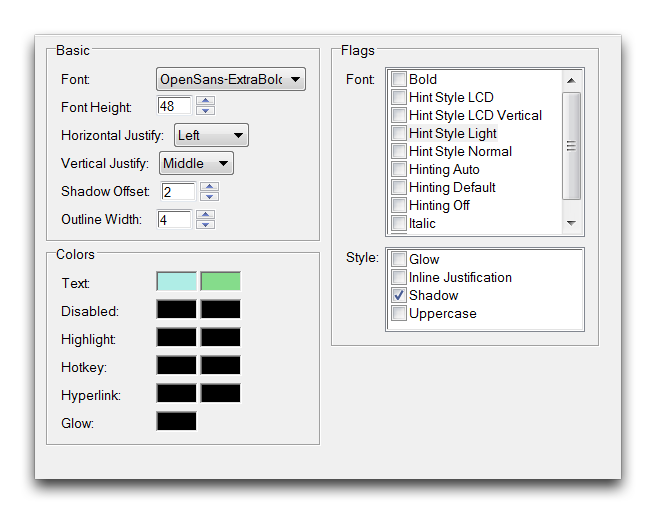](./resources/078_Font_Styles7.png)
*已配置的OpenSans48样式*

预览现在将显示一个更加醒目的字体，如下图所示。

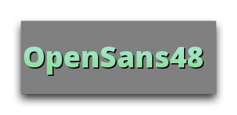
*OpenSans48样式预览*

## 应用字体样式

创建后，您可以在编辑器中任何可以编辑文本的地方应用字体样式。文本编辑器是更改项目中任何文本的内容或字体样式的自上而下解决方案。导航到‘文本’选项卡将显示所有项目文本的列表。如下图所示。

[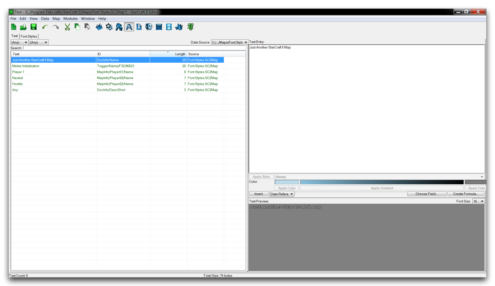](./resources/078_Font_Styles9.png)
*文本编辑器主视图*

突出显示文本实例将会将其详细信息推送到屏幕右侧，其中包含三个子面板，文本输入、文本控件和文本预览。

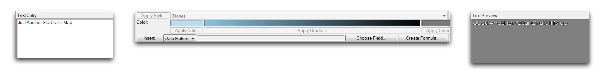
*文本输入 -- 文本控件 -- 文本预览*

您可以通过从‘应用样式’下拉菜单中选择样式来将样式应用到突出显示的文本片段。

[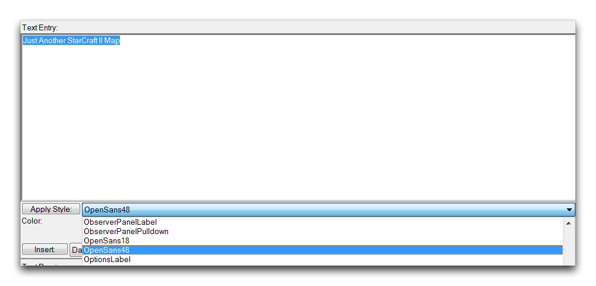](./resources/078_Font_Styles11.png)
*选择应用样式*

单击‘应用样式’按钮将通过在文本输入周围附加样式标签来完成该操作。样式标签将在原始文本之前带有\<s值='样式名称"\>，在其后跟随\</s\>。这些元素指示游戏在运行时更改包含的文本的样式。现在，您可以从文本预览面板预览文本输出。

[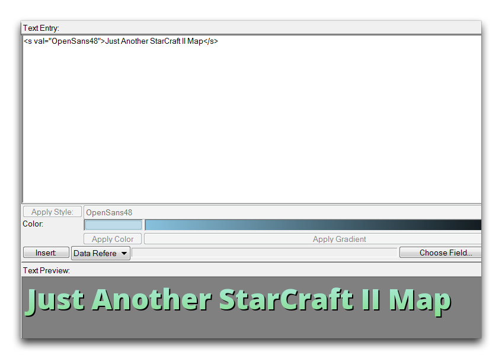](./resources/078_Font_Styles12.png)
*应用字体样式的文本*

或者，您可以在填充触发器编辑器中的任何文本字段时样式文本。选择文本字段并导航到‘值’源，将会弹出另一个类似文本编辑器的编辑器。

[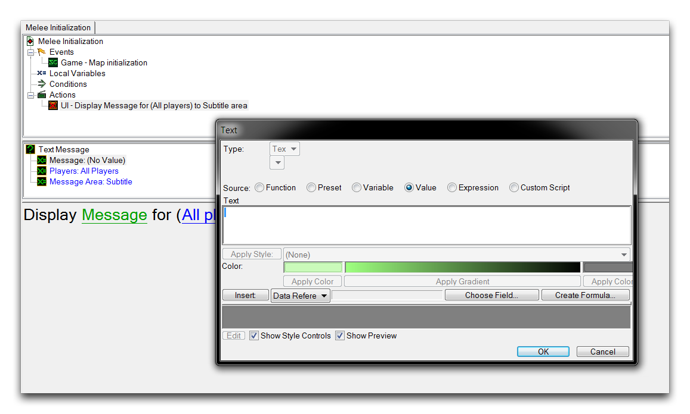](./resources/078_Font_Styles13.png)
*样式化文本字段*

与前述相同，突出显示任何已输入的文本以解锁文本控件。使用‘应用样式’下拉菜单选择样式，然后单击按钮本身来为文本添加样式。此过程的结果如下图所示。

[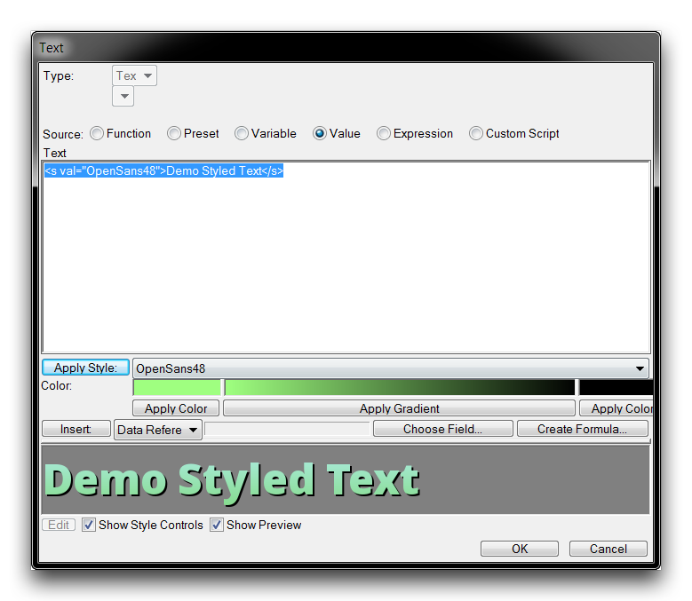](./resources/078_Font_Styles14.png)
*触发器编辑器中的样式文本*

在这种情况下，您可以通过启动地图来测试更新后的文本。下图显示了游戏视图中样式文本的标准示例。

[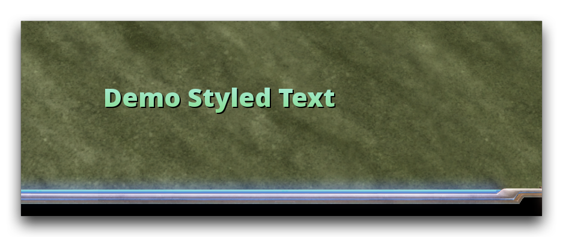](./resources/078_Font_Styles15.png)
*游戏视图中的样式文本*

## 附件

 * [078_Font_Styles.SC2Map](./maps/078_Font_Styles.SC2Map)