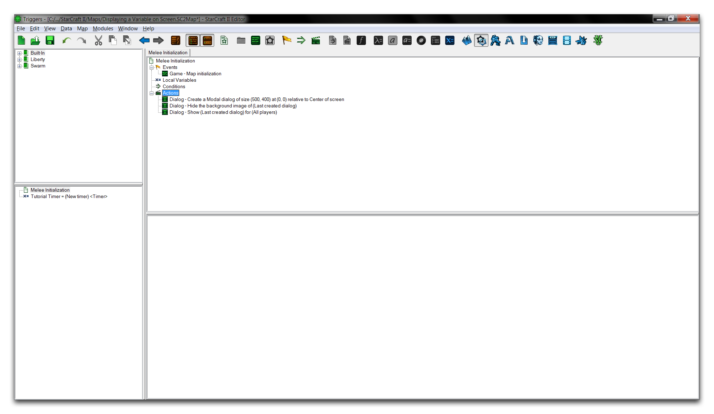
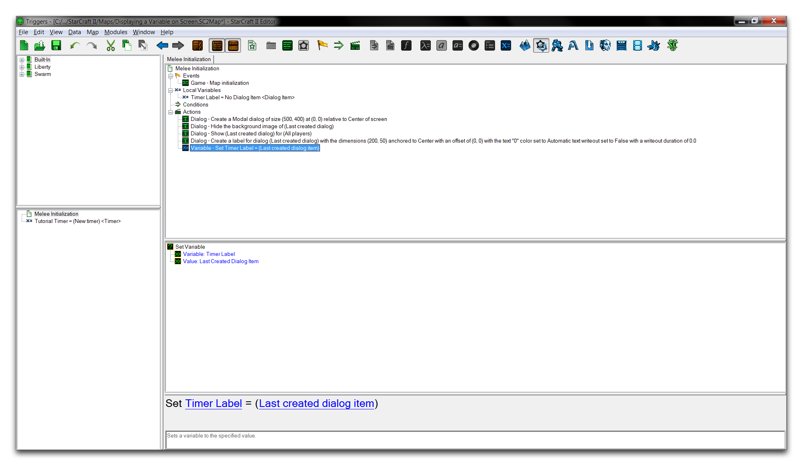
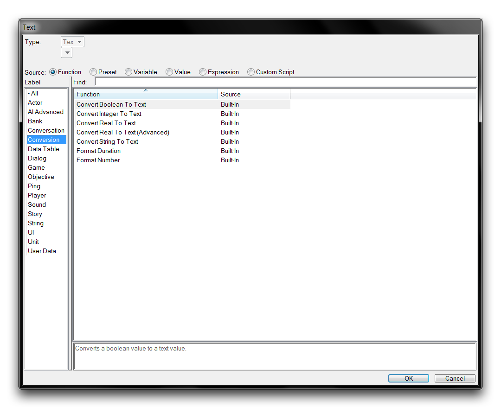
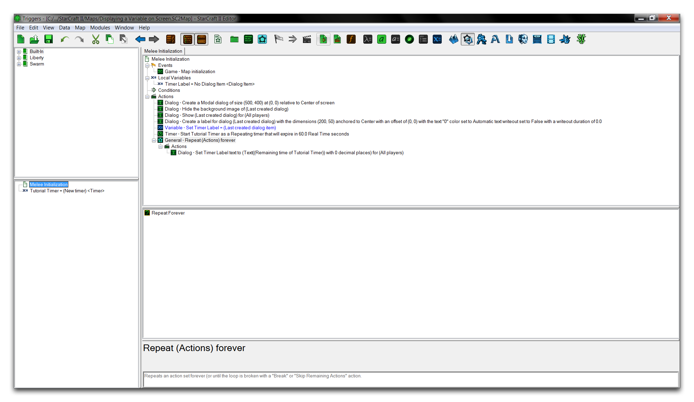
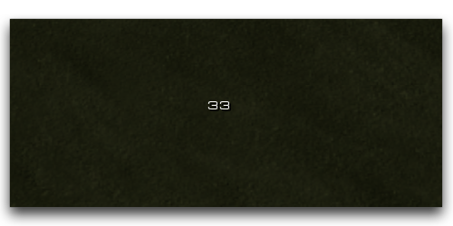

# 将变量显示在屏幕上

直接从触发器编辑器输出变量到屏幕空间可能非常有用。您可以将其用作快速诊断点检技术，用于测试新功能，或直接作为简单用户界面的一部分传达信息。

这个练习将向您展示如何构建一个基本的倒计时器，一种类型的变量，它将显示在屏幕上。

## 创建对话框

使用这种方法，倒计时器将使用对话框显示在屏幕上。您将首先组装这个对话框和要显示在其中的变量。创建一个新文档，然后在任何地形类型上开始创建一个近战地图。移动到触发模块，选择“近战初始化”触发器。删除此触发器中的默认动作。创建一个类型为计时器的全局变量，然后命名为“教程计时器”。接下来，添加以下动作，并按照下面的描述进行配置。

  - “创建对话框”，保留默认设置。
  - “显示/隐藏对话框背景”，将“可见”项设置为“隐藏”。
  - “显示/隐藏对话框”，将“可见”项设置为“显示”。

您的触发器应该如下所示。

*创建基础对话框和计时器变量*

## 创建标签

接下来，创建一个新的类型为“创建对话框项（标签）”的动作，并将术语“横向偏移”，“纵向偏移”和“文本”更改为零。将“锚点”设置为“中心”，并配置“写出持续时间”为0.0。最后将对话框尺寸设置为（200，50）。

这一过程已经创建了标签，但仍然需要一个引用，以便稍后可以轻松调用它。导航到局部变量▶︎新建▶︎新变量，为此目的创建一个局部变量，将其命名为“计时器标签”。接下来，将变量类型设置为“对话框项”，以便它可以正确容纳标签。

回到触发器主体，创建一个“设置变量”动作，并将值项配置为“最后创建的对话框项”。现在是一个很好的时机确保“设置变量”动作位于“创建对话框项”动作之下。这种顺序确保了在“设置变量”动作时标签是最后创建的对话框项。这意味着标签将被设置为新创建的局部变量，完成您的引用。触发器的进展如下所示。

*连接对话框标签*

## 计时器

现在您可以继续创建将显示在屏幕空间中的计时器。在触发器主体中继续创建一个类型为“启动计时器”的动作。将动作的“计时器”项设置为“教程计时器”变量。现在配置计时器的其他项。将“重复”标志设置为“重复”，将“持续时间”设置为60.0，将“时间类型”设置为“实时”。这将配置计时器在60个真实世界秒的间隔后持续重置。它也将绑定到“教程计时器”变量以供功能引用。

## 显示变量

您需要做一些准备工作来不断更新对话框标签中的计时器值。这是控制语句的常见用法，在这种情况下，您会发现一个循环是合适的。通过创建动作“永久重复”来组装一个循环。在循环的body语句中，创建动作“设置对话框项文本”。

请注意，由于函数输入的原因，准备好的标签必须以“文本”类型输出到屏幕。由于我们的计时器以“实时”类型计数，因此需要进行转换。点击“设置对话框项文本”动作的“文本”术语。这将启动一个窗口显示潜在的功能输入。在左侧子视图中导航到“转换”以查看可能的转换函数列表。

*文本转换选项*

这里适用“将实时转换为文本”的选项。选择它，然后点击“确定”返回到触发器视图。这个函数仍然需要一个输入，因此选择“值”项并将其设置为“计时器的剩余时间”以赋予其这个属性。完成后，将计时器设置为变量“教程计时器”。您的触发器现在应该完成了，将您的结果与下面的图像进行比较。

*已完成触发器*

您现在可以启动“测试文档”并查看您的结果。您应该看到计时器变量显示在屏幕空间中，如下所示。

*屏幕上显示的计时器变量*

## 附件

 * [081_Display_a_Variable_to_the_Screen.SC2Map](./maps/081_Display_a_Variable_to_the_Screen.SC2Map)