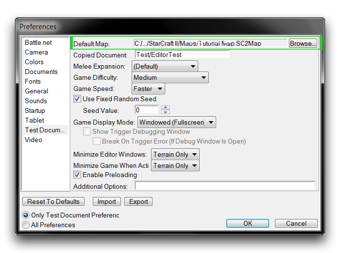
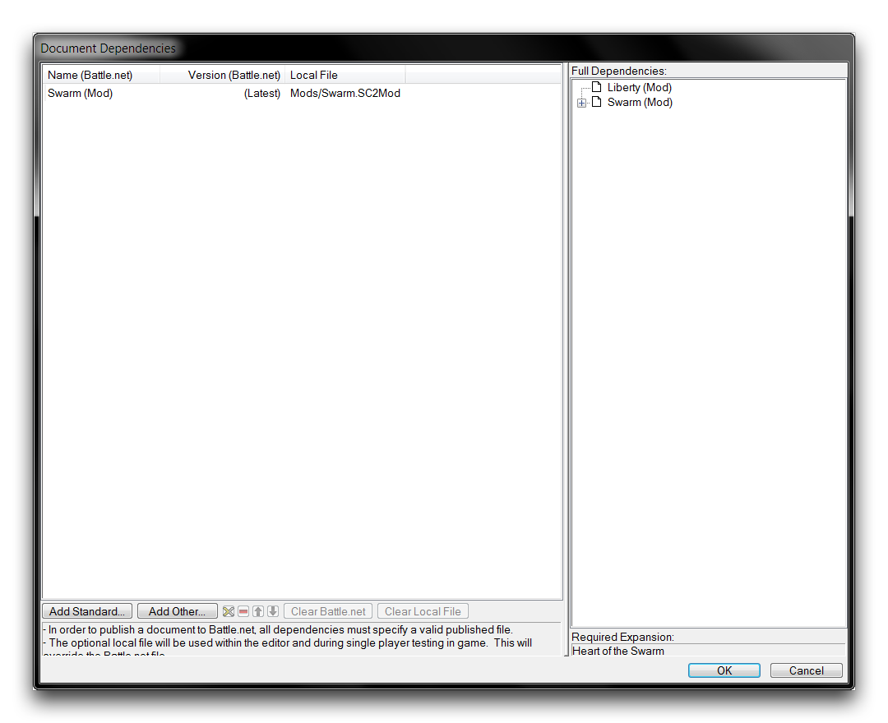
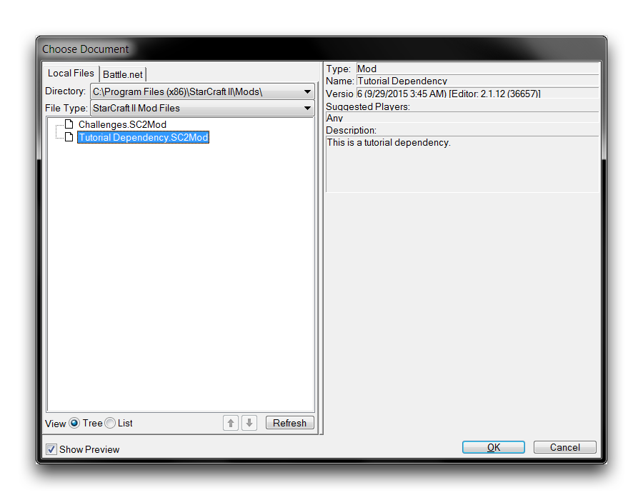

# 测试一个离线模组

测试是开发的主要组成部分之一。一个优秀的开发者希望为测试者尽可能地提供轻松、专注和高效的游玩体验。在共享测试之前准备您的项目对于确保最大限度地利用志愿者的时间是至关重要的。

对于地图，编辑器有一个明显且直接的测试方法，即直接转到编辑器导航栏中嵌入的“测试地图”功能。然而，对于模组来说，有一些额外的步骤。这可能导致初学者开发者采取最为显而易见的方法，即将他们的模组和地图同时上传到战网进行测试。

这种方法可能会导致一些显著的减速，因为发布系统有一个额外的保护层，这是为发布版本而设计的。相比之下，有几种灵活的测试模组的方法，你应该熟悉一下。不足之处在于这些方法是离线方法，因此只适用于单人测试实践。

## 使用目标地图测试一个模组

您应该注意，当尝试使用编辑器的直接“测试地图”功能时，您将被要求为活动模组设置一个地图目标。这是有道理的，因为模组文件不包含地形数据，也没有设定包含的资产和数据。为测试设置一个目标“默认地图”可以直接、简单地离线测试模组系统。

您可以通过转到“文件” ▶︎ “首选项” ▶︎ “测试文档”来设置一个直接的模组测试。在这里，您会注意到“默认地图”标题。

*设置测试目标地图*

通过选择“浏览”按钮，然后导航到本地地图文件，将“默认地图”设置为您要测试的模组的目标。单击“确定”返回到主编辑器。从现在开始，使用“测试地图”功能将导致当前活动的模组文件被临时依赖于“默认地图”。然后包含模组的地图将启动一个测试。设置的“默认地图”将在项目之间保持不变。如果您同时在几个不同的模组中使用这个功能，您将需要每次进行更改。

这个系统可能会让你想起“扩展模组”系统的本地版本，其中地图和模组在运行时被合并，但在游戏后保持分离。

## 使用依赖进行测试

或者，您可以通过将模组添加为活动地图的依赖项来测试模组。打开您要测试的地图，导航到“文件” ▶︎ “依赖项”。这将呈现当前文档依赖项的列表。默认视图可能类似于下面显示的视图。

*设置测试目标地图*

在这里，选择“添加其他”。这将呈现下面显示的视图。

*设置测试依赖*

选择您感兴趣进行测试的自定义模组，然后点击“确定”。一旦您返回到依赖性视图，再次点击“确定”回到您的活动地图。在那里，您可以使用“测试文档”功能来测试具有新依赖关系的地图。

如果您正在开发地图并对其中一个或多个现有模组的一些交互感到好奇，那么这种方法可能是比较合适的。您可以通过添加或删除模组，快速更改当前地图的依赖关系，而不是转移到战网，然后对每种配置进行试验。