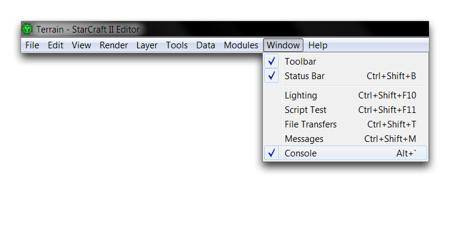
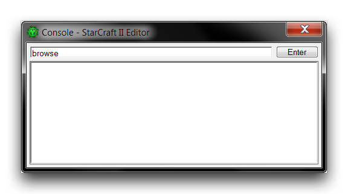
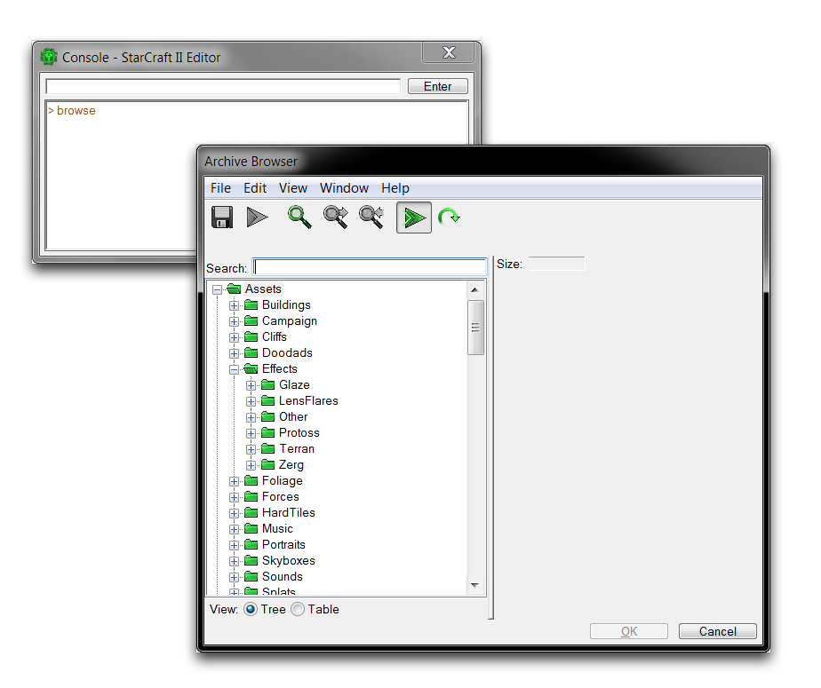
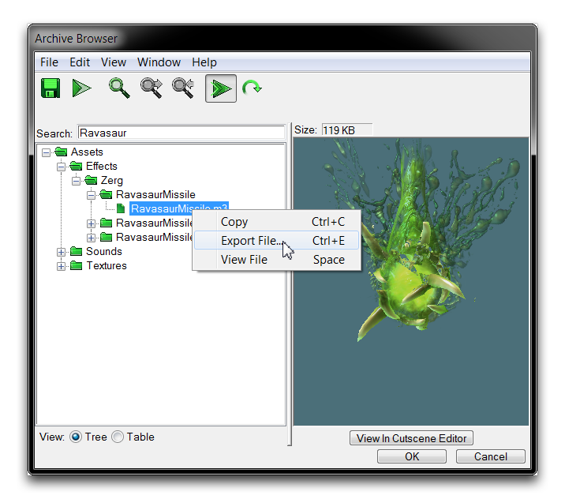
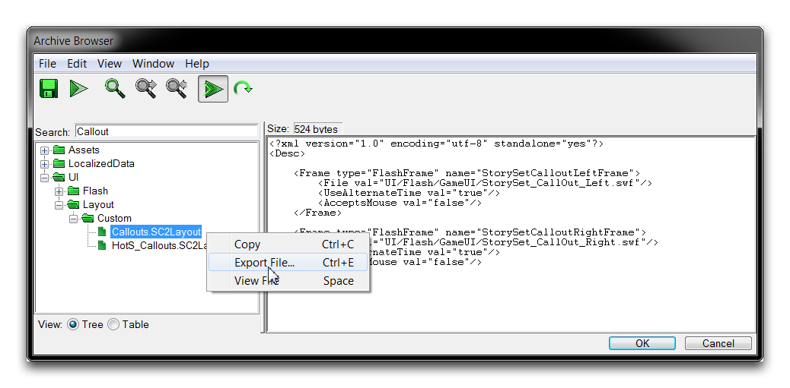
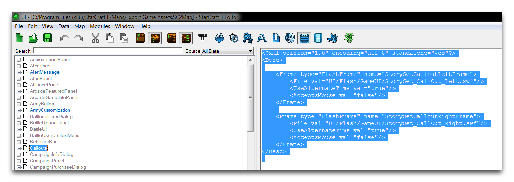
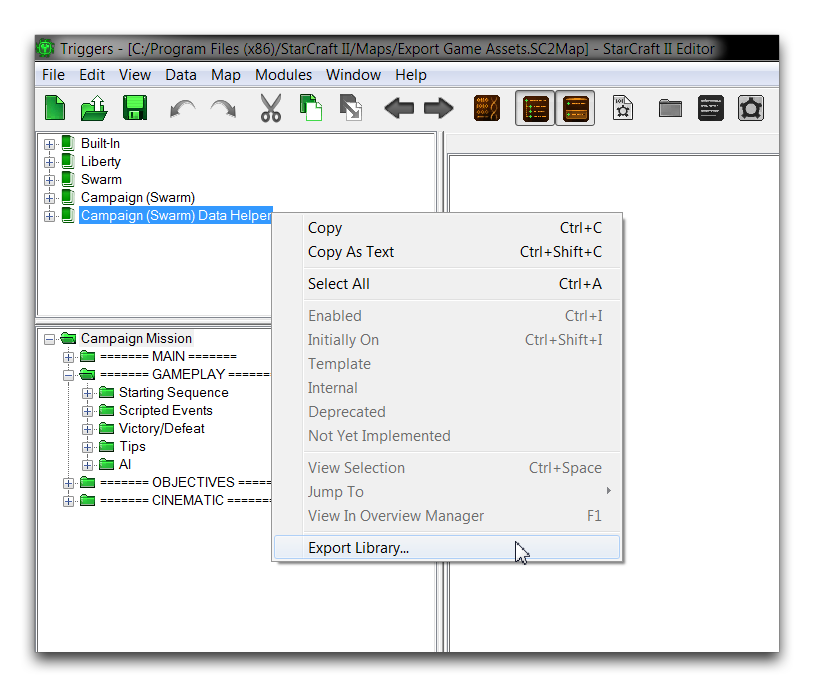
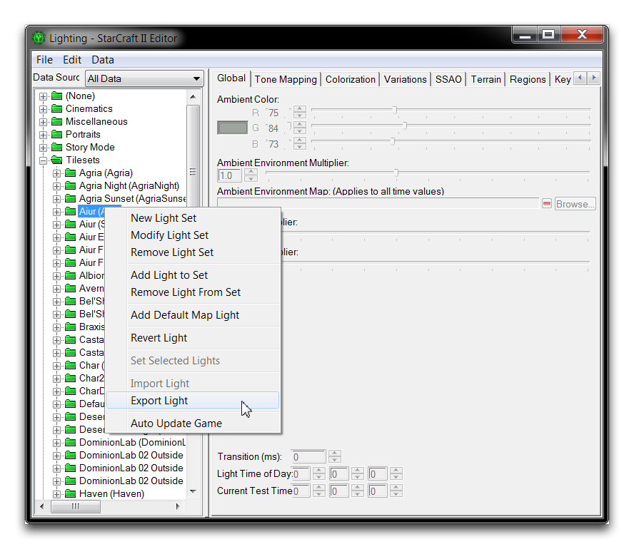
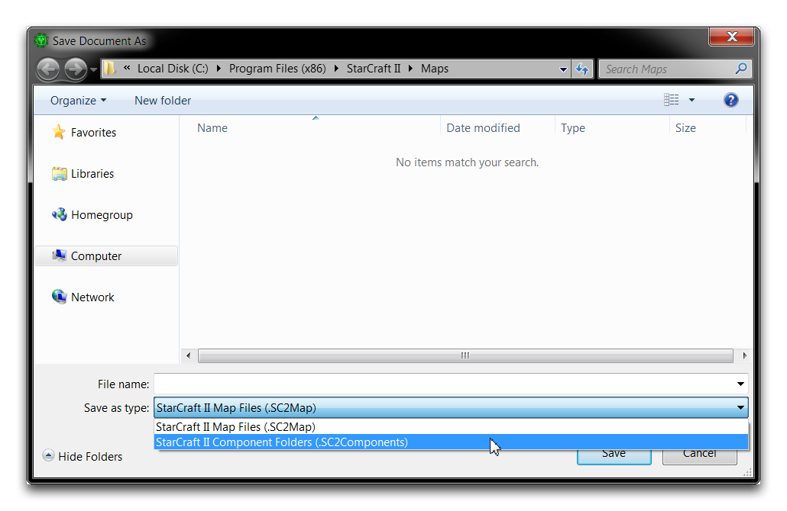
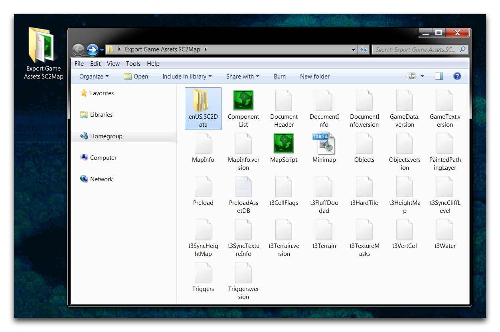

# 导出游戏资源

就像自定义资源可以通过导入器引入编辑器一样，标准资源也可以导出到基本文件类型中。每种类型的资源都需要您使用稍有不同的方法从项目中提取出来。这些方法在本文中有所描述。

从编辑器中导出通常用于更仔细地查看标准资源。它们可以从编辑器中取出，插入到不同的程序中，进行修改和重组，然后再次导入以供使用。如果您曾经丢失项目之源部分，了解如何导出也是非常有价值的。那么您可以通过从基本项目中导出文件作为恢复方法。对于每种资源类型，有一些常见的文件格式是您应当了解的。下面提供了一个列表。

| 类型               | 文件格式                |
| ------------------ | ----------------------- |
| 纹理               | .dds                    |
| 模型               | .m3                     |
| 声音               | .wav                    |
| UI 布局            | .SC2Layout, .xml        |
| 触发器库           | .SC2Lib                 |
| 灯光               | .SC2Lighting            |
| 部件文件夹         | .SC2Components, Various |

## 打开存档浏览器

您可能已经熟悉了存档浏览器，因为它用于查找各种数据和触发器操作的文件。它还可以作为从项目中导出事物的主要中心。要将其用于此目的，您需要直接访问浏览器，而不是作为编辑提示的一部分。您可以通过从编辑器的任何位置导航到“窗口” ▶︎ “控制台” 来实现这一点，如下所示。

*打开控制台*

启动控制台后，输入命令 “browse” 然后选择 “Enter” 按钮，如下所示。

*启动资源浏览器的命令*

这将启动存档浏览器。它将显示项目中当前所有资源的结构化文件夹布局。

*存档浏览器视图*

## 从存档浏览器中导出

可以通过右键单击存档浏览器中的资源并选择“导出文件”来导出资源。

*存档浏览器视图*

## 导出 UI 布局

您也可以使用存档浏览器导出 UI 布局。只需在 UI 文件夹中找到它们，将其高亮显示，然后选择“导出文件”。

*存档浏览器视图*

或者，您可以直接从 UI 编辑器中提取它们。导航到“.SC2Layout”文件，然后突出显示 XML 数据并按Ctrl+C进行复制。然后可以将数据粘贴到文本编辑器或纯文本文件中供以后使用。

*突出显示用于导出的 XML*

## 导出触发器库

您可以通过触发器编辑器中的“库”面板从“库”中导出触发器库，方法是选择库，右键单击，并选择“导出库”。

*导出触发器库*

## 导出灯光

您可以从灯光窗口导出灯光文件。选择要导出的灯光排列方式，然后右键单击并选择“导出灯光”。

*导出灯光*

## 导出部件文件夹

通过导出过程，地图项目可以拆分为其部件文件夹。这种格式是一种包含脚本、组件列表、图像文件和原始数据的集合，可用于您可以在编辑器外进行的诊断和分析程序。要导出，请打开要保存为部件文件夹的地图，并导航到“文件” ▶︎ “另存为”。将“保存类型”字段更改为“.SC2Components”，然后选择“保存”。

*保存为星际争霸 II 部件文件夹*

此过程将生成一个带有指定文件名的文件夹，附加了后缀“.SC2Map”。该文件夹将包含一套数据组件和资源文件，看起来类似于下面显示的内容。

*星际争霸 II 部件文件夹*