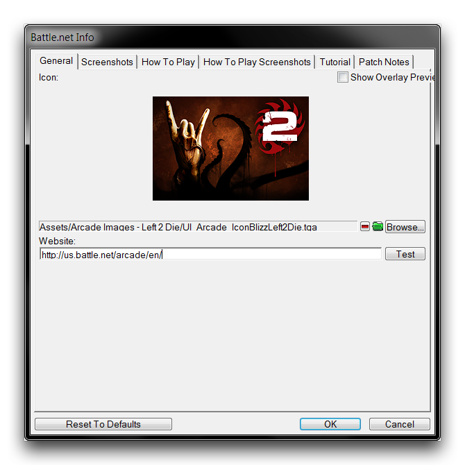
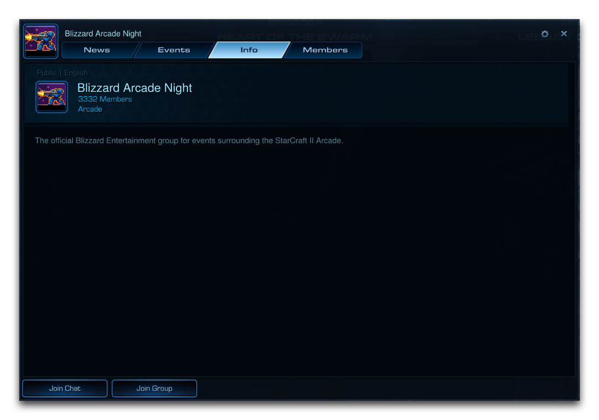

# 市场营销

最终，释放项目进入世界的时机将会到来。花一些精力来思考如何做这件事可以对对其感兴趣的人数产生巨大影响。市场营销你的游戏并制造期待是增加游戏成功机会的好方法。虽然总有可能仅靠口口相传就足以，但你不能低估积极主动行动的价值。即使你的游戏尚未完工或仍在积极开发中，开始市场营销工作也许会带来额外反馈、乐意测试者以及其他机遇。尽管如此，好的市场营销始于好的项目。重要的是要不要过早着急。首先专注在重要的事情上，即游戏设计的实践。

# 推广材料

你会想要有一些材料可以展示你的游戏在各个地方。虽然Battle.net和Arcade有许多预览功能，但你不能依靠人们通过游戏本身接触到你的项目。那里已经发生了很多事情，你必须努力争取关注度来开始建立自己的市场。促销物品例如截图、视频、网站、精心撰写的文案和插图可以在许多方面使用，推动你的项目走向更广泛的受众。

在这里最好要有一些关于目标受众的想法。如果项目是吸引竞技星际玩家的近战地图，展示他们会喜欢的事物，比如游戏中的新进展或旨在促进高级平衡的功能。如果游戏吸引某一流派的粉丝，看看该领域的其他事物已经做过的，尝试击中一些相同的要点同时提供你自己的创新。

预告片或简短的推广影片可能特别有效。在制作这些内容时，你会想要以最佳分辨率和游戏设置进行拍摄，同时保持内容简洁。在你的预告片的最早部分，试着包含一些突出你项目独特特点的内容，引起人们的注意并激励他们实际尝试项目。展示你项目的显著要点，以适当的节奏介绍新想法，不要在可能对未尝试过的人无趣的事物上停留太久。

# 宣传

拥有你的推广材料后，是时候开始宣传了。一定要搜索你认为合适的社区站点和聚集地，以及官方的暴雪论坛。制定一个想要进行市场推广的位置清单并准备一份包含你材料的一般模板。不要简单粗糙地在各处贴广告。花时间在每种情况下基于你的模板进行工作，根据每个场所量身定制你的方法和交流。一些发布的一般想法可能包括：

- 在星际社区论坛发布。
- 在社交媒体上发送一些信息。
- 将你的项目链接给游戏网站的编辑或博主们。
- 联系可能感兴趣的社区人物。
- 向可能对尝试的星际直播玩家展示你的项目。

在专门推出某物的营销时，尝试将你的工作集中在一个短时间窗口，这将通过让你的项目同时在多个地方被谈论来提高效果。尽管如此，如果你最初的营销推动效果不佳，也不要放弃。有时候需要慢慢积累兴趣；保持你的材料公开和更新，并尝试随时间投入较小的持续发布努力。但不要让持续的营销阻止你的开发，一个项目可能随着额外工作取得突破，甚至可能引领你到新的东西。毕竟，总有下一个项目。

# 维护社区

市场营销未必在发布后终结。你可能希望努力建立一个持续增长和发展项目的社区。如果这是一个为反复游玩而制作的多人游戏，你将考虑任何可以团结玩家群体并让他们互相联络的材料。一个简单的网站可以很有效，并可以附带一个自己的讨论论坛。Battle.net系统允许你为每个项目公布一个网站。您可以通过导航到编辑器中的Battle.net信息 ▶︎ 通用 ▶︎ 网站来添加此网站，如下所示。

*Battle.net 网站链接*

使用“测试”按钮确保链接正常连接。StarCraft II还支持一个名为“团体”的功能。团体是一个在Battle.net上聚集玩家的好方法。你甚至可以在团体内创建“事件”，设定在StarCraft II主屏幕上显示的计划游玩会话或会议，让团体成员看到。另外，值得你参考一下'暴雪游乐夜'团体，他们举办专门为开发者推广和测试项目的活动。

*暴雪游乐夜团体*