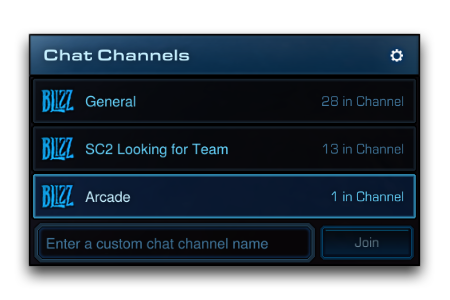
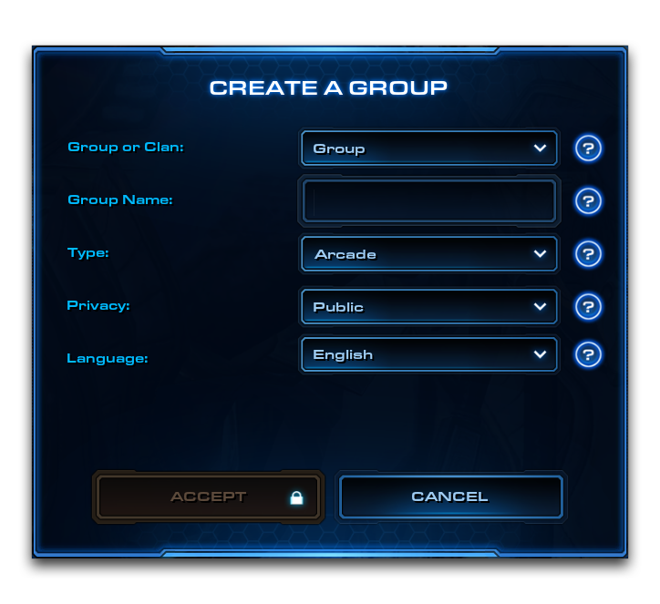
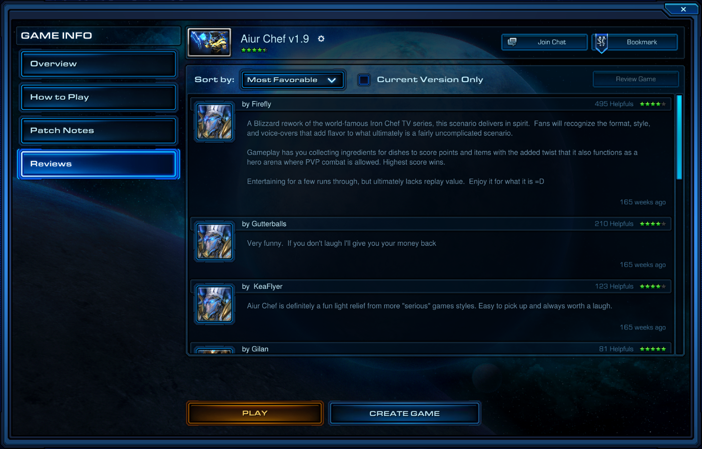
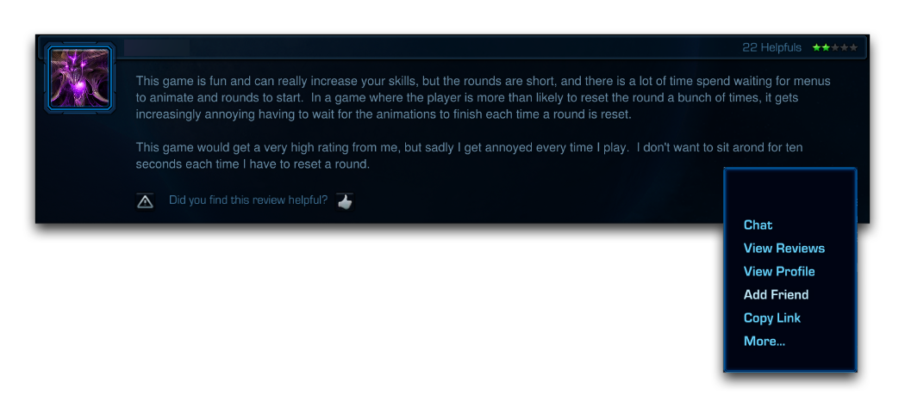

# 寻找测试人员

游戏开发需要大量的测试以产生良好的结果。许多最优秀的开发人员承认，密切观察和对游戏进行实验很可能是最重要的设计实践。游戏是不断变化的系统，这往往使它们变得难以理解。有很多意想不到的行为最好通过频繁测试来发现、纠正，甚至利用。对游戏的适当观察是一个关乎时间、技术和视角的问题。通过让新鲜的视角参与进来，通常以游戏测试人员的形式，可以更好地实现正确的视角。

术语“测试人员”指的是一个志愿者，将玩一个实验性的街机游戏、在新的近战地图上进行战斗、使用自定义界面进行观察，或以任何方式使用创作者的项目，然后回馈他们的体验。尽管公众对使用编辑器进行创作项目表示热情，但要找到既愿意又有效的测试人员往往很困难或耗时极大。有一些做法可以帮助你应对这个问题。

## 为会话做准备

进行有效的测试意味着需要做准备。成为他人志愿努力的受益者意味着要承担起使测试具有成效、专注和尽可能有趣的责任，鉴于当前项目的状态。虽然一个有问题的地图可能会使开发人员的内疚感沉重，但重要的是不要仓促地将多人游戏测试作为首选反应。始终确保先行动你自己的设计、诊断和修复能力。虽然你需要借助他人的视角来成长为开发人员，但培养个人纪律也同样重要。

当准备进行多人游戏测试时，考虑上传一个项目构建版本，这是从主要发布版本分开发布的版本。这样可以保持标准版本的清洁，并确保不会干扰当前在享受你项目的玩家。它甚至可以让你与其他开发人员分享一个低调的、未锁定的游戏版本。如果你正在寻求其他开发人员对地图内部的问题，比如触发器或数据，这是很有用的。

测试是一个相当泛泛的术语，适当的准备工作可能大相径庭。良好的测试可能意味着花时间找到高技能玩家来深入了解特定竞技地图设计，或确保界面元素调整得足够精细，以让新手玩家快速进入街机游戏的核心内容。

通常情况下，你希望孤立游戏的某个部分。你应考虑尽可能添加多种规定，以便快速进入游戏的特定部分并有效测试。这可能意味着引入命令以跳过开场动画，或在游戏中构建能够重复测试多次的功能。确保每个会话都有明确定义的目标，并在开始测试前明确告知你的测试人员。

一些开发人员会将测试用作推广预览，一种营销手段。这里不会讨论这个问题，但这可以是建立社群的有效工具。游戏所获得的追随者都可成为真正的测试人员，更多感兴趣的人意味着更多潜在的测试人员。作为有志成为开发人员的一条经验法则，最好的营销方式就是努力打造更好的游戏。

## 联系玩家

通过论坛、聊天客户端、社交媒体和Battle.net内置的社区功能联系潜在的测试人员。利用所有可用渠道与其他星际争霸II玩家和开发者联系。星际争霸II社区站点和其他以游戏为中心的社区通常支持他们自己的活跃论坛和IRC频道。

保持灵活的时间安排。记得将你的游戏发布到所有地区，因为有意向的测试人员可能居住在世界上任何地方。与不同地区和时区的人协调，以包含尽可能多的玩家。对于你自己的时间表之外可用的玩家，你可以选择让其他人主持测试。如果你是团队的一部分，你可以分工合作，同时主持几个测试。

当你准备好测试时，首先向社区中的同行伸出援手。开发者通常可以成为特别强大的测试人员，并提供普通玩家无法提供的技术帮助。开发者可能也有他们自己的联系人，愿意向他们介绍你。除此之外，你还可以尝试邀请来自Battle.net公共聊天频道，比如“SC2寻找团队”或“街机”。

*街机中心的聊天频道*

## 组织测试人员

现在你已经建立了一份感兴趣的玩家名册，你可以开始测试你的游戏了。不要为每个会话都这样拼凑你的测试团队，使用Battle.net的功能来帮助你组织这些事件。通过使用聊天频道和群组保持更一致的联系。

Battle.net群组提供了一些工具来管理和与测试人员进行通信。通过在主工具栏上的“群组”按钮之间找到的“好友列表”和“菜单”之间导航，创建一个群组。这将启动“创建群组”窗口，在那里你将为你的群组做好准备。一旦做好决定，选择“创建”将该群组添加到Battle.net。这些属性相对无害，但你可能希望将群组的“隐私”设定为公开，以便访客能够方便地加入。你还应注意，基于游戏的氏族确实存在，但在Battle.net内，玩家一次只能加入一个氏族，这可能会阻碍潜在的测试人员。

*创建群组*

如果你已将你的游戏发布到Arcade作为公共项目，那么你可以使用“游戏信息”屏幕上的“加入聊天”按钮进入为游戏自动生成的聊天中心。否则，你可以随时创建自己的聊天频道。另一个提示是在你游戏的“地图信息”描述、加载屏幕和游戏本身中提及你正在使用的群组、聊天室和其他社区位置。

## 反馈

记得在你的地图旁留下一个通讯渠道，比如电子邮件或社交媒体。这可以作为收集反馈的手段。记住，Battle.net还提供了一个针对活跃游戏的“评论”窗口，这也可以是了解玩家对你游戏体验的另一种方式。

*评论屏幕*

在这里找到挑剔但公正的建设性批评可以为你找到潜在测试人员提供了重要线索。不要犹豫与以尊重方式对你的游戏提出批评的玩家联系。你可以通过Battle.net向他们发送好友请求，并就他们对游戏的体验展开对话。优秀的开发者会提出好问题。

*建设性反馈*