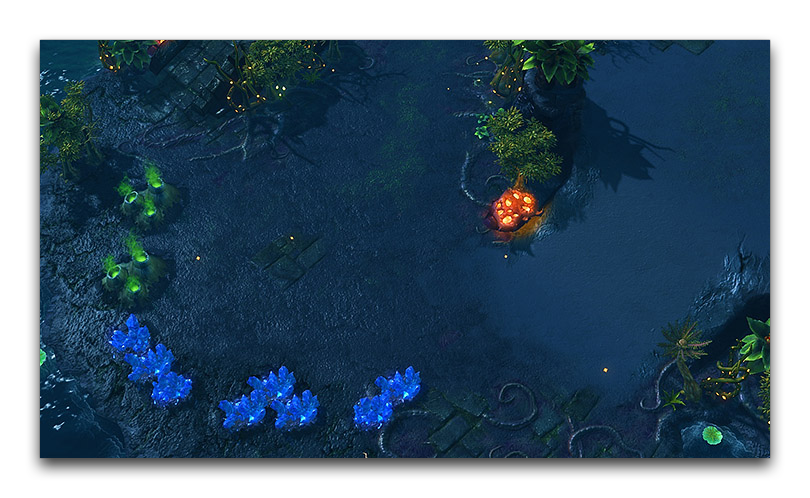
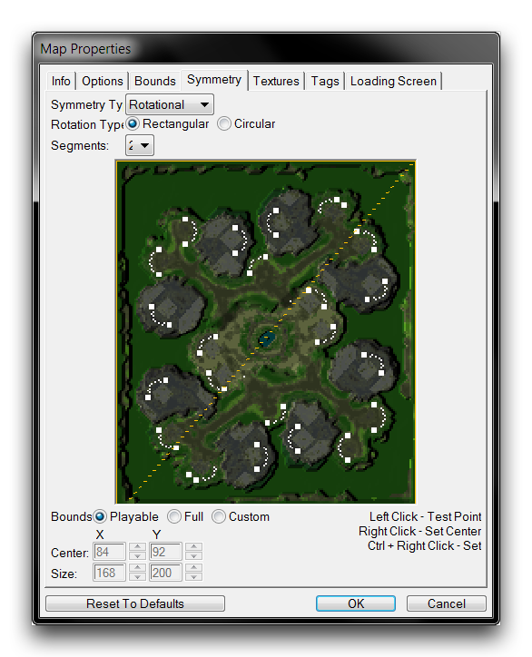
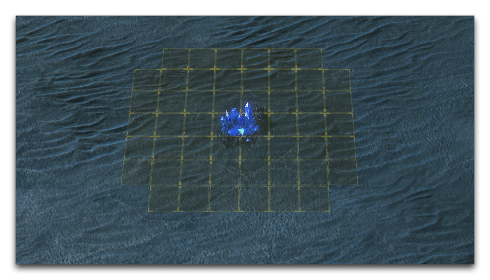
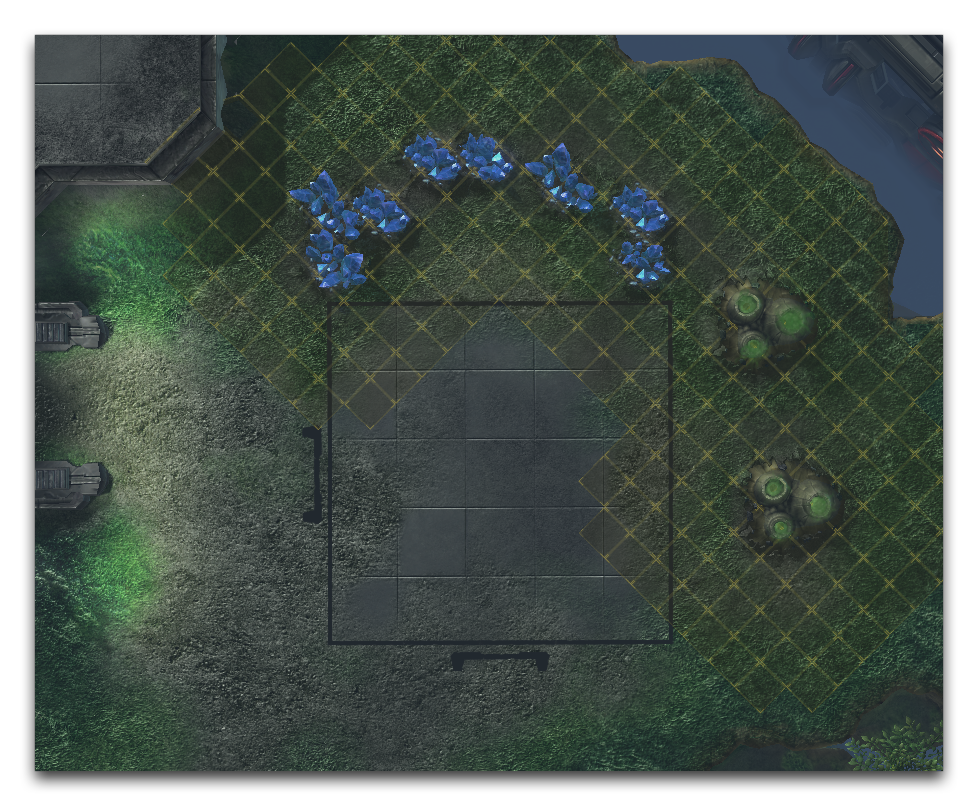
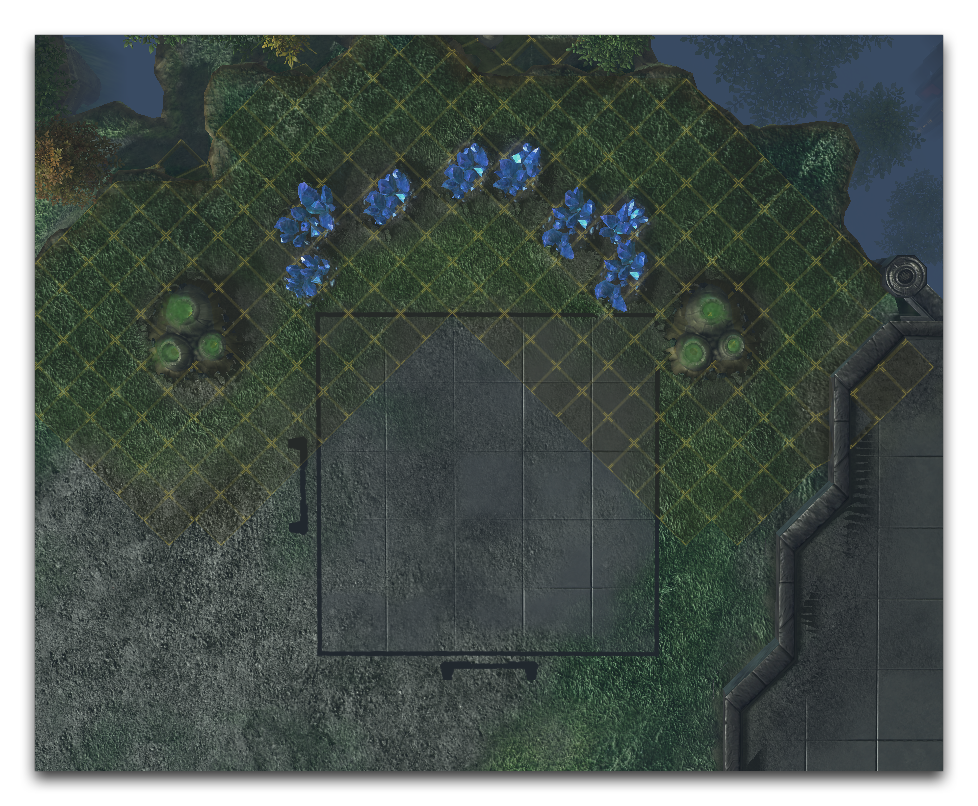
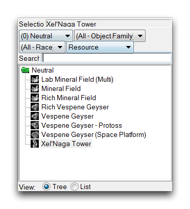

# 竞技模式下的资源摆放

在近战地图中放置的每个元素都至少具有一定的游戏含义，这种含义可以从一个简单的草地装饰物塑造战场氛围的方式，到形成可能出现的游戏风格的路径和地形布局。

作为近战地图制作者，你最大的挑战在于探索和尝试形状、外观和游戏性之间的关系。然而，有一个领域你几乎没有太多的实验空间。对于竞技游戏，有一种已经建立的模型规定了资源需要如何摆放在地图上。即使对这个布局进行最微小的变化，都可能对游戏的资源模型产生深远影响，改变竞技游戏的平衡状态。

*由SeinGalton设计的Cassandra Gemini的第三井*

## 地图对称性

适当摆放近战资源是相当简单的，但你需要遵循一些规则和技巧来满足需求。首先要检查地图的对称性，因为这比单独配置每个基地要省时。点击地图 ▶︎ 地图对称性，即可访问对称性控制，这将打开如下所示的“地图属性”窗口。

*地图对称性控制*

应用“对称类型”将创建一个镜像轴，所有在地图中创建的单位都将在此轴上复制。将地图设计与对称性连接起来并不一定要永久固定；你可以使用它，然后稍后切换关闭，而不会丢失结果。

## 摆放考虑

准备摆放资源时，考虑使用编辑器中提供的“摆放网格”叠加。你可以通过导航到查看 ▶︎ 显示摆放网格 ▶︎ 显示网格 来激活它。该叠加将显示围绕任何资源物品的三个单位范围内玩家无法放置指挥中心的区域。如下所示：

*摆放网格*

接下来，考虑基地的可能资源布局。有两种标准方案几乎涵盖了所有竞技布局。这两种方案如下图所示。

*相同侧边维斯平基地布局*

*两侧维斯平基地布局*

## 资源摆放

现在终于可以开始摆放一些资源了。你可以在地形编辑器的单位层中找到它们。导航到单位面板并将“对象类型”搜索过滤器设置为“资源”。这将显示所有可用的近战资源，如下图所示。

*单位面板中的资源*

选择矿石并将其放置在基地结构中，牢记标准布局。记住，传统的基地规划包含八个矿藏区和两个维斯平间。还有高产出基地包含六个矿藏区和一对维斯平间。尽管这些标准可以商榷，但要注意，对竞技地图进行任何变动都会影响游戏机会。尽管如此，每个地图都需要一些实验和实践。

避免将维斯平区摆放成对角线状，因为这会导致收取速率降低。你可以通过测试来看是否维斯平能够支持第四个工人。总体而言，测试是确定资源摆放是否正确的好方法。资源对近战游戏氛围至关重要，即使对业余玩家来说，它们的布局微小改变也是可感知的。

请注意，你还应考虑你所设计的星际争霸版本。在虚空遗留中，资源模型与游戏早期版本不同。这些版本需要矿藏内部不同的值。