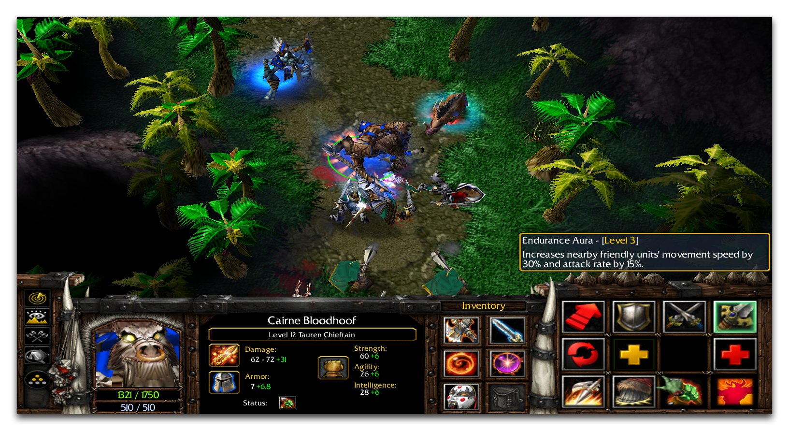
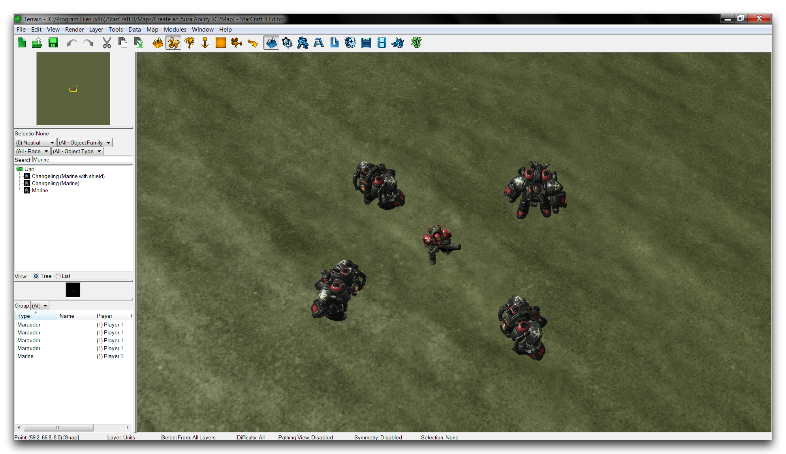
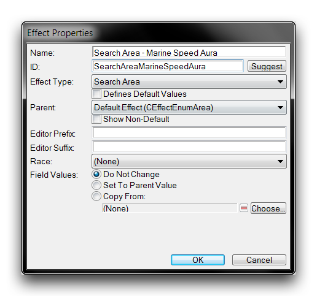
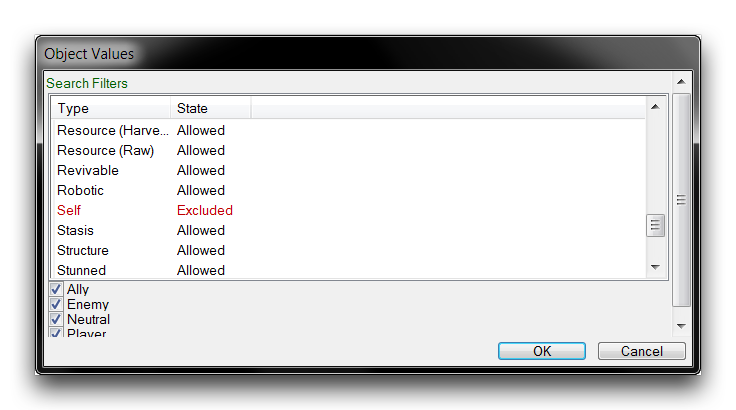
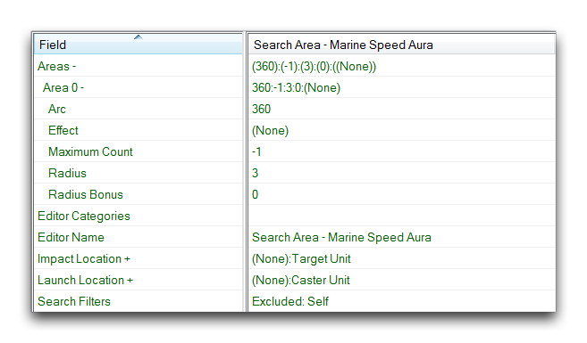
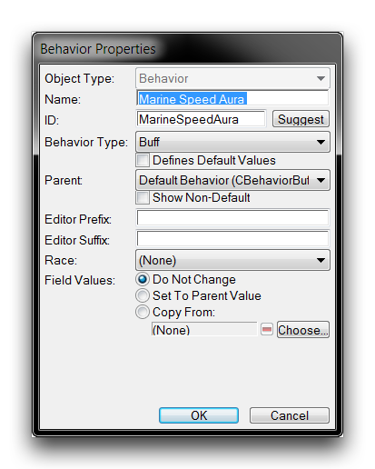

# 创建光环能力

光环指的是游戏中常见的一类能力。光环通常源自单个单位，给身处光环持有者周围区域内的友方单位带来有益效果。在主题上，光环通常支持这样一种观念：英雄单位的存在能激发和活跃周围的单位。您可以在下面的图片中看到一个光环效果的示例。

*《魔兽争霸III》的耐力光环*

在《魔兽争霸III》中，大角魔酋长的“耐力光环”能让附近的盟友获得速度和攻击速率加成。虽然这是光环的传统应用方式，但在不同游戏中存在着许多变体和类似的想法。概括该概念的关键点如下。

- 光环是被动、不可使用的能力，托管在源单位上。
- 光环在源单位周围的区域中对单位造成改变。

这种概括提供了光环的真正定义；它们并没有具体的连接到积极或消极的效果，也并非只存在于英雄单位上。在这个基础上，光环能力的设计可能会有很多变化。一个拿着火把的单位可能具有一个燃烧光环，对敌人造成持续伤害。这些光环也可以叠加，随着火把手的聚集而增加。另外，可能存在着一个被诅咒的神器，一枚脉动着缩小光环的戒指，对任何靠近它的单位都会缩小体积。任何试图接近偷取宝藏的小偷很快会发现自己变得太小而搬运不了宝藏。

## 设计一个光环

光环显然具有为游戏增添许多有趣元素的潜力。学习在编辑器中创建光环将是一项非常值得的练习。幸运的是，提前梳理光环的关键点能让您迅速地引入它们。

这里需要注意的第一点是，实现光环有几种可能的方式。本文将介绍的方法是一种基于数据的选项，您会发现它简单直观。然而，需注意一点与先前提到的有所偏差。在这种情况下，光环能力实际上不符合星际争霸编辑器中“能力”的定义。在编辑器中，“能力”指的是在游戏内进行的变化，并通过指令牌界面访问。例如，陆战队员的“刺激剂”或狂热者的“冲锋”都是这方面的示例。虽然也可以以这种方式开发光环，但本文将实际上使用两种行为和两种效果来实现光环。

行为改变单位的属性，托管在一个单位内部。这与上文中概括的光环定义相契合。您将使用一个行为将光环授予源单位，然后传递第二个用于改变属性的行为给每个光环接收者。这一对效果将被用于找到光环接收者，并分别应用于更改属性的行为。

通过这种方式详细讨论光环的机制有助于理解其一般设计思路。该设计将在接下来的章节中进行解释和扩展，但现在提供如下计划。将这个计划作为参考，许多像本文开头提到的那些创意改动可以使用这个一般方案构建。

- 单位 — 承载光环
  - 行为（增益）— 将光环授予源单位
    - 效果（搜索区域）— 找到单位周围的光环接收者
      - 效果（应用行为）— 将增益应用于找到的接收者
        - 行为（增益）— 将光环的属性变化应用于接收者

要设计一个特定实现的光环，您需要选择一个源单位和一个特定的增益行为。在本演示中，您将为海军陆战队员创建一个加速光环，使其所有接收者的移动速度翻倍。设计计划如下。

- 海军陆战队员 — 承载速度光环
  - 速度光环 — 将速度光环授予海军陆战队员
    - 速度光环搜索区域效果 — 找到海军陆战队员周围的盟友单位
      - 速度光环应用行为效果 — 将速度增益应用于盟友单位
        - 速度增益 — 加倍单位的速度

要开始组建这个设计，请打开本教程中提供的演示地图。地图应该如下图所示。

*地图准备*

移至数据编辑器，开始构建光环的逻辑。

## 搜索区域效果

需要注意的是，您不必按计划中所列的顺序来构建光环。因此，开始的最佳位置是“搜索区域”效果，这将定位光环主人周围的盟友。创建一个新效果，并设置其属性如下所示。

*创建搜索区域效果*

现在选择新创建的效果，并打开“搜索：搜索过滤器”字段。将“自身”过滤器设置为“排除”，如下图所示。

*搜索过滤器*

这将阻止效果定位施法者或光环托管单位。现在设置字段“冲击位置 — 值”为“目标单位”，“目标：发射位置 — 值”为“施法单位”。前者设置将在半径内找到的单位，而后者将在光环主人的位置开始搜索。最后，设置实际搜索区域和大小。您可以通过将“搜索：区域 — 半径”字段修改为 3 来完成这一步。然后将“搜索：区域 — 圆弧”更改为 360。搜索区域是光环主人周围的一个完整圆，在任何方向延伸三个地图单位。这个效果的字段将显示为下图中的样子。

*搜索区域效果字段*

您会注意到，“效果”字段尚未设置。这将启动“应用行为”效果到光环接收者身上。

## 增益行为 — 海军速度光环

接下来，创建光环源行为。“增益”行为将作为光环源。创建一个新的行为，并设置其属性如下。

*光环行为创建*