选择行为并设置其'Movement: Modification - Movement Speed Multiplier'字段为2。这将向光环托管单位（在本例中为海军）应用速度增益。这样，速度光环的来源将能够跟上其加成接收者的移动。接下来，设置字段'Time Scale Source -- Value'并将其设置为Global。时间刻度是引擎中计时方式的修改。个体单位可以使用其自己的刻度，但在本例中，该行为将依照全局或标准时间运行。

如设计所示，光环首先通过搜索区域效果来找到光环接收者开始其变更。这通过将'Effect - Periodic'字段设置为上一步中创建的'Search Area - Marine Speed Aura'效果来建立链接。该过程如下所示。

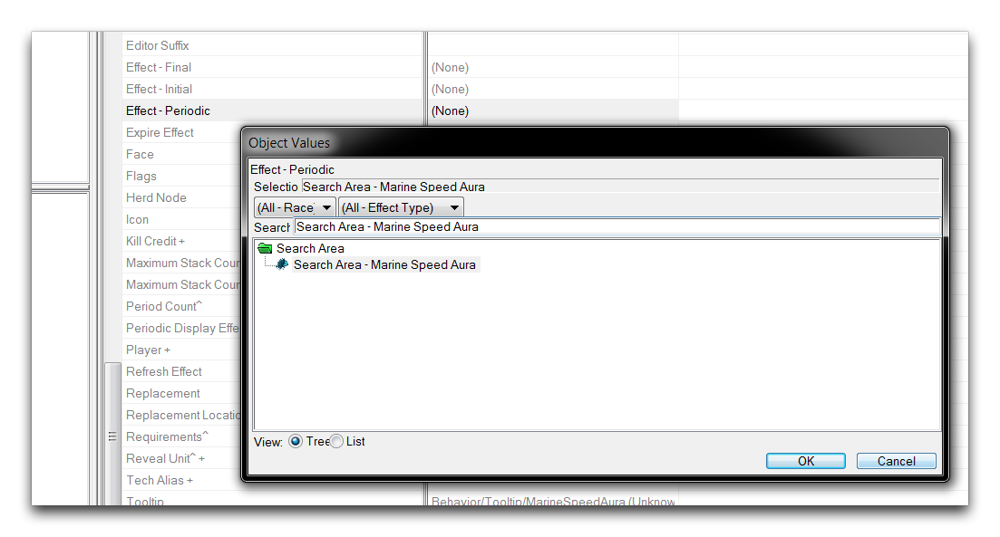
*选择光环搜索效果*

现在，将'Period'设置为0.0625，这将导致'Effect -- Periodic'和随之的搜索效果每秒发生16次。完成的光环行为字段应如下所示。

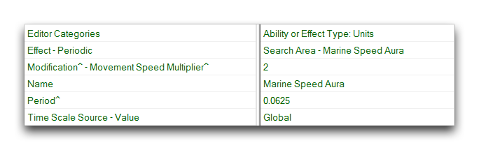
*海军速度光环字段*

## Buff Behavior - 速度增益

这个组件是负责光环接收者速度增加的行为。它也属于增益类型，其创建窗口应如下所示。

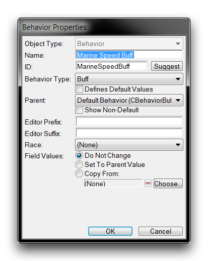
*速度增益行为创建*

创建完行为后，将'Modification -Movement Speed Multiplier'字段修改为2。这将在托管此行为的单位中创建速度增益。由于光环中的每个单位都会单独接收此行为，因此通过此速度增益行为，增益将在整个搜索区域中分发。

还将'Duration'字段设置为0.2。这是单位中修改的生命周期，这意味着如果单位离开光环区域，增益将在0.2秒后消失。作为最后一步，将'Time Scale Source -- Value'设置为Global，与前一个行为相同。该行为的完成字段应与以下匹配。

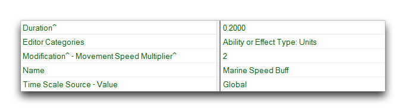
*海军速度增益字段*

## 应用行为效果

最后一个组件是将速度增益增益应用于找到的友方单位的效果。这是一个'Apply Behavior'效果，其创建屏幕应如下所示。

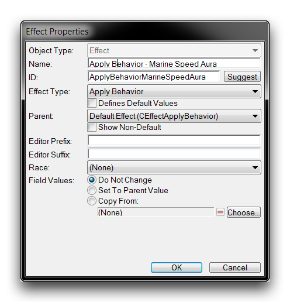
*速度增益行为创建*

这里需要设置的唯一字段是'Effect: Behavior'。将其设置为之前创建的 'Marine Speed Buff'。

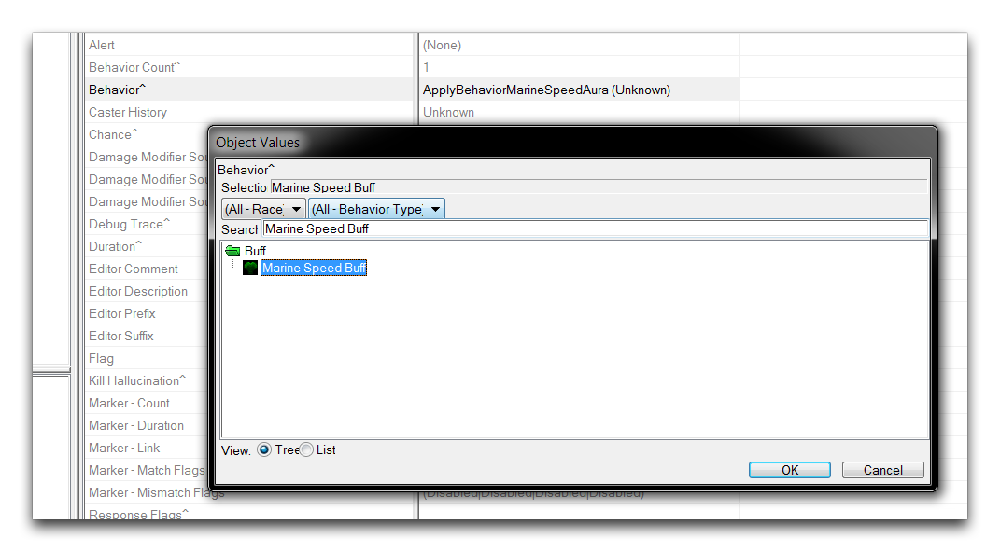
*为应用设置行为*

此效果现在将针对'Search Area -- Marine Speed Aura'效果找到的每个单位调用。然后将'Marine Speed Buff'行为推送到这些单位中，增加其速度。此时，该行为的完成字段应如下所示。

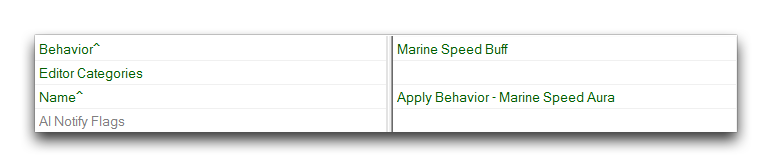
*应用行为效果字段*

## 连接数据

首先建立每个单独组件，然后连接数据的方式是高效的过程，但这给数据的连接部分留下了一些漏洞。您现在可以解决这个问题。返回到 'Search Area -- Marine Speed Aura'效果并打开其'Areas -- Effect'字段。将其设置为 'Apply Behavior -- Marine Speed Aura' 效果。

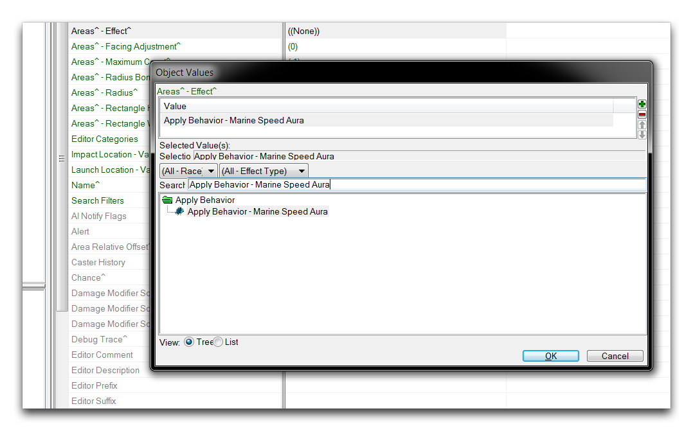
*将行为应用效果链接到搜索效果*

现在，您已经设置了搜索效果以在每个找到的友方单位中启动 'Apply Behavior'效果。要完成，您需要将光环设置到其源单位，海军。由于您用于光环的实现方法是简单的，这是一个简单的过程。转到单位选项卡中的 'Marine' 并打开其 'Behaviors -- Behavior'字段。在弹出窗口中，单击绿色 + 以向单位添加行为。选择 'Marine Speed Aura'，然后通过两个窗口单击 'Ok'。该过程如下所示。

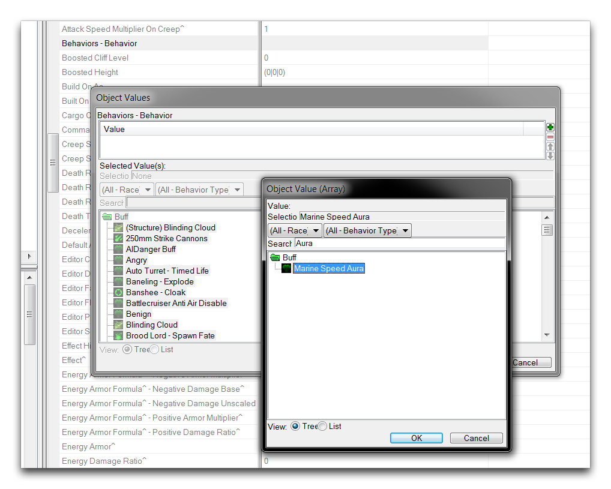
*将光环添加到源单位*

## 测试光环

您现在已经完全组成了光环。您可以通过查看数据导航器来确认，这将向您展示光环的整个数据结构。

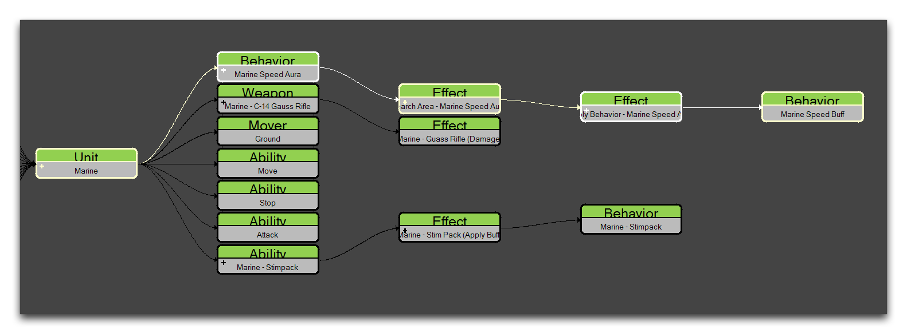
*光环数据结构*

通过查看此可视化，您可以看到以下连接。

  - 单位（海军） -- 通过其 Behaviors -- Behavior字段托管 'Marine Speed Aura' 行为
  
  - 行为（Marine Speed Aura） -- 通过其 Effect -- Periodic字段应用 'Search Area' 效果
  
  - 效果（Search Area - Marine Speed Aura） -- 通过其 Areas -- Effect字段应用 'Apply Behavior'
  
  - 效果（Apply Behavior - Marine Speed Aura） -- 通过其 Behavior字段创建 'Marine Speed Buff'
  
  - 行为（Marine Speed Buff） -- 光环的终点
    
    > 这与本文介绍的设计非常匹配。测试项目应导致光环在海军主机中被创建，并在其周围约两个单位的圆形区域内的所有单位。所有受影响的单位应以大约正常速度的两倍移动。它们还将显示一个增益图标，如下所示。

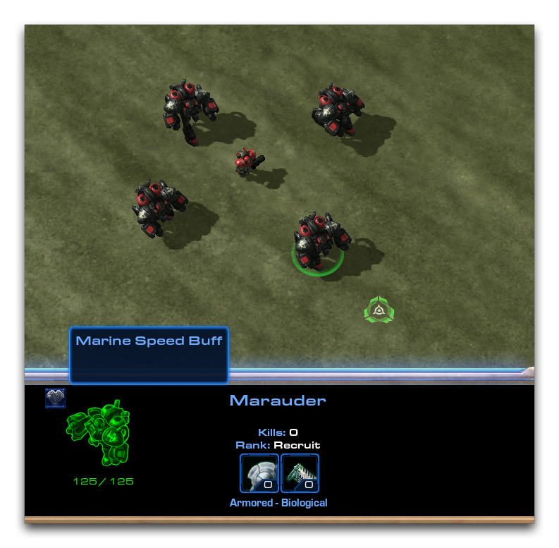
*应用行为效果字段*

## 附件

 * [087_Create_an_Aura_Ability.SC2Map](./maps/087_Create_an_Aura_Ability.SC2Map)