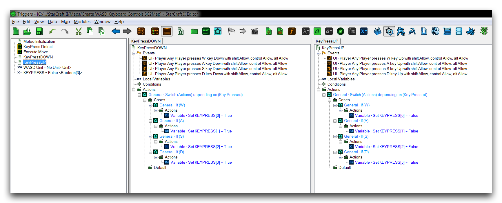
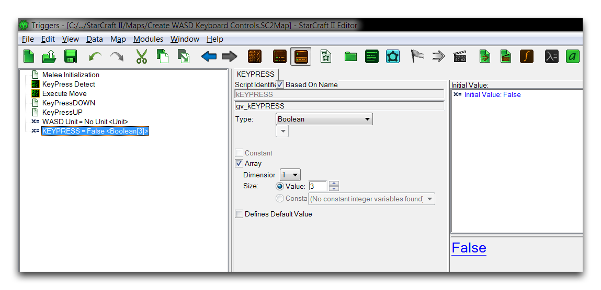
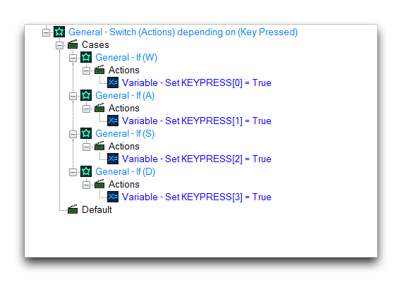

# 创建 WASD 键盘控制

使用键盘来控制游戏角色的移动是经典的控制方案。最著名的例子就是 WASD 键盘控制，其中 W、A、S 和 D 键分别绑定到向上、向左、向右和向下的方向。这通常被用作一种符合人体工程学的、普遍可用的选项，可以一只手操作键盘，另一只手使用鼠标。

尽管《星际争霸》使用鼠标和键盘控制方案，但并没有直接将任何键盘控件与移动绑定。尽管如此，在使用编辑器创建的自定义项目中，实现 WASD 键盘控制是可能的。学习实现 WASD 键盘控制可以是非常教育性的，并在动作、冒险和模拟游戏中有许多实际应用。

## 按键 UI 事件

键盘控制系统需要一种方式在玩家输入和游戏之间传递信息。UI 事件通常适合此需求，在这种情况下，您将使用按键按下事件。触发器 'KeyPressDOWN' 和 'KeyPressUP' 创建响应 WASD 控件四个键的事件。'KeyPressDOWN' 在其中任何键被按下时运行，而 'KeyPressUP' 在其中任何键被释放时运行。您可以在下面的图像中看到这些触发器的组成。

*按键 UI 事件触发器*

通过单独区分键，该系统支持按下和释放按键的组合方式，以任何硬件支持的方式。结果，例如同时按下 W 和 A 键将正确响应同时向上和向左移动角色。

## 按键存储数组

为了跟踪所有同时按下的键，此设计需要一个存储数组。'KEYPRESS' 数组类型为布尔类型且大小为 3。考虑到数组从零索引开始，这里提供的总存储空间为 4 个键，足以满足整个 WASD 控制系统的需求。使用布尔数组允许每个数组值表示某个键当前是否被按下。各键的映射如下。

W == 索引 0

A == 索引 1

S == 索引 2

D == 索引 3

True 表示按下，False 表示未按下。所有数组位置默认设置为 False。以下是数组本身。

*按键存储数组*

## 开关动作

正如您所见，两个键按下触发器会响应四个 WASD 键中的任意一个。这使得设计无需依赖于八个单独事件来监视键盘输入。然而，这需要一些控制语句来适当解析输入。您可以使用开关语句来解决这个问题，为每一个键值提供一个案例。下面是 'KeyPressUP' 触发器使用的开关语句。

*KeyPressUP 开关*

对于每个触发器，开关语句包含一个 '设置变量' 动作，它将与该案例键相关联的数组索引设置为该值。对于 'KeyPressUP' 触发器，这些值设置为 True，表示该键现在按下。相反，对于 'KeyPressDOWN' 触发器，这些值设置为 False，表示该键已释放。

## 按键检测循环

为了将按键输入不断输入到移动逻辑中，使用了一个循环 '按键检测'。该循环本身相当复杂，下面已经有注释。

  - 通用 -- 当条件为真时，执行操作 // While 循环允许持续移动

<!-- -->

  - 条件

<!-- -->

  - (WASD 单元存活) == True // 检查控制单位是否仍存活

<!-- -->

  - 操作

<!-- -->

  - 通用 -- 如果条件为真，则执行多个操作 // 触发一系列输入检查

<!-- -->

  - 如果然后否

<!-- -->

  - 通用 -- 否则如果 // 这些检查寻找特定的

<!-- -->

  - 否则如果 // 输入情况

<!-- -->

  - KEYPRESS\[0\] == False
  - KEYPRESS\[1\] == False
  - KEYPRESS\[2\] == False // 此案例表示四个键
  - KEYPRESS\[3\] == False // 都未被按下

<!-- -->

  - 如果

<!-- -->

  - 单元 -- 命令 WASD 单元 (停止)(替换现有命令) // 停止移动

<!-- -->

  - 通用 -- 否则如果

<!-- -->

  - 否则如果

<!-- -->

  - KEYPRESS\[0\] == True
  - KEYPRESS\[1\] == True // 按下 W 和 A 键

<!-- -->

  - 如果

<!-- -->

  - 执行移动(145.0, 1.0) // 将单位移动到东北方

<!-- -->

  - 通用 -- 否则如果

<!-- -->

  - 否则如果

<!-- -->

  - KEYPRESS\[0\] == True // 按下 W 和 D 键
  - KEYPRESS\[3\] == True

<!-- -->

  - 如果

<!-- -->

  - 执行移动(45.0, 1.0) // 将单位移动到西北方

<!-- -->

  - 通用 -- 否则如果

<!-- -->

  - 否则如果

<!-- -->

  - KEYPRESS\[2\] == True // 按下 S 和 A 键
  - KEYPRESS\[1\] == True

<!-- -->

  - 如果

<!-- -->

  - 执行移动(45.0, -1.0) // 将单位移动到东南方

<!-- -->

  - 通用 -- 否则如果

<!-- -->

  - 否则如果

<!-- -->

  - KEYPRESS\[2\] == True // 按下 S 和 D 键
  - KEYPRESS\[3\] == True

<!-- -->

  - 如果

<!-- -->

  - 执行移动(145.0, -1.0) // 将单位移动到西南方

<!-- -->

  - 通用 -- 否则如果

<!-- -->

  - 否则如果

<!-- -->

  - KEYPRESS\[0\] == True // 按下 W 键

<!-- -->

  - 如果

<!-- -->

  - 执行移动(90.0, 1.0) // 将单位向北移动

<!-- -->

  - 通用 -- 否则如果

<!-- -->