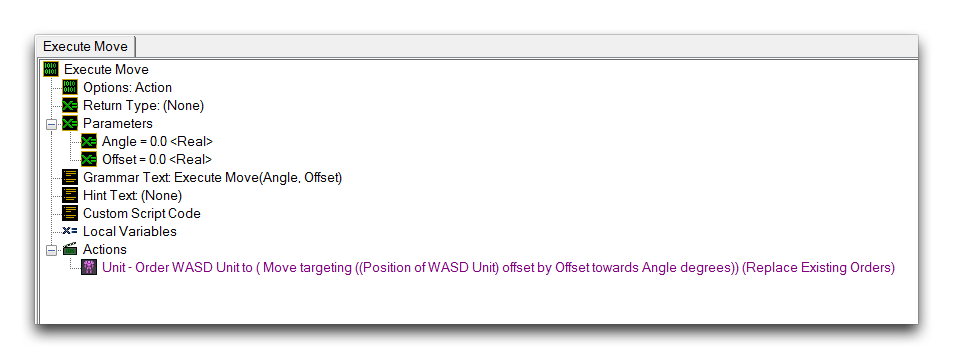
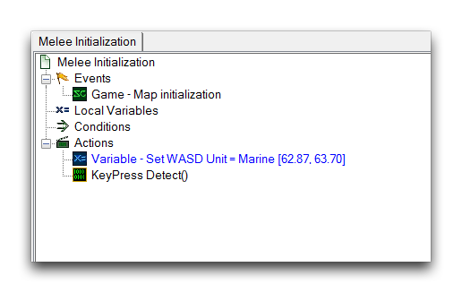
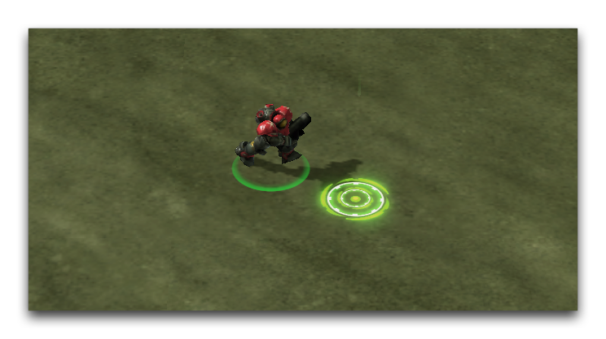

- Else If

<!-- -->

- KEYPRESS\[1\] == True // 按下了一个键

<!-- -->

- Then

<!-- -->

- 执行 Move(180.0, 1.0) // 将单位向西移动

<!-- -->

- 一般 -- Else If

<!-- -->

- Else If

<!-- -->

- KEYPRESS\[2\] == True // 按下了S键

<!-- -->

- Then

<!-- -->

- 执行 Move(90.0, -1.0) // 将单位向南移动

<!-- -->

- 一般 -- Else If

<!-- -->

- Else If

<!-- -->

- KEYPRESS\[3\] == True // 按下了D键

<!-- -->

- Then

<!-- -->

- 执行 Move(0.0, -1.0) // 将单位向东移动

<!-- -->

- 一般 -- 等待 0.0 秒 // 为测试输出创建一个暂停

## 移动单位

'KeyPress Detect' 发送一组指令到 'Execute Move' 操作中， 'Execute Move' 操作负责移动被控制的单位。 这些指令包括一个角度和一个偏移量，它们被发送到 'Order Targeting Point' 命令。 这个命令利用 'Move' 能力，将单位发送到一个 '具有极坐标偏移量的点'。 通过将单位发送到其当前位置，并由偏移量改变，该命令有效地使单位沿着角度方向向偏移量的大小移动。

当偏移量设定为负值时，实际上表示将单位向相反方向移动。 因此，当按下 S 和 D 键时，角度为 145.0，偏移量为 -1.0，将单位向西南方向发送。 当数值为 145.0 的角度和 1.0 的偏移量时，即按下 W 和 A 键时，单位被发送到东北方向。 'Execute Move' 操作定义如下图所示。

*Execute Move 操作定义*

## 整合

在此演示中，移动系统在地图开始时启动。 这并非必需，但这是最有可能的情况。 控制方案很少在游戏体验过程中更改，但将初始化操作移到其他地方是一种选择。 'Melee Initialization' 触发器如下所示。

*Melee Initialization 触发器*

此触发器将预设单位设置为 'WASD Unit' 变量。 这使其成为移动系统的受控单位。 另外， 'KeyPress Detect' 循环开始运行，此时它立即开始寻找玩家的输入。 在处理持续运行的 UI 事件系统时，应密切监控循环和事件检查的数量，以确保性能。 当为在线使用设计类似的系统时，务必进行仔细测试，以确保延迟不会成为问题。

## 测试控制

启动地图将允许您使用WASD键控制marine。

*WASD 键盘控制*

## 附件

* [088_Create_WASD_Keyboard_Controls.SC2Map](./maps/088_Create_WASD_Keyboard_Controls.SC2Map)