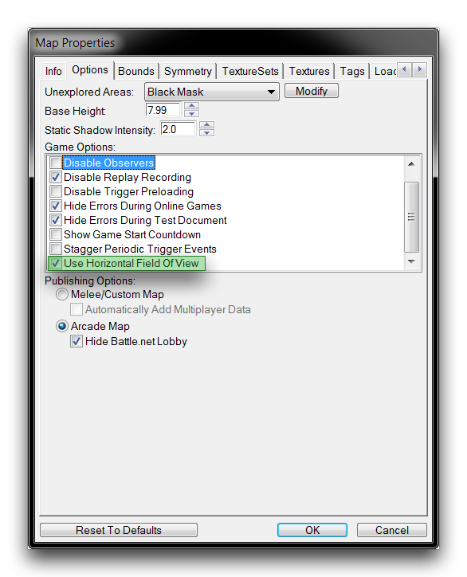
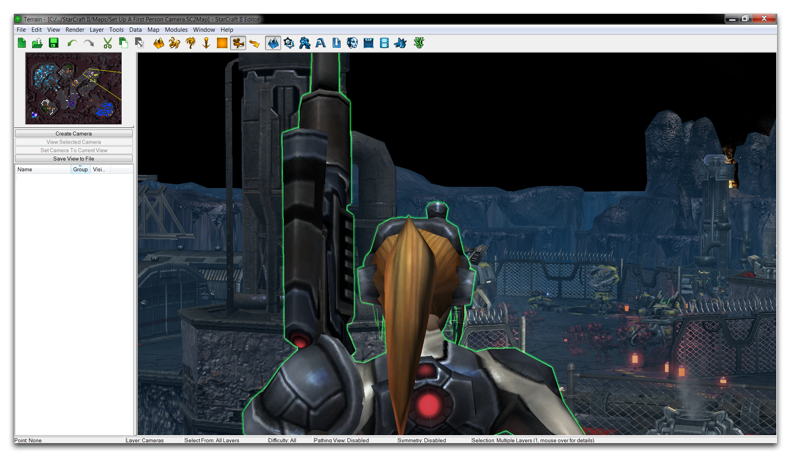
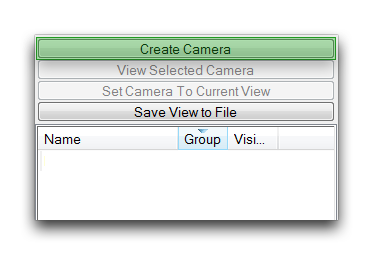
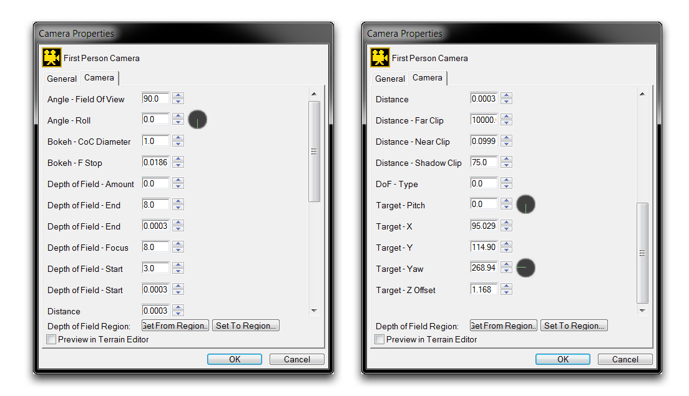
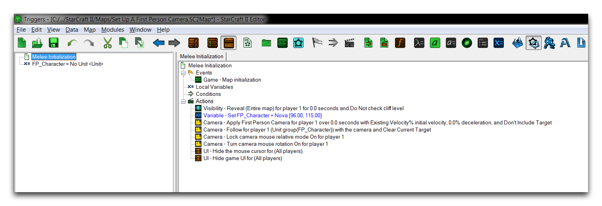

# 设置第一人称摄像头

StarCraft引擎中的摄像头对象经常用于叙述故事。在叙述场景中应用新的摄像头使您能够利用传统等距视角之外的角度和效果。快速切换摄像头可以成为一个非常有效的叙事工具。

自定义摄像头也可以应用于游戏玩法本身，改变玩家的视角到新的透视角度。许多开发者喜欢利用这种技术的方式是第一人称摄像头。这是一种直接设置在游戏玩家角色头部内的摄像头。第一人称摄像头模拟了行走或在环境中移动时的自然视角，并给用户一种他们正在自主导航游戏的印象。对引擎玩法摄像头进行这种改动很简单。按照本文提供的方法和随附的地图设置第一人称摄像头。

## 视野

视野（FOV）设置了摄像头可见的游戏世界的范围。这是一个重要的数字，用于控制自定义游戏摄像头的基本构成。更改FOV可能会有些复杂，最好通过实时预览摄像头来完成。实际上有两种类型的视野可供在编辑器中使用，垂直和水平。默认情况下使用垂直FOV，因为它对于传统的实时战略游戏视角更为合适。

对于第一人称摄像头，您应该强烈考虑使用水平FOV，因为这倾向于更自然地近似人类视觉。可以通过导航到地图属性中的地图选项 ▶︎ 选项 ▶︎ 使用水平视野 来更改视野类型。勾选此选项将使每个摄像头的FOV类型更改为水平。您应该注意，某些FOV值常常引起玩家晕动病。在游戏中提供一个控制以更改FOV值的幅度可能会有所帮助。

*启用水平视野*

## 创建摄像头

第一人称摄像头应该在地图上与玩家角色一起定位，以模拟该角色的视野。您可以通过将摄像头有效地移动到角色模型的头部内或者仅在其肩膀后方来实现这一点。在此处，自由摄像头控件至关重要，因为它们可以让您通过鼠标轻松调整编辑器摄像头的位置。以下控件对于设置摄像头非常有用。

| 控件                  | 效果                                                                                                                   |
| --------------------- | ---------------------------------------------------------------------------------------------------------------------- |
| 缩放                  | 按照目标方向进行缩放。缩放会减小摄像头距离。                                                                         |
| (Shift + 右击)        |                                                                                                                        |
| 旋转                  | 围绕其目标点旋转摄像头。这将改变目标-俯仰和目标-偏航。                                                                  |
| (Ctrl + 右击)         |                                                                                                                        |
| 高度                  | 沿垂直轴移动摄像头，远离或靠近地图的地面水平。这将改变目标- Z偏移。                                               |
| (Alt + 右击)          |                                                                                                                        |

放置的第一人称摄像头应该与下面的图片类似。

*第一人称摄像头设置*

定位后，可以通过在摄像头面板中点击“创建摄像头”按钮来创建摄像头对象，如下图所示。请注意，单位模型挡住了视野只是暂时的。您还应该确保了解单位相对于摄像头的位置，因为这将是第一人称摄像头移动的锚点。

*创建摄像头对象*

## 选择摄像头属性

您可以使用“摄像头属性”预览摄像头对象，并微调它在游戏中的外观。通过从摄像头面板中选择第一人称摄像头，然后双击它来打开这个面板。标准的第一人称摄像头设置如下所示。

*第一人称摄像头属性设置*

在这里有几点需要注意。基本的摄像头镜头目标由Pitch和Yaw组成。这些值将根据摄像头在地图上的位置而变化。通常情况下，您需要使用在0.5至1.5范围内的Z偏移以提供逼真的地面级视图。

此时的距离控制了摄像头与其目标之间的分离。对于第一人称摄像头，它应设置为0。水平FOV设置为90是制作美观的第一人称视角的最常见选项。此外，应将远裁剪距离设置为10,000。这个很大的距离将导致一些性能拖延，但这是必要的，以便从低平的视角渲染整个场景。

## 设置摄像头逻辑

自定义的游戏摄像头将需要处理逻辑，处理摄像头将在游戏时间内如何使用以及由玩家如何使用的触发器。这种逻辑可以根据项目的类型和其实现方式而采用多种形式。然而，有一些基本需求很可能会成为任何设计的一部分。下面显示了第一人称摄像头逻辑的标准示例。

*第一人称摄像头逻辑*

每个摄像头逻辑步骤如下注释。

- 揭示区域--地图已被揭示，因为RTS风格的战争迷雾在此处不可取。

<!-- -->

- 设置变量--设置可控制的玩家角色，作为摄像头锚点。

<!-- -->

- 应用摄像头对象--将第一人称摄像头应用于游戏视图。

<!-- -->

- 跟随单位组和相机区域--将第一人称摄像头附加到玩家的移动上。
- 打开相机鼠标相对模式--将相机移动绑定到鼠标控制，这是一种流派标准。
- 打开相机旋转--通过允许摄像头在三维空间中自由查看来支持鼠标控制。

<!-- -->

- 隐藏鼠标光标--移除玩家鼠标光标的显示。
- 隐藏游戏UI--移除标准UI，以便进行自定义构建。

所有这些操作帮助完成摄像头实际上是一个自由运动实体的错觉。将这与任何移动键盘控制结合起来将形成第一人称游戏的基础。

## 摄像头平滑时间

游戏摄像头具有一些内置的平滑系数，影响摄像头在地图周围移动的方式。建立第一人称摄像头时，默认值往往具有不利影响。您可以通过移至数据编辑器，然后到摄像头选项卡来更改这些默认值，如下所示。