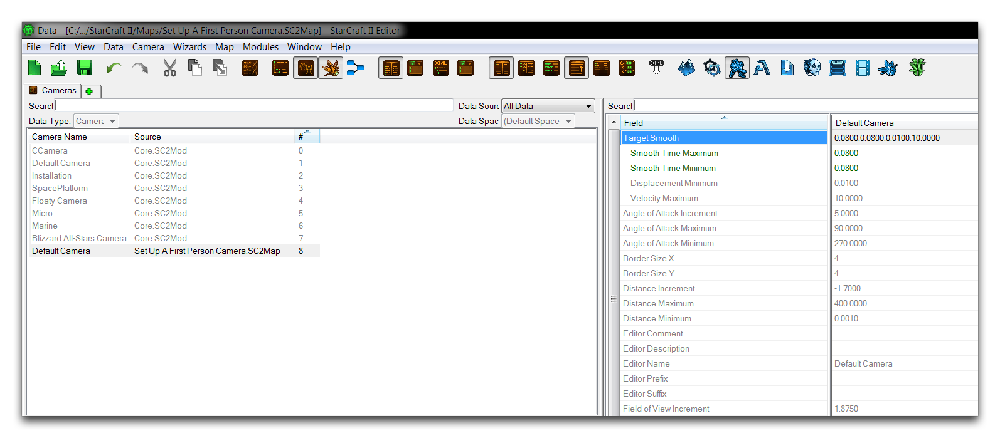
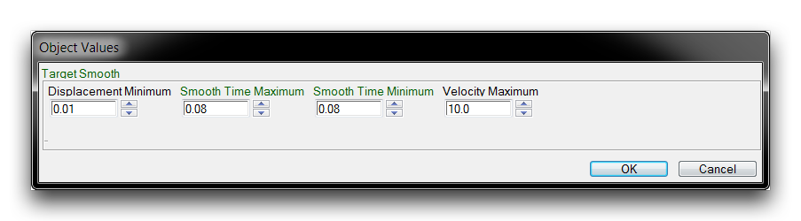
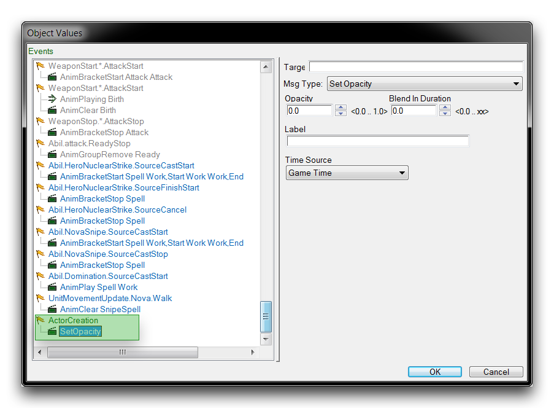
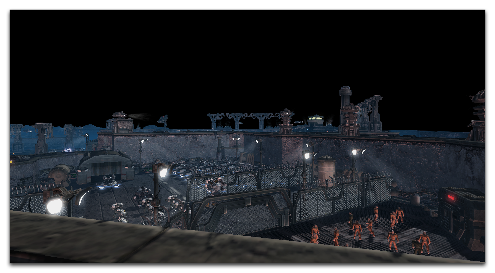

*相机平滑时间设置*

您可以通过打开“目标平滑”字段来更改这些数值。您需要修改平滑时间最大值和平滑时间最小值。这些值设置了相机在移动到移动目标位置时所需的最短时间。将这些值设得太低可能会导致卡顿，因此通常适当的标准值为0.08。完成的字段如下所示。

*设置平滑时间*

## 隐藏玩家单位

对于第一人称游戏，玩家角色的模型应该从视野中移除。这可以通过单位角色的事件来实现，通过添加ActorCreation事件发送SetOpacity消息，将模型的不透明度设置为0.0来完成。您可以在以下图像中看到这一点。

*设置不透明度角色消息*

## 测试结果

在本文提供的演示地图中，游戏已经进行了所有列出的修改。测试应该会给出以下结果。

*第一人称地图视图*

## 附件

 * [089_Set_Up_A_First_Person_Camera.SC2Map](./maps/089_Set_Up_A_First_Person_Camera.SC2Map)